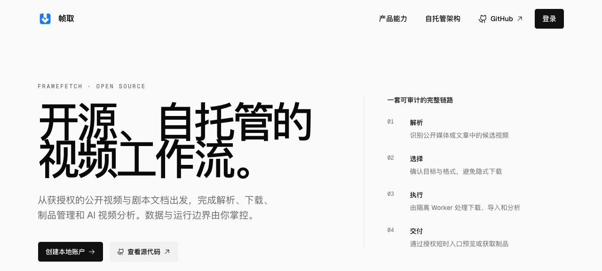
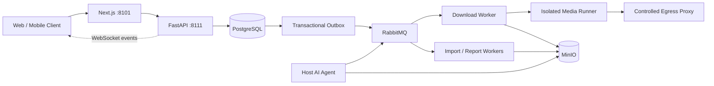

<div align="center">
  
  <h1>FrameFetch</h1>
  <p><strong>Open-source, self-hosted public-media download, screenplay processing and AI analysis workflow</strong></p>
  <p>
    <a href="https://github.com/StephenQiu30/video-server/actions/workflows/ci.yml"></a>
    <a href="LICENSE"></a>
    
    
    
  </p>
  <p>
    <a href="#quick-start">Quick start</a> ·
    <a href="#capabilities">Capabilities</a> ·
    <a href="#screenshots">Screenshots</a> ·
    <a href="#architecture">Architecture</a> ·
    <a href="README.md">简体中文</a>
  </p>
</div>



> The screenshots were captured from a local preview instance with `agent-browser`. Media-bearing views use the repository's visual-regression fixture; none contains real user data, credentials, or third-party hotlinks. See [`docs/images/README.md`](docs/images/README.md) for capture provenance.

## What is FrameFetch?

FrameFetch is an open-source, self-hosted video downloader and media workflow for creators, content researchers and developers. It turns an authorized public-media URL or a local screenplay into an observable, recoverable job: inspect the source, select a real format, download and verify it in an isolated runner, persist the artifact, and optionally produce a structured AI analysis report.

FrameFetch is not designed to circumvent platform restrictions. Anonymous providers only handle content that can be positively identified as public, free and non-DRM. Membership, private, purchased, region-restricted and protected playback rights are outside the project's scope.

## Capabilities

| Capability | Current implementation |
| --- | --- |
| Public-media inspection | Extract source metadata and actual available formats from an authorized public URL or single-link share text |
| Reliable asynchronous jobs | FastAPI → Transactional Outbox → RabbitMQ → workers → isolated media runner |
| Artifact verification | Re-resolve the source, validate semantic format identity, run FFmpeg/ffprobe checks, and verify size, duration and SHA-256 before storage |
| Persistent artifacts | Store media, imported documents, normalized text and Markdown/DOCX reports in MinIO |
| Live status | WebSocket delta events with version checks, reconnect and resync; PostgreSQL remains the source of truth |
| Screenplay workflow | Import Markdown, Fountain, TXT, PDF and DOCX files for reading, navigation and analysis |
| Optional AI analysis | A host-side Codex Agent or an administrator-configured model provider, with Markdown/DOCX report export |
| Operations | User roles, provider health, download analytics, paginated artifacts and explicit retention cleanup |
| Native mobile client | Separate [FrameFetch Flutter client for iOS and Android](https://github.com/StephenQiu30/video-app) |

The system is built for recoverability and isolation rather than one-shot command execution. PostgreSQL stores job facts, the transactional outbox aligns state with message intent, and long-running download, FFmpeg and AI work never runs inside the HTTP request process.

## Screenshots


<p align="center"><strong>Authenticated media inspection and real-format workspace</strong></p>

<table>
  <tr>
    <td width="50%"></td>
    <td width="50%"></td>
  </tr>
  <tr>
    <td align="center"><strong>Provider capabilities and verification</strong></td>
    <td align="center"><strong>Account and secure session</strong></td>
  </tr>
</table>

The web application includes media inspection and download, job history and details, screenplay reading and analysis, provider status, account settings, and administrator views for users, files, analytics and AI providers. Treat the deployment's `/providers` page and canary results as the source of truth for current platform availability.

## Quick start

### Requirements

- Docker Engine and Docker Compose
- Allocate disk and runtime resources for media artifacts, databases and messaging services
- Strong random secrets and a public origin are required before an internet-facing deployment

```bash
git clone https://github.com/StephenQiu30/video-server.git
cd video-server
cp .env.example .env

# PostgreSQL, RabbitMQ, Valkey and MinIO
docker compose --env-file .env -f docker-compose-env.yml up -d

# Web, API, workers, runners and controlled egress proxy
docker compose --env-file .env -f docker-compose.yml \
  up -d --build --force-recreate --remove-orphans --wait --wait-timeout 300
```

PowerShell:

```powershell
Copy-Item .env.example .env
docker compose --env-file .env -f docker-compose-env.yml up -d
docker compose --env-file .env -f docker-compose.yml up -d --build --force-recreate --remove-orphans --wait --wait-timeout 300
```

Open the services after startup:

- Web application: <http://localhost:8101>
- Swagger UI: <http://localhost:8111/docs>
- OpenAPI contract: <http://localhost:8111/openapi.json>

```bash
curl --fail http://127.0.0.1:8111/health/live
curl --fail http://127.0.0.1:8111/health/ready
curl --fail --head http://127.0.0.1:8101/
```

Set `ANALYSIS_ENABLED=false` in `.env` when you only need downloads and screenplay imports. See the [root Compose operations guide](docs/operations/001-root-compose运行手册.md) for startup, shutdown, external infrastructure and recovery procedures.

### Optional AI worker

The AI worker runs on the host and is intentionally not part of the business Compose topology. The default route can reuse a signed-in Codex App Server; administrators may also configure supported model providers in the web application.

```bash
cd backend
uv sync --frozen --dev
uv run python -m app.workers.analysis.agent_cli doctor
uv run python -m app.workers.analysis.agent_cli install
uv run python -m app.workers.analysis.agent_cli status
```

Do not copy or mount Codex/Claude OAuth directories into containers. Before enabling an external model, run a canary with authorized material and review the provider's terms and your organization's data policy.

## Architecture



| Layer | Technologies |
| --- | --- |
| Frontend | Next.js 16, React 19, TypeScript, Tailwind CSS, Radix UI |
| Backend | Python 3.12, FastAPI, SQLAlchemy, PostgreSQL |
| Async | Transactional Outbox, RabbitMQ, Valkey, idempotent workers with leases and heartbeats |
| Media | FFmpeg, ffprobe, yt-dlp adapters, isolated runners and Squid egress proxy |
| Storage | MinIO object storage with short-lived presigned access URLs |
| Contract | OpenAPI is the single contract shared by the web, Flutter and server code |

See the [documentation index](docs/README.md) for maintained product, design, research, acceptance and operations facts.

## Security and content boundaries

- Process only content you are legally authorized to download or analyze.
- Anonymous providers accept only public, free and non-DRM HTTP(S) content. Private-network URLs, arbitrary yt-dlp arguments and shell input are always rejected.
- Normal API requests never accept raw cookies. Provider credentials are limited to the corresponding read-only, isolated runner and must not enter the browser, ordinary logs or unrelated workers.
- An edge agent may transfer only a clear file the user has legally obtained and explicitly selected. It must not inspect platform sessions, intercept traffic, extract content keys or transform protected media.
- External media access must pass through an egress proxy that blocks private networks; input validation is not a substitute for network isolation.

Do not disclose exploit details, secrets or user content in a public issue. Follow the [Security Policy](SECURITY.md) to report vulnerabilities privately.

## Current limitations

- FrameFetch is evolving open-source software. It currently provides self-hosted source and Compose workflows, not an official SaaS, public demo or availability SLA.
- Provider behavior can change with source pages and platforms. A platform name does not imply support for every item, region or account entitlement.
- AI analysis needs a separate host agent or a deployment-configured model service. Disabling AI does not disable downloads or document imports.
- Presigned URLs expire, but stored artifacts are not automatically deleted for that reason. Operators must plan MinIO capacity, backups and explicit retention cleanup.
- Replace every placeholder credential in `.env.prod.example` and complete network, storage, runner and provider-canary acceptance before exposing a deployment to the internet.

## Development

The frontend requires Node.js `>=24.15 <25` and npm 11. The backend requires Python `>=3.12 <3.13` and [uv](https://docs.astral.sh/uv/).

```bash
cd backend
uv sync --frozen --dev
uv run --frozen ruff check app tests
uv run --frozen mypy --strict app
uv run --frozen pytest -q

cd ../frontend
npm ci
npm run lint
npm test
npm run build
```

## Contributing

Contributions to provider adapters, reliability, web and mobile UX, AI reports, tests and documentation are welcome. Before opening a pull request, read the [Contributing Guide](CONTRIBUTING.md), [Code of Conduct](CODE_OF_CONDUCT.md), [repository rules](AGENTS.md), [documentation index](docs/README.md), and [Security Policy](SECURITY.md).

Keep implementation, OpenAPI contracts, tests, operations documentation and acceptance evidence aligned. Prefer small, independently verifiable changes.

## License

FrameFetch is available under the [MIT License](LICENSE). The software license does not grant rights to download, copy or analyze third-party media.
