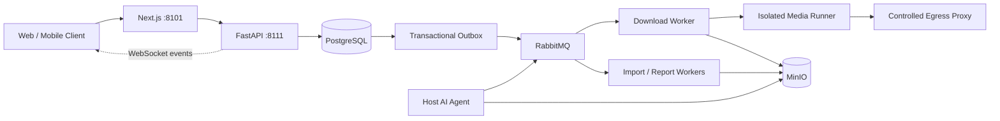

<div align="center">
  
  <h1>帧取 · FrameFetch</h1>
  <p><strong>开源、自托管的公开视频下载、剧本文档处理与 AI 分析工作流</strong></p>
  <p><em>Open-source, self-hosted media download, screenplay processing and AI video analysis workflow.</em></p>
  <p>
    <a href="https://github.com/StephenQiu30/video-server/actions/workflows/ci.yml"></a>
    <a href="LICENSE"></a>
    
    
    
  </p>
  <p>
    <a href="#快速开始">快速开始</a> ·
    <a href="#产品能力">产品能力</a> ·
    <a href="#界面预览">界面预览</a> ·
    <a href="#架构">架构</a> ·
    <a href="README.en.md">English</a>
  </p>
</div>


> 截图由 `agent-browser` 在本地预览环境中采集；涉及媒体的界面使用仓库自带视觉回归素材，所有图片均不包含真实用户数据、凭据或第三方图片热链。采集说明见 [`docs/images/README.md`](docs/images/README.md)。

## 帧取是什么

帧取（FrameFetch）是一个面向创作者、内容研究者和开发者的开源媒体工作流。它把公开媒体链接、本地视频或剧本文档转换为可观察、可恢复的异步任务：解析来源、选择真实格式、隔离下载与校验、保存制品，并按需生成结构化 AI 分析报告。

项目不是规避平台限制的下载脚本。默认能力只处理用户有权使用、公开、免费且非 DRM 的 HTTP(S) 内容；受保护、会员、私密、购买或地域限制内容不属于项目目标。

**English summary:** FrameFetch is an open-source, self-hosted video downloader and media workflow for authorized public content. It combines FastAPI, Next.js, PostgreSQL, RabbitMQ, MinIO, yt-dlp/FFmpeg adapters, screenplay ingestion and optional AI video analysis. See the [English README](README.en.md) for the complete overview.

## 视频解析与 AI 分析如何配合

1. 检查已获授权的公开媒体链接，或导入自己的本地视频、剧本文档。
2. 确认来源和格式，跟踪处理任务；媒体制品与 AI 分析分别记录状态。
3. 按需执行视频分镜、场景或剧本文档分析，结合时间轴与关键帧证据复核结果。
4. 导出 Markdown / DOCX 报告，用于内容研究、创作整理与团队审阅。

Web 实例提供公开页面：`/guide/` 使用指南、`/self-hosting/` 自托管部署指南、`/about/` 项目定位与边界，以及面向生成式搜索的 `/llms.txt`；完整实现与配置见下方能力表和[项目文档](docs/README.md)。模型可用性与输出内容取决于已配置的分析能力和 AI 服务。

### 常见问题

**帧取和 yt-dlp、FFmpeg 有什么关系？** yt-dlp 与 FFmpeg 是媒体适配和处理链路中的工具。FrameFetch 在其上提供 Web / API、用户与任务管理、隔离 Worker、制品存储、文档处理和可选 AI 分析，不保证所有提取器支持的平台在当前部署中都可用。

**开源免费是否包含模型与服务器费用？** MIT 许可证开放源代码；服务器、存储、流量和外部模型可能产生费用，不包含免费托管或模型额度。

**自托管是否代表所有数据仅在本地？** 数据保存在部署者配置的基础设施中；使用外部 AI Provider 时，分析所需内容会发送到该服务。启用前请确认素材授权与服务的数据处理约定。

**Web 和手机端在哪个仓库？** 本仓库维护 API、Next.js Web 和 Worker；[video-app](https://github.com/StephenQiu30/video-app) 是连接本服务的 Flutter iOS / Android 客户端，不在手机端运行离线 AI。

## 产品能力

| 能力 | 当前实现 |
| --- | --- |
| 公开媒体解析 | 从公开链接或单链接分享文案中识别来源、媒体信息和真实可用格式 |
| 可靠异步下载 | API → Transactional Outbox → RabbitMQ → Download Worker → 隔离 Media Runner |
| 制品校验与存储 | 通过重新解析、语义格式校验、FFmpeg/ffprobe、大小、时长和 SHA-256 校验后写入 MinIO |
| 实时任务状态 | WebSocket 增量事件、版本检查、断线重连与 resync；实时连接不作为任务事实源 |
| 剧本文档工作流 | 导入 Markdown、Fountain、TXT、PDF、DOCX，提供阅读、目录、分页和分析入口 |
| 可选 AI 分析 | 宿主机 Codex Agent 或管理员配置的模型 Provider；报告可导出 Markdown/DOCX |
| 运维与管理 | 用户与角色、Provider 状态、下载分析、持久文件分页和显式清理 |
| 原生移动端 | 独立的 [FrameFetch Flutter iOS/Android 客户端](https://github.com/StephenQiu30/video-app) |

### 为什么采用工作流架构

- **可恢复**：PostgreSQL 保存任务事实，Transactional Outbox 保证数据库状态与消息意图一致。
- **可隔离**：下载、媒体命令和 AI 长任务不在 HTTP 请求进程中执行；Runner 经过受控出口代理。
- **可验证**：Provider 返回值不会直接成为最终制品，Worker 会重新解析并验证媒体身份、格式和文件完整性。
- **可扩展**：Provider、Runner、应用用例、OpenAPI 客户端和前端 feature 组件保持清晰边界。
- **可自托管**：Docker Compose 只管理业务服务并复用已有基础环境，不依赖官方托管服务。

## 界面预览


<p align="center"><strong>登录后的媒体解析与真实格式选择工作区</strong></p>

<table>
  <tr>
    <td width="50%"></td>
    <td width="50%"></td>
  </tr>
  <tr>
    <td align="center"><strong>Provider 能力与验证状态</strong></td>
    <td align="center"><strong>账户登录与安全会话</strong></td>
  </tr>
</table>

主要 Web 路由包括媒体解析与下载、任务历史与详情、剧本文档阅读与分析、Provider 状态、账户设置，以及管理员用户、文件、分析和 AI Provider 管理。实际可用平台和状态以部署实例的 `/providers` 页面与 canary 结果为准。

## 快速开始

本机开发使用 `docker-compose.yml`，生产使用 `docker-compose-prod.yml`。标准拓扑内置固定版本的解析引擎与抖音公开访客维护器：首次启动会在后台准备访客材料，普通用户粘贴公开链接或分享文案后无需提供浏览器 Cookie。准备状态可用 `docker compose exec -T provider-guest python -m app.workers.runner.provider_guest_manager status` 脱敏查看；只有 `published_lease_usable=true` 才代表访客租约已发布，健康检查本身不代表媒体可下载。其他平台可先走匿名或 Generic 的受限单视频尝试；提取器候选不等于已验证下载，最终以当前出口的解析和文件结果为准。YouTube、Reddit、优酷等需要账号或额外验证的内容仍受各平台访问条件约束，部署者可按 Provider 登记批准的只读来源，普通客户端不安装扩展也不提供 Cookie。来源安装与更新见[个人部署手册](docs/operations/008-个人部署重启与换机手册.md)。

### 前置条件

- Docker Engine 与 Docker Compose
- 本机已运行 PostgreSQL、RabbitMQ、Redis 和 MinIO，已有配置直接复用
- 用于生产部署时，需要自行提供强随机密钥和公开访问地址

### Docker Compose 启动

```bash
git clone https://github.com/StephenQiu30/video-server.git
cd video-server
test -f .env || cp .env.example .env

# 确认 .env 连接本机已运行的 PostgreSQL、RabbitMQ、Redis 与 MinIO

# 首次使用空项目数据库时，先以该库的 DDL 账号加载唯一当前态结构。
# 以下连接参数只是 .env.example 的本机示例；已有库按实际连接信息替换。
# -W 交互读取密码，避免放进命令行历史。已有库升级前先备份。
psql -X -v ON_ERROR_STOP=1 -W -h 127.0.0.1 -U video -d video \
  -f backend/sql/schema.sql

# 启动前校验 Provider 来源，再启动 Web、API、Worker、可用 Runner 与受控出口代理
uv run --project backend python -m app.workers.runner.provider_startup start \
  --env-file .env --compose-file docker-compose.yml
```

全新空库还没有登录账号时，在部署机终端执行一次首管理员初始化（需使用可连接 PostgreSQL 的 `DATABASE_URL`，密码交互输入，不进入命令行历史）：

```bash
uv run --project backend python -m app.workers.bootstrap_admin \
  --env-file .env --username your-admin --email you@example.com
```

命令只在用户表为空时创建管理员；已有任何用户时拒绝，不开放 HTTP 初始化接口。之后用该邮箱和密码登录 Web，再粘贴链接解析；公开抖音访客路线由后台准备，不要求先登记账号来源。若要让其他用户自行注册，先在 `.env` 配置真实 SMTP 并启用 `SMTP_ENABLED=true`；默认关闭时注册验证码不可发送，现有账号仍可登录。生产部署还应替换示例密钥。健康检查只证明服务可运行，不证明首账号已创建或每个平台有真实媒体证据。

统一入口保留已配置的平台路由，不因来源短暂失效删除能力。文件来源由独立 `provider-sources` 进程从现有 PostgreSQL 解密恢复，按平台原子发布到 Runner 的只读命名卷；重建和换机无需复制这些本地副本。启动器读取本次 `--env-file` 指定的环境文件，在内存中计算 Provider 启动计划，再作为进程环境交给 Compose 和来源维护器；不生成第二份 `provider-startup.env`。

部署密钥优先通过未提交的根目录 `.env` 或 Secret Manager 设置为 `PROVIDER_SOURCE_ENCRYPTION_KEY`。macOS 本机自动浏览器来源未设置该值时，首次启动会在 `backend/.local-runtime/provider-source.key` 生成权限为 `0600` 的稳定密钥；该目录不会提交 Git，换机或恢复 PostgreSQL 时须从安全备份恢复密钥文件，或继续注入原密钥。已有批准来源登记在持久库。普通用户不参与此过程。新宿主复用同一持久库和密钥后自动恢复；平台撤销、过期或新出口验证仍需按平台处理。首次配置、登记命令和验收边界见 [008 手册](docs/operations/008-个人部署重启与换机手册.md)。

```bash
uv run --project backend python -m app.workers.runner.provider_startup start \
  --env-file .env.prod --compose-file docker-compose-prod.yml
```

维护器只更新 `.provider-sessions/youtube/cookies.txt`，不会在解析或下载请求中读取浏览器。完整来源边界、停止与换机步骤见 [YouTube 受控会话手册](docs/operations/002-YouTube受控会话运行手册.md)和[个人部署手册](docs/operations/008-个人部署重启与换机手册.md)。

PowerShell 使用相同入口：

```powershell
if (-not (Test-Path .env)) { Copy-Item .env.example .env }
uv run --project backend python -m app.workers.runner.provider_startup start --env-file .env --compose-file docker-compose.yml
```

启动后访问：

- Web 应用：<http://localhost:8101>
- Swagger UI：<http://localhost:8111/docs>
- OpenAPI：<http://localhost:8111/openapi.json>

健康检查：

```bash
curl --fail http://127.0.0.1:8111/health/live
curl --fail http://127.0.0.1:8111/health/ready
curl --fail --head http://127.0.0.1:8101/
```

只需要下载与剧本文档导入时，可在 `.env` 中设置 `ANALYSIS_ENABLED=false`。完整的启动、停止、已有基础环境复用和故障恢复方式见 [Compose 运行手册](docs/operations/001-root-compose运行手册.md)。更新代码时先执行 `git pull --ff-only`，再重新运行上面的统一启动命令；`docker compose restart` 不会重新评估 Provider 来源，也不会应用新镜像或环境配置。

### 启用 AI 分析

AI Worker 独立运行，不包含在业务 Compose 中。默认线路可以复用宿主机已登录的 Codex App Server；管理员也可在 Web 中配置受支持的模型 Provider。宿主机 Agent 的统一管理入口为：

```bash
cd backend
uv sync --frozen --dev
uv run python -m app.workers.analysis.agent_cli doctor
uv run python -m app.workers.analysis.agent_cli install
uv run python -m app.workers.analysis.agent_cli status
```

生产业务使用 `.env.prod` 时，宿主机 Agent 必须读取同一环境文件：

```bash
uv run python -m app.workers.analysis.agent_cli doctor --env-file ../.env.prod
uv run python -m app.workers.analysis.agent_cli install --env-file ../.env.prod
```

不要把 Codex/Claude OAuth 目录复制或挂载进容器。启用第三方模型前，请使用已获授权样本完成 canary，并确认模型服务条款和组织数据策略。

## 架构



| 层 | 技术 |
| --- | --- |
| Frontend | Next.js 16、React 19、TypeScript、Tailwind CSS、Radix UI |
| Backend | Python 3.12、FastAPI、SQLAlchemy、PostgreSQL |
| Async | Transactional Outbox、RabbitMQ、Redis、幂等 Worker 与 lease/heartbeat |
| Media | FFmpeg、ffprobe、yt-dlp 适配层、隔离 Runner、Squid egress proxy |
| Storage | MinIO 对象存储与短时预签名访问地址 |
| Contract | OpenAPI 是 Web、Flutter 与服务端之间的唯一接口契约 |

详细的产品、设计、研究、验收和运维事实收录在 [文档索引](docs/README.md)。

## 安全与合规边界

- 只处理你拥有相应权利的内容，并遵守内容来源、所在地和部署环境适用的法律与平台规则。
- 匿名 Provider 只接受公开、免费、非 DRM 的 HTTP(S) 内容；私网 URL、任意 yt-dlp 参数和 shell 输入始终禁止。
- 普通业务请求不接收原始 Cookie。Provider 会话来自部署者私有的只读平台文件或已授权浏览器；每次操作的副本进入对应隔离 Runner 的 tmpfs，结束后销毁，不进入业务数据库、普通日志或其他 Worker。持久文件与迁移配置见[个人运行手册](docs/operations/008-个人部署重启与换机手册.md)。
- Edge Agent 只能传输用户已合法取得并明确选择的明文文件，不能读取平台会话、拦截流量、提取密钥或转换受保护媒体。
- 外部媒体访问必须经过阻断私网的出口代理；入口 URL 校验不能替代网络隔离。

发现安全问题时，请不要在公开 Issue 中披露利用细节、密钥或用户内容；按 [安全策略](SECURITY.md) 使用私有渠道报告。

## 当前限制

- 腾讯视频与优酷已增加可选个人会话下载路径，仅尝试获取账号可访问的完整非 DRM 内容；完整 VIP 下载尚待真实样本验证，参见 [032 设计](docs/design/032-腾讯视频与优酷个人下载设计.md)与[运行手册](docs/operations/008-个人部署重启与换机手册.md)。

- 项目仍在持续演进，目前提供自托管源码和 Compose 运行方式，不承诺官方 SaaS、公共演示站或服务可用性 SLA。
- Provider 能力受来源页面和平台变化影响；平台名称不代表对所有内容、地区或账户权益都可用。
- AI 分析依赖独立宿主机 Agent 或部署方配置的模型服务，关闭 AI 不影响下载和文档导入。
- 预签名 URL 会过期，但最终制品不会因此自动删除；管理员仍需规划 MinIO 容量、备份和显式清理策略。
- 对外部署前必须检查 `.env.prod` 的实际配置，替换所有占位凭据，并完成网络、存储、Runner 和 Provider canary 验收。

## 本地开发

前端需要 Node.js `>=24.15 <25` 与 pnpm 12，后端需要 Python `>=3.12 <3.13` 与 [uv](https://docs.astral.sh/uv/)。代码级质量门禁：

```bash
cd backend
uv sync --frozen --dev
uv run --frozen ruff check app tests
uv run --frozen mypy --strict app
uv run --frozen pytest -q

cd ../frontend
pnpm install --frozen-lockfile
pnpm lint
pnpm test
pnpm build
```

仓库主要目录：

```text
backend/                 FastAPI、领域逻辑、Worker、Runner 与当前态 SQL
frontend/                Next.js App Router、业务组件、Hooks 与 OpenAPI 客户端
docs/                    设计、需求、计划、验收、研究和运维事实
backend/Dockerfile       API、Worker、Runner 镜像
frontend/Dockerfile      Next.js 独立镜像
docker-compose-env.yml   GitHub CI 隔离测试夹具，不用于本机启动
docker-compose.yml       Web、API、Worker、Runner 与出口代理
docker-compose-prod.yml  生产业务差异
```

## 参与贡献

欢迎通过 Issue 或 Pull Request 参与 Provider 适配、可靠性、前端与移动端体验、AI 报告、测试和文档建设。开始前请阅读：

- [贡献指南](CONTRIBUTING.md)
- [社区行为准则](CODE_OF_CONDUCT.md)
- [仓库协作规范](AGENTS.md)
- [文档索引](docs/README.md)
- [安全策略](SECURITY.md)

提交变更时，请保持实现、OpenAPI 契约、测试、运行手册和验收证据一致，并只提交小而完整、可独立验证的改动。

## 许可证

FrameFetch 基于 [MIT License](LICENSE) 开源。MIT 许可证授予软件使用、修改和分发权，不代表授予任何第三方媒体内容的下载、复制或分析权。

公开网站的索引配置、生成式搜索可发现性与上线核查见 [SEO 与 GEO 运行手册](docs/operations/010-SEO与GEO运行手册.md)。个人自托管实例默认不开放索引。
