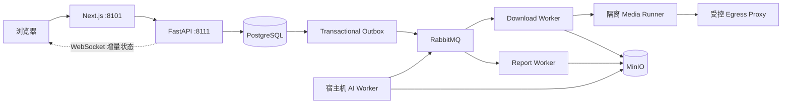

<div align="center">
  
  <h1>帧取 · FrameFetch</h1>
  <p><strong>面向创作者和开发者的可自托管媒体工作流</strong></p>
  <p>从公开媒体链接或本地剧本文档开始，完成解析、异步处理、持久化存储、实时状态同步和 AI 分析。</p>
  <p>
    <a href="https://github.com/StephenQiu30/video-server/actions/workflows/ci.yml"></a>
    <a href="LICENSE"></a>
    
    
  </p>
  <p>
    <a href="#快速开始">快速开始</a> ·
    <a href="#核心能力">核心能力</a> ·
    <a href="#架构与设计取舍">架构</a> ·
    <a href="#参与贡献">参与贡献</a>
  </p>
</div>


> 截图使用仓库内置视觉回归媒体资产，不包含真实用户数据或第三方图片热链。

## 帧取是什么

帧取是一个开源、可自托管的媒体处理平台。它把“拿到一个链接”之后容易失控的工作拆成可观察、可恢复的步骤：解析真实格式，创建异步任务，校验并保存最终制品，再按需进行视频或剧本分析。

它适合个人创作者、内容研究、素材整理、短视频平台适配实验，以及希望研究可靠异步任务系统的工程团队。下载和导入能力可以独立运行，AI Worker 是可选扩展。

### 为什么值得参与

- **不是一次性脚本**：PostgreSQL 保存任务事实，Transactional Outbox 与 RabbitMQ 驱动异步 Worker，失败、重试和恢复都有明确边界。
- **可以真正部署**：Docker Compose 已区分基础环境、业务服务和生产差异，MinIO、RabbitMQ、Valkey、PostgreSQL 都有可重复启动方式。
- **扩展点清晰**：Provider、Media Runner、应用用例、OpenAPI 客户端和按 feature 分类的前端组件彼此分离，适合独立贡献。
- **安全边界明确**：默认只处理公开、非 DRM 且用户有权处理的内容；不会通过技术手段绕过会员、私密、地域或平台访问控制。

## 核心能力

| 能力 | 当前实现 |
| --- | --- |
| 媒体解析 | 从公开链接或单链接分享文案中识别媒体、平台和真实可用格式 |
| 异步下载 | API → Outbox → RabbitMQ → Download Worker → 隔离 Runner 的可恢复任务链 |
| 可靠交付 | 重新解析、格式语义校验、FFmpeg/ffprobe、大小、时长和 SHA-256 校验后才写入制品库 |
| 持久化文件 | 视频、导入文档、规范化文本和 Markdown/DOCX 报告写入 MinIO 持久卷，不设置业务自动过期 |
| 状态同步 | WebSocket 增量事件、版本检查、断线重连和 resync；连接降级不会阻塞下载任务本身 |
| 剧本文档 | 上传并解析 Markdown、Fountain、TXT、PDF、DOCX，提供 Markdown 阅读器、目录、分页和分析入口 |
| AI 分析 | 通过宿主机已登录的 Codex CLI 或 Claude CLI 生成分镜、高光、视觉资产和制作建议，报告可导出 Markdown/DOCX |
| 管理能力 | 用户与角色、Provider 状态、下载分析、持久文件分页，以及按“多少天前”手动清理文件（默认 30 天） |
| 平台适配 | Provider Registry、能力状态、受控会话 Runner 和无凭据 Generic extractor 的分层扩展模型；视频号支持公开 `/sph/` 单视频的匿名预检与隔离元宝会话解析 |

### 文件生命周期

最终制品不会因为预签名下载地址失效而消失。预签名地址只是短时访问凭证；只要管理员没有清理，用户仍可以从历史记录重新获取文件。管理员可在 `/admin/files` 分页查看视频、剧本文档和分析报告，并按创建时间手动清理历史文件，默认阈值为 30 天。

上传会话、任务 lease、Worker heartbeat 和临时工作目录仍然会过期或清理；它们与最终制品的持久化策略是两件事。

### 内容与权限边界

请只处理你拥有相应权利的内容。匿名 Provider 默认只处理能够正向证明为公开、免费、非 DRM 的媒体；Edge Agent 只能传输用户已经合法取得并显式选择的明文文件，不能读取平台会话、拦截流量或转换受保护内容。受控 Provider 会话只用于已经匿名证明公开、但第一方匿名接口未返回 clear 媒体地址的单视频，并按平台独立 Runner/Secret 隔离；视频号当前只允许公开 `/sph/` 链接。官方资产连接器仍需明确下载/导出授权且输出未加密。会员、购买、私密、地域或 DRM 播放权益不等于第三方明文导出权。

## 界面预览

<table>
  <tr>
    <td width="50%"></td>
    <td width="50%"></td>
  </tr>
  <tr>
    <td align="center"><strong>平台能力与最近验证状态</strong></td>
    <td align="center"><strong>账户登录与安全会话入口</strong></td>
  </tr>
</table>

主要页面采用响应式、可键盘操作的 Next.js App Router 界面：

| 路由 | 作用 |
| --- | --- |
| `/` | 解析媒体、选择真实格式并创建下载任务 |
| `/history` | 搜索、筛选和分页查看当前账户的下载历史 |
| `/downloads/detail?jobId=...` | 查看进度、获取文件、取消/重试任务并阅读分析 |
| `/documents` | 分页查看和上传剧本文档 |
| `/documents/detail?documentId=...` | 阅读 Markdown 剧本、浏览目录并发起分析/改写 |
| `/providers` | 查看平台能力、访问模式和最近验证状态 |
| `/account` | 管理公开用户名和账户信息 |
| `/admin/files` | 分页查看持久文件并手动清理历史制品（管理员） |
| `/admin/analytics` | 查看周期下载趋势、成功率和来源表现（管理员） |
| `/admin/ai-providers` | 管理本机 AI 路由并查看 Agent 心跳（管理员） |
| `/admin/providers` | 维护平台状态页名称、排序和可见性（管理员） |
| `/admin/users` | 搜索用户、管理角色和启用状态（管理员） |

## 快速开始

### 使用 Docker Compose

需要 Docker Engine 与 Docker Compose。项目将基础环境与业务服务拆成两个 Compose 文件：`docker-compose-env.yml` 只负责 PostgreSQL、RabbitMQ、Valkey、MinIO 及初始化；`docker-compose.yml` 负责前端、API、Worker、Runner 和出口代理。

```bash
git clone https://github.com/StephenQiu30/video-server.git
cd video-server
cp .env.example .env

# 只体验下载和剧本文档导入时，可在 .env 中设置 ANALYSIS_ENABLED=false
# 首次使用或基础依赖尚未运行时执行一次
docker compose --env-file .env -f docker-compose-env.yml up -d
docker compose --env-file .env -f docker-compose.yml up -d --build --force-recreate --remove-orphans --wait --wait-timeout 300
```

PowerShell 只需使用相同的 Compose 入口：

```powershell
Copy-Item .env.example .env
docker compose --env-file .env -f docker-compose-env.yml up -d
docker compose --env-file .env -f docker-compose.yml up -d --build --force-recreate --remove-orphans --wait --wait-timeout 300
```

更新代码时先独立执行 `git pull --ff-only`，再重复上述唯一业务 Compose 命令。
不要用 `docker compose restart`，因为它不会应用新的代码、镜像或环境配置。
YouTube、TikTok、X 的固定媒体 Canary 是启动后的验收命令，不属于启动入口，详见
`docs/operations/007-固定Provider探针运行手册.md`。

启动完成后访问：

- Web 应用：<http://localhost:8101>
- Swagger UI：<http://localhost:8111/docs>
- OpenAPI 契约：<http://localhost:8111/openapi.json>

检查服务状态：

```bash
curl --fail http://127.0.0.1:8111/health/live
curl --fail http://127.0.0.1:8111/health/ready
curl --fail --head http://127.0.0.1:8101/
```

`.env.example` 只用于本地开发示例。首次对外暴露服务前，请替换数据库、RabbitMQ、MinIO、认证密钥和公开访问地址。MinIO 业务进程共用一组 `MINIO_ACCESS_KEY` 与 `MINIO_SECRET_KEY`，不按 Worker 复制密钥。

完整启动、停止、复用已有基础环境和故障恢复步骤见[根目录 Compose 运行手册](docs/operations/001-root-compose运行手册.md)。

### 启用 AI 分析

AI Worker 不在业务 Compose 中运行，它复用宿主机已经登录的 Codex CLI 或 Claude CLI。这样可以避免把宿主机 OAuth 认证目录复制进容器：

```bash
# 先完成对应 CLI 的官方登录
cd backend
uv sync --frozen --dev
uv run python -m app.workers.analysis.main
```

启用分析时，API 会先将任务事实和消息意图可靠写入 PostgreSQL Outbox，再由 RabbitMQ 投递给 AI Worker；Agent 状态只用于运维诊断，不作为 API 全局 readiness 或任务创建的硬前置。没有 AI Worker 的部署仍应明确设置 `ANALYSIS_ENABLED=false`；若 Agent 暂时不可用，任务保持 `queued`，恢复后由 Worker 继续消费。下载、文件获取和历史记录不依赖 AI Worker。AI Worker 通过受限的 FFmpeg/ffprobe 工具观察完整视频，请先确认内容授权、模型服务条款和组织数据策略。

当前真实视觉闭环以 Codex 为验收基线；启用 Claude 前，请先用真实视频 canary 验证模型路由和图片理解能力。

## 架构与设计取舍



技术栈：

- **Frontend**：Next.js 16、React 19、TypeScript、Tailwind CSS、Radix UI、Vitest。
- **Backend**：Python 3.12、FastAPI、SQLAlchemy、PostgreSQL、RabbitMQ、Valkey、MinIO。
- **Media**：FFmpeg、ffprobe、yt-dlp 适配层、隔离 Media Runner 和受控 Squid 出口。
- **Delivery**：Next.js 前端固定监听 `8101`，通过 rewrite 访问 `8111` 的 FastAPI；FastAPI 只提供 API、健康检查和 OpenAPI，不再托管 `frontend/out`。

几个重要的不变量：

1. HTTP 请求只创建或查询任务，不在请求进程中执行下载、FFmpeg 或 AI 长任务。
2. PostgreSQL 是任务状态事实源；RabbitMQ 只负责可靠投递，Outbox 保证数据库事实和消息意图一致。
3. WebSocket 只负责及时同步；断线、丢事件或慢消费者会触发重连/resync，不能把实时连接当成下载任务的唯一生命线。
4. Provider 凭据只进入对应的受控 Runner；匿名 Runner 不携带 Provider 凭据，普通 Web 请求不接收原始 Cookie。
5. OpenAPI 是前后端接口契约的唯一来源，前端请求通过已提交的 `frontend/src/services/video/` 客户端进入统一请求层。

## 本地开发

前端需要 Node.js 24 与 npm 11.19，后端需要 Python 3.12 与 [uv](https://docs.astral.sh/uv/)。推荐先用环境 Compose 提供依赖，再分别启动后端 API 和前端热更新：

```bash
docker compose --env-file .env -f docker-compose-env.yml up -d
```

在第一个终端启动后端：

```bash
cd backend
uv sync --frozen --dev
uv run python -m app.main
```

在第二个终端启动前端：

```bash
cd frontend
npm ci
npm run dev
```

开发页面位于 <http://127.0.0.1:8101>，前端会将 `/api/*` 与 `/health/*` 代理到 `127.0.0.1:8111`。后端 API 入口为 <http://127.0.0.1:8111>；如果使用容器 API，先启动业务 Compose。

与 CI 一致的主要质量门禁：

```bash
cd backend
uv sync --frozen --dev
uv run --frozen ruff check app tests
uv run --frozen mypy --strict app
uv run --frozen pytest -q

cd ../frontend
npm ci
npm run lint
npm test
npm run build
```

涉及 Compose、数据库或运行时的改动，还要验证：

```bash
cd ..
docker compose --env-file .env -f docker-compose-env.yml config --quiet
docker compose --env-file .env -f docker-compose.yml config --quiet
```

## 仓库结构

```text
backend/                 FastAPI、领域逻辑、Worker、Runner 和当前态 SQL
frontend/                Next.js 页面、按 feature 分类的组件、Hooks 和测试
docs/                    Design、PRD、Plan、Acceptance、研究和运维事实
Dockerfile               前后端统一生产镜像
docker-compose-env.yml   PostgreSQL、RabbitMQ、Valkey、MinIO 基础环境
docker-compose.yml       前端、API、Worker、Runner 和出口代理
docker-compose-prod.yml  生产部署差异
```

前端业务组件放在 `frontend/src/components/{account,admin,analysis,auth,downloads,intake,layout,providers,screenplay}/`，不新增平行的 `src/features/` 目录。后端依赖方向保持为 `api/workers → application → domain`。

## 参与贡献

欢迎通过 Issue 或 Pull Request 参与。特别欢迎以下类型的贡献：

- **Provider 适配**：补充公开样本的 metadata、媒体下载、ffprobe、完整性和 canary 证据。
- **可靠性工程**：改进任务恢复、Outbox、RabbitMQ、WebSocket resync、MinIO 和健康检查。
- **前端体验**：完善剧本文档、下载历史、管理员文件管理、可访问性和 390px 窄屏体验。
- **AI 与报告**：改进分析 Skill、Markdown 报告质量、DOCX 导出和本地 CLI Worker 体验。
- **文档与测试**：补充运行手册、架构决策、契约测试、真实浏览器验收和故障复现样本。

开始前请阅读：

- [贡献指南](CONTRIBUTING.md)：模块边界、Docker 规范、提交格式和本地门禁
- [AGENTS.md](AGENTS.md)：仓库级架构、安全、设计和验证要求
- [文档索引](docs/README.md)：产品、设计、研究、计划、验收和运行手册
- [安全策略](SECURITY.md)：漏洞报告和安全边界

提交一个变更时，请保持实现、OpenAPI 契约、测试、运行手册和验收证据一致。提交前至少运行对应模块的 lint、测试和构建；涉及运行时的改动还需要验证 Compose 配置和健康接口。

## 社区路线

帧取仍在持续演进中，当前优先方向包括更多公开平台的可验证适配、Provider canary 自动化、可观测性、跨平台宿主 Agent、剧本文档体验和更完整的真实浏览器验收。欢迎先从 Issue 讨论约束和验收标准，再提交小而完整的改动。

## 许可

项目基于 [MIT License](LICENSE) 开源。下载、保存或分析媒体前，请确认你拥有相应权利，并遵守内容来源、所在地和部署环境适用的法律与平台规则。
