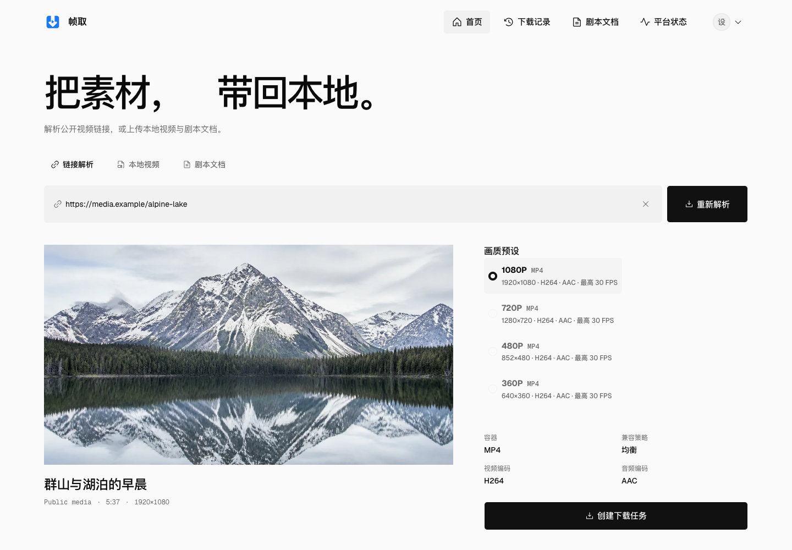
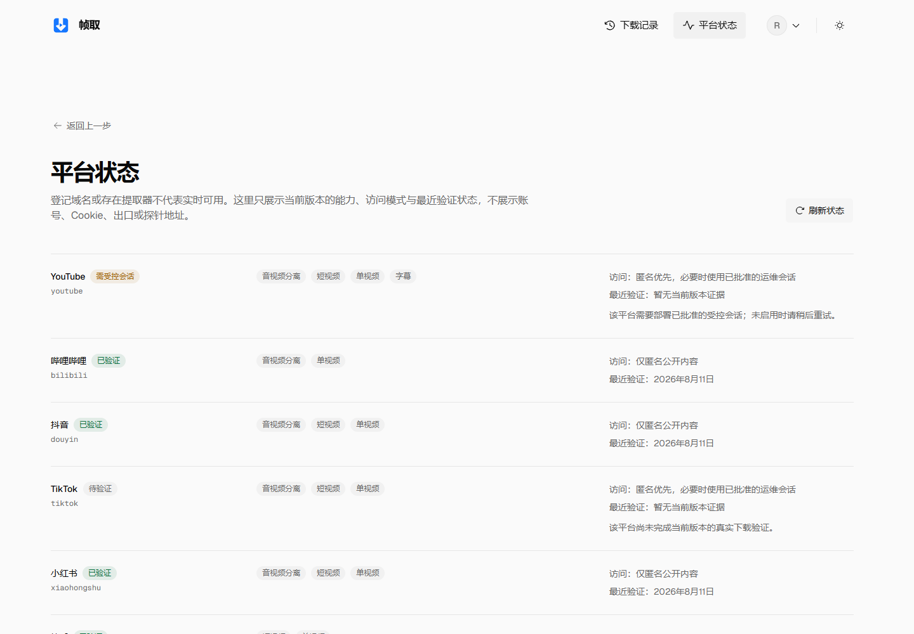
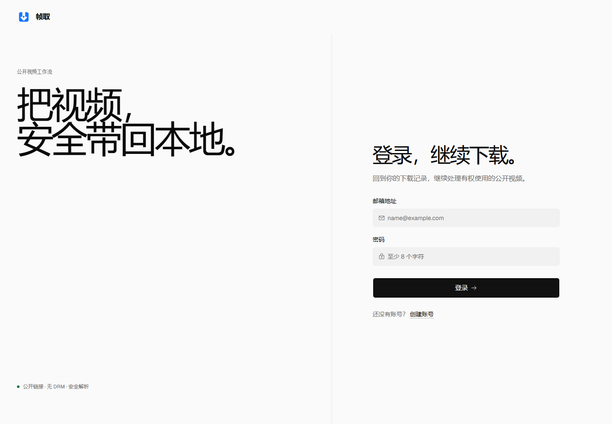
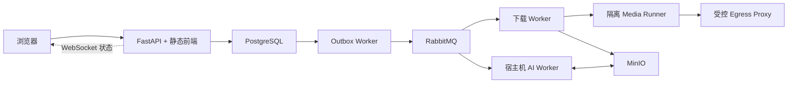

<div align="center">
  
  <h1>帧取</h1>
  <p><strong>可自托管的多平台公开视频下载与 AI 视觉分析工作流</strong></p>
  <p>解析真实媒体格式，异步下载并追踪任务，再把视频转化为可检索、可导出的结构化分析报告。</p>
  <p>
    <a href="https://github.com/StephenQiu30/video-server/actions/workflows/ci.yml"></a>
    <a href="LICENSE"></a>
    
    
  </p>
  <p>
    <a href="#快速开始">快速开始</a> ·
    <a href="#界面预览">界面预览</a> ·
    <a href="#工作流与架构">工作流与架构</a> ·
    <a href="#文档">文档</a>
  </p>
</div>



> 截图使用仓库内置视觉回归媒体资产，不包含真实用户数据或第三方图片热链。

## 为什么使用帧取

- **真实格式解析**：从公开链接或只包含单个链接的分享文案中读取媒体信息，直接呈现后端返回的可用格式。
- **可靠异步下载**：RabbitMQ、Transactional Outbox 与独立 Worker 共同驱动任务，WebSocket 实时同步状态。
- **完整任务闭环**：支持下载历史、进度查看、取消、重试以及 MinIO 预签名文件获取。
- **结构化 AI 分析**：通过宿主机 Codex CLI 或 Claude CLI 适配器生成连续分镜、高光、视觉资产与制作建议，并导出 Markdown / DOCX；当前真实视觉闭环以 Codex 为验收基线。
- **账户与管理能力**：提供 HttpOnly Cookie 会话、用户资料、角色管理、Provider 状态和下载数据分析。
- **默认安全边界**：入口 URL 校验、私网阻断、受控出口、Runner HMAC 与 Secret 隔离贯穿下载链路。

项目只面向你有权下载和分析的内容。匿名下载默认处理**公开、非 DRM** 内容；平台保护媒体可通过官方授权 Provider，或用户自有设备上的受控 Edge Agent 进入分析链路。Edge Agent 只向服务端上传已校验视频与脱敏元数据，不上传平台登录态、根证书私钥、签名材料或内容密钥。系统不扩张用户账号已有权益，也不承诺私密、会员、付费或受地域限制的内容可用。

## 界面预览

<table>
  <tr>
    <td width="50%"></td>
    <td width="50%"></td>
  </tr>
  <tr>
    <td align="center"><strong>平台能力与最近验证状态</strong></td>
    <td align="center"><strong>账户登录与安全会话入口</strong></td>
  </tr>
</table>

主要页面均采用响应式、可键盘操作的 Next.js App Router 界面：

| 路由 | 作用 |
| --- | --- |
| `/` | 解析媒体、选择真实格式并创建下载任务 |
| `/history` | 搜索和分页查看自己的下载历史 |
| `/downloads/detail?jobId=...` | 查看下载进度、获取文件并发起或阅读 AI 分析 |
| `/providers` | 查看平台能力、访问模式与最近验证状态 |
| `/account` | 管理公开用户名并查看账户信息 |
| `/admin/ai-providers` | 管理本机登录与 API Key AI 路由，并查看宿主 Agent 在线状态（仅管理员） |
| `/admin/analytics` | 通过无边框 KPI、可切换趋势系列与来源进度查看全局下载表现（仅管理员） |
| `/admin/providers` | 维护平台状态页名称、排序与可见性（仅管理员） |
| `/admin/users` | 搜索用户并管理角色与启用状态 |
| `/user/login`、`/user/register` | 登录、注册与受保护页面回跳 |

除登录和注册外，业务页面需要有效会话；管理员页面还会由后端独立校验角色。

## 快速开始

### Docker Compose

需要 Docker Engine 与 Docker Compose。复制本地环境模板后，先启动项目专用的基础环境，再启动业务服务：

```bash
git clone https://github.com/StephenQiu30/video-server.git
cd video-server
cp .env.example .env
docker compose --env-file .env -f docker-compose-env.yml up -d
docker compose --env-file .env -f docker-compose.yml up -d --build
```

启动完成后访问：

- Web 应用：<http://localhost:8101>
- Swagger UI：<http://localhost:8101/docs>
- OpenAPI 契约：<http://localhost:8101/openapi.json>

首次对外暴露服务前，请检查并替换 `.env` 中的示例配置。完整的启动、健康检查、停止与故障恢复步骤见[运行手册](docs/operations/001-root-compose运行手册.md)。

已有本地部署需要载入最新前后端代码时，先构建镜像，再强制重建服务。命令不会删除 PostgreSQL、RabbitMQ、MinIO 等命名卷：

```bash
docker compose --env-file .env -f docker-compose.yml build
docker compose --env-file .env -f docker-compose.yml up -d --force-recreate
```

重建完成后检查存活、依赖就绪和 Web 页面：

```bash
curl --fail http://127.0.0.1:8101/health/live
curl --fail http://127.0.0.1:8101/health/ready
curl --fail --head http://127.0.0.1:8101/
```

### 启用 AI 分析

AI Worker 复用宿主机已经完成 OAuth 登录的 Codex CLI 或 Claude CLI，不把 CLI 认证目录挂载进容器。完成对应 CLI 登录后，从 `backend/` 启动：

```bash
cd backend
uv sync --frozen --dev
uv run python -m app.workers.analysis.main
```

AI Worker 直接连接宿主机回环地址发布的 PostgreSQL、RabbitMQ 和 MinIO。Compose 强制重建这些依赖时，正在运行的宿主机 Worker 可能因连接中断而退出，因此每次完整重建后都应确认只存在一个 Worker 进程并重新启动它。本地默认 `ANALYSIS_ENABLED=true`；在这种配置下，API 只有收到兼容 Worker 的持续心跳后才会让 `/health/ready` 返回 `200`。如果部署明确不提供 AI 分析，应设置 `ANALYSIS_ENABLED=false` 后重建 API，而不是长期忽略就绪失败。

下载能力本身不依赖 AI Worker。启用分析时，选定的抽帧会交给所选云端模型观察；视频容器不会直接上传，但这些帧可能离开本机。请先确认内容授权、模型服务条款和组织的数据策略。

当前默认验收 Provider 为 Codex；启用 Claude 前，请先用真实视频 canary 验证模型路由与图片理解能力。

## 工作流与架构

`解析链接 → 选择格式 → 创建任务 → 异步下载 → 获取文件 → AI 分析与报告导出`



前端使用 Next.js 16、React 19、TypeScript、Tailwind CSS 与 Radix UI；后端使用 Python 3.12、FastAPI、PostgreSQL、RabbitMQ、Valkey 和 MinIO。生产镜像先静态导出前端，再由 FastAPI 同源交付页面、`/api/*` 与 WebSocket，不运行独立的前端生产容器。管理端下载分析延续统一的无边框视觉系统：周期与趋势系列使用 Radix Toggle Group，成功率和来源占比使用 Radix Progress，精确数值继续提供等价表格/移动摘要。

## 平台与能力状态

内置目录覆盖 YouTube、哔哩哔哩、抖音、快手、小红书、TikTok、Vimeo、X / Twitter、Instagram、Facebook、Twitch、Reddit 等公开媒体来源，并可继续交给无凭据的 yt-dlp Generic extractor 尝试解析。

**目录登记不代表当前版本实时可用。** 平台可能处于“已验证”“需要会话”或“待验证”状态；请以应用内 `/providers` 或 `GET /api/providers` 的结果为准。需要受控会话的平台必须遵循对应的隔离部署与验收门禁。

## 本地开发

前端要求 Node.js 24 与 npm 11.19，后端要求 Python 3.12 与 [uv](https://docs.astral.sh/uv/)。`docker-compose-env.yml` 只负责本项目专用的 PostgreSQL、RabbitMQ、Valkey 和 MinIO 等基础环境；`docker-compose.yml` 只负责业务服务。若本机已有这些基础服务，可不启动环境 Compose，并在 `.env` 中填写现有服务的地址和端口。

需要为本机 Runner 提供受控出口时，只启动代理，不会连带启动环境服务：

```bash
docker compose --env-file .env \
  -f docker-compose.yml \
  up -d egress-proxy
```

```bash
cd frontend
npm ci
npm run dev
```

开发页面位于 <http://127.0.0.1:8000>，并将 `/api/*` 与 `/health/*` 代理到 `127.0.0.1:8101`。接口变化后同步审查 `/openapi.json` 与已提交的 `frontend/src/services/video/` 客户端；仓库不再保留本地 OpenAPI 生成脚本。

与 CI 一致的质量检查统一从仓库根目录执行：

```bash
cd backend && uv sync --frozen --dev && uv run --frozen ruff check app tests && uv run --frozen mypy --strict app && uv run --frozen pytest -q
cd ../frontend && npm ci && npm audit --omit=dev --audit-level=high && npm run lint && npm test && npm run build
cd .. && docker compose --env-file .env -f docker-compose-env.yml config --quiet && docker compose --env-file .env -f docker-compose.yml config --quiet
```

GitHub 的 `Required CI` 会聚合仓库、后端、前端和运行边界检查，包括统一镜像、完整 Compose 拓扑、健康接口和 SQL 幂等。

## 文档

- [文档索引](docs/README.md)：Design、PRD、Plan、Acceptance、研究与运维资料
- [后端说明](backend/README.md) / [前端说明](frontend/README.md)：模块边界与开发方式
- [运行手册](docs/operations/001-root-compose运行手册.md)：Compose 拓扑、健康检查与恢复
- [CI 运行手册](docs/operations/004-CI与主分支门禁运行手册.md)：本地命令、远端检查与故障定位
- [贡献指南](CONTRIBUTING.md)：开发流程、质量门禁与提交规范
- [安全策略](SECURITY.md)：安全边界与漏洞报告方式

## 贡献与许可

欢迎提交 Issue 与 Pull Request。开始前请阅读[贡献指南](CONTRIBUTING.md)，并保持 `Design → PRD → Plan → Acceptance` 的交付链、OpenAPI 契约和测试证据同步。

项目基于 [MIT License](LICENSE) 开源。下载、保存或分析媒体前，请确认你拥有相应权利，并遵守内容来源、所在地和部署环境适用的规则。
