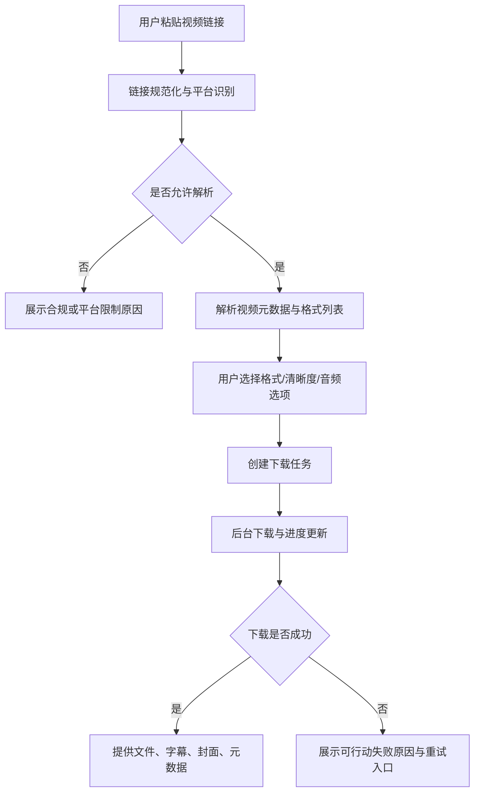

# 产品范围定义

更新时间：2026-05-02

## 1. 产品定位

本项目定位为“合规、安全、可自部署的万能视频下载与内容整理工具”。核心价值不是绕过平台限制，而是帮助用户保存自己拥有权利或已获得授权的公开视频，并进一步完成字幕、摘要、格式转换和素材归档。

一句话目标：

> 用户粘贴一个视频链接，系统解析可下载资源，给出格式选择，创建下载任务，并在完成后提供文件、字幕、元数据和可选 AI 摘要。

## 2. MVP 目标

首版只做最小闭环：

1. 链接输入与平台识别。
2. 视频信息解析：标题、封面、时长、可用格式、清晰度、文件大小估计。
3. 用户选择格式后创建下载任务。
4. 服务端下载与进度查询。
5. 下载完成后提供文件获取入口。
6. 历史任务列表和失败原因展示。
7. 合规提示、使用条款入口、敏感链接脱敏。

## 3. MVP 暂不做

- 不做 DRM、付费墙、会员专属内容、加密内容规避。
- 不做平台账号 Cookie 托管，除非后续经过合规审查和用户明确授权。
- 不做大规模爬取、频道自动同步、RSS 订阅。
- 不做移动 App。
- 不做支付和会员，除非产品验证后再进入商业化阶段。
- 不做“承诺支持所有平台”的营销表达。

## 4. 目标用户

| 用户 | 核心任务 | 产品优先级 |
| --- | --- | --- |
| 学习用户 | 下载公开课程/讲座，提取字幕和摘要 | 高 |
| 内容创作者 | 保存授权素材，整理封面/字幕/音频 | 高 |
| 开发者/自部署用户 | 本地部署、安全下载、二次开发 | 高 |
| 普通临时用户 | 粘贴链接快速下载 | 中 |
| 商业团队 | 账号、审计、配额、团队管理 | 后置 |

## 5. 核心用户路径

## 6. 平台支持策略

首版不追求平台数量，优先选择可稳定验证的公开内容平台：

- P0：yt-dlp 原生支持且可公开访问的公开视频。
- P1：B 站、YouTube、Vimeo、X/Twitter、TikTok、抖音等主流平台的公开资源。
- P2：垂直平台深度适配，如弹幕、合集、字幕、封面。
- P3：企业私有平台或需要认证的平台，必须等合规和授权机制成熟后再做。

## 7. 合规边界

产品默认展示并记录以下约束：

- 用户应只下载自己拥有版权、已获得授权、公共领域、开放授权或平台明确允许保存的内容。
- 系统不提供 DRM 规避、付费内容绕过、盗版传播、批量滥采或账号共享能力。
- 系统不鼓励使用平台账号 Cookie 进行大规模下载。
- 对存在法律风险的平台或内容类型，默认拒绝或要求用户明确确认用途。

## 8. 首版验收标准

| 模块 | 验收标准 |
| --- | --- |
| 链接解析 | 至少 3 个公开视频样例可解析出标题、封面、时长、格式 |
| 下载任务 | 可创建、查询、取消、重试任务 |
| 进度反馈 | 前端可看到排队、下载中、完成、失败状态 |
| 文件处理 | 可完成音视频合并并输出 MP4，或解释为什么不能合并 |
| 错误处理 | 网络失败、平台不支持、格式不可用、文件过大均有明确提示 |
| 安全 | URL、文件名、日志做基本脱敏和注入防护 |
| 合规 | 产品入口、下载前、错误提示中均体现使用边界 |
