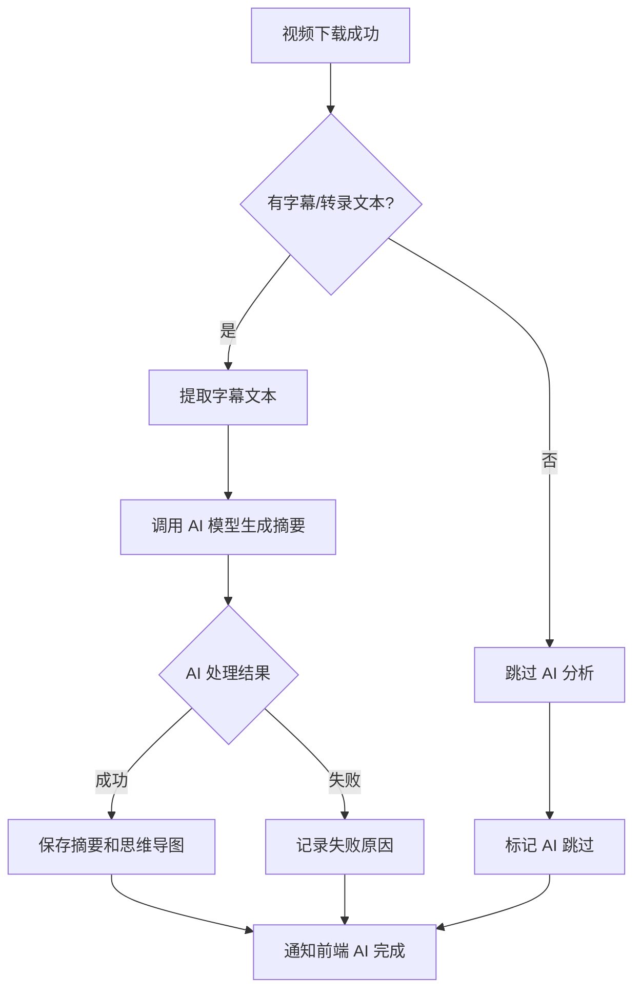
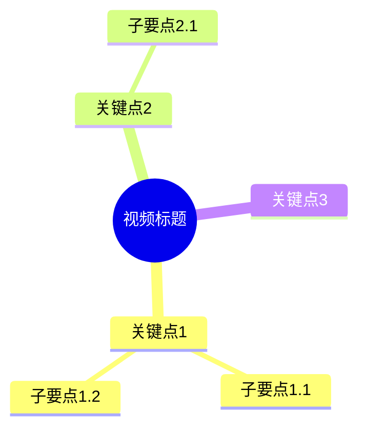
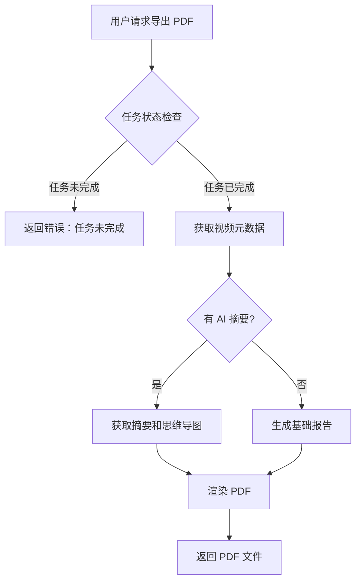

# AI 摘要与 PDF 报告

## 1. 背景

当前 MVP 已完成视频解析、下载、进度追踪和文件获取的完整闭环。用户在下载成功后，需要进一步的内容整理能力：理解视频核心内容、可视化知识结构、导出可分享的分析报告。

AI 摘要与 PDF 报告是 M4 增强能力阶段的核心功能，为下载成功的视频提供异步 AI 分析和报告导出能力。

## 2. 目标

```gherkin
Given 用户已成功下载一个视频
When 用户请求 AI 摘要分析
Then 系统应异步生成视频内容摘要和 Mermaid 思维导图
And AI 处理失败或跳过时，主视频下载结果不受影响

Given 用户已获得 AI 摘要结果
When 用户请求导出 PDF 报告
Then 系统应生成包含视频元数据、摘要和思维导图的 PDF 文件
And PDF 生成失败时返回可理解的错误原因
```

### 2.1 核心能力

| 能力 | 说明 |
| --- | --- |
| AI 智能摘要 | 基于视频字幕/转录文本生成结构化摘要 |
| 思维导图生成 | 将摘要内容转换为 Mermaid 格式思维导图 |
| PDF 报告导出 | 将视频元数据、摘要、思维导图整合为 PDF 文件 |

### 2.2 关键约束

| 约束 | 说明 |
| --- | --- |
| 异步增强 | AI 处理是下载成功后的异步操作，不影响主下载流程 |
| 失败隔离 | AI 跳过或失败不阻塞主视频下载结果的展示和使用 |
| 字幕依赖 | AI 摘要依赖视频字幕或转录文本，无字幕时跳过 AI 分析 |
| 本地优先 | 首版支持本地 AI 模型或 API 调用，不要求云端服务 |

## 3. 非目标

- 不做实时流式 AI 分析。
- 不做多语言翻译或字幕生成。
- 不做视频内容审核或合规检测。
- 不做 AI 问答或交互式对话。
- 不做批量视频 AI 分析。
- 不做自定义报告模板。
- 不做 AI 模型训练或微调。

## 4. 核心内容

### 4.1 AI 智能摘要

#### 4.1.1 摘要生成流程



#### 4.1.2 摘要内容结构

AI 摘要应包含以下结构化信息：

| 字段 | 说明 | 必填 |
| --- | --- | --- |
| `summary` | 视频核心内容摘要（200-500字） | 是 |
| `key_points` | 关键要点列表（3-7个） | 是 |
| `chapters` | 章节划分（如适用） | 否 |
| `mindmap` | Mermaid 格式思维导图 | 是 |
| `keywords` | 关键词标签（5-10个） | 否 |

#### 4.1.3 思维导图格式

思维导图使用 Mermaid mindmap 语法：



### 4.2 PDF 报告导出

#### 4.2.1 报告内容

PDF 报告包含以下章节：

| 章节 | 内容 | 条件 |
| --- | --- | --- |
| 封面 | 视频标题、下载时间、平台来源 | 始终包含 |
| 视频信息 | 标题、时长、格式、大小、来源URL | 始终包含 |
| AI 摘要 | 结构化摘要和关键要点 | 仅当 AI 分析成功时 |
| 思维导图 | Mermaid 渲染的思维导图图片 | 仅当 AI 分析成功时 |
| 下载记录 | 任务ID、状态、文件信息 | 始终包含 |

#### 4.2.2 导出流程



### 4.3 数据模型扩展

#### 4.3.1 AI 分析结果表

```sql
CREATE TABLE ai_analysis (
    id UUID PRIMARY KEY,
    task_id UUID REFERENCES tasks(id),
    status VARCHAR(20) NOT NULL, -- pending, processing, completed, failed, skipped
    summary TEXT,
    key_points JSONB,
    chapters JSONB,
    mindmap TEXT,
    keywords JSONB,
    error_message TEXT,
    model_used VARCHAR(100),
    processing_time_ms INTEGER,
    created_at TIMESTAMP DEFAULT NOW(),
    updated_at TIMESTAMP DEFAULT NOW()
);
```

#### 4.3.2 任务表扩展

```sql
ALTER TABLE tasks ADD COLUMN ai_status VARCHAR(20) DEFAULT 'pending';
ALTER TABLE tasks ADD COLUMN ai_analysis_id UUID REFERENCES ai_analysis(id);
```

### 4.4 API 接口

#### 4.4.1 触发 AI 分析

```
POST /api/tasks/{task_id}/analyze
```

请求体：
```json
{
  "force": false  // 是否强制重新分析
}
```

响应：
```json
{
  "task_id": "uuid",
  "ai_status": "processing",
  "message": "AI 分析已开始"
}
```

#### 4.4.2 获取 AI 分析结果

```
GET /api/tasks/{task_id}/analysis
```

响应：
```json
{
  "task_id": "uuid",
  "status": "completed",
  "summary": "...",
  "key_points": ["...", "..."],
  "mindmap": "mindmap\n  root((...))",
  "keywords": ["...", "..."],
  "processing_time_ms": 5000
}
```

#### 4.4.3 导出 PDF 报告

```
GET /api/tasks/{task_id}/report/pdf
```

响应：
- Content-Type: application/pdf
- Content-Disposition: attachment; filename="report-{task_id}.pdf"

### 4.5 Worker 任务

#### 4.5.1 AI 分析任务

Worker 接收 AI 分析任务后的处理流程：

1. 检查任务状态是否为 `succeeded`
2. 检查是否有字幕/转录文本
3. 提取字幕文本（如有）
4. 调用 AI 模型生成摘要和思维导图
5. 保存分析结果到 `ai_analysis` 表
6. 更新任务的 `ai_status` 字段
7. 通过 SSE 推送 AI 分析完成事件

#### 4.5.2 失败处理

| 失败场景 | 处理方式 |
| --- | --- |
| 无字幕文本 | 标记为 `skipped`，不阻塞主流程 |
| AI 模型调用失败 | 标记为 `failed`，记录错误信息 |
| AI 模型超时 | 标记为 `failed`，支持重试 |
| 输出格式错误 | 标记为 `failed`，记录格式问题 |

## 5. 关联文档

### 5.1 输入文档

1. `docs/02-产品需求/03-MVP需求清单.md` - AI 智能套件需求
2. `docs/02-产品需求/01-产品范围定义.md` - 产品范围和用户路径

### 5.2 输出文档

1. `docs/04-执行计划/07-AI摘要与思维导图计划.md` - AI 摘要实现计划
2. `docs/04-执行计划/08-PDF报告导出计划.md` - PDF 导出实现计划

### 5.3 下游文档

1. `docs/05-测试验收/01-验收标准.md` - 验收标准

## 6. 验收门禁

| 验收项 | 验证方式 |
| --- | --- |
| AI 分析异步执行 | 下载成功后可触发 AI 分析，不影响主流程 |
| 失败隔离 | AI 失败时任务状态仍为 `succeeded` |
| 摘要生成 | 有字幕视频能生成结构化摘要 |
| 思维导图生成 | 摘要结果包含有效 Mermaid 语法 |
| PDF 导出 | 能生成包含视频信息的 PDF 文件 |
| 无字幕处理 | 无字幕视频标记为 `skipped` |
| 重试机制 | AI 失败后支持手动重试 |

## 7. 风险与边界

| 风险 | 缓解措施 |
| --- | --- |
| AI 模型可用性 | 支持本地模型和 API 双模式 |
| 处理时间过长 | 设置超时限制，异步处理 |
| 字幕提取失败 | 无字幕时跳过，不阻塞 |
| PDF 渲染兼容性 | 使用成熟 PDF 库（如 reportlab） |
| 成本控制 | 限制单次分析文本长度 |

## 8. 待确认问题

- AI 模型选型：本地模型（如 llama.cpp）还是云端 API（如 OpenAI）？
- 字幕提取方式：使用 yt-dlp 内置字幕还是 Whisper 转录？
- PDF 渲染库选型：reportlab 还是 weasyprint？
- 思维导图渲染：服务端渲染为图片还是前端渲染 Mermaid？

## 9. 变更记录

| 日期 | 作者 | 版本 | 变更说明 |
| --- | --- | --- | --- |
| 2026-06-02 | StephenQiu30 | 0.1.0 | 初始化文档 |
