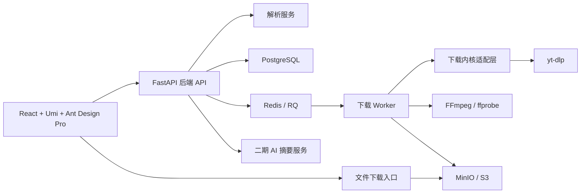

# 总体架构方案

更新时间：2026-05-02

## 架构目标

采用“React + Umi + Ant Design Pro 前端 + FastAPI 后端 + RQ 后台任务 + 下载内核可插拔”的架构。M1 首版优先保证本地 Docker Compose 可运行、任务可追踪、错误可解释，并以 PostgreSQL、Redis、MinIO / S3 兼容对象存储和本地单用户模式作为基础能力。

## 架构图



## 模块边界

| 模块 | 职责 |
| --- | --- |
| Web 前端 | React + Umi + TypeScript + Ant Design Pro，负责链接输入、格式选择、任务台、历史记录、错误反馈 |
| 后端 API | FastAPI，负责参数校验、本地单用户归属、任务创建、状态查询、文件授权、错误转换 |
| 解析服务 | 平台识别、视频元数据解析、格式列表解析 |
| 下载 Worker | RQ Worker，负责后台下载、合并、重试、取消、清理 |
| 下载内核适配层 | 封装 yt-dlp；首版不做平台专用解析，只预留插件口 |
| 存储层 | MinIO / S3 兼容对象存储，使用私有 bucket 保存成品文件、封面、字幕和元数据，通过后端生成短期预签名 URL 交付 |
| AI 服务 | 二期提供字幕摘要、章节、问答和思维导图 |

## 数据流

1. 用户提交视频链接。
2. 后端规范化 URL 并检查是否允许解析。
3. 解析服务返回视频元数据和格式列表。
4. 用户选择格式并创建下载任务。
5. Worker 执行下载、合并和落盘。
6. 前端轮询或订阅任务进度。
7. 任务完成后提供文件入口，过期后自动清理。

## 项目目录结构

```text
apps/
  web/        # React + Umi + Ant Design Pro 前端
  api/        # FastAPI 后端 API
  worker/     # RQ 下载 Worker
packages/
  shared/     # API 类型、状态枚举、共享约定
infra/
  docker/     # Docker Compose、容器配置、初始化脚本
```

## 架构原则

- 下载内核必须通过适配层调用。
- 任务状态机必须可观测。
- 文件和日志默认脱敏。
- M1 采用本地单用户模式，不要求注册、登录或 JWT；公网 SaaS 前再单独启用鉴权、限流和任务配额。
- 平台专用解析首版不做；后续必须经过合规审查后才能加入。
- 下载限制默认值为：单任务最大 2GB、最长 2 小时、全局并发 2、单用户并发 1、文件保留 24 小时。
- M1 实现变更由 OpenSpec `bootstrap-mvp-foundation` 管理。
