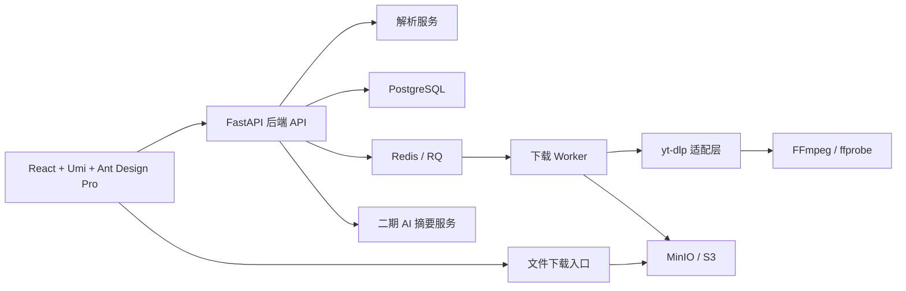

# 技术选型候选

更新时间：2026-05-02

## 1. 架构上下文

总体架构详见 [01-总体架构方案.md](01-总体架构方案.md)。本文件沉淀已确认技术选型、原候选取舍和后续变更约束。

## 2. 已确认技术选型

以下技术选型已由项目负责人在 2026-05-02 手动确认，后续实现必须以本节为准。若需要调整，必须新增 ADR 或更新 [03-架构决策记录.md](03-架构决策记录.md)。

| 决策项 | 已确认方案 | 说明 |
| --- | --- | --- |
| 前端框架 | React + Umi + TypeScript | 采用 Ant Design Pro 常见成熟落地方式，适合管理台和任务工作台。 |
| UI 体系 | Ant Design Pro | 使用 Ant Design Pro / Umi 体系，优先复用 ProLayout、ProTable、ProForm 和任务工作台模式。 |
| 后端框架 | FastAPI + Python 3.12 | 便于集成 yt-dlp、FFmpeg、RQ 和异步 API 文档。 |
| 下载内核 | yt-dlp | 作为默认下载内核，通过适配层调用。 |
| 音视频处理 | FFmpeg / ffprobe | 用于音视频合并、格式处理、元数据探测。 |
| 任务队列 | RQ + Redis | 下载是长任务，必须由 Worker 后台执行，API 不直接阻塞。 |
| 数据库 | PostgreSQL | 存储任务、用户、历史、元数据和后续审计信息。 |
| 文件存储 | MinIO / S3 兼容对象存储 | 使用私有 bucket + 后端短期签名代理下载 URL 的成熟模式。 |
| AI 摘要 | 二期再做 | 首版不实现 AI 摘要、问答和思维导图。 |
| 鉴权 | M1 本地单用户模式 | 当前阶段不要求注册、登录或 JWT；默认本地用户负责任务归属和下载限制。 |
| 平台专用解析 | 首版不做，只预留插件口 | 不做 B 站、抖音等专用解析，避免过早进入高维护和高合规风险区域。 |
| 部署方式 | Docker Compose | 统一管理 frontend、api、worker、redis、postgres、minio 等服务。 |
| 项目结构 | 默认推荐 monorepo | `apps/web`、`apps/api`、`apps/worker`、`packages/shared`、`infra/docker`。 |
| OpenSpec 管理 | `bootstrap-mvp-foundation` | M1 实现变更使用 OpenSpec 管理 proposal、design、specs、tasks。 |

## 3. 下载内核比较

| 方案 | 优点 | 缺点 | 决策 |
| --- | --- | --- | --- |
| yt-dlp | 支持站点多，更新活跃，格式控制强，和 FFmpeg 集成成熟 | 平台变化会导致失败，部分内容需登录或额外 token | 已确认作为默认核心下载引擎 |
| you-get | 轻量，中文社区认知较高 | 活跃度和站点覆盖通常弱于 yt-dlp | 暂不采用，可作为后续备用适配 |
| Cobalt API | Web/API 产品体验成熟，隐私叙事清晰，可自部署 | AGPL 许可、平台覆盖和扩展方式需要评估 | 暂不采用，可作为架构参考 |
| 专用解析器 | 对特定平台体验可控，可处理弹幕、字幕、合集 | 维护成本高，合规风险更高 | 首版不做，只预留插件口 |

## 4. 分阶段技术路线

### 阶段 0：技术确认

- 已完成文档、角色、规范、合规边界。
- 已确认前端、后端、队列、数据库、存储、AI、UI 和专用解析策略。
- 已建立 ADR 文档模板，后续每个关键决策都需要留痕。

### 阶段 1：MVP

已确认 MVP 技术组合：

- 前端：React + Umi + TypeScript + Ant Design Pro。
- 后端：FastAPI + Python 3.12。
- 下载：yt-dlp + FFmpeg / ffprobe。
- 队列：RQ + Redis。
- 数据：PostgreSQL。
- 存储：MinIO / S3 兼容对象存储。
- 鉴权：M1 本地单用户模式，不要求注册、登录或 JWT。
- 资源限制：单任务最大 2GB、最长 2 小时、全局并发 2、单用户并发 1、文件保留 24 小时、后端签名下载 URL TTL 15 分钟。
- OpenSpec：M1 变更名 `bootstrap-mvp-foundation`。
- 部署：Docker Compose。
- 暂不进入首版：AI 摘要、支付会员、平台专用解析。

### 阶段 2：产品增强

- AI 字幕摘要和问答。
- 下载历史与素材库。
- 批量任务。
- 清晰度偏好和文件命名模板。
- 平台适配插件系统。

### 阶段 3：生产化

- 多 Worker 和任务优先级。
- 对象存储生命周期管理。
- 用户配额、限流、审计。
- 管理后台和风控黑名单。

## 5. 安全与合规架构要求

- URL 入库前规范化并脱敏。
- 日志不得记录完整私密链接、Cookie、Authorization、签名参数。
- 下载文件名必须清洗，防止路径穿越。
- Worker 必须运行在受限目录，不允许任意写入系统路径。
- 每个任务必须有大小、时长、并发和超时限制。
- 默认拒绝 DRM、付费墙、加密内容规避需求。
- 公网部署必须通过 `production-saas-readiness` 单独启用鉴权、限流和任务配额。

## 6. 已确认清单

- [x] 前端框架：React + Umi + TypeScript。
- [x] UI 体系：Ant Design Pro。
- [x] 后端框架：FastAPI + Python 3.12。
- [x] 下载内核：yt-dlp。
- [x] 音视频处理：FFmpeg / ffprobe。
- [x] 任务队列：RQ + Redis。
- [x] 数据库：PostgreSQL。
- [x] 文件存储：MinIO / S3 兼容对象存储，私有 bucket + 后端短期签名代理下载 URL。
- [x] AI 摘要：二期再做。
- [x] 账号系统：M1 本地单用户模式；JWT 注册登录延后到上线级 SaaS。
- [x] 平台专用解析：首版不做，只预留插件口。
- [x] 项目目录结构：默认推荐 monorepo。
- [x] 下载限制：2GB / 2 小时 / 全局并发 2 / 单用户并发 1 / 文件保留 24 小时。
- [x] M1 变更管理：OpenSpec `bootstrap-mvp-foundation`。
