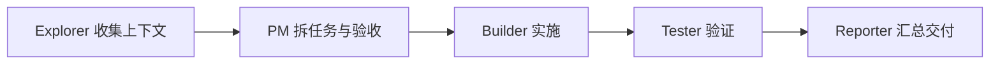

# 角色协作策略

更新时间：2026-05-02

## 标准执行流程

## 角色分工

| 角色 | 执行策略 | Codex 配置 | Claude 配置 | Cursor 配置 |
| --- | --- | --- | --- | --- |
| PM | 控制范围，决定 MVP 是否加入 AI、账号、支付 | `.codex/agents/pm.toml` | `.claude/agents/pm.md` | `.cursor/agents/pm.md` |
| Explorer | 只读探索代码、依赖、文档、竞品和技术资料 | `.codex/agents/explorer.toml` | `.claude/agents/explorer.md` | `.cursor/agents/explorer.md` |
| Builder | 按确认后的计划做最小实现，不自行扩大范围 | `.codex/agents/builder.toml` | `.claude/agents/builder.md` | `.cursor/agents/builder.md` |
| Tester | 维护公开视频样例、失败样例和验收脚本 | `.codex/agents/tester.toml` | `.claude/agents/tester.md` | `.cursor/agents/tester.md` |
| Reporter | 汇总变更、验证结果、风险和下一步 | `.codex/agents/reporter.toml` | `.claude/agents/reporter.md` | `.cursor/agents/reporter.md` |

## 协作规则

- Explorer 只收集事实，不改文件。
- PM 先确认范围和验收标准。
- Builder 只能在关键选型确认后实施。
- Tester 必须覆盖成功、失败和边界样例。
- Reporter 必须交付验证结果和未解决风险。
