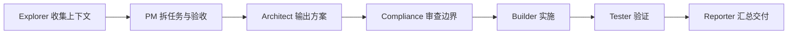

# 角色协作策略

更新时间：2026-05-02

## 标准执行流程

## 角色分工

| 角色 | 执行策略 | `.codex` 配置 |
| --- | --- | --- |
| PM | 控制范围，决定 MVP 是否加入 AI、账号、支付 | `.codex/agents/pm.toml` |
| Architect | 维护 ADR、模块边界、风险清单，所有关键选型需确认 | `.codex/agents/architect.toml` |
| Explorer | 只读探索代码、依赖、文档、竞品和技术资料 | `.codex/agents/explorer.toml` |
| Builder | 按确认后的计划做最小实现，不自行扩大范围 | `.codex/agents/builder.toml` |
| Tester | 维护公开视频样例、失败样例和验收脚本 | `.codex/agents/tester.toml` |
| Reporter | 汇总变更、验证结果、风险和下一步 | `.codex/agents/reporter.toml` |
| Compliance | 审查平台条款、版权风险、DRM、付费墙和 Cookie | `.codex/agents/compliance.toml` |
| DevOps | 维护 Docker、存储、清理、限流、监控和部署 | `.codex/agents/devops.toml` |

## 协作规则

- Explorer 只收集事实，不改文件。
- PM 先确认范围和验收标准。
- Architect 对关键技术只给候选和推荐倾向，不自行锁定。
- Compliance 对平台专用解析、Cookie、付费墙和 DRM 有否决权。
- Builder 只能在关键选型确认后实施。
- Tester 必须覆盖成功、失败和边界样例。
- Reporter 必须交付验证结果和未解决风险。
