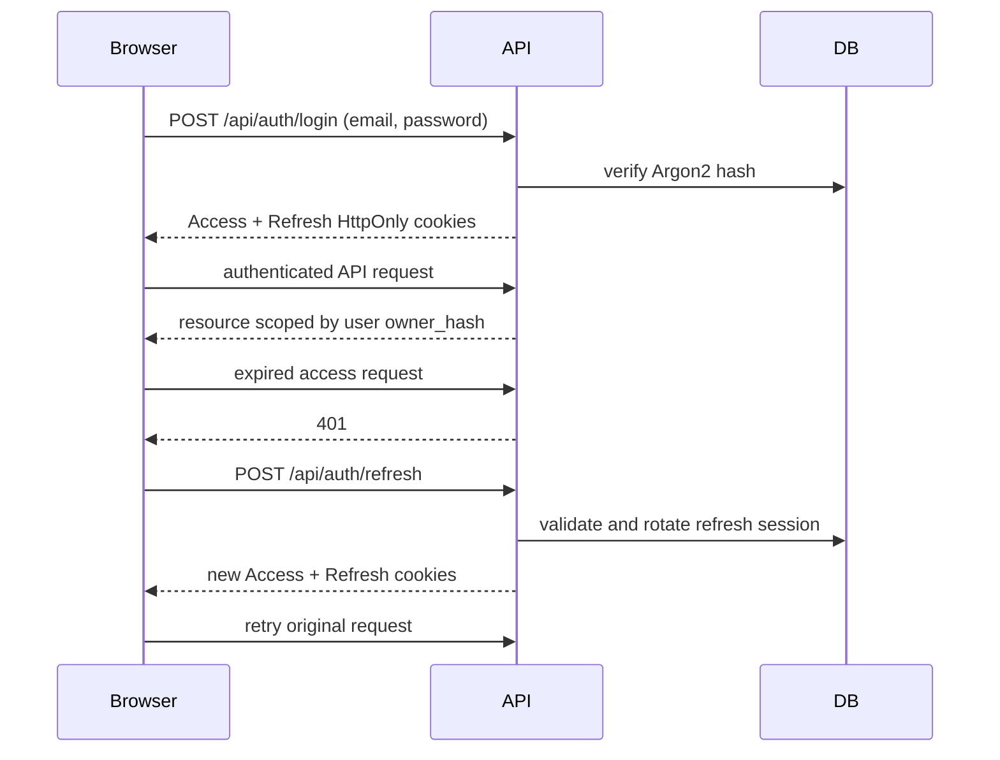

# 007 邮箱账户与 JWT 认证设计

- 状态：Accepted
- 日期：2026-08-09

## 目标与边界

用户使用邮箱和密码注册、登录并跨浏览器刷新恢复登录态。所有解析、下载、历史和分析接口只允许已登录用户访问，现有 `owner_hash` 改由稳定用户 UUID 派生，因此不同账户的数据继续隔离。

密码使用 pwdlib 推荐的 Argon2 参数哈希。服务端签发短期 Access JWT 和长期 Refresh JWT；两个令牌都只存在于 `HttpOnly + SameSite=Lax` Cookie，前端 JavaScript 不读取或持久化令牌。Access 默认 15 分钟，Refresh 默认 30 天。

## 会话流

Refresh JWT 的原文不写入数据库；`auth_sessions` 只保存使用 JWT 密钥计算的摘要、用户和过期时间。刷新时旧会话与新会话原子替换，避免同一 Refresh JWT 重放。注销删除会话摘要并清除两个 Cookie。

JWT 固定使用 HS256，并强制校验 `sub`、`jti`、`type`、`iat`、`exp`、`iss` 和 `aud`。密钥、签发方、受众、Cookie 名和有效期全部通过根目录 `.env` 进入类型化 `Settings`；生产环境拒绝开发默认密钥。

## 数据与接口

- `users`：唯一邮箱、唯一规范化用户名、密码哈希、角色、启用状态和时间戳。
- `auth_sessions`：可撤销 Refresh 会话摘要和过期时间。
- `POST /api/auth/register`：使用用户名、邮箱和密码创建账户并登录，返回 `201 + Location`。
- `POST /api/auth/login`：校验邮箱密码并登录。
- `GET /api/auth/me`：恢复当前用户；在认证路径上可用 Refresh Cookie 自动轮换。
- `POST /api/auth/refresh`：显式轮换 Refresh 会话。
- `POST /api/auth/logout`：撤销当前 Refresh 会话并清除 Cookie。
