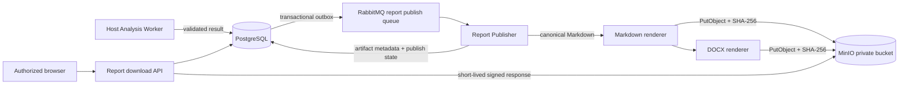

# 012 AI 分析报告与 MinIO 持久化设计

- 状态：Accepted
- 日期：2026-08-10
- DAC：DAC-012-01 ～ DAC-012-10
- 关联设计：`docs/design/010-Codex与Claude CLI视频分析设计.md`、`docs/archive/013/013-AI分析原任务重试设计.md`、`docs/archive/015/015-RabbitMQ异步分析设计.md`

## 1. 目标与边界

分析完成后，PostgreSQL 必须持久化可恢复、可审计的报告事实；规范 Markdown 与由该 Markdown 渲染的 DOCX 必须作为不可变对象上传到 MinIO。用户再次打开任务或下载报告时，不得重新调用 AI，也不得临时重建一份可能与首次结果不同的文档。

本设计只定义报告发布、存储、读取和生命周期，不改变 010 的视频视觉分析语义。分析对象仍是完整下载制品，由 Agent 自主检查视频并形成分镜、高光和视觉资产；报告持久化不得退化为应用侧预先抽帧后只分析零散图片。

## 2. 设计冻结时的事实与目标差异

设计冻结时，实现已经把经过校验的 `result_json`、Provider、模型和 CLI 版本写入 `analysis_results`，但每个任务只能保存一条结果。`GET /api/analyses/{id}/report.md` 与 `report.docx` 会在每次请求时从结果即时渲染，MinIO 中没有可复用的报告对象，也没有对象校验和、渲染版本或发布状态。

目标状态为：

- PostgreSQL 是报告语义、版本、归属和发布状态的事实源。
- MinIO 保存 Markdown、DOCX 二进制对象，数据库只保存必要的 Markdown 快照和对象元数据，不保存 DOCX BLOB。
- 同一次成功执行只发布一个规范报告版本；两个文件必须来自同一份 Markdown。
- `succeeded` 表示结构化结果已提交且两个必需文件均可下载。
- 报告发布失败只重试渲染/上传阶段，不重新运行 AI。

## 3. 目标发布链路



结构化结果通过领域校验后先进入 `validated` 发布阶段。Report Publisher 从数据库读取固定结果和渲染版本，生成唯一 Markdown，再从该 Markdown 生成 DOCX。两个对象都通过大小、媒体类型和 SHA-256 校验后，才在一个数据库事务中把报告版本标为 `available`，同时把当前执行标为成功。

## 4. 数据模型

### 4.1 报告版本

目标模型引入 `analysis_report_versions`，每次执行可产生至多一个报告版本：

| 字段 | 语义 |
| --- | --- |
| `id` | 报告版本 UUID |
| `job_id` | 稳定分析任务 ID |
| `run_id` | 013 定义的执行代次 ID，唯一约束 |
| `result_json` | 已通过 010 证据规则的结构化结果 |
| `report_markdown` | 规范 Markdown 的 UTF-8 快照 |
| `content_sha256` | Markdown 内容哈希，用于审计与幂等 |
| `renderer_version` | 报告模板和 DOCX 渲染器的受信版本 |
| `provider` / `model` / `cli_version` | 内部执行审计信息，不直接公开 |
| `status` | `validated`、`publishing`、`available`、`publish_failed` |
| `created_at` / `published_at` | 生成与完成时间 |

`analysis_jobs.current_report_id` 指向最近一次成功发布的报告版本。现有 `analysis_results` 的当前态能力在实施时收敛进上述版本模型，不保留两套可写报告事实；Schema、ORM、repository 和测试快照必须同一提交同步更新。

### 4.2 MinIO 对象记录

`analysis_report_artifacts` 为每个报告版本保存两个对象元数据：

| 字段 | 语义 |
| --- | --- |
| `report_id` / `format` | 报告版本与 `markdown`、`docx`；联合唯一 |
| `bucket` / `object_key` | 私有 bucket 与不可变对象键 |
| `content_type` | `text/markdown; charset=utf-8` 或 DOCX 标准类型 |
| `size_bytes` / `sha256` | 下载与完整性校验事实 |
| `status` | `pending`、`available`、`delete_pending`、`deleted`、`failed` |
| `created_at` / `available_at` / `deleted_at` | 生命周期时间 |

对象键由服务端生成，不使用标题、原始文件名、用户邮箱或 `owner_hash`：

```text
analyses/<job-id>/runs/<run-no>/reports/<report-id>/report.md
analyses/<job-id>/runs/<run-no>/reports/<report-id>/report.docx
```

同一 `report_id + format` 的重投总是写入同一个键。消息和 API 不携带 MinIO Secret 或预签名 URL。

## 5. 一致性、幂等与恢复

PostgreSQL 与 MinIO 不支持跨系统事务，因此采用“数据库意图先落盘、对象幂等上传、数据库最终确认”的状态机：

```text
validated → publishing → available
                    ↘ publish_failed → publishing
```

1. AI Worker 在事务中写入报告版本、任务事件和 `analysis.report.publish.requested` Outbox 事件。
2. Publisher 按 `report_id` claim，并用数据库租约防止并发发布。
3. 对每种格式生成内容、计算 SHA-256，再以确定性对象键执行 `PutObject`。
4. 重复消费时先 `StatObject`；大小和哈希一致即视为成功，不一致则拒绝覆盖并告警。
5. 两个对象可读且与数据库元数据一致后，原子标记报告 `available`、更新 `current_report_id` 和任务终态。

进程若在上传后、数据库确认前退出，下一次消费通过对象校验继续完成；若数据库事务已回滚但对象存在，Lifecycle Worker 在隔离期后按对象清单清理孤儿。不得用“RabbitMQ 已 ACK”或“MinIO 中存在对象”代替数据库发布状态。

## 6. API 与下载行为

现有资源路径保持稳定：

- `GET /api/analyses/{analysis_id}` 返回当前报告的 `report_id`、`status`、`published_at` 和两个格式的大小/可用状态，不返回 bucket、object key 或内部渲染错误。
- `GET /api/analyses/{analysis_id}/report.md` 读取数据库中的当前可用 artifact，完成 owner 授权后签发短时下载响应。
- `GET /api/analyses/{analysis_id}/report.docx` 使用相同规则，不再同步执行 DOCX 渲染。

API 可以使用带 `Content-Disposition` 的短时 MinIO 预签名 URL 重定向，也可以受控流式代理；两种实现都必须先校验当前用户拥有该任务。bucket 永远不公开，URL 不进入普通日志、WebSocket 事件或长期缓存。报告尚在发布时返回稳定的 `409 analysis_report_not_ready`；对象记录为可用但 MinIO 对象缺失时返回 `503 analysis_report_unavailable` 并触发对账告警，不临时重新渲染掩盖数据损坏。

## 7. 重试与版本可见性

013 的原任务重试会创建新的执行代次，但保持 `analysis_jobs.id` 不变。新执行期间：

- 旧的成功报告保持不可变且仍可下载，界面明确标注“上一版本”。
- 新报告只有在两个对象均发布成功后才原子替换 `current_report_id`。
- 新执行失败不会删除或覆盖旧报告。
- 用户修改 Skill、提示词、输出语言或受信 Provider 配置时属于新语义任务，不复用旧任务重试。

报告发布自身的重试不增加 AI `attempt`，也不产生新的执行代次。

## 8. 生命周期与安全

- 报告对象与数据库报告版本使用同一保留策略；删除数据库记录前先进入 `delete_pending`，由 Lifecycle Worker 幂等删除 MinIO 对象。
- 用户删除任务时，运行中执行先取消，报告进入异步删除；普通 API 不等待对象删除完成。
- 下载制品可以在报告发布完成且无重试保留锁后按原 TTL 回收；报告保留不要求永久保留源视频。
- MinIO 使用最小权限账号；Analysis CLI 子进程永远看不到 MinIO 地址、凭据和对象键。
- Markdown 在前端只能经过受控渲染和转义；DOCX 不嵌入远程图片、宏、外部关系或视频原始路径。
- 对象 metadata 不保存用户输入、完整 Prompt、模型原始响应或预签名 URL。

## 9. 可观测性

至少记录以下低基数指标：报告发布耗时、各格式生成/上传失败数、pending 数、对象缺失数、哈希不一致数、孤儿对象数和预签名失败数。日志包含 `job_id`、`run_id`、`report_id`、格式、稳定错误码和 correlation id，不记录报告正文与签名参数。

告警至少覆盖持续 `publish_failed`、可用记录对应对象缺失、孤儿积压超过隔离期、MinIO 容量不足和签名错误率异常。

## 10. 设计验收标准（DAC）

- DAC-012-01：成功分析的结构化结果、规范 Markdown 和发布元数据可在 PostgreSQL 中恢复，服务重启后内容不变化。
- DAC-012-02：每个可用报告在 MinIO 中恰有一个 Markdown 和一个 DOCX 对象，两个文件来自同一 Markdown 快照。
- DAC-012-03：`succeeded` 只在两个对象完成大小与 SHA-256 校验后出现。
- DAC-012-04：相同发布消息重复消费不会生成重复记录或内容不同的同键对象。
- DAC-012-05：上传成功后进程退出、数据库提交失败和重复投递均可恢复，不重新调用 AI。
- DAC-012-06：报告下载先执行 owner 授权，bucket 保持私有，签名 URL 短时有效且不进入日志或事件。
- DAC-012-07：原任务重试成功后原子切换当前报告；重试失败时上一成功版本仍可下载。
- DAC-012-08：数据库可用记录与 MinIO 缺失对象会显式失败并告警，不通过即时重建掩盖问题。
- DAC-012-09：用户删除、TTL 清理和孤儿对账可幂等执行，数据库与对象存储最终一致。
- DAC-012-10：Schema/ORM/repository、报告渲染、MinIO 集成、API 契约和故障恢复测试结果记入后续 Acceptance。
