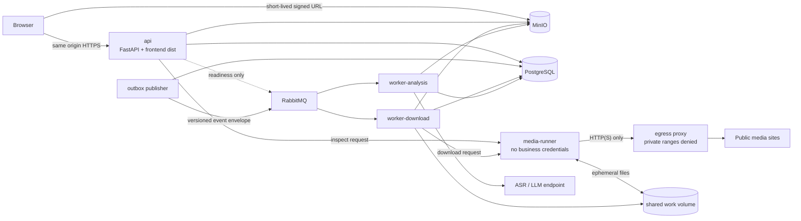

# 001 Server 单仓与运行时架构设计

- 状态：Accepted
- 日期：2026-08-06
- 决策来源：用户明确要求外层项目命名为 `server`，内部按 `backend`、`frontend` 等模块重新设计，并允许清理旧实现。

## 1. 目标

建立一个可独立开发、统一构建、按进程扩缩容的模块化单体。浏览器只访问一个 Server Origin；前端静态文件、业务 API、下载任务和 AI 分析均由该仓库交付，但计算密集任务不得运行在 API 进程内。

## 2. 仓库边界

```text
server/
├── backend/
│   ├── app/
│   │   ├── api/              HTTP、会话、DTO
│   │   ├── application/      用例编排、事务边界
│   │   ├── domain/           下载与分析状态机、纯规则
│   │   ├── infrastructure/   PostgreSQL、RabbitMQ、MinIO、模型客户端
│   │   ├── runner/           无业务凭据的媒体执行服务
│   │   └── workers/          download / analysis 进程入口
│   ├── sql/schema.sql
│   └── tests/
├── frontend/
│   ├── src/app/              Next.js App Router 页面与全局主题
│   ├── src/components/       业务组件与 shadcn/ui 源码
│   ├── src/hooks/            下载与分析状态流程
│   ├── src/services/         Umi OpenAPI 生成代码与业务请求入口
│   └── tests/
├── docs/                     当前交付契约
├── Dockerfile                统一前后端镜像
├── docker-compose.yml        本地完整服务拓扑与运行时定义
└── docker-compose-prod.yml   生产环境覆盖
```

依赖方向固定为：`api/workers → application → domain`；`infrastructure` 实现 application 所需端口。Domain 不得导入 FastAPI、SQLAlchemy、RabbitMQ、MinIO、yt-dlp 或模型 SDK。

## 3. 运行时拓扑



## 4. 进程职责

| 进程 | 允许持有的凭据 | 职责 |
| --- | --- | --- |
| `api` | DB、MQ 健康检查、MinIO 签名 | 同源 Web、API、鉴权/会话、创建与查询任务；业务事件只写 PostgreSQL outbox |
| `outbox` | DB、MQ | 领取并发布已提交的 outbox 事件，确认后标记投递结果 |
| `worker-download` | DB、MQ、MinIO | 任务租约、调用 Runner、验证制品、上传、状态收敛 |
| `media-runner` | 仅内部 HMAC token | yt-dlp/FFmpeg/ffprobe 子进程；不得访问 DB、MQ、MinIO 或模型 |
| `worker-analysis` | DB、MQ、MinIO、AI provider | 音频提取、ASR、结构化分析、证据校验 |
| `egress-proxy` | 无 | 仅代理 HTTP(S)，阻断私网、链路本地和云元数据地址 |

前端不是独立生产服务。Next.js 以静态导出生成 `frontend/out`，多阶段镜像将其复制到 `/app/frontend/dist`，API 在所有 API/health 路由之后挂载静态页面。

## 5. 数据与消息原则

1. PostgreSQL 是任务状态的唯一事实来源。
2. RabbitMQ 使用固定 envelope：`schema_version`、`event_id`、`aggregate_id`、`event_type`、`occurred_at` 和受限 `payload`。
3. `download.requested` payload 仅包含 `job_id`、`attempt`、`version`；`analysis.requested` 仅包含 `job_id`、`artifact_id`、`input_sha256`、`profile`、`schema_version`、`output_language`、`attempt`、`version`。payload 有大小、深度和敏感字段校验，不得携带 URL、cookie、token、密钥、完整转录、模型原始响应或分析结果。
4. 业务事务与 outbox 事件同事务提交；Outbox Publisher 负责投递并标记，消费者按 event/job/version 幂等处理。API 不直接发布业务消息。
5. MinIO 保存已验证的视频制品；分析音频只在受限工作目录中临时存在并在终态清理，可查询的结构化分析结果保存在 PostgreSQL JSONB。
6. 所有任务使用 UUID、幂等键、乐观版本与 lease；进度不是锁，心跳必须独立刷新。

## 6. 安全边界

- API 对 URL 做语法、scheme、hostname 和解析结果初筛，但最终网络隔离由 Runner + egress proxy 实现。
- Runner 只接受内部网络请求和带时间戳的 HMAC；请求体大小、并发、时长、磁盘和输出数量均有限制。
- 用户提供的 URL 加密存储并按 TTL 清理；日志不得记录 query、cookie、Authorization、API key 或完整转录。
- 浏览器永远不接触 DB/MQ/MinIO/AI provider 凭据。
- Compose 使用按职责拆分的内部网络完成服务互联；浏览器只访问 API 入口和 API 签发的短时对象地址。Media Runner 通过 egress proxy 出网，proxy 拒绝私网、localhost 和字面量 IP 目的地址。
- 不支持 DRM 绕过、私有内容规避、任意文件协议、直播录制或未授权内容下载。

## 7. 部署与演进

- 单一代码镜像、多个命令入口，便于独立扩容 API、下载和分析 Worker。
- Python builder 与 runtime 固定使用同一绝对目录 `/app/backend`，复制后的虚拟环境保持 `/app/backend/.venv`；容器入口通过该 PATH 下的 `python -m ...` 启动，避免构建路径写入的 venv 解释器在运行时失效。
- PostgreSQL、RabbitMQ、MinIO 使用 Compose 项目 `video-server` 的作用域卷。单实例服务直接使用服务原名作为稳定容器名；本地与生产共用项目名、容器名和数据卷，因此同一主机不并行启动两套环境。
- 两份 Compose 文件按职责分层：`docker-compose.yml` 可独立启动本地完整服务，定义拓扑、依赖、健康检查、卷、本地 `.env` 和宿主机端口；`docker-compose-prod.yml` 注入 `.env.prod` 并覆盖生产镜像和对外端口。生产启动通过 `--env-file .env.prod` 显式加载变量，MinIO 初始化器等待服务可用后再执行。
- 首期保持模块化单体；只有当容量、隔离或团队所有权出现真实证据时才拆仓/拆服务。
- OpenAPI 是前后端契约；前端使用 `@umijs/openapi` 生成服务代码和类型，所有生成请求统一进入 Axios `request.ts`，页面不维护平行 DTO 或原始 HTTP 调用。

## 8. 架构验收条件

1. 仓库只保留一套治理、文档、环境和 CI。
2. `backend` 与 `frontend` 能独立测试，统一镜像能构建。
3. 生产拓扑没有独立前端容器，页面和 API 同源可用。
4. Runner 镜像环境中不存在 DB、MQ、MinIO、AI 密钥。
5. 下载失败不影响 API，AI 失败不改变已成功下载的状态。
