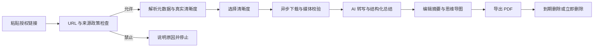

# 授权视频下载与 AI 知识化产品设计

## 1. 产品定义

本产品定位为“授权视频下载与 AI 知识化工作台”：用户粘贴自己有权处理的视频链接，系统先判断来源安全性与平台政策，再展示来源真实提供的清晰度，完成下载、内容转写、带时间证据的总结、思维导图和 PDF 编排。

“万能”只表示统一入口、统一能力探测和可扩展来源适配器，不表示支持任意网站，也不表示绕过平台规则、账号登录、付费墙、地区限制、下载禁用或 DRM。

## 2. 目标用户与核心任务

| 用户 | 核心任务 | 可验证结果 |
| --- | --- | --- |
| 内容创作者 | 备份自己发布或已获授权的视频 | 得到规格正确、可播放的文件 |
| 学习者与研究者 | 快速理解长视频 | 得到带时间戳的摘要、章节和思维导图 |
| 知识工作者 | 归档或分享研究成果 | 得到可编辑内容和排版稳定的 PDF |
| 编辑与运营人员 | 在真实规格中选择下载版本 | 不误选无声流、仅视频流或虚假清晰度 |

不服务于破解会员视频、批量搬运、去水印、盗版搜索或受限内容下载。

## 3. 主用户旅程

下载与 AI 分析是相互独立的能力。下载成功但 AI 失败时保留下载文件；无法合规下载时允许用户上传其合法持有的本地文件做分析。

## 4. 能力模型

来源探测必须返回明确领域判定，而不是含糊的“支持/不支持”。公共 API 在判定前加 `SOURCE_`，例如 `DRM_PROTECTED → SOURCE_DRM_UNSUPPORTED`：

- `PROBE_ALLOWED`：当前 policy 只授权元数据探测与规格展示，不等于允许下载。
- `DOWNLOAD_ALLOWED`：仅在 Plan 002 创建下载时，current signed policy 明确含 `download` 且权利声明、远端身份与技术检查再次通过。
- `DOWNLOAD_DISABLED`：创作者或官方机制关闭下载。
- `POLICY_BLOCKED`：平台条款或产品政策不允许处理。
- `DRM_PROTECTED`：检测到加密或密钥系统，停止处理。
- `AUTH_REQUIRED`：需要登录、Cookie 或账号凭据，MVP 不处理。
- `UNSUPPORTED`：尚无经过评审的适配器。

每个来源适配器必须记录官方政策链接、允许动作、禁止动作、下载禁用识别方式、DRM 识别方式、最后复核时间和下一次复核时间。证据过期时默认禁用。

Plan 001 采用本地单用户部署，默认只监听 loopback 并以安装令牌隔离资源；没有经过鉴权 Principal 配置时禁止公网绑定。生产来源默认全部拒绝，只有持久化且未过期的政策 dossier 可开放；CI 的自有 HTTPS fixture 只用于证明真实网络链路，不构成生产 allowlist。

## 5. 清晰度与输出规则

每个可选规格必须包含在当前 15 分钟快照内稳定的不透明 `format_key`、像素宽高、帧率、编码、容器、HDR、是否含音频、是否需要音视频合并及预计大小。

规则如下：

1. 只展示来源实际存在的规格，不伪造 2K、4K 或帧率。
2. 单一媒体文件只显示一个真实候选，不制造虚假清晰度列表；已知高度使用 `{height}p`，未知高度才显示“原始”。
3. 默认保持源编码；主动转码不属于 MVP。
4. 高质量音视频分离流要明确标注“下载后合并”。
5. 执行下载时重新解析并验证视频身份，不能信任过期媒体 URL。
6. 下载完成后用媒体探针校验分辨率、时长、音轨和容器。

## 6. AI 内容编排

MVP 的准确名称是“基于语音或字幕的内容总结”，不宣称已经理解全部画面。静音教程、体育或舞蹈等视觉主导内容必须提示能力限制。

默认知识文档结构：

1. 标题、作者或来源、视频时长与分析时间。
2. 一句话摘要。
3. 三至十个核心观点。
4. 带起止时间的章节。
5. 分章节详细摘要。
6. 二至四层、十至五十个节点的思维导图。
7. 关键术语、人物、数据与结论。
8. 行动项或后续问题。
9. 低置信度、听不清和无法验证的内容。
10. 可选的时间戳转写附录。

可验证事实应关联一个或多个时间证据；推断必须标为“AI 推断”。用户编辑后的结构化内容是 PDF 的唯一事实来源，导出时不得再次生成并覆盖。

## 7. 合规与隐私底线

一次处理必须同时满足：用户拥有版权、许可或合法使用依据；来源平台和访问方式允许本产品执行对应动作。用户确认权利只是审计证据，不能替代平台许可。

必须拒绝：

- DRM、EME、加密清单或密钥系统绕过。
- 登录墙、付费墙、地区限制或反机器人机制绕过。
- 用户 Cookie、账号密码或浏览器会话导入。
- 创作者关闭下载的内容。
- 去水印、移除署名或权利管理信息。
- 直播、播放列表和批量搬运。
- 未经书面批准的 YouTube 下载或离线存储。

隐私规则：下载授权与第三方 AI 处理同意分开；原始媒体默认完成后 24 小时内删除，未显式保存的结果默认 7 天删除；下载地址默认 15 分钟过期；日志不记录完整查询参数、Cookie、令牌或转写正文；所有结果默认私有。

## 8. 分阶段交付

| 阶段 | 交付能力 | 明确不含 |
| --- | --- | --- |
| Plan 001 | 合规 URL 探测、异步解析、真实清晰度目录 | 下载、AI、PDF |
| Plan 002 | 清晰度下载、音视频合并、对象存储交付 | AI、PDF |
| Plan 003 | 转写、章节、总结、思维导图 JSON/SVG | PDF |
| Plan 004 | 在线编辑、PDF 编排、生命周期与删除 | 多模态视觉理解 |
| Plan 005 | 兼容性、配额、生产安全和多模态增强 | DRM 绕过 |

每个阶段必须完成对应 Acceptance 后才能解锁下一个阶段。

## 9. 关键风险

- 来源站点和解析器持续变化：固定依赖版本，使用授权 canary，允许快速升级和回滚。
- 平台条款变化：适配器政策定期复核，过期自动禁用。
- SSRF 与资源耗尽：每次 DNS 和重定向都检查，worker 受网络、CPU、内存、磁盘和时长限制。
- AI 幻觉：严格结构化输出、时间证据、低置信度标记和人工编辑。
- 成本失控：限制视频时长、下载字节、并发、音频秒数和 Token。

## 10. 官方依据

- [YouTube API Developer Policies](https://developers.google.com/youtube/terms/developer-policies)
- [W3C Encrypted Media Extensions](https://www.w3.org/TR/encrypted-media-2/)
- [U.S. Copyright Office DMCA / Section 1201](https://www.copyright.gov/dmca/)
- [OpenAI API 数据控制](https://platform.openai.com/docs/models/default-usage-policies-by-endpoint)

## 11. 变更记录

| 版本 | 日期 | 变更说明 |
| --- | --- | --- |
| 1.0.0 | 2026-07-18 | 独立产品、服务端与跨仓复审通过，冻结首个实现基线 |
| 0.3.0 | 2026-07-18 | 明确 format key 快照作用域与签名来源治理入口 |
| 0.2.0 | 2026-07-18 | 冻结本地主体、默认拒绝和领域/API 判定映射 |
| 0.1.0 | 2026-07-18 | 初始化产品、合规、内容编排与阶段边界 |
