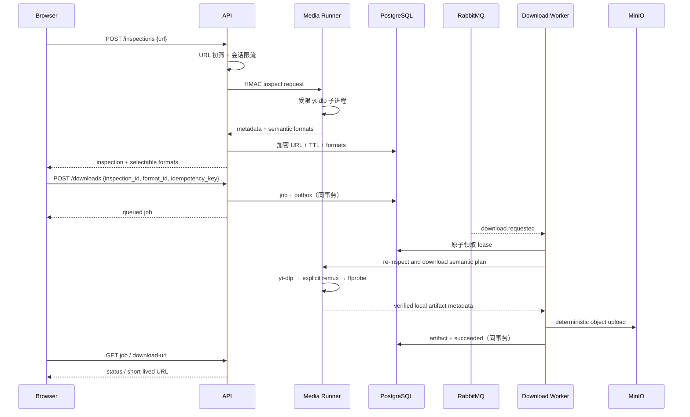

# 002 安全视频下载闭环设计

- 状态：Accepted
- 日期：2026-08-06

## 1. 目标与边界

用户提交一个其有权处理的公开 HTTP(S) 视频 URL，系统返回可解释的清晰度选项，按所选语义计划下载并交付经过验证的文件。首期不支持 DRM、账号登录、Cookie 上传、直播、播放列表或批量任务。

## 2. 核心流程



## 3. 语义下载计划

持久化的 `DownloadPlan` 不依赖易失的 provider format id：

- `height`、`width`、`fps_bucket`
- `dynamic_range`: `sdr | hdr`
- `video_codec_family`: `h264 | hevc | vp9 | av1 | other`
- `audio_codec_family`: `aac | opus | vorbis | other`
- `audio_language`
- `container_preference`: `mp4 | webm | source`
- `compatibility_profile`: `balanced | quality | smallest`
- inspect 时的 provider ids 仅作为短期 hint

Worker 开工前必须重新 inspect，并按语义重新匹配；无法满足时返回稳定的 `format_unavailable`，不得偷偷降清晰度。

## 4. 格式与制品规则

1. 优先单文件音视频流；否则选择容器/codec 兼容的独立视频与音频流。
2. MP4 默认使用 H.264/HEVC + AAC；WebM 默认使用 VP9/AV1 + Opus/Vorbis。
3. 无法 stream-copy 时，首期不自动重编码；返回 `transcode_required`，避免不可预测成本。
4. yt-dlp 只负责获取明确输出；最终容器由显式 FFmpeg remux 产生。
5. ffprobe 必须验证：至少一个视频流、预期音轨、实际容器、正时长、时长偏差、文件上限。
6. Worker 计算 SHA-256；对象 key 由 job id 和 attempt 决定，重试可识别孤儿对象。
7. 项目特有站点规则只能作为随镜像交付的可信 yt-dlp extractor 插件存在；Runner 显式指定该只读插件目录，不加载用户提交的插件、配置或参数。

## 5. 状态机与恢复

```text
queued
  → running.revalidating
  → running.downloading
  → running.remuxing
  → running.verifying
  → running.uploading
  → succeeded

queued/running → cancelled
running → retry_wait → queued
queued/running/retry_wait → failed
```

- 领取任务时原子写入 `lease_owner`、`lease_expires_at`、`started_at`、`heartbeat_at` 和 attempt。
- 心跳独立于下载进度；失效 lease 由 sweeper 根据错误类型重新排队或失败。
- 进度按阶段单调，最多每秒一次写库。
- 总墙钟超时必须终止整个子进程组：TERM 宽限后 KILL，并清理工作目录。
- Consumer 只有在状态事务完成后 ack；重投递通过 job version/attempt 幂等收敛。

## 6. SSRF 与资源限制

- 只允许 `https` 和必要时的 `http`；拒绝 userinfo、非标准端口、IP literal 和本地域名。
- egress proxy 在每次连接时解析并拒绝 loopback、private、link-local、multicast、reserved 和云元数据地址，重定向也走同一路径。
- Runner 不挂载 Docker socket，不拥有业务网络或业务凭据，并以非 root、只读 rootfs 运行。
- 每任务限制：30 秒 inspect、30 分钟下载、2 小时媒体、2 GiB 输出、4 GiB 临时空间、最多 3 个输出文件。

## 7. API 契约

- `POST /api/inspections`
- `GET /api/inspections/{id}`
- `POST /api/downloads`
- `GET /api/downloads/{id}`
- `POST /api/downloads/{id}/cancel`
- `POST /api/downloads/{id}/download-url`

所有创建接口要求 `Idempotency-Key`；资源按匿名会话或已登录用户隔离。错误使用 RFC 9457 problem details 和稳定业务码。

## 8. 前端解析入口与视觉规范

首页由 Next.js App Router 页面承载，使用 Radix UI 可访问原语与 Tailwind CSS 组织布局和状态样式；解析、格式读取和下载创建只调用 `@umijs/openapi` 生成的服务与类型，不在页面内维护平行 DTO 或原始 HTTP 请求。

界面采用方案 2 的简洁蓝白方向：白色画布、Apple 蓝主操作色、极浅灰分隔和克制阴影，不使用大面积黑色主题、厚重卡片边框或装饰性平台色块。首屏只保留居中的任务标题、简短说明和一条宽 URL 输入区；输入区将平台提示、清空操作与“解析”主按钮合并为一个连续操作面。标题用于解释当前任务，不扩展为营销式 Hero。

未开始解析时不展示空结果容器；解析中、失败或已有结果时才渲染对应状态。解析成功后展示“链接 → 格式 → 下载”的三阶段进度，并在宽屏使用“左侧格式选择、右侧视频摘要/预览”的双栏布局，窄屏按操作顺序改为单列。格式选项须显示清晰度、容器、分辨率、编码、帧率与预估大小；选中态、焦点态、错误提示和加载状态不能只依赖颜色表达。主下载操作保持高辨识度，并在旁边持续展示合法使用与版权提示。

## 9. 验收关键点

MVP 核心通过条件是：使用项目自有或明确授权的受控单文件视频，在真实 PostgreSQL、RabbitMQ、MinIO、Runner、egress proxy 和下载 Worker 上完成解析、格式选择、下载、签名 URL 取回、SHA-256 对账与 ffprobe 校验，并由真实浏览器验证解析页和下载任务页无运行时错误。Mock 单测不能替代这条链路。

分离音视频流、第三方站点/Extractor 矩阵、重定向、格式失效重匹配、硬超时、Worker 崩溃、重复消息与孤儿清理继续作为扩展兼容和故障注入矩阵。未执行这些项目时必须明确披露范围，不得把单个受控直链结果表述为所有第三方站点均已通过。
