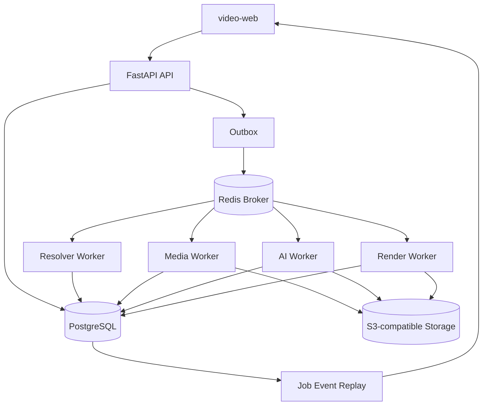

# 服务端技术与数据架构设计

## 1. 架构结论

采用 Python 模块化单体代码库，并按职责部署 API、outbox dispatcher 和多个 Celery worker。模块共享领域模型与 PostgreSQL，但只能通过 Port 接口使用 yt-dlp、FFmpeg、对象存储和 AI SDK。

不采用微服务：当前拆分会提前引入分布式事务、跨服务追踪和多仓契约成本；worker 仍可独立扩容。

## 2. 技术选型

| 领域 | 选择 | 决策理由 |
| --- | --- | --- |
| 语言与 API | Python 3.13、FastAPI、Pydantic v2 | yt-dlp 原生集成；类型化 HTTP 契约；适合模块化单体 |
| 数据 | PostgreSQL、SQLAlchemy 2、Alembic | Job、幂等、事件、资产和 AI 结果的唯一业务真相 |
| 任务 | Celery 5.6、Redis Broker | 隔离队列、重试、超时和横向扩展；消息只传 ID |
| 可靠投递 | Transactional Outbox | API 事务内同时保存业务记录和待投递消息 |
| 来源解析 | 固定版本 yt-dlp Adapter | 嵌入式元数据/格式能力成熟；不承担平台政策判断 |
| 出站安全 | 固定版本 Smokescreen + 网络策略 | worker 无直连外网；代理在连接时执行 host/IP ACL |
| 媒体 | FFmpeg、ffprobe | 优先 stream copy 合流并验证最终媒体规格 |
| 资产 | S3-compatible Port、boto3 | multipart 上传和短期签名下载；不让大文件经过 API |
| AI | Provider Port；首个 Adapter 使用 OpenAI | Audio Transcriptions + Responses Structured Outputs |
| 思维导图 | 层级 JSON → Graphviz SVG | 应用生成并转义 DOT，AI 不直接生成命令或 DOT |
| PDF | Jinja2 受控模板 + WeasyPrint | HTML/CSS 分页、中文字体和 SVG；禁用外部资源访问 |
| 可观测性 | OpenTelemetry、结构化日志、Prometheus | 串联 API、outbox、worker、外部工具和供应商 |

FastAPI 官方建议重计算使用 Celery 等独立工具；Celery/Redis 只负责传输，不能作为业务状态真相。具体版本在实现时锁定并由测试保护。

## 3. 运行拓扑

Redis Pub/Sub 仅唤醒在线 SSE 连接；断线恢复必须读取 PostgreSQL `job_events`，因为 Pub/Sub 是 at-most-once。

## 4. 模块边界

- `source`：URL 策略、来源政策、解析和格式快照。
- `identity`：安装级 Principal、Bearer token 校验和资源 owner。
- `job`：状态机、步骤、事件、outbox、幂等和取消。
- `download`：清晰度选择、重新解析、下载和重试。
- `media`：FFmpeg、ffprobe、音频提取和媒体校验。
- `asset`：对象存储、校验和、保留期限和签名地址。
- `transcript`：分片、转写、时间轴和语言。
- `insight`：章节、摘要、关键词、行动项和思维导图 JSON。
- `export`：Graphviz SVG 与 PDF 编排。
- `usage`：下载字节、音频秒数、Token、成本和配额。
- `observability`：日志、trace、指标和审计。

基础设施 Adapter 实现 `SourceExtractor`、`ObjectStorage`、`TranscriptionProvider` 和 `DocumentRenderer` 等 Port；领域层不得导入供应商 SDK。

## 5. 核心数据模型

| 表 | 关键职责 |
| --- | --- |
| `source_resolution_requests` | owner、加密 URL、请求摘要、权利确认、policy 快照和保留期 |
| `source_policy_snapshots` | adapter、host/path、允许动作、官方依据、识别规则和复核期限 |
| `jobs` | owner、类型、状态、阶段、进度、错误码与尝试次数 |
| `job_steps` | 阶段状态、尝试次数、开始/完成时间和 checkpoint |
| `job_events` | 单调事件 ID、可回放进度与终态证据 |
| `outbox_messages` | 与业务事务一致的待投递任务 |
| `video_sources` | owner、平台、远端 identity hash、标题、时长与解析版本 |
| `source_format_snapshots` | 不透明格式键、真实规格、估算大小和过期时间 |
| `download_requests` | 选定规格、重新解析计划与输出策略 |
| `media_assets` | 对象 key、MIME、大小、SHA-256、探针元数据与保留期限 |
| `analysis_runs` | 语言、模型、提示词版本、模式与成本 |
| `transcript_chunks` | 时间范围、文本、供应商和处理状态 |
| `insight_documents` | 可编辑摘要、章节、证据引用和思维导图 JSON |
| `exports` | 模板版本、SVG/PDF 资产与状态 |
| `usage_ledger` | 下载字节、音频秒数、Token 和估算成本 |

`format_key` 是服务器生成的快照内不透明标识；API 不返回真实媒体 URL，也不接受任意 yt-dlp selector 或命令参数。字段、外键、密文与事务不变量见 Design 004。

## 6. 可靠性规则

1. Celery 消息只携带 `job_id`、`aggregate_id` 和 trace context。
2. worker 必须按 Job 与 stage 幂等；重复投递不能生成重复记录或资产。
3. outbox dispatcher 使用锁定批次取消息；发布成功后记录 `published_at`。
4. Celery result backend 不承载业务状态；业务查询只读 PostgreSQL。
5. 任务超时、重试和取消必须写入 `job_steps` 与 `job_events`。
6. 媒体格式快照有 TTL；下载前重新解析并核对远端身份。
7. 外部调用都设置连接、读取和总时长限制，并只对可恢复错误重试。

## 7. 安全执行边界

- 仅 HTTP/HTTPS；拒绝 userinfo、异常端口、IP literal 和危险 hostname。
- resolver worker 无直连外网，只能经 Smokescreen；代理在每次连接解析全部地址并阻断私网、metadata、危险端口和未列入 dossier 的 host。
- yt-dlp 不读取用户配置、浏览器 Cookie 或插件；使用非 root、临时目录和资源限制。
- 不拼接 shell 字符串；只用 Python API 或固定 argv。
- FFmpeg 收敛允许协议，输出后重新探测规格。
- WeasyPrint 只接受服务器生成的受控 HTML/CSS/SVG，禁止 `file://` 和任意外部 URL。
- 日志中的 URL 仅保留 scheme、host 和路径散列，不记录查询参数。

## 8. 可观测性

日志统一包含 `request_id`、`trace_id`、`job_id`、脱敏 owner、stage、attempt、adapter、model 和 `safe_error_code`。

核心指标包括 queue age、阶段耗时、各类成功率、重试/超时/取消、下载和上传吞吐、临时空间、AI 秒数/Token/成本、孤儿 multipart 及清理失败。

## 9. 被否决方案

- FastAPI `BackgroundTasks`：不适合下载、转码和 AI 等重任务。
- PostgreSQL 自研完整队列：需要自行实现调度、超时、监控与 worker 管理。
- Temporal：恢复能力强，但 MVP 运维和认知成本过高。
- NestJS + BullMQ：仍需跨 Python/CLI 媒体边界，没有明显收益。
- 立即拆微服务：当前边界与规模不足以抵消分布式复杂度。

## 10. 官方依据

- [FastAPI Background Tasks caveat](https://fastapi.tiangolo.com/tutorial/background-tasks/#caveat)
- [Celery 5.6 文档](https://docs.celeryq.dev/en/stable/)
- [yt-dlp README](https://github.com/yt-dlp/yt-dlp/blob/master/README.md)
- [FFmpeg streamcopy](https://ffmpeg.org/ffmpeg.html#Streamcopy)
- [Redis Pub/Sub delivery semantics](https://redis.io/docs/latest/develop/pubsub/)
- [WeasyPrint 文档](https://doc.courtbouillon.org/weasyprint/stable/)
- [Smokescreen 官方仓库](https://github.com/stripe/smokescreen)

## 11. 变更记录

| 版本 | 日期 | 变更说明 |
| --- | --- | --- |
| 1.0.0 | 2026-07-18 | 独立复审通过，冻结服务端架构基线 |
| 0.2.0 | 2026-07-18 | 补齐主体、政策、请求聚合、出站代理和细化设计入口 |
| 0.1.0 | 2026-07-18 | 初始化技术选型、模块、数据和运行拓扑 |
