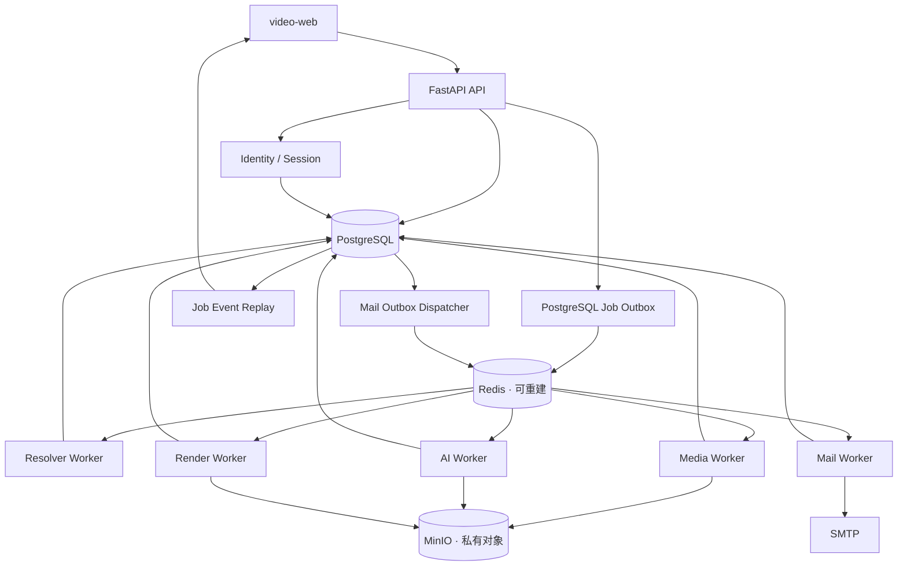

# 服务端技术与数据架构设计

## 1. 架构结论

采用 Python 模块化单体代码库，并按职责部署 API、outbox dispatcher 和多个 Celery worker。模块共享领域模型与 PostgreSQL，但只能通过 Port 接口使用 yt-dlp、FFmpeg、对象存储和 AI SDK。

不采用微服务：当前拆分会提前引入分布式事务、跨服务追踪和多仓契约成本；worker 仍可独立扩容。

## 2. 技术选型

| 领域 | 选择 | 决策理由 |
| --- | --- | --- |
| 语言与 API | Python 3.13、FastAPI 0.139.2、Pydantic 2.13.4 | yt-dlp 原生集成；类型化 HTTP 契约；适合模块化单体 |
| 数据 | PostgreSQL 17.10、SQLAlchemy 2.0.51、Alembic 1.18.5、psycopg 3.3.4 | 用户、会话、Job、幂等、事件、资产元数据和 AI 结果的唯一业务真相；WAL/PITR；API/worker 共用同一驱动 |
| 身份 | FastAPI Users 15.0.5、SQLAlchemy Adapter 7.0.0、pwdlib 0.3/Argon2id、email-validator 2.3、fastapi-csrf-protect 1.0.7 | 复用注册/验证/找回、DatabaseStrategy 与带时限签名 double-submit；`check_deliverability=false`，真实性由验证邮件证明；owner 是 `users.id` UUID |
| 邮件 | aiosmtplib 5.1.2、Jinja2 3.1.6、PostgreSQL mail outbox | SMTP 异步投递、可重试且不把邮件状态放进 Redis |
| 任务与临时态 | Celery 5.6.3、Redis Open Source 8.2.7（AGPLv3）、redis-py 6.4 | 队列、SSE 唤醒、缓存和限流；消息只传 ID，Redis 可清空重建 |
| 可靠投递 | Transactional Outbox | API 事务内同时保存业务记录和待投递消息 |
| 来源解析 | 固定版本 yt-dlp Adapter | 嵌入式元数据/格式能力成熟；不承担平台政策判断 |
| 出站安全 | 固定版本 Smokescreen + 网络策略 | worker 无直连外网；代理在连接时执行 host/IP ACL |
| 媒体 | FFmpeg、ffprobe | 优先 stream copy 合流并验证最终媒体规格 |
| 资产 | MinIO Server、MinIO Python SDK 7.2.20、`ObjectStorage` Port | 私有 bucket、multipart、校验和和短期签名下载；二进制不经过 API |
| AI | Provider Port；首个 Adapter 使用 OpenAI | Audio Transcriptions + Responses Structured Outputs |
| 思维导图 | 层级 JSON → Graphviz SVG | 应用生成并转义 DOT，AI 不直接生成命令或 DOT |
| PDF | Jinja2 受控模板 + WeasyPrint | HTML/CSS 分页、中文字体和 SVG；禁用外部资源访问 |
| 可观测性 | OpenTelemetry、结构化日志、Prometheus | 串联 API、outbox、worker、外部工具和供应商 |

FastAPI 官方建议重计算使用 Celery 等独立工具；Celery/Redis 只负责传输和可丢弃的加速状态，不能作为业务状态真相。依赖以 `uv.lock` 精确锁定，容器镜像固定 digest；不得使用 `latest`。FastAPI Users 当前处于维护模式，因此只复用其成熟协议与实现，并通过自有 Port/契约测试隔离未来替换。

## 3. 运行拓扑

Redis Pub/Sub 仅唤醒在线 SSE 连接；断线恢复必须读取 PostgreSQL `job_events`，因为 Pub/Sub 是 at-most-once。Redis 使用 `noeviction`、AOF `everysec` 与 RDB 作为运行恢复手段，但允许整个实例丢失后由 PostgreSQL/outbox 重建，不能把它当作业务备份。

## 4. 模块边界

- `source`：URL 策略、来源政策、解析和格式快照。
- `identity`：邮箱注册/验证/找回、Argon2 密码、数据库会话、UUID Principal 与资源 owner。
- `job`：状态机、步骤、事件、outbox、幂等和取消。
- `download`：清晰度选择、重新解析、下载和重试。
- `media`：FFmpeg、ffprobe、音频提取和媒体校验。
- `asset`：对象存储、校验和、保留期限和签名地址。
- `transcript`：分片、转写、时间轴和语言。
- `insight`：章节、摘要、关键词、行动项和思维导图 JSON。
- `export`：Graphviz SVG 与 PDF 编排。
- `usage`：下载字节、音频秒数、Token、成本和配额。
- `observability`：日志、trace、指标和审计。

基础设施 Adapter 实现 `SourceExtractor`、`ObjectStorage`、`TranscriptionProvider` 和 `DocumentRenderer` 等 Port；领域层不得导入供应商 SDK。

## 5. 核心数据模型

| 表 | 关键职责 |
| --- | --- |
| `users` | UUID owner、规范化邮箱、验证状态、Argon2 密码散列和安全时点 |
| `access_tokens` | DatabaseStrategy opaque token、用户、到期与撤销时点；支持注销和全会话撤销 |
| `auth_mail_intents` | 邮箱验证/找回 purpose、generation、SHA-256 token digest、到期、单次消费和 supersede 状态 |
| `mail_outbox` | 模板、目标 user、加密 token material、投递状态、重试与安全审计；不保存密码 |
| `auth_audit_events` | 验证、重置、会话撤销和安全动作的 append-only 事实；不保存 token、密码或邮箱全文 |
| `source_resolution_requests` | owner、加密 URL、请求摘要、权利确认、policy 快照和保留期 |
| `source_policy_snapshots` | adapter、host/path、允许动作、官方依据、识别规则和复核期限 |
| `jobs` | owner、类型、状态、阶段、进度、错误码与尝试次数 |
| `job_steps` | 阶段状态、尝试次数、开始/完成时间和 checkpoint |
| `job_events` | 单调事件 ID、可回放进度与终态证据 |
| `outbox_messages` | 与业务事务一致的待投递任务 |
| `video_sources` | owner、平台、远端 identity hash、标题、时长与解析版本 |
| `source_format_snapshots` | 不透明格式键、真实规格、估算大小和过期时间 |
| `download_requests` | 选定规格、重新解析计划与输出策略 |
| `media_assets` | MinIO 私有对象 key/version、状态、MIME、大小、SHA-256、探针元数据与保留期限 |
| `analysis_runs` | 语言、模型、提示词版本、模式与成本 |
| `transcript_chunks` | 时间范围、文本、供应商和处理状态 |
| `insight_documents` | 可编辑摘要、章节、证据引用和思维导图 JSON |
| `exports` | 模板版本、SVG/PDF 资产与状态 |
| `usage_ledger` | 下载字节、音频秒数、Token 和估算成本 |

`format_key` 是服务器生成的快照内不透明标识；API 不返回真实媒体 URL，也不接受任意 yt-dlp selector 或命令参数。字段、外键、密文与事务不变量见 Design 004。

## 6. 可靠性规则

1. Celery 消息只携带 `job_id`、`aggregate_id` 和 trace context。
2. worker 必须按 Job 与 stage 幂等；重复投递不能生成重复记录或资产。
3. outbox dispatcher 使用锁定批次取消息；发布成功后记录 `published_at`。
4. Celery result backend 不承载业务状态；业务查询只读 PostgreSQL。
5. 任务超时、重试和取消必须写入 `job_steps` 与 `job_events`。
6. 媒体格式快照有 TTL；下载前重新解析并核对远端身份。
7. 外部调用都设置连接、读取和总时长限制，并只对可恢复错误重试。
8. 对象写入使用 `PENDING → UPLOADING → HEAD/校验和 → READY` Saga；上传失败不发布 READY，孤儿 multipart/object 由 sweeper 对账。
9. 任务在业务事务中写 PostgreSQL outbox。FastAPI Users 的用户创建先独立 commit，再由 post-commit callback 创建验证 intent/outbox；callback 崩溃只由“未验证用户且无有效验证 generation”scanner 补单。重发验证和找回密码则先持久化 `auth_mail_intents`，再调用库流程，callback 崩溃由同 intent reconciler 恢复。两类流程都不能虚构跨 adapter 原子事务。Celery/Redis 只负责唤醒，Redis 丢失后可重放未发布行。

## 7. 数据持久化与恢复边界

1. PostgreSQL 是恢复顺序第一位：生产使用 pgBackRest 开启 WAL 归档与 PITR，定期做加密全量备份和独立恢复演练；RPO/RTO 以 Design 005 为准。
2. Redis 只做运行态持久化；灾难恢复时可从空实例启动，由 PostgreSQL outbox、事件和限流自然过期状态重建。
3. MinIO 开启 bucket versioning，对象备份/复制必须位于独立故障域；PostgreSQL 保存 key、version、checksum 与生命周期，恢复后执行双向孤儿/缺失对账。
4. 开发与测试通过命名 volume 保留 PostgreSQL/Redis/MinIO 数据；生产不能把同机 volume 当作备份。
5. MinIO Community 上游归档带来维护风险：09-07 release 缺少后续安全修复并被禁止；开发/测试只能从官方 2025-10-15 tag/commit 构建、固定 base/image digest、provenance、SBOM/CVE 扫描。生产上线需在 Acceptance 中记录维护发行版或书面风险接受、安全补丁责任、备份恢复和删除所有版本的证据，否则保持 blocked。
6. 生产系统默认恢复目标为 RPO≤5 分钟、RTO≤2 小时；任何组件的恢复设计不能把整体目标放宽，MinIO 当前生产门禁未解除时不得宣称已满足。

## 8. 安全执行边界

- 仅 HTTP/HTTPS；拒绝 userinfo、异常端口、IP literal 和危险 hostname。
- resolver worker 无直连外网，只能经 Smokescreen；代理在每次连接解析全部地址并阻断私网、metadata、危险端口和未列入 dossier 的 host。
- yt-dlp 不读取用户配置、浏览器 Cookie 或插件；使用非 root、临时目录和资源限制。
- 不拼接 shell 字符串；只用 Python API 或固定 argv。
- FFmpeg 收敛允许协议，输出后重新探测规格。
- WeasyPrint 只接受服务器生成的受控 HTML/CSS/SVG，禁止 `file://` 和任意外部 URL。
- 日志中的 URL 仅保留 scheme、host 和路径散列，不记录查询参数。
- 会话使用固定 `__Host-video_session` 的 `Secure`、`HttpOnly`、`SameSite=Lax` cookie；公开 `GET /api/v1/auth/csrf` 以 no-store 响应签发 fastapi-csrf-protect 的 raw header token 与 HttpOnly 签名 Cookie，unsafe route dependency 验证配对、1 小时有效期与 Origin/Host/Fetch Metadata。登录、注销、重置和会话轮换清除旧配对值；不宣称 CSRF token 与数据库会话天然绑定。日志不记录邮箱、Cookie 或一次性 token。
- MinIO bucket/console 不公开；API 只签发最长 15 分钟、绑定对象与用途的 URL，不返回内部 endpoint、credential 或永久 object key。

## 9. 可观测性

日志统一包含 `request_id`、`trace_id`、`job_id`、脱敏 owner、stage、attempt、adapter、model 和 `safe_error_code`。

核心指标包括 queue age、阶段耗时、各类成功率、重试/超时/取消、下载和上传吞吐、临时空间、AI 秒数/Token/成本、孤儿 multipart 及清理失败。

## 10. 被否决方案

- FastAPI `BackgroundTasks`：不适合下载、转码和 AI 等重任务。
- PostgreSQL 自研完整队列：需要自行实现调度、超时、监控与 worker 管理。
- Temporal：恢复能力强，但 MVP 运维和认知成本过高。
- NestJS + BullMQ：仍需跨 Python/CLI 媒体边界，没有明显收益。
- 立即拆微服务：当前边界与规模不足以抵消分布式复杂度。
- Redis 保存 session、Job 结果或资产状态：Redis 必须可重建，权威状态只能在 PostgreSQL。
- PostgreSQL 保存媒体 blob：放大 WAL、备份和 API 压力；二进制进入 MinIO，PG 只保存元数据。

## 11. 官方依据

- [FastAPI Background Tasks caveat](https://fastapi.tiangolo.com/tutorial/background-tasks/#caveat)
- [Celery 5.6 文档](https://docs.celeryq.dev/en/stable/)
- [yt-dlp README](https://github.com/yt-dlp/yt-dlp/blob/master/README.md)
- [FFmpeg streamcopy](https://ffmpeg.org/ffmpeg.html#Streamcopy)
- [Redis Pub/Sub delivery semantics](https://redis.io/docs/latest/develop/pubsub/)
- [WeasyPrint 文档](https://doc.courtbouillon.org/weasyprint/stable/)
- [Smokescreen 官方仓库](https://github.com/stripe/smokescreen)
- [PostgreSQL continuous archiving / PITR](https://www.postgresql.org/docs/17/continuous-archiving.html)
- [Redis persistence](https://redis.io/docs/latest/operate/oss_and_stack/management/persistence/)
- [MinIO Python SDK](https://github.com/minio/minio-py)
- [FastAPI Users](https://fastapi-users.github.io/fastapi-users/latest/)

## 12. 变更记录

| 版本 | 日期 | 变更说明 |
| --- | --- | --- |
| 2.0.0 | 2026-07-18 | 独立复审通过；冻结邮箱 UUID/FK、DatabaseStrategy Cookie、PG 唯一事实、可重建 Redis、MinIO/SMTP 与恢复边界 |
| 1.0.0 | 2026-07-18 | 独立复审通过，冻结服务端架构基线 |
| 0.2.0 | 2026-07-18 | 补齐主体、政策、请求聚合、出站代理和细化设计入口 |
| 0.1.0 | 2026-07-18 | 初始化技术选型、模块、数据和运行拓扑 |
