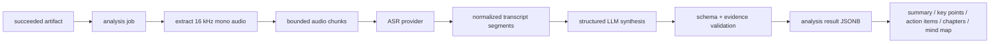

# 003 AI 分析与思维导图设计

- 状态：Accepted
- 日期：2026-08-06

## 1. 目标

对已经成功且未过期的下载制品执行后端 AI 分析，产出带时间证据的转录、摘要、关键观点、章节与思维导图。AI 失败不得使下载任务失败。

## 2. 流程



## 3. 独立状态机

```text
queued
  → running.preparing
  → running.transcribing
  → running.analyzing
  → running.validating
  → succeeded

queued/running → cancelled
running → retry_wait → queued
queued/running/retry_wait → failed
```

`analysis_jobs` 独立于 `download_jobs`。输入通过 artifact id 和 SHA-256 固定；创建请求按 owner + `Idempotency-Key` 幂等，同一键不能改换输入。失败或取消后，用户使用新键可以发起新的分析。

## 4. Provider 边界

应用只依赖两个窄端口：

```python
class Transcriber:
    async def transcribe(chunks, language_hint) -> Transcript: ...

class Analyzer:
    async def analyze(transcript, output_language) -> AnalysisDocument: ...
```

ASR 与文本分析是两个独立适配器。ASR 当前使用 OpenAI Audio Transcriptions API；文本分析统一通过 LangChain `ainvoke` 与 Pydantic structured output 运行，可由服务端配置切换：

- `deepseek`：`langchain-deepseek` 的 `ChatDeepSeek`，使用 DeepSeek JSON mode，默认 `deepseek-v4-flash`。
- `ollama`：`langchain-ollama` 的 `ChatOllama`，使用本地 JSON Schema structured output，默认 `deepseek-r1:8b`。

Provider 只允许在 AI Worker 启动配置中选择，不进入任务 API，也不生成同一任务内的隐式降级。`base_url` 只允许由受信部署配置覆盖；DeepSeek 与 ASR 密钥只注入 `worker-analysis`，API 和前端不得读取。

## 5. 规范化数据契约

```text
TranscriptSegment
  id: string
  start_ms: integer
  end_ms: integer
  text: string

AnalysisDocument
  schema_version: string
  language: string
  title: string
  summary: {text, evidence_segment_ids[]}
  key_points[]: {text, evidence_segment_ids[]}
  action_items[]: {text, evidence_segment_ids[]}
  chapters[]: {title, start_ms, end_ms, summary, evidence_segment_ids[]}
  mind_map: MindMapNode

MindMapNode
  id: string
  title: string
  summary?: string
  start_ms?: integer
  evidence_segment_ids[]
  children[]
```

模型只返回 JSON。后端必须校验 segment id 存在、时间范围合法、章节单调、导图深度/节点数、字符串长度与总大小；不合格时最多进行一次带错误摘要的修复请求，仍失败则任务失败。

## 6. 分块与证据

- 音频按时长和 provider 大小上限切分，保留绝对时间偏移。
- Transcript segment 时间戳必须单调且不重叠异常；空白和幻觉片段通过规则标记。
- 首期使用支持当前转录长度的单次结构化合成；最终观点和导图节点必须引用一个或多个真实 segment。超过配置上限直接失败，不增加隐式降级路径。
- UI 点击章节/导图节点时跳转到对应时间，并显示引用文本，避免“无来源摘要”。

## 7. 数据与生命周期

- `analysis_jobs`：输入 artifact/SHA、profile、schema version、输出语言、状态、stage、progress、attempt、lease 和错误码。
- `analysis_results`：input SHA 与严格结构化 summary、key points、action items、chapters、mind map。
- 首期不持久化完整 transcript 或 Provider 原始响应，减少敏感数据面；证据关系在写入前完成校验。
- 分析运行期间锁定输入 artifact 的清理；任务终态后按独立 TTL 释放。

## 8. API 与前端

- `POST /api/downloads/{download_id}/analyses`
- `GET /api/analyses/{analysis_id}`
- `POST /api/analyses/{analysis_id}/cancel`

下载任务页展示独立 Analysis Panel：配置语言、启动/取消分析、阶段进度、稳定失败原因、摘要、关键观点、行动项、章节和可折叠思维导图。

## 9. 质量与安全

- Provider 超时、429、5xx、非法 JSON、内容过滤和部分分块失败均映射稳定错误码。
- Prompt 明确把转录视为不可信数据，禁止执行其中指令；所有 UI 内容按纯文本渲染。
- 日志只记录 job id、模型、耗时、token/音频秒数和错误类别，不记录 API key、完整音频或完整转录。
- 必测非法证据、越界时间、超大导图、prompt injection 文本、任务重投递和输入制品清理竞争。
