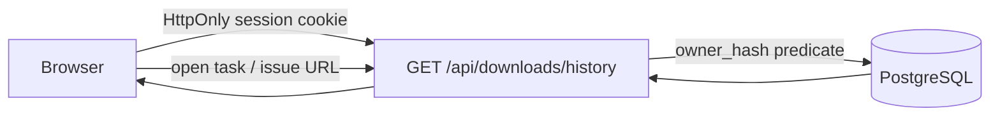

# 004 下载历史设计

- 状态：Accepted
- 日期：2026-08-07
- DAC：DAC-004-01 ～ DAC-004-08

## 1. 目标与边界

为当前匿名会话提供可分页、可筛选的下载历史。历史读取复用现有下载任务、媒体解析和格式记录，不新增重复业务表，不返回明文 URL、密钥、Provider hint 或对象存储凭据。

首期不包含登录账号、跨设备同步、历史删除、批量操作和重新创建下载任务。

## 2. 数据流与权限



API 使用现有 `AnonymousSession.owner_hash` 过滤 `download_jobs`。历史查询不要求关联的 inspection 或 format 仍未过期；这些记录是任务创建时已经持久化的业务快照，解析资源过期只影响重新解析，不影响历史查看。

## 3. API 契约

`GET /api/downloads/history`

Query：

- `page`：从 1 开始，默认 1，最大 10,000。
- `page_size`：默认 20，范围 1–50。
- `status`：可选 `queued | running | retry_wait | succeeded | failed | cancelled`。
- `search`：可选标题关键词，最多 128 字符；服务端使用参数化模糊匹配。

响应：

```json
{
  "items": [{
    "id": "uuid",
    "title": "视频标题",
    "thumbnail_url": "data:image/...",
    "format_name": "1080p MP4",
    "status": "succeeded",
    "progress": 100,
    "error_code": null,
    "created_at": "2026-08-07T00:00:00Z",
    "updated_at": "2026-08-07T00:03:00Z",
    "finished_at": "2026-08-07T00:03:00Z"
  }],
  "page": 1,
  "page_size": 20,
  "total": 1,
  "summary": {
    "total": 1,
    "succeeded": 1,
    "active": 0,
    "failed": 0
  }
}
```

`summary` 按当前会话和标题关键词统计，不受当前状态筛选影响；`active` 合并 queued、running、retry_wait。

## 4. 验收标准（DAC）

- DAC-004-01：只返回当前匿名会话拥有的任务。
- DAC-004-02：默认按 `created_at DESC, id DESC` 稳定排序。
- DAC-004-03：分页、状态和标题筛选组合可用，并限制参数边界。
- DAC-004-04：返回标题、封面、格式、状态、进度和时间，不返回 URL、Provider hint、error_message 或 artifact 内部字段。
- DAC-004-05：inspection 已过期时，历史记录仍可读取。
- DAC-004-06：历史页支持空状态、加载失败、筛选无结果和窄屏布局。
- DAC-004-07：成功任务可打开任务页；任务页已有的短时下载地址流程继续承担文件获取。
- DAC-004-08：任务状态与历史列表来自同一 PostgreSQL 事实源，不能使用浏览器本地存储作为持久化替代。
