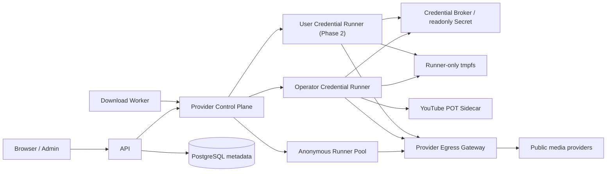

# 005 多平台 Provider 与会话适配设计

- 状态：Proposed
- 日期：2026-08-10
- 前置调研：`docs/research/003-多平台下载会话与GitHub适配调研.md`
- 实现状态：当前 Registry、yt-dlp/EJS/FFmpeg 和公开 Provider 主链已存在；本文的受控 Cookie、PO Token、能力状态和凭据 Broker 尚未实现。

## 1. 目标

在不改变语义下载计划、任务租约、FFmpeg 校验和对象存储交付的前提下，把现有“域名识别 + 固定参数”升级为版本化 Provider 控制面和隔离执行面：

1. 默认匿名访问公开内容；只有 allowlist Provider 和明确策略可以使用受控会话。
2. YouTube 支持运维管理的 Cookie、自动 PO Token 和固定出口，分别诊断登录、请求证明和 IP challenge。
3. inspect、下载前重解析、视频流、音频流与 probe 始终使用同一个访问上下文。
4. 用真实 canary 表达平台能力，不把 registered host 或 extractor 清单写成成功承诺。
5. 为后续 owner-scoped ProviderCredential 和图片/轮播引擎保留边界，但不把凭据或任意命令带入业务消息。

## 2. 非目标

- 不绕过 DRM、会员/购买权益、private/follow-only 权限或平台地域限制。
- 不自动化账号密码、验证码、2FA、设备注册或账号养号。
- 不在 inspection/download JSON 中直接上传 Cookie、Authorization、PO Token 或原始浏览器 profile。
- 不开放任意 yt-dlp/gallery-dl 参数、输出模板、插件、外部 downloader、shell 或文件路径。
- 不把用户 URL 或凭据发送到公共解析 API、公共 Worker 或公共 cobalt 实例。
- 不通过高频代理轮换、伪造平台签名或安装 MITM 根证书规避访问控制。
- 不在本编号中开放直播录制、无限播放列表、频道归档或多媒体帖子下载。

Cookie 的一刀切禁令被调整为“默认关闭、Provider allowlist、生命周期受控”的会话能力；这不改变“用户有权处理、非 DRM”的产品边界。

## 3. 当前基线与根因

### 3.1 已实现

- `ProviderRegistry` 根据标准化 hostname 选择 17 个 Provider key 或 Generic fallback。
- `ProviderProfile` 可提供 URL 规范化、固定命令参数、检查重试和 Provider 专用出口。
- 仓库固定 yt-dlp commit `5d6b8c8`，该包报告版本 `2026.07.04`；镜像包含 EJS、Node 24、curl-cffi、FFmpeg 和 ffprobe。
- Bilibili、抖音公开分享页和带有效 token 的小红书样本曾完成真实解析/下载验证。
- Runner 只经拒绝私网的 egress proxy 出网，下载前会重新 inspect。

### 3.2 未实现与缺陷

- Profile 没有 capability、auth mode、Cookie 域、POT、会话版本、限流或 canary 策略。
- Runner 没有会话配置，三条 yt-dlp 命令都不传 `--cookies`。
- 用户截图的 YouTube bot challenge 被合并为 `provider_access_required`，API 又硬编码成“Cookie 上传不支持”。
- 下载阶段不映射 `provider_*`，会把下载前重解析失败归为 `worker_lost`。
- Runner 与 Download Worker 共享 `/work`；该卷不能用于凭据临时文件。
- 当前统一出口没有 Provider 专用覆盖，Cookie、POT 和 IP 无法形成稳定 session coherence。

因此当前 YouTube 问题不是一个布尔值 `cookies_enabled` 可以修复，而是访问上下文缺失和错误模型过粗。

## 4. 设计原则

1. **匿名优先**：公开内容先使用无凭据 Runner；会话不是默认请求头。
2. **显式选择**：access mode 由 Profile 和任务选择决定，不在错误后无界尝试所有账号/clients。
3. **最小授权**：Provider Secret 只进入对应 Provider 的 credentialed Runner，Generic 永远无凭据。
4. **上下文一致**：Cookie、client/UA、visitor/session、POT 和 egress affinity 构成不可拆分的 `ProviderAccessContext`。
5. **业务面无 Secret**：DB、outbox、RabbitMQ、MinIO、日志、trace 和普通 Runner RPC 只保存非 Secret 引用。
6. **失败关闭**：DRM、权益不足、跨 Provider redirect、会话不匹配和未知签名失败不静默降级。
7. **可验证支持**：Provider 状态由 capability + auth mode + region/egress + engine version 的 canary 计算。
8. **固定执行面**：引擎参数由可信 Profile 生成，用户不能透传原始 options。

## 5. 目标架构



### 5.1 Provider Control Plane

控制面负责：

- 解析 URL 后选择版本化 Profile；redirect 改变 Provider 时重新分类。
- 根据 capability、access mode、账号状态、出口状态和配额选择 Runner pool。
- 生成不含 Secret 的 `ProviderAccessContextRef`。
- 聚合 canary、错误、引擎版本和 kill switch，向 API 提供粗粒度状态。

控制面不执行 yt-dlp，不接收 Cookie 原文，也不把凭据放入 outbox。

### 5.2 Runner pools

| Pool | 可见 Secret | 用途 | 网络范围 |
| --- | --- | --- | --- |
| `anonymous-runner` | 无 | 默认公开内容和 Generic | Profile 允许的公共媒体域 |
| `youtube-operator-runner` | 只读 YouTube Secret 源；任务期 POT | 第一阶段 YouTube 会话 | YouTube/Google 媒体域和本地 POT sidecar |
| `user-auth-runner` | 单 owner、单 Provider、短租约 | 第二阶段用户凭据 | 租约声明的 Provider 域 |
| `gallery-runner` | Profile 决定，默认无 | 后续图片/轮播 manifest | 与视频池隔离 |

所有 pool 都保持非 root、只读 rootfs、`no-new-privileges`、无 Docker socket、无 DB/MQ/MinIO/AI 凭据，并只能经 egress gateway 出网。

## 6. Provider Profile v2

现有 Profile 扩展为版本化、静态审计的描述，不从用户请求构造命令参数。

```text
key / version / display_name / hosts / engine
url_normalizer / redirect_policy
media_kinds / capabilities
access_modes / credential_precedence
cookie_domain_allowlist / client_profile / impersonation
attestation_policy / egress_pool / sticky_scope
inspect_concurrency / download_concurrency / credential_concurrency
retry_budget / cooldown / timeout
stable_error_mapping / canary_suite
engine_version / plugin_version / license
```

### 6.1 Capability

最小 capability 集合：

- `single_video`
- `short_video`
- `clip_or_vod`
- `audio_video_split`
- `subtitles`
- `image_or_carousel`
- `live`
- `playlist`

只有 `single_video`、`short_video`、`clip_or_vod` 和现有语义格式在当前产品范围。其他能力可以被识别，但在对应领域模型和验收完成前返回 `capability_not_enabled`。

### 6.2 Access modes

| Mode | 当前阶段 | 语义 |
| --- | --- | --- |
| `anonymous` | 已有 | 无 Provider Secret，所有平台默认首选 |
| `operator_managed` | Phase 1 | 运维专用账号，仅为 allowlist Provider 和公开/用户有权内容提供会话 |
| `user_managed` | Phase 2 | owner 创建独立 Credential 资源并显式引用，不跨 owner 共享 |

Profile 的 precedence 是白名单，不是自动穷举。例如 YouTube 可配置 `anonymous → operator_managed`；用户显式选择 `user_managed` 后不自动切换到运维账号，反之亦然。

## 7. ProviderAccessContext

一次 inspection 成功时冻结以下非 Secret 元数据：

```text
provider_key
profile_version
access_mode
credential_version_id
egress_affinity_id
client_profile_id
attestation_provider_version
engine_commit
```

规则：

1. 下载任务保存上述引用，不保存 Cookie、visitor data 或 token 原文。
2. “同一 context”表示同一个不可变 credential snapshot version、client 和出口身份，不要求把初次 inspection 中收到的临时 `Set-Cookie` 持久化到业务数据面。
3. 初次 inspection 与异步 download 各创建一个操作级可写 jar；download 必须先用原 snapshot version 重新 inspect，再让 video/audio stream、probe sample 和需要远程访问的 ffprobe 串行复用该 jar。
4. Download Worker 重解析时必须获得原 snapshot version；它至少保留到 inspection TTL 和最大排队窗口结束。不可用时返回稳定错误，不用当前 active 版本、其他账号或匿名模式替代。
5. POT 由同一 client/session/出口上的 Provider 按视频生成；不把 video-bound token 长期持久化。
6. redirect 到另一 Provider 时销毁 context，重新执行 URL 安全校验和 admission；原凭据不得随 redirect 发送。
7. Profile/credential 已被撤销或版本不一致时，排队任务不再启动；运行中任务按撤销策略终止。

## 8. Secret 与 Cookie 生命周期

### 8.1 第一阶段：运维 Secret

- 只配置 Secret 文件路径，不把 Cookie 内容写入环境变量。
- 源文件按不可变 version 挂载到 credentialed Runner 的 `/run/provider-secrets/{provider}/{version}.cookies.txt:ro`。
- Runner 启动和轮换 canary 验证：普通文件、非 symlink、Netscape header、最大 1 MiB、仅允许该 Profile 的域名。
- 每次 Runner inspect/download 操作在独占 tmpfs `/run/provider-secrets-tmp` 创建唯一目录；目录 `0700`、Cookie jar `0600`。
- 不能把只读源直接传给 yt-dlp，因为 yt-dlp 退出时会回写 Cookie jar。
- 初次 inspection 使用独立 jar 并在返回时销毁；异步 download 从原 snapshot version 新建 jar，重解析、视频流、音频流和 probe 串行复用，让该操作内的 `Set-Cookie` 更新可见。
- 同一 jar 不得被多个子进程并发写；未来若并发下载 stream，必须先增加 Cookie coordinator 或在冻结更新后分叉副本。
- 成功、失败、超时、取消、SIGTERM 和子进程异常都在 `finally` 删除 jar；Runner/container 销毁后 tmpfs 清空。
- 临时文件绝不位于当前 Runner 与 Download Worker 共享的 `/work`。
- 操作级 jar 的更新在终态丢弃，不反向写 Secret；轮换只走运维渠道。

运维 Cookie 版本状态为：

```text
pending → canary → active → retired
                    ↘ rejected
```

新版本只有 canary 通过后才能激活；旧版本至少保留到引用它的 inspection TTL 和最大排队窗口结束，并可在短时窗口回滚。会话出现明确 rotated/expired 信号时标记 `needs_refresh`，不依据猜测 TTL 自动登录或自动化 2FA。

### 8.2 第二阶段：用户 ProviderCredential

用户凭据只能通过独立、认证、CSRF 防护的 multipart API 创建：

- 文件限 1 MiB，只接受 Netscape Cookie，解析后剔除非目标域 Cookie。
- 原文使用 KMS/envelope encryption 存放在独立 Vault；PostgreSQL 只保存 owner、Provider、版本、状态、时间和密文引用。
- API 只返回 `credential_id`、Provider、状态、创建/最后验证时间；Cookie 永不可回读。
- Runner 通过 Broker 获得一次性短租约，不由 API/Worker 解密，不经过 RabbitMQ。
- owner A 引用 owner B 的 credential 返回 404，并且不能调用 Runner。
- 撤销后 60 秒内停止新租约并终止仍使用该凭据的进程。

`POST /api/inspections` 继续拒绝 `{cookie: ...}`；Phase 2 只增加可选 `credential_id`。这条约束防止 Secret 混入普通 JSON、访问日志、错误快照和幂等存储，并不等同于禁止 Cookie 功能。

### 8.3 内容权益防火墙

共享运维会话只能解除公开视频的反机器人访问验证，不能把账号自身权益借给用户：

- 专用账号不得订阅 Premium、加入频道会员、购买/租赁内容或接受 private share，也不得保存个人邮件、播放列表和支付资产。
- credentialed inspect 在生成格式前必须校验标准化 `availability` 和 Provider 权益字段；YouTube 第一阶段只允许 `public` 或不依赖账号权益的 `unlisted`。
- `private`、`premium_only`、`subscriber_only`、`needs_auth`、付费/会员标记、`has_drm=true` 和未知 `availability` 都 fail closed。
- download re-inspect 必须重复权益校验，任何媒体字节下载和对象交付都发生在校验通过之后。
- Profile 后续启用其他 Provider 会话时必须定义等价的 entitlement classifier；没有可靠证据就不得使用共享运维会话。
- Canary 检测到账号新增权益或 classifier 变为 unknown 时立即 disable 该 credential version。

## 9. YouTube 策略

### 9.1 处理阶梯

1. yt-dlp 默认 clients + EJS +匿名固定出口。
2. 明确 `credential_required` 或 allowlist 下的 bot challenge 才选择运维会话。
3. 格式缺失/GVS 403 时使用 `mweb` + 自动 GVS PO Token Provider。
4. POT、Cookie、client 和 egress affinity 必须在同一 context；sidecar 获取 token 时沿用同一 proxy/source binding。
5. IP challenge 仍存在时进入冷却并标记出口，不继续切 client/账号放大请求。

不硬编码旧教程中的 Android、iOS、TV 或 `player_client=all`。当前上游会改变各 client 的 POT、Cookie、SABR 和 DRM 行为，Profile 只在受控 canary 证明需要时启用 fallback。

### 9.2 并发与重试

- 每个 YouTube credential subject 初始最多 1 个 active job。
- 匿名 Provider 全局初始 1–2 个 active job；fragment 并发单独限制。
- 视频间随机延时、429/403 指数退避与 jitter 由统一预算控制。
- yt-dlp、Runner、Worker 的重试合计不得相乘；凭据失效、DRM、权益、geo 和 extractor unsupported 不重试。
- Cookie/POT/出口任一变化都创建新 context，不沿用旧格式 URL。

## 10. 其他平台策略

| Provider 族 | 主路径 | 会话策略 | 当前产品决策 |
| --- | --- | --- | --- |
| Bilibili | yt-dlp 公开 UGC | anonymous；`SESSDATA` 默认关闭 | 保持已验证公开链；会员/课程/DRM 终止 |
| 抖音 | URL 规范化 + 可信 share-page plugin | anonymous 优先；动态签名 adapter 另审 | 保留公开 fallback；不伪造“Cookie 必然可修复” |
| TikTok | yt-dlp + curl-cffi/web challenge | allowlist Cookie 后续启用 | 先建真实 canary，区分 WAF、IP、private |
| 小红书 | 保留完整 `xsec_token`/短链 + yt-dlp | anonymous；会话后续评审 | 不生成 token；图文笔记不静默当视频 |
| X / Instagram / Facebook | 单视频用 yt-dlp | user-managed 优先于共享运维账号 | 登录墙、NSFW/private、频控和 schema 分开报错 |
| Vimeo | player URL + impersonation | Cookie、password、Referer 分开建模 | private/password 内容不因 Cookie 开放而自动允许 |
| Twitch / Reddit | yt-dlp 公开 clip/VOD/post | 权益 Cookie 后续评审 | live/私有/quarantine 不在首期 |
| Pinterest / 微博 / 优酷 / QQVideo / Dailymotion / NicoNico | yt-dlp | 默认 anonymous | `unknown` 直至真实 canary；付费/DRM fail closed |
| Generic | 公开 direct/HLS/DASH/embed | 永不携带 Provider Secret | redirect 后重新归类 |
| 视频号 / 快手 | 无受支持 extractor/Profile | 无 | `unsupported` |

图片、carousel、gallery 和用户时间线若进入产品范围，使用独立 gallery-dl engine adapter，返回受限 manifest；在领域模型支持多条目之前不静默只取第一项。gallery-dl 为 GPL-2.0，必须以独立进程/镜像评估分发义务，不直接导入当前核心源码。

## 11. 错误模型

内部错误比公开错误更细；两层都必须保留 `stage`、`retryable`、`retry_after`、`user_action` 和 `operator_action`，但公开响应不暴露账号、Cookie 版本、POT 或出口地址。

| 内部码 | 默认重试 | 处理 |
| --- | --- | --- |
| `credential_required` | 否 | 选择/配置受控会话 |
| `credential_expired` | 否 | 标记 needs_refresh，轮换后新建任务 |
| `credential_rejected` / `credential_revoked` | 否 | 停止使用，不匿名偷降级 |
| `client_context_mismatch` | 否 | 丢弃格式 URL，重新 inspect |
| `pot_required` | 否 | 启用允许的自动 Provider |
| `pot_provider_unavailable` | 短时 | 基础设施退避，不换手工 token |
| `pot_rejected` | 一次刷新 | 同 context 重新 mint 一次 |
| `egress_challenged` | 冷却后 | 隔离出口、降速、通知运维 |
| `provider_rate_limited` | 是 | 遵守 `Retry-After` 和统一预算 |
| `provider_geo_restricted` | 否 | 明确不可用，不规避 |
| `provider_link_unavailable` / `content_deleted` | 否 | 提示复制新的公开分享链或内容已删除 |
| `content_private` / `content_not_entitled` | 否 | 按产品边界拒绝 |
| `drm_protected` | 否 | 永久拒绝 |
| `extractor_regression` | 否 | 降级 Provider，触发工程 canary |
| `media_url_expired` | 一次重检 | 使用原 context 重新 inspect |
| `fragment_failed` | 有界 | 固定次数重试，不能变更 credential |

公开层收敛为稳定、可行动的码：

| 公开码 | 内部原因示例 | 用户动作 |
| --- | --- | --- |
| `provider_auth_required` | `credential_required` | 选择已批准会话或稍后重试 |
| `provider_session_expired` | `credential_expired/rejected/revoked` | 刷新或重新选择凭据 |
| `provider_verification_failed` | POT、EJS、egress challenge | 等待平台恢复；不要求反复上传 Cookie |
| `provider_rate_limited` | Provider/credential/egress 限流 | 按 `Retry-After` 等待 |
| `provider_geo_restricted` | 地域限制 | 当前地区不可用，不提供规避指引 |
| `provider_link_unavailable` | 链接失效、内容删除 | 复制新的公开分享链接或确认内容仍存在 |
| `provider_content_restricted` | private、未获权益 | 检查访问权利；不建议反复更换凭据 |
| `provider_drm_protected` | DRM | 不支持处理 |
| `provider_temporarily_unavailable` | extractor regression、sidecar/Provider degraded | 稍后重试并由运维处理 |

`provider_content_restricted` 只聚合 private/未获权益，不包含链接失效或删除。inspect 和 download 必须使用同一映射。`provider_access_required` 可作为迁移期公开聚合码，但内部不能继续把未知 Provider 错误降为 `worker_lost`。

## 12. API 与前端

### 12.1 Phase 1

- `POST /api/inspections` 请求仍为 `{url}`；是否允许 operator session 是部署/Profile 决策。
- `GET /api/providers` 返回 Provider、capability、粗粒度状态、最近验证时间和合法用户动作。
- 错误 detail 不再宣称 Cookie 永远不支持；根据稳定码显示“需要平台会话”“会话已失效”“出口正在验证”“请求证明不可用”等。
- 管理端只展示会话 Provider、版本、状态、最后 canary、启用/撤销；不回显 Secret。

### 12.2 Phase 2

- `POST /api/provider-credentials`：multipart 创建 allowlist Credential。
- `GET /api/provider-credentials`：列出当前 owner 元数据。
- `DELETE /api/provider-credentials/{id}`：撤销，幂等且跨 owner 返回 404。
- `POST /api/inspections` 增加可选 `credential_id`，但永远不接受 Cookie 原文。

OpenAPI 仍是前后端唯一契约；新增接口使用稳定 operationId，前端只通过生成服务调用。

## 13. Capability、Canary 与状态

状态计算维度：

```text
provider + capability + access_mode + egress_region + client_profile + engine_version
```

公开状态：

```text
unknown | verified | degraded | access_required | rate_limited | blocked | disabled | unsupported
```

Canary：

- 匿名 metadata canary：每 6 小时。
- 运维会话 metadata canary：每 6 小时。
- 小文件 Range/完整下载 + remux + ffprobe + SHA canary：每天。
- 只使用项目自有或明确授权样本，不使用用户 URL/Cookie。
- 记录 Provider、capability、access mode、Profile/engine/POT 版本、egress affinity 引用、阶段、耗时和稳定错误；不记录完整 URL 或 Secret。

最近 5 次至少 4 次成功且最近成功不超过 6 小时可标记 `verified`；至少 2 次失败进入 `degraded`；连续 3 次同类永久失败进入 `blocked`。会话失效立即进入 `access_required`，恢复至少需要连续 2 次成功，避免状态抖动。

## 14. 可观测性与审计

- 低基数指标按 provider、capability、access_mode、stage、public_error、engine_version 聚合。
- 禁止 URL、query、credential id、账号、Cookie version、egress address 和异常原文成为 metrics label。
- 凭据创建、激活、验证、撤销和租约只记录 actor、Provider、非 Secret 资源 ID、时间与结果。
- Cookie、Authorization、visitor data、PO Token 和临时文件路径进入日志过滤器和敏感字段测试。
- 单 Provider blocked 不影响 API readiness；kill switch 只阻止对应 capability/access mode 的新高成本任务。

## 15. 许可证与供应链

| 组件 | 许可证 | 约束 |
| --- | --- | --- |
| yt-dlp | Unlicense；发行物含其他依赖许可证 | 固定 commit、更新 canary、镜像 SBOM |
| bgutil POT Provider | GPL-3.0 | 插件/sidecar 单独记录版本与许可证，启用前法务/分发评估 |
| MeTube / cobalt | AGPL-3.0 | 只借鉴设计，不复制或内嵌源码 |
| gallery-dl | GPL-2.0 | 独立 Runner 候选，分发与源码义务单独评估 |

CI 应拒绝未登记许可证、未固定版本或可从用户目录动态加载的 Provider 插件。

## 16. 决策门与迁移

1. 实现前必须把 `AGENTS.md`、`SECURITY.md`、根/后端 README 的一刀切 Cookie 禁令改成本文的受控会话边界。
2. Phase 1 只允许 YouTube 运维会话；其他 Provider 要有真实 canary 和域名 allowlist 后才能启用。
3. 用户 Credential 在 Vault/Broker、跨 owner 隔离、删除和审计通过前不得上线。
4. POT sidecar 和 gallery-dl 通过许可证、SBOM、网络及故障隔离门禁后才能进入生产镜像。
5. Cookie 功能不扩大到私有、会员、购买或 DRM；若产品边界变化必须另立 Design/PRD 和法律评审。

实现顺序和验收见同编号 Plan 与 Acceptance。
