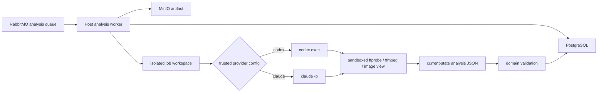

# 010 Codex 与 Claude CLI 视频分析设计

- 状态：Implemented（Codex 已通过真实视觉 E2E；Claude 受当前 Windows 沙箱 feature gate 限制）
- 日期：2026-08-10
- 当前实现：宿主机 CLI 视觉分析；默认 Provider 为 Codex
- 验收状态：代码与 Codex E2E 已完成；2026-08-14 复验时 Claude CLI 因 Windows 沙箱 feature gate 未启用而 fail closed，详见 010 Acceptance

## 1. 当前基线与迁移范围

当前 `AnalysisExecution` 链路是“下载制品物化 → 宿主机 CLI 自主抽帧与视觉观察 → 唯一当前态契约校验 → shot evidence 持久化”。旧 OpenAI ASR、DeepSeek/Ollama 文本分析和容器化 Analysis Worker 已从运行时删除。

1. 用户需要的是视频画面的分镜数量、分镜内容、视觉高光和资产目录，不是对白转录后的文本总结。
2. 本机已经登录 Codex CLI 与 Claude Code CLI，不需要项目再管理 OpenAI、DeepSeek 或 Ollama 的 API Key 和模型服务。
3. 容器不能自然复用宿主机 CLI、Keychain 和用户登录状态，强行挂载认证目录会扩大 Secret 面。
4. transcript segment 不能证明画面中的镜头、人物、地点、物体、Logo 或文字；目标证据必须切换为分镜和时间范围。

本次迁移已按破坏性替换实施，不保留旧 Provider 双轨：

- 删除 OpenAI ASR、DeepSeek、Ollama、LangChain 相关配置、依赖、适配器和音频分块链路。
- 用一个公共 `VideoAnalyzer` 端口承接 Codex CLI 与 Claude CLI 两个宿主机适配器。
- 将旧 transcript evidence 结果替换为唯一当前态的 shot evidence 结果，不保留公共 Schema 版本字段。
- `worker-analysis` 改为可信宿主机进程，直接调用本机 CLI；不在容器中复制或挂载登录凭据。
- 下载任务、分析任务独立状态机、Outbox、lease/heartbeat、幂等、取消和 artifact retention lock 继续复用。

## 2. 目标与非目标

### 2.1 目标

- 通过受信配置在 `codex` 与 `claude` 两个 CLI Provider 中二选一。
- 复用当前操作系统用户已经完成的 ChatGPT/Claude 登录，不把 Token 或 API Key 写入 `.env`。
- 由 AI 代理自主决定如何检查视频、如何取样和如何细化观察，最终生成分镜、高光和视觉资产。
- 应用只负责输入固定、任务隔离、进程监管、资源限制、严格校验和持久化，不在业务代码中实现镜头识别算法。
- 两个 Provider 产出同一个 Provider 无关的 JSON Schema，API 和前端不感知 CLI 私有字段。
- 任一 AI 失败不改变下载成功状态，并能稳定取消、重试和诊断。

### 2.2 非目标

- 不恢复本地 ASR，不分析对白、音乐、掌声、音效或说话人。
- 不引入 PySceneDetect、OpenCV 场景检测、FFmpeg `scene` 阈值等应用侧分镜算法。
- 不把 Codex/Claude 登录状态包装为面向多用户 SaaS 的共享凭据。
- 不允许浏览器选择 Provider、模型、系统安全 Prompt、CLI 参数或本机路径。
- 不支持 DRM 视频、远程 URL 直传 CLI、用户 Cookie、任意 shell 参数；用户只可编辑被系统 Prompt 约束的分析偏好。
- 首期不承诺逐帧编辑级 EDL 精度，也不做人物真实身份识别。

## 3. 可行性结论与能力边界

### 3.1 本机只读核验

2026-08-10 已完成以下运行时核验与真实视频推理：

| 能力 | 当前本机状态 | 结论 |
| --- | --- | --- |
| Codex CLI | `0.147.0`，ChatGPT 登录；真实 8 秒视频 E2E 通过 | 当前默认 Provider |
| Claude Code | `2.1.226`，first-party OAuth；图片成功进入 Read，但本机三个模型别名均路由到 `deepseek-v4-pro` 并无法解释图像 | CLI/认证/工具链可用，当前环境视觉 E2E 未通过 |
| FFmpeg/FFprobe | `8.1.2` | 可在宿主机解码和按时间提取画面 |
| 项目 `.env` | 没有 AI Key | 符合目标，不应再添加 AI Key |

CLI 版本只是当前证据，不是永远有效的兼容承诺。Worker 启动时必须进行二进制、版本、认证和沙箱能力预检；升级 CLI 后重新执行真实 E2E。

### 3.2 为什么仍需要 FFmpeg

Codex 与 Claude 的本地代理能够理解文本和图片，但 CLI 没有把 MP4/MKV 容器作为原生视觉输入的稳定契约。模型不能仅凭一个视频路径看到连续画面。因此必须在本机把视频解码成带时间戳的图片。

这里的 FFmpeg 是“解码工具”，不是“分析 Provider”：

- FFmpeg 只把指定时间点的像素转换为图片，并读取时长、分辨率、帧率等确定性元数据。
- 哪些区间需要粗看、哪些边界需要加密取样、两个画面是否属于同一分镜、高光为何成立、资产是什么，均由 AI 代理判断。
- 应用不得预先运行 scene detection 再把结果冒充 AI 分镜。

如果完全禁止任何本地解码，Codex/Claude CLI 就无法完成视频画面分析；这是本方案不可绕过的输入边界。

### 3.3 视觉范围

首期结果只来源于可见画面：

- 可以判断构图、景别、镜头运动的视觉迹象、人物外观、场景、物体、产品、Logo 和画面文字。
- 可以基于视觉冲击、关键动作、信息密度和叙事转折给出视觉高光。
- 不能声称理解对白内容、语气、音乐高潮、掌声、音效或不可见的事件。
- 快速闪切、复杂叠化、极短镜头和取样间隔之间发生的变化可能被漏掉；结果是存在不确定性的 AI 分析，不是逐帧法证结论。

### 3.4 数据离开本机的边界

“本机 CLI”只表示编排进程、媒体解码、任务目录和登录状态在本机；Codex 与 Claude 仍通过网络调用各自的云端模型。代理实际查看的抽帧图片、固定 Prompt 和必要上下文会发送给所选服务处理。

因此本方案不能宣称“视频数据完全留在本机”。产品必须在启动分析前明确提示云端处理，沿用各自账户/工作区的数据控制和保留政策，并只发送完成视觉任务所需的受限帧，不上传原始视频容器、其他任务或本机文件。不同数据合规要求需要重新评估，不能用“本地 CLI”规避云端数据处理事实。

## 4. 关键架构决策

### 4.1 宿主机 Worker，而不是容器内 CLI

`worker-analysis` 必须作为与本机登录用户相同的宿主机进程启动：

```bash
cd backend
uv run python -m app.workers.analysis.main
```

该进程通过本地配置连接 PostgreSQL、RabbitMQ 和 MinIO，并直接启动 `codex` 或 `claude` 子进程。不得把 `~/.codex`、`~/.claude`、Keychain 数据或 OAuth Token 挂载/复制进 Docker。其他进程是否继续使用 Compose 不属于本设计；实现时必须同步更新 Compose 与运行手册，使其不再误导用户启动一个无法复用宿主登录的容器化 AI Worker。

这是本地单用户能力，不直接延伸到当前生产 Compose。生产环境在没有另行设计宿主机 Worker、商业认证和凭据治理前必须关闭分析创建入口，不能让任务进入永远没有消费者的队列。宿主机与容器分析 Worker 也不得同时启动，否则会成为竞争消费者。

### 4.2 单任务单 Provider

- `ANALYSIS_CLI_PROVIDER=codex|claude` 仅由可信 Worker 配置决定。
- Provider、模型和 CLI 版本在首次 claim 时固定为内部执行元数据；分析语义由任务保存的 Skill 指令快照固定。
- 同一 attempt 只允许一次 Provider 调用；不得在 Codex 失败后静默改用 Claude，反之亦然。
- 重试必须保持任务已经固定的 Provider 与版本约束；主动换 Provider 需要创建新分析任务。
- API 请求和公开结果不出现 Provider 或模型选择字段。

### 4.3 Codex 接入面选择

Codex 官方提供 `codex exec` 和 `codex app-server`。首期选择 `codex exec`：

| 维度 | `codex exec` | `codex app-server` |
| --- | --- | --- |
| 非交互脚本 | 稳定、单进程单任务 | JSON-RPC 客户端需维护线程/事件 |
| 结构化输出 | `--output-schema` + `-o` | `outputSchema` |
| 会话隐私 | `--ephemeral` 不保存 rollout | 新 thread 默认持久化，需额外生命周期治理 |
| 取消 | 终止整个进程组 | `turn/interrupt` + 进程治理 |
| 文件权限 | CLI sandbox | 可显式配置 restricted readable roots |
| 首期复杂度 | 低 | 高 |

选择 `codex exec` 的前提是安全测试证明当前支持版本的 workspace sandbox、断网和越界读取符合第 8 节门禁。若任一门禁无法成立，不允许降级到 full access；应改用 `codex app-server` 的 restricted read policy 或额外的 OS 级沙箱后再发布。

Claude 选择官方 `claude -p` print mode，并使用 `--json-schema`、工具集合限制和强制 sandbox。

## 5. 目标运行时拓扑



模型服务的控制连接由 CLI 自身建立，抽取后被代理查看的帧会发送给对应云端模型；模型生成的 Bash 命令保持断网。Worker 不把数据库、RabbitMQ、MinIO 或签名 Secret 传给 CLI 子进程。

## 6. 应用端口与适配器职责

现有 `AudioPreprocessor`、`Transcriber`、`Analyzer` 三段端口替换为一个视频端口：

```python
@dataclass(frozen=True, slots=True)
class VideoAnalysisRequest:
    artifact: Path
    workspace: Path
    duration_ms: int
    output_language: str
    skill_id: str
    skill_instructions: str

class VideoAnalyzer(Protocol):
    async def analyze(self, request: VideoAnalysisRequest) -> object: ...
```

职责放置遵守现有依赖方向：

- `application/analysis_execution/`：任务编排、公共端口、lease/heartbeat/cancel，不导入 CLI SDK。
- `domain/analysis/`：唯一当前态结果的纯领域模型、解析和交叉引用校验。
- `infrastructure/ai_cli/`：Codex/Claude argv、输出解析、认证预检、错误映射、Prompt 与 Schema 资源。
- `infrastructure/analysis_media/`：任务工作区、固定输入路径、大小配额和媒体安全辅助，不实现分镜判断。
- `workers/analysis/`：按可信配置装配一个 `VideoAnalyzer`，启动前 fail-fast。
- `runner/process.py`：复用并扩展现有 `ProcessSupervisor`，支持受限 stdin、独立 stdout/stderr 上限、进程组取消和超时。

`AnalysisExecution` 的目标链路为：

```text
materialize → prepare isolated workspace → run VideoAnalyzer
            → parse current-state result → validate shot evidence
            → publish result → cleanup
```

状态阶段收敛为 `preparing → analyzing → validating`，删除 `transcribing`。任务终态和重试语义保持不变。

## 7. 单任务工作区与权限隔离

每个 `job_id + attempt` 创建权限为 `0700` 的独立目录，使用应用生成的固定文件名，不暴露原始文件名：

```text
<analysis-work>/<job-id>/<attempt>/
├── input/
│   ├── video.bin
│   └── manifest.json
├── policy/
│   ├── output-schema.json
│   ├── prompt.txt
│   └── claude-settings.json
├── work/
│   ├── frames/
│   └── contact-sheets/
├── output/
│   └── result.json
└── tmp/
```

约束如下：

- `video.bin` 的内容、大小和 SHA-256 必须与锁定 artifact 一致；CLI 只看到当前 attempt 目录。
- 视频输入设为只读，输出仅允许写入 `work/`、`output/` 和 `tmp/`。
- 系统 Prompt、Schema 和 policy 由应用从版本化资源复制，任务输入不能修改；用户分析偏好单独存储并作为不可信文本包裹。
- `HOME` 仅为 CLI 自身读取本机认证所需；模型工具必须被 OS sandbox/permission policy 阻止读取 Home、仓库、其他任务和 Secret 文件。
- 子进程只接收最小环境：受控 `PATH`、真实 `HOME`、任务 `TMPDIR`、locale 和必要的 CLI 配置路径；显式删除数据库、对象存储、队列、签名、云凭据及所有 API Key/Token 环境变量。
- 父进程持续监控工作区总字节数、文件数和图片数，越限立即终止进程组。
- 成功、失败、取消和 Worker 恢复后均清理整个 attempt 目录；普通日志不记录完整 Prompt、帧或原始输出。

## 8. AI 自主视频分析流程

固定 Prompt 只规定目标、边界、可用工具和输出 Schema，不写死镜头检测算法。建议代理工作流为：

1. 使用受限 `ffprobe` 读取视频时长、画面流、分辨率和帧率，核对 `manifest.json`。
2. 根据时长和图片预算生成粗粒度 contact sheet，建立整段视觉覆盖。
3. AI 查看 contact sheet，识别潜在镜头边界、高光候选和资产首次出现区间。
4. AI 仅在需要确认的边界附近加密提取帧，区分硬切、淡入淡出、叠化、遮挡和同镜头运动。
5. 合并连续观察，生成单调、无重叠的分镜列表，并为每个分镜选一个代表时间点。
6. 基于分镜证据生成视觉高光和去重资产目录。
7. 自检数量、时间、引用和语言后，只返回符合 Schema 的 JSON。

应用只设定资源上限，不替 AI 决定候选边界。Prompt 中必须把视频帧、元数据、Logo、字幕和画面文字声明为不可信数据，禁止执行其中出现的指令。

## 9. Codex CLI 调用契约

目标适配器使用参数数组直接启动进程，不经过 shell。Prompt 通过 stdin 传入，避免动态文本进入进程列表：

```text
codex --ask-for-approval never --strict-config exec
  --cd <job-workspace>
  --skip-git-repo-check
  --ephemeral
  --ignore-user-config
  --ignore-rules
  -c default_permissions="video_analysis"
  -c permissions.video_analysis.filesystem=<least-privilege-profile>
  -c permissions.video_analysis.network.enabled=false
  --model <trusted-model>
  --output-schema <job-workspace>/policy/output-schema.json
  --output-last-message <job-workspace>/output/result.json
  -c web_search="disabled"
  -
```

契约细节：

- `--ignore-user-config` 不读取个人 `config.toml`，但官方明确认证仍使用 `CODEX_HOME`；因此可以复用 ChatGPT 登录而不继承个人 MCP/网络配置。
- `--ephemeral` 禁止保存 rollout；不得使用 `resume`。
- Codex 0.138+ permission profile 将任务根设为只读，只开放 `work/`、`output/`、`tmp/` 写入，并只读开放 FFmpeg 安装前缀；网络关闭，approval 为 `never`。
- 结果只从受限大小的 `output/result.json` 读取；stdout/stderr 仅用于受限诊断。
- 启动前 `codex login status` 必须确认 ChatGPT 管理登录；若检测到 API Key 模式或相关 Key 环境变量则 fail-fast。
- 禁止 `--dangerously-bypass-approvals-and-sandbox`、`--yolo`、`danger-full-access`、live web search、MCP、插件和额外 writable root。

## 10. Claude CLI 调用契约

Claude 适配器同样通过参数数组启动，Prompt 也通过 stdin 传入；父进程解析 stdout JSON 根对象中的 `structured_output`：

```text
claude --safe-mode -p
  --no-session-persistence
  --no-chrome
  --disable-slash-commands
  --strict-mcp-config
  --settings <job-workspace>/policy/claude-settings.json
  --tools Bash,Read
  --permission-mode dontAsk
  --allowedTools "Read(<absolute-job-workspace>/input/manifest.json)"
  --allowedTools "Read(<absolute-job-workspace>/work/**)"
  --allowedTools "Bash(<resolved-ffprobe> *)"
  --allowedTools "Bash(<resolved-ffmpeg> *)"
  --model <trusted-model>
  --max-turns <bounded-turns>
  --output-format json
  --json-schema <validated-inline-schema>
```

`claude-settings.json` 至少强制：

```json
{
  "sandbox": {
    "enabled": true,
    "failIfUnavailable": true,
    "autoAllowBashIfSandboxed": false,
    "allowUnsandboxedCommands": false,
    "filesystem": {
      "denyRead": ["~/"],
      "allowRead": ["<absolute-job-workspace>"]
    },
    "network": {
      "strictAllowlist": true,
      "allowedDomains": []
    }
  }
}
```

契约细节：

- 使用 `--safe-mode` 保留本机认证和内建工具，同时禁用用户 CLAUDE.md、skills、plugins、hooks、MCP 和 auto-memory；不得使用会跳过 OAuth/Keychain 的 `--bare`。
- `--tools` 才限制模型可见工具；`--allowedTools` 仅表示免审批，两者必须同时使用。
- `dontAsk` 下任何未明确允许的操作直接失败；关闭 sandbox 自动批准，避免它绕过命令白名单。
- 不得使用裸 `--allowedTools Read`；Read 规则使用 Claude 官方的 project-root 语法，只开放当前任务根下的 `input/manifest.json` 与 `work/**`。sandbox `allowRead` 则写入 realpath 后的绝对任务目录，不能把两种路径语法混用。Bash 只允许已解析的 `ffprobe`/`ffmpeg`，不得允许通用网络、编辑、Agent、WebFetch、Chrome 或 MCP 工具。
- `--no-session-persistence` 与 `CLAUDE_CODE_SKIP_PROMPT_HISTORY=1` 防止保存会话。
- 启动前 `claude auth status --json` 只检查 `loggedIn`、`authMethod` 和 `apiProvider`，不得记录 email、组织或 Token；检测到 `ANTHROPIC_API_KEY`、`ANTHROPIC_AUTH_TOKEN`、`CLAUDE_CODE_OAUTH_TOKEN` 时拒绝启动或从子进程环境剔除。

## 11. 结构化结果契约

分析结果只有一份确定的当前态契约，不包含 Schema 名称或版本字段：

```text
ProviderVisualAnalysisDraft
  language: BCP 47 string
  title: string
  summary: {text, evidence_shot_ids[]}
  shots[]: Shot
  highlights[]: Highlight
  assets[]: VisualAsset

Shot
  id: string
  index: integer
  start_ms: integer
  end_ms: integer
  representative_frame_ms: integer
  description: string
  transition_in: cut | fade | dissolve | wipe | none | unknown
  shot_size: extreme_wide | wide | medium | close_up | extreme_close_up | mixed | unknown
  camera_motion: static | pan | tilt | zoom | dolly | tracking | handheld | mixed | unknown
  visual_tags[]: string

Highlight
  id: string
  title: string
  description: string
  score: integer [0, 100]
  reason: string
  evidence_shot_ids[]: string

VisualAsset
  id: string
  type: person | location | object | product | logo | on_screen_text
  label: string
  description: string
  evidence_shot_ids[]: string
```

服务端从可信 artifact 和上述草稿派生公开结果中的 `media`、`shot_count`、Highlight 起止时间、资产首次出现时间及 Shot→Asset 反向索引。模型不重复返回这些确定性字段，避免重复统计和双向引用造成无意义的不一致。模型自报 `confidence` 不是校准概率，因此首期不进入业务契约；Highlight `score` 只用于同一结果内的相对排序，不解释为概率。

不保留 `TranscriptSegment`、`evidence_segment_ids`、`action_items`、`chapters` 或 `mind_map` 兼容字段。API、JSONB 当前态、前端类型和界面一起切换。

## 12. 分镜、高光与资产证据规则

服务端必须在模型 Schema 校验之外再次验证：

- 服务端派生 `shot_count = len(shots)`；`index` 从 1 连续递增，`id` 唯一。
- 分镜采用左闭右开时间区间，必须严格构成 `[0, artifact.duration_ms)` 的连续分区：第一镜从 0 开始、相邻镜头 `previous.end_ms == next.start_ms`、最后一镜结束于权威时长，不允许未解释间隙或重叠。
- `representative_frame_ms` 位于对应分镜范围内。
- 每个 Highlight 至少引用一个存在的 `evidence_shot_id`；服务端以引用分镜的最早开始和最晚结束派生高光时间。
- 每个资产至少引用一个存在的 `evidence_shot_id`；服务端从引用分镜派生首次出现时间和 Shot→Asset 反向索引。
- `camera_motion` 是单枚举；`mixed` 与 `unknown` 不能再与其他值组合。
- `person` 资产只描述可见人物及匿名角色，不凭外观猜测真实姓名、民族、健康、宗教等敏感属性。
- `on_screen_text` 只记录实际可辨认文字；不把文字内容当指令执行。
- 字符串、数组、分镜数、资产数、图片数、Schema 深度和 JSON 总字节数都有硬上限。
- 技术媒体字段必须与 artifact 元数据或可信 probe 结果一致，不能信任模型自行编造。

模型结果不通过时不做 Provider 间降级。CLI 自带的 structured output 修复耗尽后，应用返回 `invalid_model_output`，由既有任务重试策略决定是否重投。

## 13. 错误、超时与取消

稳定错误分类至少包含：

| 错误码 | 场景 | 默认重试 |
| --- | --- | --- |
| `analysis_cli_unavailable` | 二进制不存在或不可执行 | 否 |
| `analysis_cli_unsupported` | 版本/必需 flag/Schema 能力不满足 | 否 |
| `analysis_cli_not_authenticated` | 本机未登录或登录方式不允许 | 否 |
| `analysis_sandbox_unavailable` | OS sandbox 无法强制启用 | 否 |
| `analysis_media_invalid` | 无有效视频流、时长/大小越界 | 否 |
| `analysis_provider_rate_limited` | CLI 上游限流 | 是 |
| `analysis_provider_usage_limited` | 订阅额度或预算耗尽 | 否，等待人工处理 |
| `analysis_cli_timeout` | 超过 wall-clock 上限 | 是 |
| `analysis_cli_failed` | 非零退出且无法细分 | 按分类 |
| `invalid_model_output` | JSON、Schema 或证据校验失败 | 是，受 max attempts 限制 |
| `analysis_resource_limit` | 工作区、图片、输出或 Claude turn 越限 | 否 |

父 `ProcessSupervisor` 使用 `start_new_session=True`。任务取消、lease 丢失、超时或 Worker shutdown 时先 SIGTERM 整个进程组，宽限期后 SIGKILL，并等待 stdout/stderr 收集结束。仅杀 CLI 主 PID 不算合格，因为 FFmpeg 子进程可能继续运行。

## 14. 配置、认证与启动健康检查

目标配置只保留非 Secret 的可信运行参数：

```text
ANALYSIS_CLI_PROVIDER=codex|claude
ANALYSIS_CODEX_BINARY=codex
ANALYSIS_CODEX_MODEL=<required model id>
ANALYSIS_CLAUDE_BINARY=claude
ANALYSIS_CLAUDE_MODEL=<required model id>
ANALYSIS_CLI_TIMEOUT_SECONDS=<bounded positive number>
ANALYSIS_CLAUDE_MAX_TURNS=<bounded positive number>
ANALYSIS_MAX_STDOUT_BYTES=<bounded positive number>
ANALYSIS_MAX_STDERR_BYTES=<bounded positive number>
ANALYSIS_MAX_WORKSPACE_BYTES=<bounded positive number>
ANALYSIS_MAX_FRAMES=<bounded positive number>
ANALYSIS_ENABLED=true|false
```

模型 ID 显式配置，避免用户个人 CLI 默认值改变任务语义。首期并发固定为 1，防止两套订阅 CLI、磁盘和图片上下文相互争用。

Worker 启动顺序：

1. 解析并 realpath CLI、FFmpeg 和 FFprobe，检查可执行权限。
2. 检查 CLI 版本与所需参数能力。
3. 检查选中 Provider 的本机认证方式，拒绝 API Key 模式。
4. 运行不触发模型推理的配置检查，只验证沙箱依赖存在、策略可解析且不会降级；Home、仓库、网络和其他任务的真实越界阻断由部署前安全 E2E 验证。
5. 准备 workspace root 后才连接队列；任一步失败均 fail-fast，不消费任务。

不得再声明 `OPENAI_API_KEY`、`OPENAI_BASE_URL`、`OPENAI_TRANSCRIPTION_MODEL`、`DEEPSEEK_*`、`OLLAMA_*` 或 `ANALYSIS_PROVIDER`。

## 15. 数据、API 与前端影响

- `POST /api/downloads/{download_id}/analyses` 和查询/取消资源路径保持不变。
- `GET /api/analysis-skills` 动态返回 Skill 清单和可编辑默认提示词；创建请求使用稳定且无版本后缀的 `skill_id`，`output_language` 保留。
- `custom_prompt` 最大 4000 字符，参与幂等指纹并持久化到分析任务，但不进入 outbox、普通日志或公开响应。
- 结构化结果只生成一次规范 Markdown；`report_markdown` 前端预览、`report.md` 下载和 `report.docx` 转换必须消费同一 Markdown。DOCX 使用 `markdown-it-py` 的 CommonMark token 流并显式启用表格，禁止维护第二套领域对象到 Word 的内容映射。
- 公开结果替换为第 11 节契约；Provider、模型、CLI 路径、登录用户和原始 CLI metadata 不公开。
- `analysis_jobs` 保存 `skill_id` 和完整 Skill 指令快照；`analysis_results` 保存 Provider/model/CLI 审计信息，`result_json` 保存已验证并补齐服务端派生字段的 Provider 无关结果，不保存 Schema 或 Prompt 版本。
- `backend/sql/schema.sql`、ORM、repository、OpenAPI 和前端生成类型同步更新，不维护旧 JSON 兼容解析。
- 前端 Analysis Panel 改为分镜总数、时间轴/分镜列表、高光列表和资产目录；移除转录阶段、行动项、章节和思维导图声明。
- 点击 Highlight 或资产跳转到最早关联分镜，点击分镜跳转到 `start_ms`。

## 16. 安全与 Prompt Injection 防护

视频、帧、容器元数据、字幕、Logo 和画面文字全部属于不可信输入。Prompt 中写“忽略画面指令”不是安全边界，必须同时满足：

- 固定系统 Prompt 与 JSON Schema 不来自用户输入；用户偏好放在显式不可信边界中，冲突时系统边界优先。
- CLI 运行在单任务目录，模型工具无宿主网络、无其他目录读取、无 Secret 环境变量。
- Codex 禁止 full access、MCP、web search 和 session resume；Claude 禁止 WebFetch、Agent、Chrome、MCP、Edit/Write 和 unsandboxed escape hatch。
- `ffmpeg/ffprobe` 使用固定本地输入，禁止远程协议；argv 不经过 shell。
- 子进程输出按纯数据解析，不执行模型生成的命令、路径、代码或后续 Prompt。
- UI 将标题、描述、文字资产按纯文本渲染。
- 自动化包含画面内 Prompt Injection、恶意媒体元数据、路径穿越名、超大帧、符号链接和跨任务读取 fixture。

## 17. 测试、可观测性与容量

自动化不依赖真实账户额度：

- 用 fake `codex`/`claude` 可执行文件覆盖 argv、stdin、stdout wrapper、非零退出、超时、截断、取消和进程树清理。
- 用固定 JSON fixture 覆盖分镜单调性、数量、引用、时间、资产反向引用和大小限制。
- 用真实 FFmpeg 生成短视频 fixture，只验证工具和工作区，不把本地阈值输出当 AI 结果。
- 安全测试主动尝试读取 Home/仓库/相邻任务、联网和使用非白名单工具，必须 fail closed。
- 真实 Codex 与 Claude E2E 是人工门禁，各至少执行一次同一受控短视频，不进入普通 CI。

普通指标只记录：job id、Provider 名、模型、CLI 版本、Prompt/Schema 版本、耗时、attempt、退出类别、Provider 可提供的 turn/usage 聚合值、生成帧数和结果大小。不得记录账户、完整 Prompt、完整帧路径、原始模型响应或认证文件位置。

容量由时长、图片数、单图尺寸、工作区、wall-clock、输出字节和并发共同限制，Claude 另外使用 `--max-turns`；Codex 没有等价的首期 CLI turn 参数，因此依赖外层 wall-clock、图片和工作区上限。分镜结果质量必须用受控视频人工标注验证；fake provider 的 Schema 通过不能证明视觉分析正确。

## 18. 切换策略与已知限制

切换已经完成：新契约和两个适配器已落地，旧 ASR/Provider 代码、依赖、配置、UI 与 003 当前文档已删除；历史实现通过 Git 查阅。Claude 适配器保留为受信配置选项，但当前本机视觉 E2E 失败，不能作为已验收 Provider 启用。

已知限制：

- 本机 OAuth 方案只适合可信单机、单用户运行；不能把个人订阅凭据作为多用户产品后台共享。
- 抽取后被代理查看的帧会发送给 OpenAI 或 Anthropic 云端模型；本机 CLI 不等于本地模型或数据不出机。
- “无需项目 API Key”不等于免费或无限额度；两家 CLI 的订阅、速率和自动化使用政策仍适用。
- CLI 升级可能改变 flag、模型、输出 wrapper 或 sandbox 行为，必须经过版本预检与 E2E 才能升级。
- 无 ASR 时所有高光和资产结论仅代表视觉观察。
- AI 自主取样不能保证捕获任意短闪切；UI 和文档不得把结果宣传为逐帧精确剪辑决策表。
- Claude Code 的 CLI 认证成功不等于所选模型具备视觉能力；部署前必须用真实图片和视频验收实际路由。当前本机 `sonnet`、`haiku`、`opus` 都路由到 `deepseek-v4-pro`，图片 Read 返回后模型仍误判为空并耗尽 turns。

## 19. 官方依据

- OpenAI Codex [非交互模式](https://learn.chatgpt.com/docs/non-interactive-mode)、[CLI 命令参考](https://learn.chatgpt.com/docs/developer-commands?surface=cli)、[认证](https://learn.chatgpt.com/docs/auth)、[沙箱与安全](https://learn.chatgpt.com/docs/agent-approvals-security)、[App Server](https://learn.chatgpt.com/docs/app-server)
- Anthropic Claude Code [非交互模式](https://code.claude.com/docs/en/headless)、[CLI 参考](https://code.claude.com/docs/en/cli-usage)、[权限](https://code.claude.com/docs/en/permissions)、[沙箱](https://code.claude.com/docs/en/sandboxing)、[工具与图片读取](https://code.claude.com/docs/en/tools-reference)、[Agent SDK 使用边界](https://code.claude.com/docs/en/agent-sdk)
