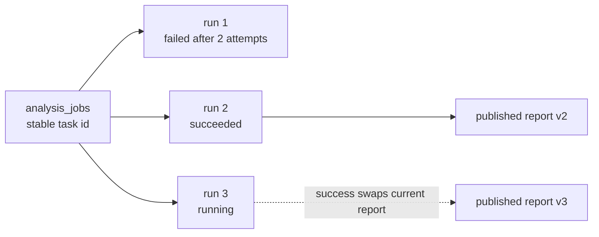

# 013 AI 分析原任务重试设计

- 状态：Proposed
- 日期：2026-08-10
- DAC：DAC-013-01 ～ DAC-013-10
- 关联设计：`docs/design/010-Codex与Claude CLI视频分析设计.md`、`docs/design/012-AI分析报告与MinIO持久化设计.md`、`docs/design/014-WebSocket任务状态同步设计.md`、`docs/design/015-RabbitMQ异步分析设计.md`

## 1. 目标与边界

用户对分析任务执行“重试”或“重新分析”时，必须继续使用原 `analysis_jobs.id`，不得通过再次调用创建接口产生另一个用户可见任务。每次执行作为该任务下的独立代次保存，以便审计失败原因、避免并发执行，并让页面、WebSocket 订阅和下载链接始终围绕一个稳定任务资源工作。

重试只复用原任务已固定的输入制品、Skill 指令快照、输出语言、自定义提示词和 Provider 约束。修改这些语义输入属于新分析任务，不允许借“重试”静默改变历史任务含义。

## 2. 当前事实与问题

当前 `analysis_jobs.attempt` 已支持 Worker 对限流、超时、无效模型输出等可重试故障进行自动重投，并保持同一个 job id。缺口在手动操作：前端“重新分析”会清空当前状态，再次调用 `POST /api/downloads/{download_id}/analyses`，从而创建新的 `analysis_jobs` 记录。

仅反复重置现有 `attempt` 也不够，因为会覆盖开始时间、错误、Provider 审计和上一成功结果。目标模型必须区分：

- `run_no`：一次用户可见的重新执行代次，单调递增。
- `attempt`：同一代次内由系统执行的有上限技术重试。

## 3. 稳定任务与执行代次



`analysis_jobs` 保存稳定资源和当前投影：owner、artifact、请求语义快照、`active_run_id`、`current_report_id`、当前状态、进度和单调 `version`。新增 `analysis_runs` 保存每次执行事实：

| 字段 | 语义 |
| --- | --- |
| `id` / `job_id` | 执行代次与所属稳定任务 |
| `run_no` | 任务内从 1 开始递增，联合唯一 |
| `trigger` | `initial`、`manual_retry`、`manual_rerun` |
| `status` / `stage` / `progress` | 本代次状态投影 |
| `attempt` / `max_attempts` | 本代次内技术重试次数与上限 |
| `provider` / `model` / `cli_version` | 首次 claim 后固定的内部审计值 |
| `started_at` / `finished_at` | 本代次时间范围 |
| `error_code` / `error_message` | 最终稳定错误分类与受限信息 |
| `version` | 本代次乐观并发版本 |

执行、attempt、报告版本均只追加或单向转换，不通过清空字段伪造“从未执行过”。任务详情默认返回当前代次，并可返回最近代次摘要；完整运行历史使用受限分页接口读取。

## 4. 状态规则

### 4.1 可触发重试的状态

- `failed`、`cancelled`：按钮语义为“重试”，创建下一执行代次。
- `succeeded`：按钮语义为“重新分析”，仍创建同一任务下的下一执行代次；上一成功报告继续可见。
- `queued`、`running`、`retry_wait`、`publishing`：已有活跃代次，不允许再创建，返回 `409 analysis_already_active`。

源视频制品必须仍存在且完整性校验通过。若 artifact 已过期或删除，返回 `409 analysis_artifact_unavailable`；稳定任务不会因此被复制成一个无法执行的新任务。

### 4.2 代次状态机

```text
queued → running → retry_wait → running
             │          │
             ├──────────┴→ failed
             ├→ publishing → succeeded
             └→ cancelled
```

手动重试只从任务终态创建新的 `queued` run。系统自动重试只在当前 run 内增加 `attempt` 并进入 `retry_wait`，不会增加 `run_no`。

### 4.3 上一结果保留

新代次启动时不得删除 `current_report_id`：

- 有上一成功报告时，任务响应同时返回 `latest_run_status` 与 `current_report`，前端标注报告来自上一代次。
- 新代次发布成功后在单一事务内替换 `current_report_id`。
- 新代次失败或取消时保留上一成功报告和全部历史报告元数据。
- 从未成功的任务只有在某次代次发布成功后才出现当前报告。

## 5. 手动重试事务

`POST /api/analyses/{analysis_id}/retry`

- 认证：当前用户必须拥有该任务。
- Header：必须提供 `Idempotency-Key`。
- 请求体：不接受 Skill、提示词、语言、Provider 或模型字段。
- 成功：返回 `201 Created`、同一 `analysis_id` 的最新任务投影，`Location` 仍为 `/api/analyses/{analysis_id}`；异步执行状态保留在响应模型中。

应用事务按以下顺序执行：

1. `SELECT ... FOR UPDATE` 锁定稳定任务并校验 owner、终态和 artifact 可用性。
2. 以 `(job_id, operation, idempotency_key)` 检查重放；相同 key 返回已创建的同一 run。
3. 计算 `run_no + 1`，插入 `analysis_runs`，更新 `active_run_id`、状态、进度和任务 `version`。
4. 写入任务事件和 `analysis.requested` Outbox 事件，payload 只包含 `job_id`、`run_id`、`run_no` 与契约版本。
5. 提交后由 Outbox Publisher 发布到 RabbitMQ；API 不直接运行 Agent。

两个不同 key 的并发请求只有一个能创建活跃 run，另一个收到 409。事务失败时不得残留 run、事件或额度重复扣减。

## 6. 配置、Provider 与配额

- 所有重试沿用任务的输入 SHA-256、Skill 指令完整快照、输出语言和自定义提示词。
- 同一 run 内 Provider、模型和 CLI 版本在 claim 后固定；技术重试不得静默切换 Provider。
- 手动新 run 默认继续使用任务已经固定的 Provider 策略。若受信运维配置不再支持该 Provider，任务明确失败，不能自动改用其他服务。
- 手动重试计入新的 AI 执行额度；同一 Idempotency-Key 重放不重复计费。报告发布阶段的存储重试不计 AI 额度。
- 为防滥用，可限制每任务最大 run 数、用户每日手动重试数和最短间隔；到达上限返回稳定 429/配额错误。

## 7. RabbitMQ、租约与取消

消息必须携带 `run_id`，Worker claim 时同时校验任务 `active_run_id`、run 状态和版本。旧消息、重复消息或上一代次延迟到达的消息只能 ACK no-op，绝不能覆盖新代次状态或当前报告。

每次 run 使用独立 lease、heartbeat 和工作目录 `<job-id>/<run-no>/<attempt>/`。取消针对当前活跃 run；完成取消后稳定任务进入 `cancelled`，历史 run 和报告不删除。若重试请求与取消并发，以数据库行锁和版本先后决定结果，不允许两个活跃 run。

## 8. 前端与 WebSocket 行为

- 前端保留当前 `analysisId`，重试时调用 retry API，不再将 job state 设为 `null` 或调用 create API。
- 重试成功后立即使用 API 返回的同任务投影，并继续订阅原任务的 WebSocket topic。
- WebSocket 事件带 `run_id`、`run_no` 和任务 `version`；前端丢弃旧版本事件。
- 页面显示“第 N 次执行”、本代次 attempt、失败原因和上一报告状态，避免把技术 attempt 误称为用户重试次数。
- 如果 retry 请求响应丢失，客户端使用原 Idempotency-Key 重放，而不是生成新 key。

## 9. 保留与审计

稳定任务、run、报告版本和事件记录使用一致的 owner 与删除策略。业务日志只记录 ID、run_no、trigger、状态、错误码和耗时，不记录 Prompt 或报告正文。用户删除任务时级联安排历史报告对象删除；在删除完成前不允许再重试。

源 artifact 的 retention lock 只覆盖活跃执行和受控“可重试窗口”，不是永久保留承诺。界面必须展示最后可重试时间；窗口结束后报告仍可下载，但无法再次运行视频分析。

## 10. 设计验收标准（DAC）

- DAC-013-01：失败、取消或成功任务手动重试后 `analysis_jobs.id` 保持不变，`run_no` 恰好增加 1。
- DAC-013-02：同一 run 的自动重试只增加 `attempt`，不增加 `run_no` 或创建新任务。
- DAC-013-03：手动 retry API 不接受任何可改变分析语义的字段，并沿用原输入与配置快照。
- DAC-013-04：相同 Idempotency-Key 重放返回同一 run，不重复发布消息或计费。
- DAC-013-05：并发重试、重试与取消并发时最多存在一个活跃 run。
- DAC-013-06：旧代次或重复 RabbitMQ 消息不能覆盖当前 run、任务状态或当前报告。
- DAC-013-07：新代次执行期间上一成功报告仍可下载；新代次失败时报告指针不变化。
- DAC-013-08：源 artifact 不可用、任务正在运行、超出重试上限时返回稳定错误且不产生新任务。
- DAC-013-09：前端重试保持原任务页面和 WebSocket 订阅，不清空任务后重新创建。
- DAC-013-10：数据库并发、状态机、消息重复、租约恢复、API 幂等和前端交互测试结果记入后续 Acceptance。
