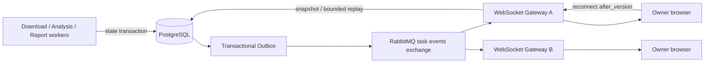

# 014 WebSocket 任务状态同步设计

- 状态：Proposed
- 日期：2026-08-10
- DAC：DAC-014-01 ～ DAC-014-10
- 关联设计：`docs/design/013-AI分析原任务重试设计.md`、`docs/design/015-RabbitMQ异步分析设计.md`、`docs/design/006-上线产品能力补全设计.md`

## 1. 目标与边界

浏览器使用一个经过认证的 WebSocket 连接持续同步当前用户的下载任务和分析任务。任务状态改变后由服务端主动推送，前端不再以固定间隔轮询作为正常路径；断线重连后能够从 PostgreSQL 当前事实恢复，不因丢失某条实时消息展示永久过期状态。

WebSocket 只负责投影任务状态和报告可用性，不承担任务创建、重试、取消、文件下载或报告正文传输。这些写操作继续走 HTTP API。RabbitMQ 是内部事件传输，WebSocket 是面向浏览器的会话协议，两者不能直接暴露或互相替代。

本设计以 WebSocket 取代 006 中任务实时同步的 SSE 目标；HTTP 低频恢复查询仅作为降级手段保留。

## 2. 当前事实与目标差异

当前分析前端在非终态下按固定间隔调用 `GET /api/analyses/{id}`，页面卸载或进入终态后停止。该方式在任务多、运行时间长时产生重复查询，也不能自然承载 013 的执行代次和 012 的报告发布事件。

目标设计要求：

- PostgreSQL 始终是任务当前状态和版本的事实源。
- 每次领域状态变更与 `task_events`、Outbox 在同一事务提交。
- WebSocket Gateway 消费内部事件并只向有权限的连接推送。
- 客户端按任务 `version` 去重、排序和检测缺口。
- 断线重连先恢复快照/缺失事件，再进入实时模式。

## 3. 目标拓扑



每个 Gateway 实例使用独占、自动删除的队列绑定 `task.state.changed` 事件，使在线实例都能看到变化并在内存中按 owner 和订阅过滤。RabbitMQ 实时投递可以丢失或重复，因此 Gateway 不能把它当历史存储；恢复读取数据库。

## 4. 持久任务事件

`task_events` 是按任务追加的受限事件日志：

| 字段 | 语义 |
| --- | --- |
| `id` | 全局事件 UUID，也作为消息 `message_id` |
| `owner_hash` | 服务端授权与路由字段，不发送给浏览器 |
| `task_type` / `task_id` | `download` 或 `analysis` 及资源 ID |
| `run_id` / `run_no` | 分析执行代次；下载任务可为空 |
| `version` | 任务内严格递增版本，联合唯一 |
| `event_type` | 稳定低基数事件类型 |
| `payload` | 公开任务投影的受限 JSON，不含 Secret 和正文 |
| `occurred_at` | 数据库事务时间 |

状态事务同时更新任务行、插入 `task_events` 和 Outbox。事件保留期至少覆盖最大前端离线恢复窗口；超出窗口的客户端直接获取当前快照，不要求无限重放。

## 5. 连接、认证与授权

浏览器连接同源端点：

```text
wss://<origin>/api/ws/tasks
```

- 握手复用现有 HttpOnly access cookie；禁止把 JWT、MinIO URL 或 API key 放进 query string。
- 服务端校验 access token、账户启用状态、`Origin` 精确 allowlist、Host 和 TLS；生产只允许 `wss`。
- Cookie 使用既有 `Secure`、`HttpOnly`、`SameSite` 策略。若未来 WebSocket 与前端跨站部署，再单独设计一次性短时 ticket，不降低 Origin 校验。
- 每次订阅仍按当前用户 owner 校验 task id；知道 UUID 不构成授权。
- 账户禁用、token 到期或角色/owner 失效时关闭连接，不继续依赖握手时的永久授权缓存。

单用户限制连接数、单连接订阅任务数、消息速率和最大帧大小。客户端发来的 JSON 使用严格 schema，不接受任意 channel、SQL 风格过滤器或 RabbitMQ routing key。

## 6. 协议契约

连接建立后服务端发送：

```json
{
  "type": "hello",
  "connection_id": "uuid",
  "heartbeat_seconds": 25,
  "protocol_version": 1
}
```

客户端按资源订阅，并携带本地最后版本：

```json
{
  "type": "subscribe",
  "tasks": [
    {"task_type": "analysis", "task_id": "uuid", "after_version": 7}
  ]
}
```

服务端事件使用统一 envelope：

```json
{
  "type": "task.updated",
  "event_id": "uuid",
  "task_type": "analysis",
  "task_id": "uuid",
  "run_id": "uuid",
  "run_no": 2,
  "version": 8,
  "status": "running",
  "stage": "analyzing",
  "progress": 70,
  "attempt": 1,
  "report_status": "publishing",
  "error": null,
  "occurred_at": "2026-08-10T12:00:00Z"
}
```

公开 error 只含稳定 code 与面向用户的受限 message。事件不含原始 URL、owner hash、Prompt、报告正文、Provider 原始输出、bucket/object key、预签名 URL或 Worker lease 信息。

## 7. 顺序、去重与断线恢复

客户端按 `(task_type, task_id)` 保存最高 `version`：

- `version <= current`：重复或旧消息，丢弃。
- `version == current + 1`：应用投影。
- `version > current + 1`：检测到缺口，暂停直接应用，发送 `resync` 或调用任务 GET 获取最新快照。

断线重连使用带随机抖动的指数退避。重新订阅时发送 `after_version`，Gateway 在订阅确认前完成以下之一：

1. 缺失事件仍在保留窗口内：按 version 顺序有限重放，再切换实时流。
2. 事件过多、已过期或出现缺口：发送当前完整快照及其 version，再切换实时流。

订阅建立与实时事件到达之间使用“读取数据库水位 → 绑定连接缓冲 → 回放至水位 → 排空更高版本缓冲”的顺序，避免恢复窗口竞态。RabbitMQ 重投不会导致 UI 回退。

## 8. 心跳、背压与降级

- 服务端每 25 秒发送 WebSocket ping，客户端 pong 超时后关闭；业务层可同时发送低频 heartbeat 便于代理诊断。
- Gateway 为每连接设置有界发送队列。进度事件可以按 task 合并为最新值，终态、错误、取消和报告可用事件不得丢弃。
- 慢消费者超过上限时以稳定 close code 断开，客户端通过快照恢复；不得无限占用内存。
- RabbitMQ 暂时不可用时，连接保持或明确降级，客户端可按退避执行低频 HTTP 查询；不得恢复为全程 1.5 秒轮询。
- 浏览器离线、标签页休眠和网络切换恢复后，都以数据库版本为准。

## 9. 前端状态管理

前端维护单例、按 owner 会话隔离的连接管理器，页面只注册/注销任务订阅。Analysis Panel 不直接创建多条 socket。HTTP 创建、重试或取消的响应立即更新本地投影，随后 WebSocket 事件按 version 对账。

013 原任务重试后任务 ID 不变，因此无需换订阅；`run_id` 和 `run_no` 更新即可。012 报告从 `publishing` 到 `available` 时触发下载按钮可用，不允许仅凭 `progress == 100` 推断 MinIO 文件存在。

页面必须显示连接状态，但不把短时重连误报为任务失败。WebSocket 永久失败时提供“重新连接”和手动刷新；恢复后停止降级轮询。

## 10. 可观测性与容量

指标包含活跃连接数、订阅数、握手失败分类、按 close code 断开数、事件端到端延迟、重放/快照次数、版本缺口、发送队列深度、合并进度事件数和降级查询数。用户 ID、任务 ID、Origin 原文和异常文本不作为 Prometheus label。

日志使用 connection id、request/correlation id、事件 id、task type、稳定错误码和计数，不记录 Cookie、JWT、完整 payload 或报告内容。容量测试覆盖单连接多任务、多标签页、Gateway 多实例、慢消费者和 RabbitMQ 重连。

## 11. 设计验收标准（DAC）

- DAC-014-01：正常运行时下载与分析任务状态由 WebSocket 主动同步，前端不执行固定周期轮询。
- DAC-014-02：任务状态、持久事件和 Outbox 在同一 PostgreSQL 事务提交，RabbitMQ 不是事实源。
- DAC-014-03：握手和每次订阅都执行认证、Origin 与 owner 授权，跨用户 UUID 订阅失败且不泄露存在性。
- DAC-014-04：重复、乱序和延迟 RabbitMQ 消息不能使客户端版本回退。
- DAC-014-05：断线、标签页休眠和 Gateway 重启后可通过有限重放或快照恢复到数据库最新版本。
- DAC-014-06：订阅恢复与实时消息切换不存在丢事件窗口，检测到版本缺口时强制 resync。
- DAC-014-07：慢消费者有界，允许合并中间进度但不丢失终态、错误或报告可用事件。
- DAC-014-08：事件与日志不含 Token、owner hash、Prompt、报告正文、对象键或预签名 URL。
- DAC-014-09：RabbitMQ/WebSocket 故障只触发有退避的低频 HTTP 降级，恢复后自动停止降级查询。
- DAC-014-10：协议、认证、顺序恢复、多实例、背压和真实浏览器 E2E 结果记入后续 Acceptance。
