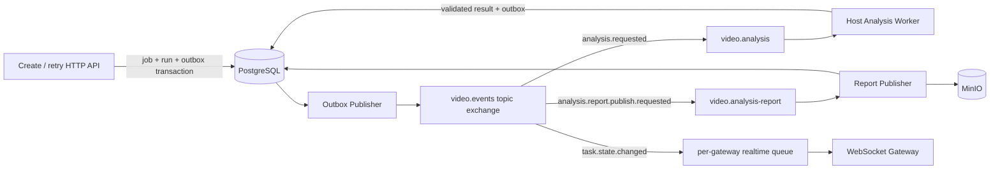

# 015 RabbitMQ 异步分析与可靠投递设计

- 状态：Accepted
- 日期：2026-08-10
- DAC：DAC-015-01 ～ DAC-015-12
- 关联设计：`docs/design/010-Codex与Claude CLI视频分析设计.md`、`docs/design/012-AI分析报告与MinIO持久化设计.md`、`docs/design/013-AI分析原任务重试设计.md`、`docs/design/014-WebSocket任务状态同步设计.md`

## 1. 目标与边界

所有 AI 视频分析必须异步执行：HTTP API 只持久化任务和发布意图，RabbitMQ 负责把执行命令交给宿主机 Analysis Worker，API 请求生命周期内不得启动 Codex/Claude CLI、等待模型结果或生成报告。

Analysis Worker 获得的是完整视频 artifact 的受控引用，并把完整视频物化到单任务工作区交给 Agent 自主分析。RabbitMQ 消息不携带视频、预抽帧包、报告正文或模型输出；本设计不把“消息异步化”误解为“应用先抽取少量帧后交给模型”。010 定义的 Agent 自主视频检查、分镜、高光和资产证据规则保持不变。

## 2. 设计冻结时的事实与建设差异

设计冻结时，创建分析任务已经在 PostgreSQL 事务中写入 `analysis.requested` Outbox 事件，由 Publisher 发送到 `video.events` topic exchange，宿主机 Worker 从 durable `video.analysis` queue 消费，并具备 ACK/NACK、lease、heartbeat、自动重试和 dead-letter 基础能力。

本设计保留该基线，不重复建设第二条队列。需要补齐的是：

- 消息显式携带 013 的 `run_id/run_no`，隔离旧代次与当前代次。
- AI 执行、报告发布和浏览器状态事件使用不同 routing key 与消费职责。
- 失败重试使用数据库状态和延时调度，不依赖无限 `nack(requeue=true)` 热循环。
- 每个阶段都有幂等 claim、publisher confirm、死信处理和可恢复的状态事实。
- 012 的报告生成/MinIO 上传从 OAuth Analysis Worker 中解耦。

## 3. 目标异步拓扑



宿主机 Analysis Worker 需要本机 CLI OAuth；Report Publisher 只读取数据库并写 MinIO，可作为无 CLI 凭据的独立 Worker 运行。两者不得共享个人 OAuth Secret。

## 4. Exchange、Queue 与 routing key

沿用 durable topic exchange `video.events`，按职责声明：

| Routing key | Queue | Consumer | 持久性 |
| --- | --- | --- | --- |
| `analysis.requested` | `video.analysis` | Host Analysis Worker | durable |
| `analysis.report.publish.requested` | `video.analysis-report` | Report Publisher | durable |
| `task.state.changed` | 每个 Gateway 独占队列 | WebSocket Gateway | auto-delete；事实可从 DB 恢复 |

每个 durable queue 有自己的 DLX/DLQ、消息 TTL、最大长度保护和告警，不复用一个无法区分责任的 dead queue。队列参数由单一 topology 模块声明，Publisher 与 Consumer 启动时必须一致；声明冲突时 fail-fast。

首期 `video.analysis` 保持单活消费者或 `prefetch=1`，符合本机 OAuth、CLI 和磁盘资源边界。Report Publisher 可以独立扩容，但仍受 MinIO 和数据库连接池上限约束。

## 5. 消息契约

执行命令 envelope：

```json
{
  "schema_version": 1,
  "event_id": "uuid",
  "event_type": "analysis.requested",
  "aggregate_type": "analysis_job",
  "aggregate_id": "job-uuid",
  "occurred_at": "2026-08-10T12:00:00Z",
  "payload": {
    "job_id": "job-uuid",
    "run_id": "run-uuid",
    "run_no": 2,
    "expected_version": 8
  }
}
```

约束如下：

- `event_id` 同时作为 RabbitMQ `message_id`，`aggregate_id` 作为 correlation id。
- 消息使用 persistent delivery、mandatory publish 和 publisher confirm。
- payload 只传稳定 ID、代次和并发版本；Worker 从 PostgreSQL 读取受信配置和 artifact 元数据。
- 禁止传完整/加密源 URL、owner hash、Skill 指令、custom prompt、视频字节、帧、MinIO 凭据、预签名 URL、结果 JSON 或报告正文。
- 契约不兼容变更增加 `schema_version` 并在同一发布切换生产者/消费者；不长期保留双写兼容层。

报告发布消息只包含 `job_id`、`run_id`、`report_id`、`renderer_version` 和 expected version。`task.state.changed` 使用 014 的公开受限投影，不复用内部命令 payload。

## 6. 创建、Outbox 与发布确认

创建任务和 013 手动重试都在一个 PostgreSQL 事务内完成：

1. 写入/锁定稳定 job 与 run。
2. 写入当前任务事件。
3. 写入唯一 Outbox 事件。
4. 提交后立即返回 `201 Created`、`Location` 和可查询的任务状态投影，不等待 RabbitMQ 或 AI。

Outbox Publisher 批量 claim 可发布记录，将 envelope mandatory publish 到 RabbitMQ，并只在 broker confirm ACK 后标记 published。连接中断或 confirm 不确定时保留记录重投；消费者依靠幂等 claim 处理重复消息。RabbitMQ 不可用时创建事务仍可成功，任务保持 `queued`，Outbox backlog 产生告警并在恢复后发布。

## 7. Analysis Worker 执行契约

Worker 收到消息后按以下顺序处理：

1. 严格解析 envelope；未知版本、缺字段或超限消息拒绝并进入 DLQ。
2. 使用 `job_id + run_id + expected_version` 在数据库原子 claim。已完成、非 active run、旧版本或重复消息 ACK no-op。
3. 验证 artifact 锁、大小、SHA-256 和媒体元数据，将完整视频物化到 `<job-id>/<run-no>/<attempt>/input/video.bin`。
4. 由 010 的 `VideoAnalyzer` 启动受限 Agent；Agent 自主决定如何浏览完整视频、解码观察和细化分镜，不由队列消息提供抽帧结论。
5. heartbeat 延长 lease；取消、超时或 lease 丢失时终止整个 CLI/FFmpeg 进程组。
6. 校验结构化结果，在事务中写入报告版本 `validated`、状态事件和报告发布 Outbox。
7. 数据库提交成功后 ACK 原消息；报告由独立队列继续处理。

任何时候都先保存数据库事实再 ACK。ACK 失败导致重复投递时，claim 规则把它转为 no-op。

## 8. 失败、重试与死信

### 8.1 业务重试

可重试的 Provider 限流、临时 CLI 失败、超时或 invalid model output 使用数据库 `retry_wait/retry_at` 和有上限 `attempt`。Recovery Sweeper 到期后写新的 Outbox 事件，形成可观测的延迟重投；不得立即 `nack(requeue=true)` 造成同一坏消息热循环。

不可重试错误立即把当前 run 标为 failed 并 ACK 消息。用户之后通过 013 的 retry API 创建同任务新 run。

### 8.2 基础设施异常

- 数据库暂时不可用、进程 shutdown：当前 delivery 可以 requeue，但必须有连接级退避。
- 消息无效、契约版本未知、超过最大 delivery 次数：NACK 不 requeue，进入对应 DLQ。
- DLQ 不自动无限回灌；人工确认原因、修复并记录审计后，使用新 event id 有界重放。
- RabbitMQ delivery count 只用于 poison-message 保护，不能代替领域 `attempt`。

报告发布失败按 012 只重试生成/MinIO 阶段，不重新调用 AI。报告消息进 DLQ 时任务保留已验证数据库结果并显示 `publish_failed`，由运维或恢复任务继续发布。

## 9. 并发、租约与 fencing

- 每个 run 同时只能有一个有效 lease owner，所有 heartbeat、阶段更新、结果发布都校验 lease owner、到期时间和 expected version。
- 旧 Worker 在 lease 过期后即使继续返回模型结果，也因 fencing version 不匹配而无法提交。
- `active_run_id` 防止上一代次延迟消息 claim 当前任务。
- RabbitMQ prefetch 与 Worker 并发分别配置；不能因为 queue 堆积绕过 Agent 单并发、工作区或订阅限额。
- 消费者 shutdown 先停止取新消息，再取消活动进程并等待可恢复状态提交，最后关闭 channel。

## 10. 数据恢复与降级

RabbitMQ 不是分析任务事实源。broker 丢失后可以根据未发布 Outbox、`queued`、到期 `retry_wait`、过期 lease 和 `validated/publish_failed` 报告状态重建应发送命令。恢复工具必须同样生成幂等 event，并接受消费者重复处理。

API readiness 分开报告数据库、Outbox backlog、RabbitMQ 和 Analysis Worker 能力。RabbitMQ 或 Worker 降级时禁止同步执行 AI 作为 fallback；可以拒绝新的高成本任务，已有任务保留在数据库等待恢复，查询、取消和报告下载继续工作。

## 11. 可观测性与安全

指标至少包含各队列 ready/unacked/dead 数、最老消息年龄、Outbox lag、publish confirm 延迟/失败、consumer 数、claim no-op、run 排队/执行/重试耗时、lease recovery、DLQ 数和报告发布积压。

日志延续 request id → outbox event id → RabbitMQ correlation id → job/run/report id，不记录视频、帧、Prompt、报告、CLI 原始输出、Cookie 或 Secret。RabbitMQ vhost 和用户按 Publisher、Analysis Worker、Report Publisher、Gateway 分权；Gateway 无权发布分析命令，Analysis CLI 子进程无 RabbitMQ 凭据。

## 12. 设计验收标准（DAC）

- DAC-015-01：创建和手动重试 API 在持久化 job/run/outbox 后立即返回，不启动或等待 AI。
- DAC-015-02：Analysis Worker 从 RabbitMQ 获取 ID 后读取并物化完整视频 artifact，消息中不存在视频或预抽帧包。
- DAC-015-03：任务事务与 Outbox 原子提交，Publisher 只在 mandatory publish 得到 broker confirm 后确认发布。
- DAC-015-04：重复、乱序、上一 run 和 lease 过期消息不能重复执行或覆盖当前结果。
- DAC-015-05：系统技术重试发生在同一 run 内并有退避/上限，不使用无限 immediate requeue 热循环。
- DAC-015-06：手动重试创建同 job 的新 run，并由新的 `analysis.requested` 事件异步执行。
- DAC-015-07：结构化结果提交后由独立报告队列生成 Markdown/DOCX 并上传 MinIO，不重复调用 AI。
- DAC-015-08：无效消息和 poison message 进入职责独立的 DLQ，回灌需要人工审计且有界。
- DAC-015-09：RabbitMQ 丢失可从 PostgreSQL/Outbox 恢复，系统不以同步 AI 作为降级路径。
- DAC-015-10：取消、shutdown、lease 过期能够终止完整进程组并安全重投或结束当前 run。
- DAC-015-11：RabbitMQ 权限按进程最小化，消息与日志不含媒体内容、Prompt、结果正文或 Secret。
- DAC-015-12：Outbox、broker confirm、重复投递、恢复、DLQ、完整视频 Agent E2E 与报告发布测试结果记入后续 Acceptance。
