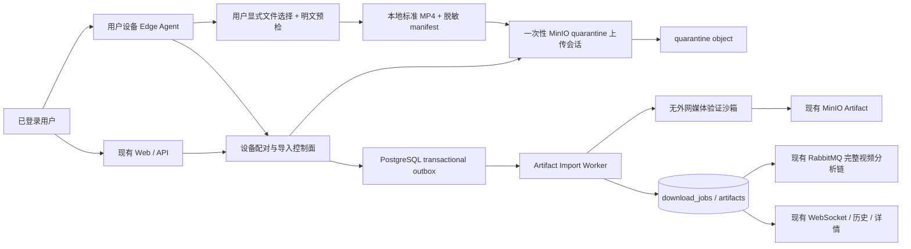

# 019 用户设备 Edge Agent 与媒体制品导入设计

- 状态：设计完成，代码未实施
- 日期：2026-08-12
- 前置事实：安全视频下载闭环、中国短视频平台支持与 `docs/design/005-多平台Provider策略设计.md`；已完成设计的原始过程通过 Git 历史追溯。
- 前置调研：`docs/research/009-红果短剧Provider接入调研.md`

> 范围调整（2026-08-27）：浏览器本地 MP4/剧本文档上传、quarantine、通用上传会话和浏览器视频 Artifact 晋升由 `023-本地内容上传与剧本分析` 统一负责。本文只负责用户设备配对和 `edge_import` 明文文件传输，并复用 023 的上传与验证端口；不再包含任何平台会话、网络采集、签名生成、受保护媒体处理或平台 Adapter。若本文仍为解释 Edge 协议而出现 `browser_import`，其规范事实以 023 为准。

> **视频号范围再次收敛（2026-08-26）：** `024-微信视频号与腾讯视频授权媒体接入设计` 取代本文所有视频号采集 Adapter 建议。Edge Agent 对视频号只能传输用户已经合法取得并显式选择的明文文件；不得读取微信/元宝会话，不得调用私有接口，不得安装 CA/代理、注入页面、抓取客户端流量、取得处理参数或转换受保护媒体。本文的设备配对、签名上传和 Artifact Import 仍可复用；任何冲突内容均以 024 为准。

## 1. 决策摘要

红果短剧和微信视频号不实现为中心服务中的 yt-dlp extractor，也不把设备登录态、客户端签名、内容密钥、本地代理或根证书带入现有 Media Runner。项目新增独立 `edge_import/verified_import` 执行路径，用于把用户已经合法取得并显式选择的标准 MP4 通过签名设备通道导入服务端，在独立隔离区重新验证后生成现有 `artifacts` 记录。视频号的设备路径是制品传输通道，不是平台采集器；红果平台访问如继续研究，必须另行完成权利、安全和供应链评审。

导入成功必须表现为现有 `download_job` 的一种来源，而不是新建平行的媒体任务体系。由此可以原样复用：

- `POST /api/downloads/{download_id}/analyses` 与原分析任务；
- PostgreSQL `artifacts`、MinIO 原始视频和持久存储策略；
- RabbitMQ `analysis.requested`、完整视频 Agent 与报告 Worker；
- 下载历史、任务详情、WebSocket 状态恢复和管理员来源统计。

实施顺序固定为：先完成 023 浏览器本地内容上传基础 → 通用设备配对和 Edge 制品导入协议 → 已授权明文文件的签名设备导入。任何平台网络 Adapter 都必须另立设计并获得正式下载/导出接口与合同授权，不能在 019 内增补。微信视频号公开分享链接由 025 的 `wechat-channels-public-v2` 独立维护；本地文件上传成功只能计作 Artifact Import 验证，不能被计作平台下载验证。

## 2. 当前系统映射

| 当前能力 | 复用方式 | 必要变化 |
| --- | --- | --- |
| `media_inspections` / `media_formats` | 继续服务远程 Provider URL | 导入任务不伪造 URL inspection；导入来源的 `inspection_id/format_id` 为空 |
| `download_jobs` | 作为远程下载与导入的统一用户任务 | 新增 `source_kind` 和来源专用状态转换 |
| `artifacts` | 继续作为可分析完整视频的唯一入口 | 增加可审计来源元数据，不改变一任务一个原始制品约束 |
| Download Worker / Media Runner | 只处理服务端远程 Provider | 不接收 Edge 任务，不获得设备或平台 Secret |
| MinIO | 最终制品继续使用现有 bucket/key 并持久保存 | 新增短保留期 quarantine 区与仅上传单对象的会话 |
| RabbitMQ / Outbox | 继续承担可靠异步执行 | 复用 023 的 `content.import.verify.requested` 队列/DLQ |
| Analysis Worker | 无变化 | 仍只读取服务端已验证的 Artifact |
| Import canary | 复用制品导入证据模型 | 按 `execution_mode`、协议/客户端版本隔离设备传输证据，不扩张 Runner access mode，不写平台 canary |
| Provider 页面 | 继续展示平台能力与验证状态 | 分开展示“设备文件导入”和“平台链接下载”，本地文件成功不改变平台状态 |

现有 `ProviderAccessMode.ANONYMOUS` 与 `OPERATOR_MANAGED` 继续只描述 Media Runner 会话，不新增设备值。Edge 使用独立 `ExecutionMode.VERIFIED_IMPORT` 和 `DownloadSourceKind.EDGE_IMPORT`，不能错误进入或回退到 Anonymous/Operator Media Runner。

## 3. 范围与非目标

### 3.1 本设计范围

1. 用户设备注册、配对、撤销、版本和在线状态。
2. Edge Agent 产生脱敏 manifest、复用 023 的单任务上传会话、上传和上报结果。
3. Edge 视频复用 023 的隔离接收、哈希、ffprobe、媒体边界验证、制品晋升和清理。
4. 视频号、红果或其他来源的已授权明文文件导入，以及与平台下载状态隔离的 Import 能力状态和错误分类。
5. 对来源声明、权利声明、Agent/Import Profile 版本和验证结果进行无 Secret 审计。

### 3.2 非目标

- 不在中心服务或任何 Edge Agent 运行 Frida、客户端注入、MITM、私有签名或受保护媒体转换。
- 不保存或转发微信、元宝、红果 Cookie、Token、设备参数、`decodeKey`、内容密钥、CA 私钥、许可证响应或短时签名媒体 URL。
- 不调用公共解析站、公共 Cloudflare Worker、付费中转 API 或影视聚合镜像。
- 首期不做作者批量归档、持续监听、评论采集、整剧一键导入、多视频 manifest、直播或跨集聚合分析。
- 技术上能够访问不等于拥有下载或分析权益；本设计不扩张会员、购买、private、follow-only 或地域权益。
- Edge Agent 可执行程序不作为 Compose 服务运行。本仓库只实现服务端控制面、协议契约和兼容性测试；客户端发行物独立签名和发布，不新增仓库顶层平行应用目录。

## 4. 总体架构



信任边界如下：

- Edge Agent 可信到“已配对设备声明用户选择了哪个本地文件”，但它提供的哈希、时长、容器和轨道仍全部视为不可信输入。
- quarantine 对象不能被 Analysis Worker、下载接口或报告流程读取。
- 只有 Artifact Import Worker 重新验证并将对象晋升后，`artifacts` 才能成为分析输入。
- 服务端不接收或验证平台协议、登录态或媒体保护材料；可选来源声明只是用户审计信息，不构成平台身份或平台下载能力证明。

## 5. 领域模型与持久化

### 5.1 下载来源

新增 `DownloadSourceKind`：

| 值 | 语义 |
| --- | --- |
| `remote_provider` | 当前 inspection → Download Worker → Media Runner 路径 |
| `browser_import` | 由 023 定义的浏览器本地文件上传；本文只消费其既有状态和 Artifact |
| `edge_import` | 已配对 Edge Agent 传输用户显式选择且已合法取得的本地明文文件 |

`download_jobs.source_kind` 默认为 `remote_provider`，保证当前数据幂等收敛。`inspection_id` 和 `format_id` 对远程来源继续必填，对导入来源必须同时为空，并由 SQL `CHECK` 保证两种形态不能混合。公开 `DownloadResponse` 相应把两字段改为可空，并新增 `source_kind`、可空 `provider_key` 和可显示的 `source_label`；现有远程任务响应不变。

`DownloadJobRules` 不再依赖一个全局枚举顺序，而按 `source_kind` 使用显式状态转换表：

```text
remote_provider: revalidating → downloading → remuxing → verifying → uploading
edge_import:     awaiting_device → collecting → uploading → verifying → importing
browser_import:  uploading → verifying → importing
```

各路径的 `stage_rank` 仍保持 1–5 单调递增，WebSocket 和进度条继续消费同一任务事件。相同名称的 `uploading` 在不同来源下具有明确语义：远程路径上传最终制品，导入路径上传 quarantine 对象。

### 5.2 新增表

#### `edge_devices`

保存 `id`、`owner_hash`、显示名、系统平台、设备公钥及指纹、Agent 版本、能力列表、状态、最后在线时间和创建/撤销时间。只保存设备身份，不保存任何 Provider 会话。设备状态为 `active/revoked/upgrade_required`；撤销后不再发放上传会话，进行中的任务进入取消或超时收敛。

配对 challenge 与短码使用 Valkey TTL 保存，服务重启后允许失效并重新配对；设备本身以 PostgreSQL 为事实来源。

#### `media_imports`

保存 `id`、`download_job_id`、owner、可选 device、`source_kind`、受控 `declared_origin`、Import Profile/version、Agent version、不可逆文件指纹、允许展示的用户声明标题、权利声明版本与时间、状态、稳定错误码、lease、版本和时间戳。`provider_key` 始终为空；`declared_origin` 不能改变 Provider 状态或成为平台 canary。`download_job_id` 唯一，一次导入只产生一个下载任务和一个最终 Artifact。

状态为：

```text
created → awaiting_upload → uploaded → verifying → promoting → succeeded
   └──────────────→ failed / cancelled / expired
```

#### `media_import_attempts`

每次上传尝试追加一行，保存 attempt、quarantine object key、multipart upload id 的服务端引用、声明大小/哈希、实际对象 stat、状态、lease 和时间戳。不得保存预签名 URL、请求头、平台 URL 或 Agent 本地路径。`(media_import_id, attempt)` 和 quarantine key 均唯一。

### 5.3 Artifact 来源元数据

`artifacts.media_metadata` 增加受 schema 约束的 `provenance`：

```json
{
  "source_kind": "edge_import",
  "provider_key": null,
  "declared_origin": "wechat_channels",
  "import_profile_key": "authorized-clear-file",
  "import_profile_version": "1",
  "agent_version": "1.0.0",
  "file_fingerprint": "sha256:...",
  "rights_statement_version": "2026-08-12"
}
```

禁止在 `provenance` 或其他 JSONB 中出现原始 Cookie、Token、密钥、证书、签名媒体 URL、平台响应和设备路径。`provider_key` 对 import 固定为 null；视频号文件的 `file_fingerprint` 只用于同一用户的重复文件提示，`declared_origin` 只用于展示/审计，两者都不作为授权证明或 Provider canary。

## 6. API 与协议契约

### 6.1 用户 API

| 操作 | 语义 |
| --- | --- |
| `POST /api/edge-device-pairings` | 已登录用户创建十分钟一次性配对 challenge |
| `GET /api/edge-devices` | 列出当前用户设备、能力、版本和在线状态 |
| `DELETE /api/edge-devices/{device_id}` | 撤销设备及未使用上传会话 |
| `POST /api/media-imports` | 由 023 定义；本文不重复实现浏览器上传 |
| `GET /api/media-imports/{import_id}` | 查询导入状态和对应 `download_id` |
| `POST /api/media-imports/{import_id}/upload-sessions` | 创建/刷新当前 attempt 的受限 multipart 上传会话 |
| `POST /api/media-imports/{import_id}/complete` | 完成 multipart 并触发服务端验证 outbox |
| `POST /api/downloads/{download_id}/cancel` | 复用现有取消入口并级联终止导入、上传和验证 |

浏览器本地文件类型、权利声明、来源显示和上传契约均由 023 定义。浏览器或 Edge 的来源标签都不能计作微信视频号、红果或其他平台验证；平台支持只能来自独立 Public Runner 或正式 Official Connector canary。

### 6.2 设备 API

设备首次使用 challenge 完成注册，之后每个请求使用设备凭据，并用安装时生成的 Ed25519 私钥对 method、path、body SHA-256、时间戳和 nonce 签名。服务端只保存公钥和凭据哈希；nonce 在短窗口内不可重放，时间偏差超限时拒绝。

| 操作 | 语义 |
| --- | --- |
| `POST /api/edge-agent/enrollments` | 消费一次性 challenge，绑定设备公钥与 owner |
| `POST /api/edge-agent/imports` | 本地检查后提交脱敏 manifest，原子创建 import 与 download job |
| `POST /api/edge-agent/imports/{id}/heartbeat` | 续租、上报粗粒度阶段和取消确认 |
| `POST /api/edge-agent/imports/{id}/upload-sessions` | 为确定 object key/大小/校验和创建一次性 multipart 会话 |
| `POST /api/edge-agent/imports/{id}/complete` | 完成 multipart 并触发服务端验证 outbox |
| `POST /api/edge-agent/imports/{id}/fail` | 上报 allowlist 稳定错误码，不接受异常原文 |

Edge Agent 不连接 PostgreSQL、RabbitMQ、AI 或 MinIO 通用凭据。上传会话只能写入指定 quarantine key；单个 part URL 短时有效，可以在任务 lease 内刷新，但不能改 bucket、key、内容长度上限或校验和。

### 6.3 严格 manifest

`EdgeImportManifest` 使用 `extra=forbid`，只允许：

- schema、Import Profile 和 Agent 版本；
- 用户声明标题、受控 `declared_origin` 和不可逆文件指纹；
- MP4、大小、SHA-256、时长；
- 视频 codec/width/height/fps 和音频 codec/channels/sample rate；
- 权利声明版本与接受时间。

任何名为或疑似 `cookie/token/key/secret/signature/license/certificate/proxy/raw_response/media_url` 的字段都在协议层拒绝。标题和剧名按现有长度、控制字符和日志规则清洗；普通日志只记录 import/download/device 的内部 ID 与稳定错误码。

## 7. 上传、验证与晋升

1. API 在同一事务创建 `media_imports`、`download_jobs(source_kind=...)` 和初始任务事件；浏览器导入以 `running/uploading/attempt=1` 开始，设备主动创建的导入以 `running/awaiting_file/attempt=1` 开始。未来 Web handoff 才允许 `queued/awaiting_device`。这些路径都不产生 `download.requested`，因此现有 Download Worker 不会领取导入任务。
2. API 创建 deterministic quarantine key 和 multipart upload；声明大小必须小于现有 `MAX_FILE_SIZE_BYTES`，声明时长必须小于 `MAX_VIDEO_DURATION_SECONDS`。
3. Edge Agent 直传 quarantine。API 完成 multipart 后执行对象 HEAD，并在事务中把 import 标记为 `uploaded`、写入 023 定义的 `content.import.verify.requested` outbox。
4. 独立 Artifact Import Worker 以 DB lease 幂等领取任务，从 quarantine 下载到任务独占工作区；该 Worker 没有 Provider 出口、Provider Secret、AI Key 或用户设备凭据。
5. 验证沙箱复用 023 视频 verifier，重新计算实际字节数和 SHA-256，使用文件内容而非扩展名识别容器，并执行 ffprobe。首期必须为单个 MP4、至少一条视频轨，时长/尺寸/codec 必须与 manifest 在既有容差内一致；合法无声视频允许通过，超限、损坏、多文件、playlist、外部引用和活动内容全部 fail closed。
6. Worker 将通过验证的文件复制到现有最终 Artifact deterministic key，重新 HEAD 核对大小；随后在一个数据库事务中插入现有 `artifacts` 行、把 `download_job` 标记为 succeeded，并记录导入成功。唯一约束保证消息重复不会产生第二个 Artifact。
7. 数据库提交后删除 quarantine 和本地工作区。若复制成功但事务前崩溃，重试先核对 deterministic 最终对象哈希再完成事务；若事务成功但清理失败，由 Lifecycle Worker 按 import 状态清理孤儿。
8. 只有第 6 步完成后，现有分析 API 才能读取 Artifact。AI 失败不会改变导入/下载成功状态。

quarantine 默认保留不超过两小时；最终 Artifact 持久保存，不设置自动过期时间。上传中止、设备撤销、任务取消、验证失败和上传会话过期都必须 abort multipart 并清理已上传 part；最终 Artifact 仅由管理员通过文件管理入口按明确天数手动清理，默认清理阈值为 30 天，并跳过仍被分析任务锁定的输入。

## 8. 设备信任、版本与撤销

- 每次安装生成独立设备密钥，私钥存入 Windows Credential Manager、macOS Keychain、Android Keystore 或等价系统存储，不随安装包分发。
- 配对必须由已登录用户在 Web 端发起；设备不能仅凭邮箱、owner hash 或可猜 ID 注册。
- 设备凭据绑定 owner、设备公钥、最小 Agent 版本和能力；owner A 的设备不能创建或完成 owner B 的 import，返回 404 而非暴露归属。
- 所有上传完成、失败、心跳和撤销操作都校验当前 import lease、attempt 和版本，过期响应不能覆盖新 attempt。
- Import Profile kill switch 可以停止新任务；已进入上传的任务按安全策略完成或取消，不能切到不同 Profile 版本继续。
- Edge Agent 更新包必须签名；服务端同时维护 `minimum_version` 与 `blocked_versions`。版本不满足时返回 `edge_agent_upgrade_required`，不静默运行旧协议。

## 9. Edge Import Profile

服务端维护静态、版本化且不含实现代码的 `EdgeImportProfile`：

```text
key / version / display_name
input_kinds / accepted_containers / minimum_agent_version
capabilities / max_size / max_duration / output_contract
stable_error_mapping / import_canary_suite
source_commit / license_manifest / kill_switch
```

Profile 只用于文件 admission、客户端兼容性和状态展示，不向 Agent 下发任意命令、脚本、域名或网络参数。Agent 安装包内有同版本的只读 Import Profile，两端 key/version 不一致时拒绝任务。

### 9.1 微信视频号：已授权明文文件导入

- 不注册视频号网络采集 Adapter；`weixin.qq.com/sph/...` 只做来源识别并返回 `export_required`。
- 用户在文件选择器中显式选择其自有原文件或通过官方功能合法取得的标准 MP4；Agent 不读取微信或元宝进程、浏览器 profile、网络流量和缓存目录。
- Agent 只执行本地大小、SHA-256、容器/轨道与保护标记预检，再复用签名上传会话把文件送入 quarantine；服务端仍进行独立验证。
- manifest 只保存脱敏来源声明、权利声明版本、Agent/协议版本和不可逆文件指纹；不包含平台 URL、作品 id、Cookie、token、媒体 URL、密钥或响应原文。
- 导入成功显示为“用户提供的视频号来源文件”，不能显示为“已从视频号下载”，也不能写入视频号 Provider canary。

### 9.2 微信视频号：未来正式连接器

- 只有取得微信书面许可、内容合作协议或正式媒体导出 API 后，才建立独立 `official_connector`；它不复用 Edge Agent、元宝会话或 Generic Runner。
- 正式连接器必须按资产返回明确下载/导出授权，输出必须是未加密 MP4 或 clear HLS，并通过 024 的权益、保护、租户、Secret 和完整制品门禁。
- 不存在“私有接口失败后回退本地代理/证书/注入/解密”的路径。

### 9.3 红果及其他平台

- 019 只允许用户显式选择已经合法取得的 clear MP4，并可记录受控 `declared_origin`；不读取红果 App 会话、设备注册、客户端签名、短时媒体信息、保护信息、缓存或内容密钥，不在设备上转换受保护媒体。
- 红果官方分享页现有公开 clear 候选继续由独立 `hongguo_web` Provider 设计和 canary 管理，与 Edge 文件导入互不证明。
- 红果创作者/推广中心若未来提供正式下载/导出 API、合同授权和未加密输出，应另立 `official_connector` 设计；不能复用 Edge Agent、Android App 会话或逆向材料。

## 10. Provider 状态与发布门禁

`GET /api/providers` 保留 `extractor_exists`，并分开展示 `verified_import_supported` 与 `required_device_profiles`；Runner 的 `access_modes` 不增加设备值。前端显示“可从用户设备导入文件”，不能显示为“需运维会话”或“支持平台下载”。设备导入不改变 025 维护的视频号 `degraded` 公开链接状态；红果文件导入也不创建或提升红果 Provider 目录状态。

Import canary 的证据按 `(import_profile_version, execution_mode, access_partition, client_profile_id)` 隔离；非 Runner 的 `access_partition=not_applicable`。任何来源标签的本地文件导入都不产生 Provider canary；未来官方连接器使用独立执行器和正式授权测试资产。Edge import canary 只在项目自有测试设备和自有 clear 样本上运行，不调度普通用户设备。

Edge Import 能力从 `unknown` 提升需要：

1. 固定、签名、可重复构建的 Agent 与 Import Profile 版本，SBOM 和逐文件许可证记录完整。
2. 本地 clear 文件预检、完整 media import、完整 analysis 三阶段真实证据均新鲜。
3. 服务端和设备流量/日志证明没有访问或收到平台 URL、会话、网络流量、内容密钥、CA 私钥或短时媒体 URL。
4. 设备撤销、版本阻断、上传过期、哈希不一致、超限、媒体损坏和权利声明缺失负例通过。
5. 对应 Import Profile 显式批准；连续失败按迟滞降级并停止发放新任务，不修改任何 Provider 状态。

原始文件导入只验证 Artifact Import 能力，不计入任何 Provider 的 metadata/media canary。

## 11. 前端体验

首页和 Provider 状态页新增以下真实状态：

- 未安装/未配对设备；
- 设备离线、需要升级或缺少 Import Profile；
- 等待用户选择本地明文文件；
- 本地预检中、上传中、服务端验证中、导入成功；
- 设备取消、文件不可读、媒体验证失败、上传过期和可重试失败。

首期只允许 Edge Agent 本地文件选择，不接受平台链接采集任务。Web 可以展示配对、设备状态和导入后的同一 download 任务；后续 Web → Agent handoff 也只能使用短时一次性 challenge 请求“选择本地文件”，不得携带平台 URL、会话或采集指令。

浏览器本地上传界面由 023 负责。本设计只增加设备配对、Edge 任务和 Import Profile 状态；Edge 来源必须显示“用户设备导入”及准确文件/设备要求，不得写成“中心服务平台下载成功”。

`DownloadResponse`、历史和详情新增 `source_kind/source_label/provider_key` 后先更新 OpenAPI，再重新生成前端 service；不手改生成类型。移动端 390×844 必须完成配对、上传、取消和错误恢复，不产生横向滚动。

## 12. 错误、重试与取消

| 场景 | 稳定错误 | 自动重试 |
| --- | --- | --- |
| 设备离线或 lease 暂时丢失 | `edge_agent_unavailable` | 等待窗口内有限重试 |
| Agent/Import Profile 版本被阻断 | `edge_agent_upgrade_required` / `edge_import_profile_regression` | 否，升级或 canary 恢复后重建任务 |
| 未选择文件或权利声明缺失 | `edge_file_selection_required` / `rights_statement_required` | 否，用户重新选择/确认 |
| quarantine 上传过期 | `edge_upload_expired` | 可创建新 attempt，不复用旧 URL |
| 声明与服务端哈希不一致 | `edge_upload_checksum_mismatch` | 否，删除对象后重新采集/上传 |
| 容器、轨道、时长或 codec 不合规 | `media_validation_failed` | 否 |
| 大小/时长/工作区超限 | 既有 `output_limit_exceeded` / `temp_space_exhausted` | 仅临时空间可有限重试 |
| 对象存储暂时不可用 | `storage_unavailable` | 统一预算内有限重试 |
| 用户取消 | `cancelled` | 否 |

存储/验证 Worker 的瞬时失败可以在同一 import attempt lease 下重试，不能重复创建 Artifact。本地文件选择、读取或预检失败需要用户在 Edge Agent 中重新选择文件并创建新 import/download 任务。现有 `/downloads/{id}/retry` 对 `edge_import` 返回 `edge_agent_action_required`，不能尝试访问不存在的 inspection URL 或平台上下文。

取消下载任务时，导入协调器撤销上传会话并把 cancel intent 返回给下一次设备 heartbeat；设备必须终止完整本地子进程组、删除单任务目录并确认。设备永久离线不阻塞服务端终态，lease/TTL 到期后任务取消并清理 quarantine。

## 13. 安全、隐私与开源治理

- 所有导入都记录版本化权利声明；没有声明不创建上传会话。声明是审计事实，不替代平台许可和法律判断。
- Edge Agent 不访问任何平台域名，不接受平台 URL、headers、会话、命令、代理、证书、脚本或下载参数；未来正式平台连接器必须另立设计，不能扩展 019 的网络权限。
- 服务端、Sentry/trace、WebSocket、分析 Prompt 和报告均不得包含平台 Secret、原始响应或签名 URL。
- quarantine bucket 无公开读取、无 Analysis Worker 权限、启用服务端加密和短 lifecycle；最终 Artifact 权限沿用现有最小权限角色。
- 文件验证进程无外网、非 root、只读 rootfs、限制 CPU/内存/pids/临时空间和执行时间；ffprobe/FFmpeg 版本固定。
- Edge Agent 发布包含签名、SHA-256、SBOM、第三方 NOTICE 和可重复构建记录；每个复用文件记录上游仓库、commit、路径和许可证。
- MIT/Apache 代码仍需来源审查；Commons Clause、许可冲突、无 LICENSE、来源不明 WASM/DLL/预置私钥与仅二进制实现不得进入发行物。

## 14. 可观测性与运行指标

新增低基数指标：

- `video_edge_devices{platform,status}`；
- `video_media_imports_total{source_kind,import_profile,outcome,error_code}`；
- `video_media_import_stage_seconds{source_kind,import_profile,stage}`；
- `video_media_import_bytes_total{source_kind,import_profile}`；
- `video_quarantine_objects{state}`；
- `video_edge_import_canary{import_profile_version,client_profile,outcome}`。

禁止以 owner、device ID、作品 ID、URL、剧名或异常原文作为指标 label。审计事件只包含 actor/device/import/download/attempt 内部 ID、Import Profile 版本、动作、结果和时间，不包含 manifest 中的用户标题。

告警至少覆盖：验证队列最老消息、quarantine 孤儿、multipart 未清理、连续 Import Profile 回归、旧 Agent 仍在线、哈希不一致率、导入成功但 Artifact 缺失，以及 Artifact 成功但任务未收敛。

## 15. 实施与兼容性边界

1. 先实施 browser import，证明隔离上传、验证、Artifact 晋升、分析与清理闭环。
2. 再实施设备配对和 `edge_import`，共享同一 Import Worker，不复制文件验证逻辑。
3. Edge 协议以 `schema_version` 和 Import Profile key/version 演进；不保留未发布的旧协议兼容层。
4. SQL 继续只维护 `backend/sql/schema.sql` 当前态，并分别验证空数据卷与现有数据卷幂等收敛。
5. RabbitMQ 新队列使用 quorum、publisher confirm、manual ack、独立 DLQ 和有界回灌；不能与下载队列共享 consumer。
6. 现有远程下载行为、`download.requested` 消息和 Analysis API 不发生语义变化。
7. 只有对应阶段的 Acceptance 真实通过后，才更新 Provider 基线和前端文案；文档或开源项目自测不能代替产品 E2E。
