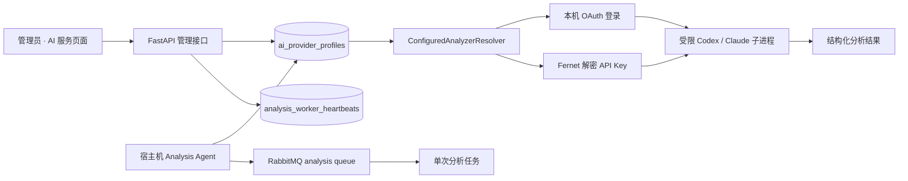

# 022 跨平台 AI 分析 Agent 与模型 Provider 配置设计

- 状态：已实现，待真实 Provider 验收
- 日期：2026-08-13
- 前置设计：`010-Codex与Claude CLI视频分析设计`、`015-RabbitMQ异步分析设计`
- 前置调研：`docs/research/011-AI分析Agent与通用Provider接入调研.md`

## 1. 决策摘要

AI 分析继续运行在宿主机 Agent，不进入 Compose。新增管理员可维护的 `ai_provider_profiles`，同时支持：

- `host_login`：复用当前系统用户已经完成的 Codex/ChatGPT 或 Claude 登录，不保存 API Key；
- `api_key`：支持 Codex Responses Provider 与 Claude/Anthropic Messages Endpoint，Key 加密保存且只注入当前任务子进程；
- 当前线路热切换：Worker 每个任务解析一次活动 Profile，配置更新时间变化时重建受限 CLI Adapter；
- 跨平台常驻：Windows 计划任务、macOS LaunchAgent、Linux systemd user service；
- 在线可见：管理页使用现有 `analysis_worker_heartbeats` 显示 Agent 是否在线。

## 2. 架构



信任边界：

- API 只接受管理员配置，不执行 Provider 网络探测。
- 数据库只保存密文与 `credential_configured` 的可推导状态。
- Worker 内存是唯一解密位置；Key 不进入 CLI 参数、日志、结果或响应。
- CLI 仍使用最小宿主机环境、独立工作区、严格工具权限、无浏览器与无用户规则模式。
- `host_login` 只在与登录用户相同的操作系统账户下运行。

## 3. 领域模型

`ai_provider_profiles`：

| 字段 | 语义 |
| --- | --- |
| `key` | 稳定标识，创建后不可变 |
| `display_name` | 管理页名称 |
| `engine` | `codex` / `claude` |
| `auth_mode` | `host_login` / `api_key` |
| `base_url` | API 模式必填；本机登录必须为空 |
| `model` | 传给 CLI 的模型标识 |
| `credential_ciphertext` | Fernet 密文；本机登录为空 |
| `credential_key_id` | 加密密钥版本 |
| `is_active` | 当前线路；部分唯一索引保证最多一条 |
| `created_at/updated_at` | 审计与 Worker 缓存失效依据 |

当前状态 schema 默认插入 `local-codex`，使用 `host_login + gpt-5.6-sol`，并保持幂等。创建新 Profile 不自动启用，避免未确认的 Endpoint 抢占线上线路。当前活动 Profile 不允许删除。

## 4. API

| 方法 | 路径 | 行为 |
| --- | --- | --- |
| `GET` | `/api/admin/ai-providers` | 返回脱敏 Profile、活动状态和 `agent_available` |
| `POST` | `/api/admin/ai-providers` | 新增 Profile，返回 `201 + Location` |
| `PATCH` | `/api/admin/ai-providers/{key}` | 更新；Key 留空时保留旧凭据 |
| `POST` | `/api/admin/ai-providers/{key}/activate` | 原子关闭旧线路并启用目标线路 |
| `DELETE` | `/api/admin/ai-providers/{key}` | 删除非活动 Profile 与密文 |

所有接口只允许管理员。响应永远没有 `api_key` 或密文，只返回 `credential_configured: boolean`。

## 5. Endpoint 与协议约束

- Codex API 模式固定 `wire_api=responses`，通过 CLI `-c model_providers.video_analysis.*` 临时注入，不写用户配置文件。
- Claude API 模式注入 `ANTHROPIC_API_KEY` 与 `ANTHROPIC_BASE_URL`。
- 公网 Endpoint 只允许 HTTPS；`localhost/127.0.0.1/::1` 可使用 HTTP。
- 禁止 URL 用户名、密码、query 与 fragment。
- 本期不做 Chat Completions 到 Responses、OpenAI 到 Anthropic 的协议转换；服务必须原生兼容所选引擎。

## 6. Worker 生命周期

1. Agent 启动，读取活动 Profile，执行 CLI/FFmpeg/认证预检，并用分析专用 MinIO 身份读取固定就绪探针。
2. 预检成功后才启动队列消费、恢复扫描与心跳。
3. 每个任务读取活动 Profile；`key + updated_at` 未变化时复用 Adapter。
4. Profile 变化时解密新凭据并重建 Adapter，下一任务生效。
5. RabbitMQ、心跳或组件循环异常时以 1–30 秒指数退避重启组件。
6. 进程级崩溃由操作系统用户服务重新拉起。

Agent CLI：

```text
python -m app.workers.analysis.agent_cli doctor
python -m app.workers.analysis.agent_cli install
python -m app.workers.analysis.agent_cli status
python -m app.workers.analysis.agent_cli uninstall
```

## 7. 管理页设计

页面路径 `/admin/ai-providers`。视觉沿用 009 的蓝白、Geist、无卡片分区：

1. 页首解释“本机登录 / API Key 路由”与生效时机。
2. “当前执行链路”用 `Agent → CLI → 登录/Endpoint` 表达真实依赖，右侧显示模型。
3. Agent 在线状态与 Provider 配置状态分开，避免“配置存在”被误解为“服务可用”。
4. Profile 使用分隔线列表，活动项不可删除；编辑在响应式 Dialog 中完成。
5. API Key 输入仅写入，编辑时用“已配置；留空不修改”反馈，不伪造掩码值。

## 8. 失败语义

| 场景 | 对外结果 |
| --- | --- |
| 无 Agent 心跳 | 创建分析返回 `analysis_unavailable`；管理页显示 Agent 离线 |
| 无活动 Profile | Agent 预检失败，由系统服务重启等待修复 |
| 本机未登录 | `analysis_cli_not_authenticated`，不写心跳 |
| 分析专用 MinIO 凭据漂移 | `doctor` 在创建任务前失败；不把旧的共享账号误判为可用 |
| API Key/Endpoint 错误 | 任务按既有失败分类收敛；密钥不出现在错误详情 |
| 活动配置被删除 | API 返回 `ai_provider_active_delete` |
| 公网 HTTP / 带凭据 URL | API 返回 `invalid_ai_provider_profile` |

## 9. 非目标

- 不实现 Provider 市场、Key 购买或账号绑定。
- 不读取、覆盖或同步 CC Switch 数据库及用户 CLI 配置。
- 不实现跨协议网关、自动模型发现、测速、余额与故障转移。
- 不让 API 容器或浏览器持有 Provider Key。
- 不改变视频完整观察、结构化输出、报告持久化和任务重试语义。
