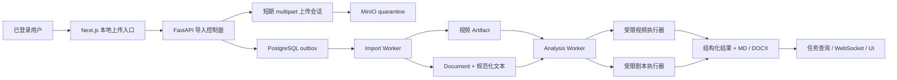

# 023 本地内容上传与剧本分析设计

- 状态：实施中，剧本文档上传与 Codex/Claude 受限执行链已打通
- 日期：2026-08-15
- 对应调研：`docs/research/012-本地内容上传与剧本Skill调研.md`
- 前置设计：`010-Codex与Claude CLI视频分析设计`、`012-AI分析报告与MinIO持久化设计`、`019-用户设备EdgeAgent与媒体制品导入设计`、`020-用户制品持久化与保留策略设计`

## 1. 决策摘要

项目新增“本地上传”入口，但不建立绕过任务、对象存储和校验 Worker 的同步上传捷径：

- 本地 MP4 使用 `browser_import` 路径，经 MinIO quarantine 和独立 Import Worker 校验后生成现有视频 Artifact，继续使用下载详情、视频拉片、RabbitMQ、报告与 WebSocket。
- 剧本文档使用独立 `documents` 聚合，保存原始文件和规范化剧本文本；它不伪造下载 inspection、format、时长或视频容器。
- Analysis 任务扩展为 `video` 与 `screenplay` 两种受控输入。两者共享任务生命周期、Provider、重试、报告与审计，但使用不同的工作区、工具权限、Prompt 和结果契约。
- 剧本文档只提供剧本分析、结构审阅和中文/英文改写。首期不提供通用文档摘要、知识问答、任意创作、OCR 或批量文件处理。
- GitHub Skill 不在运行时安装。候选规则必须经人工审查后 vendor 到仓库，固定来源 commit 和许可证，并由服务端绑定允许的输入类型与结果契约。

## 2. 与 019 的范围边界

`023` 是浏览器本地文件上传的唯一当前事实，承接原 `019` 中 `browser_import`、quarantine、上传会话、浏览器 MP4 校验和晋升职责。

`019` 收敛为：

- 用户设备配对、签名、撤销和版本治理；
- `edge_import` 协议；
- 微信视频号来源/授权媒体接入和红果 Edge Adapter；前者由 024、后者由 019 管理；
- 复用 `023` 已实现的单对象上传、quarantine、视频验证和 Artifact 晋升能力。

因此，实施 `023` 不依赖 Edge Agent、平台账号、授权分享链接、Android、动态 CA 或客户端发行物；`019` 后续也不得复制第二套上传和校验实现。

## 3. 范围与非目标

### 3.1 本期范围

1. Web 用户在首页统一内容入口中选择“链接解析 / 本地视频 / 剧本文档”。
2. 单个本地 MP4 直传、服务端复验、Artifact 晋升和视频拉片。
3. 单个 DOCX、可提取文字的 PDF、TXT、Markdown 或 Fountain 剧本导入。
4. 剧本规范化、场景 ID、人物/对白基础结构和输入质量验证。
5. 剧本综合分析、结构审阅和中英文改写三个内置 Skill。
6. 剧本分析与改写的严格结果、Markdown/DOCX 报告、取消、重试和持久存储。
7. GitHub Skill 来源、许可证、固定 commit、静态校验和升级审计。

### 3.2 非目标

- OCR、图片型 PDF、手写稿、音频转剧本或视频自动生成剧本。
- XLSX、PPTX、EPUB、网页、压缩包、文件夹和多文件批量任务。
- FDX 首期导入、在线协作编辑、修订痕迹、批注和版本合并。
- 通用文档问答、知识库、向量检索、聊天、续写整部作品或模仿名家/导演。
- 用户上传自定义 Skill、从 URL 安装 Skill、运行第三方 Skill 脚本或热更新 GitHub 内容。
- Edge Agent 与红果候选 Adapter 继续由 `019` 管理；微信公众号文章、视频号来源和授权媒体边界由 `024` 管理。

## 4. 总体架构



信任边界：

- 浏览器声明的文件名、扩展名、MIME、大小、哈希和媒体/文档属性全部不可信。
- quarantine 对下载接口、Analysis Worker 和公开读取身份不可见。
- Import Worker 没有 Provider 凭据和外网；Analysis Worker 只能读取已晋升且被任务锁定的输入。
- 剧本文本、文档 metadata、可见文字和用户提示词均是不可信数据，不能改变工具、网络、文件或输出契约。

## 5. 领域模型

### 5.1 视频导入

沿用 `019` 已定义的当前模型，但范围归 `023`：

- `download_jobs.source_kind = browser_import`；
- 导入任务的 `inspection_id/format_id` 同时为空，远程下载则同时非空，SQL `CHECK` 保证形态；
- `media_imports` 保存导入状态、权利声明和展示元数据；
- `media_import_attempts` 保存每次 quarantine/multipart attempt；
- 验证成功后只生成一个现有 `artifacts` 行，下载任务进入 `succeeded`。

视频导入继续出现在下载历史和下载详情，来源显示为“本地视频上传”，不得伪装为某个平台已下载内容，也不写 Provider canary。

### 5.2 剧本文档

新增 `documents`：

| 字段 | 语义 |
| --- | --- |
| `id/owner_hash` | 用户隔离的稳定资源 ID |
| `status` | `uploading/verifying/ready/failed/cancelled/expired` |
| `title/original_filename` | 清洗后的显示标题和原文件名 |
| `source_format` | `docx/pdf/txt/markdown/fountain` |
| `detected_language` | 受控语言检测结果，首期为 `zh-CN/en-US/mixed/unknown` |
| `scene_count/character_count` | 从规范化剧本确定性派生 |
| `text_sha256` | 规范化 UTF-8 文本哈希，作为分析输入身份 |
| `quality_warnings` | 受控低基数质量警告数组，不保存任意模型文本 |
| `error_code` | 稳定导入错误码 |
| `deleted_at` | 记录管理员手动清理状态；最终制品不设计过期字段 |

新增 `document_import_attempts`，保存 attempt、quarantine object key、multipart 引用、声明/实际大小和哈希、lease、状态与时间戳。

新增 `document_artifacts`：

- `kind=original`：用户上传原始字节；
- `kind=normalized`：服务端生成的规范化 UTF-8 Markdown/Fountain 文本；
- 每个对象记录 bucket/key/content type/size/SHA-256/status/deleted；最终对象不设置过期时间；
- `(document_id, kind)` 和 `(bucket, object_key)` 唯一。

文档是创建后不可变的输入。用户上传修订稿时创建新 Document，避免分析重试读取到不同字节。

Document repository 实现公共 `ImportRepository` 上传控制端口，但不创建 `download_jobs` 投影。它按 owner + idempotency key 隔离资源，以 `quarantine/screenplay/{document_id}/{attempt}/source` 分配确定 key，并把 complete 状态与 `content.import.verify.requested` Outbox 事件放在同一事务；解析、规范化和 Artifact 晋升由 Import Worker 的 screenplay 分支负责。

### 5.3 Analysis 输入

`analysis_jobs` 增加：

- `input_kind = video | screenplay`；
- `artifact_id` 改为可空的视频 Artifact 外键；
- `document_id` 为可空 Document 外键；
- `result_contract = video-visual-analysis | screenplay-analysis | screenplay-rewrite`。

SQL 约束必须保证：

```text
input_kind=video      → artifact_id 非空且 document_id 为空
input_kind=screenplay → document_id 非空且 artifact_id 为空
```

现有数据幂等回填 `input_kind=video` 与 `result_contract=video-visual-analysis`。输入仍在任务创建时锁定 SHA-256、Skill 指令快照和结果契约；配置或 Skill 后续变化不改变已创建任务。

视频继续使用 `analysis_artifact_locks`；剧本新增 `analysis_document_locks`，在任务可重试与报告发布期间阻止原始和规范化文档被清理。

## 6. 上传、校验与晋升

### 6.1 公共上传控制面

视频和文档复用同一个应用层 `QuarantineUploadService` 与对象存储端口：

1. 创建资源和 attempt，服务端生成 deterministic quarantine key。
2. 返回只允许指定 bucket/key、大小和有效期的 multipart 会话；浏览器不获得 MinIO 通用凭据。
3. 浏览器直传并上报 part ETag；API 不缓存完整文件。
4. `complete` 执行对象 HEAD，并在同一数据库事务更新状态和写入 `content.import.verify.requested` outbox。
5. Import Worker 按 `content_kind` 选择可信 verifier；重复消息使用资源 ID + attempt 幂等。
6. 通过后晋升到 deterministic final key，数据库原子写终态；失败、取消和过期有界清理 multipart、quarantine 和工作区。

公开上传 API 不接受任意 object key、bucket、content type、part size、S3 参数或用户签名 URL。

开源 MinIO 的浏览器上传 CORS 通过实例级 `MINIO_API_CORS_ALLOW_ORIGIN` 配置精确的 Web origin 列表，不依赖社区版本不支持的 bucket CORS API，也不允许 `*`。Web 响应的 `connect-src` 只在媒体/文档导入开启时追加由 `MINIO_PUBLIC_ENDPOINT` 安全解析出的单一存储 origin；配置拒绝 scheme、path、userinfo、query 和非法 DNS/IP，避免把配置值注入 CSP。创建资源与创建上传会话分别使用独立的有界速率策略。

### 6.2 视频校验

首期只接受单个 MP4：

- 使用 magic bytes/BMFF 结构而非扩展名识别；
- 重算实际字节数与 SHA-256；
- 使用受限 ffprobe 验证至少一条视频轨、正时长、codec、尺寸和配置上限；
- 不要求音频轨，避免无声动画和分镜素材被错误拒绝；
- 拒绝外部引用、损坏容器、多文件、playlist、超大小/时长和活动内容；
- 不转码、不修复、不改变上传字节。

验证成功后复用现有 Artifact、下载详情和 `/api/downloads/{download_id}/analyses`。

### 6.3 剧本文档校验与规范化

Import Worker 在无网络、非 root、受限 CPU/内存/pids/时间的工作区执行：

- DOCX：验证 OOXML/ZIP 条目数量、单项与总解压大小、压缩比、路径穿越、外部关系和宏；允许解析器不会解引用的标准超链接关系，拒绝外部模板、图片、OLE 等可加载资源关系；只读取正文段落与允许的表格文字。
- PDF：固定 `pypdf 6.16.0` 并以 strict 模式读取；拒绝加密、附件、关联文件、XFA、JavaScript、启动/远程跳转/URI 等活动或外部动作。对象图检查限制 20,000 个容器对象，页数限制 300，每页和总解压 content stream 分别限制 8 MiB/32 MiB；至少 80% 页面需有 40 个非空白字符，全文也至少 40 个非空白字符，替换字符比例不得超过 1%。只提取现有文字，不渲染、不执行动作、不访问外部资源。
- TXT/Markdown/Fountain：限制编码、NUL、控制字符、最长行、总字符和规范化膨胀比例。
- 所有格式统一为 UTF-8、LF 换行和稳定尾部换行，生成规范化文本 SHA-256。
- 解析场景标题、动作、人物、括注、对白、转场、镜头、Section 和 Synopsis，生成稳定 `scene_id`；无法识别任何场景但存在正文时允许退化为单场景并标记质量警告。未知或不确定的行保留为 Action，不能静默丢弃原文。
- 每个结构元素只保存 `kind + start + end`，区间引用 canonical `screenplay.md` 的字符位置且必须在所属场景内有序、不重叠；`kind` 使用受控的 heading/action/character/parenthetical/dialogue/transition/shot/section/synopsis 集合；单文档最多 5,000 个场景和 20,000 个结构元素，数据库 Artifact metadata 不复制人物名、对白或动作正文。
- 提取文本为空、乱码比例超限或结构不可恢复时返回稳定失败，不把低质量输入送给模型猜测。

首期不对扫描 PDF 自动 OCR。前端必须在创建分析前展示格式、字符数、场景数、检测语言和规范化文本预览摘要，让用户发现提取错误。

当前文本 verifier 实现使用严格 UTF-8 解码（允许 UTF-8 BOM），在有界内存中拒绝 NUL、C0/C1 控制字符、超长行、超字符数及大小/哈希漂移，并统一执行 NFC、LF 与单一尾部换行。DOCX verifier 在调用 `python-docx` 前完成 ZIP/OPC 预算、路径、符号链接、加密、宏/VBA、ActiveX、嵌入对象、DTD/ENTITY 与外部关系门禁；标准超链接由 `python-docx` 保留为字符串且不会被解引用，因此可进入后续纯文本提取，其他外部可加载资源关系继续拒绝。verifier 只把 body 段落和表格文字交给同一规范化函数。PDF verifier 在读取文本前完成 header、strict 解析、加密、页数、对象图活动内容与 content stream 预算门禁，并按文本覆盖率和替换字符比例拒绝扫描、空文本或低质量输入；`pypdf` 版本、上游 commit、BSD-3-Clause 许可证和本地用途进入独立 CycloneDX/NOTICE 并随镜像发布。统一结构解析器保留规范化原文，按场景产生中英文标题、动作、人物、括注和对白的有序字符区间，DOCX 表格的 `人物<TAB>对白` 同样映射为两个区间。Worker 只按消息中的受控 `content_kind` 和数据库固定的 `source_format` 选择 verifier；Document 独立持有 lease，依次晋升原始对象、上传规范化对象、原子提交 ready 元数据与两份 Artifact。数据库提交失败时保留 quarantine 和确定性最终对象供重试，恢复扫描会重投过期 lease，孤儿扫描只删除严格匹配 `documents/{uuid}/{positive-attempt}/(original|screenplay.md)` 且超过 grace 的未引用对象。详情查询只在 owner 校验和 ready 状态成立后读取 normalized Artifact，并同时校验 bucket、确定 key、大小及 SHA-256 绑定；存储层只读取配置允许的前缀字节，应用层再施加字符上限、严格 UTF-8 边界和截断标记，列表查询不读取正文。该实现已覆盖 TXT、Markdown、Fountain、DOCX、PDF 的语言、场景标题、稳定 scene ID、结构元素、缺标题单场景 warning 和安全预览。前端 `/documents` 列表与详情已使用生成客户端展示分页、状态、格式、字符、场景、语言、质量警告和有界纯文本预览，不使用 HTML 注入路径；`/documents` 同时提供明确的“上传剧本”入口，默认开启 Document 导入。

Analysis 联合输入的数据库形态已完成：现有任务回填为 video，SQL 约束拒绝双输入、无输入和 kind/contract/外键错配。当前 repository 已实现 screenplay 输入投影和事务内重校验；Document 与 normalized Artifact 必须同时满足 owner、ready、未删除和锁定 SHA-256 一致，创建/重试写入 Document 锁，所有既有终态与报告完成路径通过统一输入锁释放函数处理。剧本 Analysis API、独立 screenplay 执行器及报告链均已公开，且不允许剧本回落到视频执行器。

## 7. Analysis 执行器

### 7.1 公共编排

现有任务生命周期、lease、heartbeat、retry wait、取消、Provider Profile、报告发布和 WebSocket 保持统一。公开阶段继续为：

```text
preparing → analyzing → validating
```

应用层新增联合输入端口：

```text
AnalysisInput
  kind
  source_id
  local_path
  sha256
  trusted_metadata
```

执行器由 `input_kind + result_contract` 选择，不能由用户 Prompt、文件内容或模型输出改变。

### 7.2 视频执行器

保留当前 `input/video.bin`、ffprobe/ffmpeg、完整时间轴观察、视频 Prompt、Schema 和分镜证据校验，不因文档支持而放宽权限或结果。

### 7.3 剧本执行器

剧本工作区固定为：

```text
<analysis-work>/<job-id>/<run>/
├── input/
│   ├── screenplay.md
│   └── manifest.json
├── policy/
│   ├── prompt.txt
│   └── output-schema.json
├── work/
│   ├── chunks/
│   └── outputs/
└── output/
    └── result.json
```

当前分析与改写路径同时支持 Claude CLI 和 Codex CLI。Claude 使用 `--tools ""` 单轮结构化调用；Codex 使用项目固定的最小文件权限配置、禁止网络、`--ask-for-approval never`、临时会话和严格输出 Schema。规范化剧本、改写源块、相邻上下文和 glossary 均以不可信 JSON 数据通过标准输入传递，不作为命令、路径或后续指令执行。工作区中的 `input/screenplay.md` 仅供父 Worker 完整性复核；确定性 chunks 和已解析输出只保存在父 Worker 内存中。

剧本分析在 120,000 字符且不超过 120 个源场景时使用一次结构化调用；超过任一单次预算后，父 Worker 按连续完整场景确定性分块，每块分别获得严格校验的场景级结果，再把已校验的分块 JSON 交给不含 `scenes` 字段的受控汇总调用生成全局结论。最终由服务端按源顺序合并场景结果，并再次验证全部源 scene ID 恰好覆盖一次、引用均在白名单内后才允许发布；单个完整场景本身超过字符预算、块数超过上限或汇总输入超过有界容量时仍以 `analysis_resource_limit` 失败，不退化为无界上下文。Provider Schema 只使用 Codex/Claude 共同支持的严格结构化输出子集，字符串长度、数组容量、非空、唯一性与跨场景完整性由领域 parser 负责；CLI 诊断流保持有界捕获，但成功调用只以承载结果的 stdout/结果文件是否完整判断，避免大输入回显导致有效报告被误拒绝。

剧本改写固定执行：

1. 将完整规范化剧本按安全边界切成有界 glossary 段（默认每段 20,000 字符），逐段提取人物名、地点、专有名词、称谓和风格约束；服务端去重、合并并校验为一个 glossary，不把整本长剧本放进单次模型请求。
2. 按完整场景边界分块；单场景超限时按对白/动作段落继续切分，但保持 `scene_id + part_no`。
3. 每块携带 glossary、当前源块和有界相邻原文上下文；按源顺序逐块调用受限 CLI。
4. 每个输出返回源场景 ID、源块 SHA-256、目标语言和改写正文。
5. 服务端验证块一一对应、无缺失/重复/顺序漂移，并要求已在源文出现的 glossary 术语在完整输出中满足目标写法的最低出现次数，再确定性合并 Markdown；跨场景语义一致性仍由真实 E2E 和人工质量审计把关。
6. 当前块遇到 Provider 限流、CLI 超时/通用失败或结构校验失败时，父 Worker 可在同一 `run_id + attempt` 内有界重试当前块；此前已验证块只保存在本次 `execute()` 的内存列表中，不重复调用。不可恢复错误或当前块耗尽调用次数时整个任务失败，不保存部分成功报告；后续任务级重试进入新 attempt，从完整不可变输入、Skill、语言和确定性分块计划重新执行，不读取或复用跨 attempt/run 临时输出。

当前默认限制为：剧本分析单次输入 120,000 字符；改写 glossary 分段输入 20,000 字符；改写单块 8,000 字符、最多 128 块、块前后各 1,000 字符上下文、每块最多 2 次调用且首次恢复等待 1 秒、全部改写正文合计 400,000 字符。长度增长会增加有界的 glossary 与改写调用次数，而不会扩大单次模型上下文；超过块数、术语表容量、输出或 CLI/工作区容量等真实资源上限时仍明确失败。块内恢复期间仍由同一个 lease monitor 维持心跳；父 Worker 在全部 glossary、块身份、覆盖、术语和总量校验通过后才返回一个 `ScreenplayRewriteResult` 给公共 validating/publish 阶段。

`output_language` 只允许 `zh-CN/en-US`。目标语言与检测源语言不同表示跨语言改写；相同表示同语言润色。产品文案必须称为“改写/本地化”，不承诺法律、行业或逐字翻译准确性。

## 8. 结果契约与报告

### 8.1 剧本分析结果

`screenplay-analysis` 至少包含：

```text
kind = screenplay_analysis
language
title
logline
synopsis
structure { acts[], turning_points[], pacing_summary }
characters[] { id, name, goal, conflict, arc, evidence_scene_ids[] }
scenes[] { id, source_scene_id, purpose, conflict, turn, pacing, findings[] }
dialogue_findings[] { title, description, evidence_scene_ids[] }
strengths[] / priority_revisions[]
```

所有人物、结构、对白和修改建议必须引用存在的 `source_scene_id`；服务端验证 ID、数组、大小和引用，不接受模型生成的新源场景。

### 8.2 剧本改写结果

`screenplay-rewrite` 至少包含：

```text
kind = screenplay_rewrite
source_language / target_language
source_scene_count / output_scene_count
glossary[] { source, target, category }
chunks[] { source_scene_id, part_no, source_sha256, rewritten_text }
change_summary[]
```

完整改写正文由服务端按原场景顺序从已验证 chunks 合并，不让模型再返回第二份全文。公开 JSON 可只返回统计、术语表和修改摘要；完整内容进入唯一 canonical Markdown，并继续生成 DOCX 制品。

现有视频结果不增加 `kind` 兼容分支；实施时一次性把公开 Analysis Result 改为带 `kind` discriminator 的当前联合契约，并重新生成前端类型。

## 9. Skill 目录与供应链

### 9.1 当前格式

项目 Skill 改为兼容 Agent Skills 的 YAML frontmatter，并通过 namespaced metadata 保存产品字段：

```yaml
---
name: screenplay-analysis
description: 分析完整剧本的结构、人物、场景、节奏、对白与可执行修改建议。
license: MIT
metadata:
  video-server-display-name: 剧本综合分析
  video-server-default-prompt: 重点分析故事结构、人物弧光、场景功能、节奏与对白。
  video-server-order: "60"
  video-server-input-kinds: screenplay
  video-server-output-contract: screenplay-analysis
---
```

首批目录：

| Skill | 输入 | 结果契约 | 作用 |
| --- | --- | --- | --- |
| `screenplay-analysis` | screenplay | screenplay-analysis | 综合分析结构、人物、场景、对白和优先修改项 |
| `screenplay-structure-review` | screenplay | screenplay-analysis | 聚焦节拍、场景推进、转折、连续性和节奏 |
| `screenplay-rewrite` | screenplay | screenplay-rewrite | 中文/英文改写、本地化和同语言润色 |

现有五个视频 Skill 同步迁移到当前格式，并显式声明 `video + video-visual-analysis`；不保留第二套 legacy parser。

### 9.2 外部来源治理

- 生产环境和 API 不提供安装、上传或 URL Skill。
- 外部内容先在独立目录审查名称、指令、引用、脚本、许可证和 Prompt Injection，再按项目结果契约重写为内置 Skill。
- 仓库记录来源 URL、固定 commit、许可证、NOTICE 和本地修改说明；升级必须重新评审和跑真实 fixture。
- Registry 只读取 `SKILL.md` 和显式允许的一层 `references/*.md`；拒绝符号链接、绝对路径、目录穿越、未知结果契约和未知输入类型。
- `scripts/`、`allowed-tools` 和外部资源不进入 Analysis 子进程；Skill 永远不能扩大服务端工具权限。
- 创建任务时保存编译后的完整指令快照和 SHA-256，幂等指纹包含 Skill、结果契约、输出语言和用户 Prompt。

## 10. API 契约

| 方法 | 路径 | 语义 |
| --- | --- | --- |
| `POST` | `/api/media-imports` | 创建浏览器 MP4 导入，返回 `201 + Location` |
| `GET` | `/api/media-imports/{id}` | 查询上传、校验和对应 download ID |
| `POST` | `/api/media-imports/{id}/upload-sessions` | 创建/刷新 multipart 会话 |
| `POST` | `/api/media-imports/{id}/complete` | 完成上传并原子触发验证 |
| `POST` | `/api/documents` | 创建剧本文档资源，返回 `201 + Location` |
| `GET` | `/api/documents/{id}` | 查询文档导入状态和安全预览摘要 |
| `GET` | `/api/documents` | 分页查看自己的剧本文档 |
| `POST` | `/api/documents/{id}/upload-sessions` | 创建/刷新文档 multipart 会话 |
| `POST` | `/api/documents/{id}/complete` | 完成上传并触发解析验证 |
| `POST` | `/api/documents/{id}/cancel` | 取消未完成的文档导入并返回待清理对象引用 |
| `DELETE` | `/api/documents/{id}` | 在无活动 Analysis 锁时两阶段删除文档对象与记录 |
| `POST` | `/api/documents/{id}/analyses` | 创建剧本分析或改写任务 |
| `GET` | `/api/documents/{id}/analysis` | 读取最近一次剧本任务 |
| `GET` | `/api/analysis-skills?input_kind=...` | 返回该输入类型可用 Skill |

分析查询、取消、重试、删除和报告导出继续使用 `/api/analyses/{analysis_id}...`。所有创建接口使用幂等键、严格请求模型、稳定 operationId、`201 + Location`；前端只使用重新生成的 OpenAPI 客户端。

剧本任务受 `SCREENPLAY_ANALYSIS_ENABLED` 与 `ANALYSIS_ENABLED` 共同控制，两者当前默认开启。Worker 会在连接队列前同时预检 `screenplay-analysis` 与 `screenplay-rewrite` 能力，任一能力缺失即 fail closed；生产部署仍可显式关闭任一开关。

Document 列表、详情和变更均按认证 owner 隔离，跨 owner 与不存在资源统一返回 404。删除先在数据库标记 Document/attempt/Artifact 的删除意图，再清理对象存储，最后提交 Artifact 删除终态；任一活动 `analysis_document_locks` 都会阻止 prepare。应用层在第一次对象存储调用前验证所有 cleanup key，只允许当前 Document 和正整数 attempt 下的 quarantine、original 与 `screenplay.md` 三种确定路径，从而保证恶意或损坏记录 fail closed，并允许删除请求安全重试。

## 11. 前端体验

首页是所有新内容的统一起点，在同一内容网格中提供“链接解析 / 本地视频 / 剧本文档”三个可键盘操作的 Tabs：

- 移动端三个 Tabs 等分首页可用内容宽度，与输入区和主操作共享同一水平中心；320px 及以上不得因标签内在宽度产生横向滚动，`sm` 及以上恢复内容宽度的线型排列。
- 链接解析保持当前流程，不回归格式选择和下载行为。
- 本地视频与剧本文档各自只允许选择一个文件，并显示真实文件名、大小和支持范围；选择文件后可直接上传，不增加独立权利勾选、重复说明或底部提示。
- 客户端按固定块增量计算 SHA-256，不把完整文件读入 JS 内存；multipart URL、part 数、part size、并发、过期时间和返回 ETag 均再次执行客户端边界校验，任一 part 失败立即中止同批请求。
- MP4 成功后进入现有下载详情；剧本文档成功后进入 `/documents/detail?documentId=...`。

桌面与移动主导航使用相同的信息顺序：“首页 → 下载记录 → 剧本文档 → 平台状态”。首页负责创建新内容，后三项分别承接已有资源和运行状态；当前路由在对应导航项上使用 `aria-current="page"`。

新增 `/documents` 列表和文档详情：

- 列表页提供明确的“上传剧本”入口，支持 DOCX、PDF、TXT、Markdown 和 Fountain，完成后进入对应文档详情；
- 展示格式、字符数、场景数、检测语言、导入状态和“持久保存”策略；
- 展示规范化文本的有界 Markdown 预览，不嵌入原始 HTML/PDF；使用项目已有的 `react-markdown + remark-gfm` 安全渲染，固定阅读区高度并提供标题目录，超过 1 MiB/1,000,000 字符时保留截断提示；
- 只显示 screenplay 输入可用 Skill；
- 剧本分析使用结构、人物、场景、对白和修改建议视图；
- 剧本改写使用正文预览、术语表、修改摘要与 Markdown/DOCX 下载；
- 所有模型文本按纯文本或现有安全 Markdown renderer 呈现。

当前文档详情先展示文档 metadata 摘要，再以“正文阅读区 + 标题目录”两栏展示规范化 Markdown；阅读区固定高度并在内部滚动，文档信息不再占用目录侧栏。之后以一条全宽分隔线进入“剧本分析与改写”工作区。配置器只读取 screenplay Skill，沿用 `zh-CN/en-US`、4,000 字符补充要求和幂等创建；提交前持续披露规范化正文、任务指令、glossary 与有界上下文会发送给活动云端模型，并说明执行器没有文件、Shell、网络、浏览器、插件或其他 Agent 权限。任务状态复用 Analysis WebSocket、降级轮询、取消、原任务重试、删除与报告可用性语义。

成功的 `screenplay-analysis` 以结构、人物、场景、对白、修改建议和完整报告六个键盘 Tabs 组织，scene evidence 使用等宽文本显示；`screenplay-rewrite` 以源/输出场景统计、语义表格 glossary、修改摘要和 canonical Markdown 改写正文组织，不从公开 result 拼装第二份全文。两类结果只在报告同时具备 Markdown/DOCX Artifact 时显示导出动作。

界面继续遵循 009：无可见 Card 堆叠、语义 token、Phosphor 图标、44px 触控目标、完整键盘路径、桌面与 390×844 无横向溢出。上传、解析、校验、Agent 离线、失败、取消、重试、过期和空列表必须有独立状态。

## 12. 安全、容量与隐私

- 上传前声明和服务端实际值分别设置视频/文档大小上限；multipart part 数、大小、会话时长和并发均有硬限制。
- 原文件名只用于清洗后的显示与下载 disposition，不进入 object key、工作区路径或命令参数。
- quarantine 独立身份和短 lifecycle；最终视频、原文档、规范化文本和报告沿用用户制品保留策略。
- DOCX 解压、PDF 页数、提取字符、场景、单场景、单行、模型输入、模型输出和最终报告均设置上限。
- 普通日志不记录正文、Prompt、完整文件名、预签名 URL、模型原始响应、术语表或改写块。
- 剧本文档可能属于未公开作品；创建分析前明确披露文本和必要上下文会发送给活动云端模型 Provider。
- API、WebSocket、任务消息和指标只传递内部 ID、稳定状态、大小/数量与错误码，不携带正文。
- 上传会话过期清理 quarantine 与临时对象；管理员手动清理覆盖最终原始文档、规范化文档和报告对象，并受正在运行任务锁保护。

## 13. 错误语义

新增稳定错误至少包括：

| 错误码 | 场景 | 自动重试 |
| --- | --- | --- |
| `upload_session_expired` | multipart 会话失效 | 否，客户端刷新 attempt |
| `upload_incomplete` | part 缺失或 complete 不一致 | 否 |
| `import_size_mismatch` | 声明与实际大小不一致 | 否 |
| `import_sha256_mismatch` | 声明与实际哈希不一致 | 否 |
| `video_import_invalid` | MP4、轨道、时长或容器不合规 | 否 |
| `document_format_unsupported` | 非首期格式或 MIME/magic 不一致 | 否 |
| `document_encrypted` | 加密 PDF/受保护文档 | 否 |
| `document_archive_unsafe` | ZIP bomb、路径穿越、宏或外部可加载资源关系 | 否 |
| `document_text_unavailable` | 空文本、扫描 PDF 或乱码超限 | 否 |
| `document_structure_invalid` | 规范化结果无法形成受控剧本输入 | 否 |
| `screenplay_output_incomplete` | 场景/块缺失、重复或哈希不符 | 受任务预算重试 |
| `analysis_input_expired` | 兼容旧客户端的输入不可用错误；当前等价于输入已删除 | 否 |

错误响应保持可行动但不泄漏解析器栈、对象 key、本机路径、原文或 Provider Secret。

## 14. 测试与可观测性

自动化至少覆盖：

- 浏览器上传状态机、幂等键、multipart 完成、重复消息和崩溃恢复；
- 真实 FFmpeg 生成的有效/损坏/无声/超限 MP4；
- DOCX zip bomb、路径穿越、外部可加载资源关系、加密/扫描/乱码 PDF、控制字符和超长行；
- 中英文与混合语言 Fountain/DOCX/PDF fixture 的场景、角色和对白解析；
- 两个剧本结果 Schema、scene evidence、chunk 覆盖、glossary 一致性和输出上限；
- Skill 标准 frontmatter、来源 metadata、引用路径、符号链接、未知工具/契约拒绝；
- 文档正文 Prompt Injection 尝试读取 Home、仓库、相邻任务、网络和 Secret 时 fail closed；
- URL 下载、五个视频 Skill、报告、重试、WebSocket、历史和管理员统计全量回归。

指标只使用低基数 `content_kind/source_format/status/error_code/skill_id/result_contract`；不得使用 owner、标题、文件名、scene ID、人物名或文档哈希作为标签。

真实验收分别使用项目自有或明确授权的短 MP4、中文剧本和英文剧本，证明视频拉片、剧本分析、中→英改写和英→中改写完整闭环；真实用户未公开剧本不得提交为仓库 fixture。

## 15. 迁移与切换

1. 当前态 SQL 增加 `source_kind`、导入/文档表和 Analysis 联合输入约束，并幂等回填现有视频任务。
2. 先部署不暴露 UI 的数据库、API、Import Worker 与关闭状态 feature flag。
3. 完成视频导入 E2E 后启用 MP4 上传。
4. 完成文档解析与剧本分析 E2E 后启用剧本文档；改写可使用独立 feature flag。
5. 所有内置 Skill 一次性迁移到当前标准格式，删除 legacy parser 和旧 fixture，不维护双轨。
6. 同步更新 `019`，使 Edge Import 依赖本设计，不再把 browser upload 作为自身交付门禁。

任一新入口关闭时，现有链接下载和视频分析必须保持可用。只有完成 Acceptance 中的真实 E2E、供应链和安全负例后，Design/PRD/Plan/Acceptance 才能改为归档状态。

## 16. PostgreSQL 与容器配置边界

PostgreSQL 是运行时和持久化测试的唯一数据库。配置只接受 `postgresql+asyncpg`，ORM 不保留 SQLite 方言分支，开发依赖不安装 SQLite driver。Repository 与集成测试通过 `TEST_DATABASE_URL` 连接真实 PostgreSQL，并为每个测试创建独立 schema；测试 search path 不回退到 `public`，避免误读已有部署表或污染本机数据。

Compose 只表达容器拓扑需要的服务角色、连接地址、跨进程 Secret、容器固定路径和显式能力开关。大小、上传会话 TTL、批量、租约、解析器预算等已有类型化安全默认值的运行参数只在 `backend/app/core/config.py` 维护，不在基础或生产 Compose 重复展开。最终用户制品没有 TTL/自动 GC；管理员手动清理由应用接口执行。生产覆盖继续在解析阶段要求关键 Secret 和连接地址；RabbitMQ 的生产 queue type 属于基础设施拓扑策略，因生产值与初始化脚本默认值不同而保留显式覆盖。

同一 Python 镜像继续承载 API、无 OAuth Worker 与 Runner；公共镜像/重启/健康检查骨架使用 YAML extension anchor 收敛，服务自身仍显式保留 `container_name`、网络、命令、权限和依赖。PostgreSQL、RabbitMQ、Valkey、MinIO 与初始化任务由 `docker-compose-env.yml` 统一提供；业务 Compose 通过 `.env` 的连接地址复用它们或已有基础服务，不引入 SQLite 或第二套数据库过渡层。
