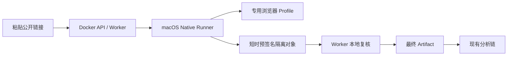

# 024 Native Runner 浏览器会话设计

- 状态：Phase 1 implemented；真实平台验收待完成
- 日期：2026-08-15

## 决策

YouTube、TikTok 等需要本机浏览器登录态的平台使用宿主机 Native Runner；匿名 Runner、API、下载 Worker、对象存储和分析链继续保留现有部署。网页仍提交普通链接，API 不接收 Cookie。

Native Runner 通过受限的 `--cookies-from-browser` Profile 引用读取宿主机会话。下载完成后，下载 Worker 为固定 `runner-deliveries/{job}/{attempt}/artifact` 生成短时预签名 PUT；Runner 只能写入该对象，不持有 MinIO 账号。Worker 把隔离对象下载到自己的有界工作区，重新验证大小、SHA-256 与媒体信息，再通过服务端 copy 晋升为现有 `downloads/{job}/{attempt}/video.{container}`。

## 安全边界

- Native Runner 只绑定 loopback，内部请求继续使用 HMAC、时间戳和 nonce。
- 浏览器类型只允许 Chrome、Chromium 或 Firefox；一个 Runner 只服务一个 Provider、并发固定为一。
- 浏览器 Cookie 不进入请求 JSON、Docker、数据库、对象 metadata 或日志。
- 预签名 URL 的 origin 必须在 Runner 静态 allowlist 中；不跟随重定向。
- Worker 永远不信任 Runner 声明的路径、大小或哈希；远程制品必须重新落地并校验。
- Cookie、PO Token、出口和客户端 Profile 变化时更新非 Secret context version，旧 inspection 不跨 context 下载。

## 当前边界

Phase 1 已实现浏览器会话源、预签名 PUT、隔离对象复核/晋升与 loopback 入口。自动安装/升级、浏览器扩展、图形化重新登录提示和真实 YouTube/TikTok canary 仍属于后续验收。
