# 024 微信公众号文章、视频号与腾讯视频授权媒体接入设计

> 2026-08-27 修订：视频号公开 `/sph/` 单视频链接的当前实现与安全边界已由 [025 设计](025-微信视频号公开分享链接下载设计.md) 取代。本文件中“视频号链接只返回 export_required/unsupported”的旧结论仅保留为历史背景；公众号文章、腾讯消费站和腾讯云 VOD 部分仍有效。

- 状态：设计完成，代码未实施
- 日期：2026-08-26
- 对应调研：`docs/research/014-微信视频号与腾讯视频授权媒体下载调研.md`
- 对应需求/计划/验收：`docs/prd/024-微信视频号与腾讯视频授权媒体接入需求.md`、`docs/plans/024-微信视频号与腾讯视频授权媒体接入计划.md`、`docs/acceptance/024-微信视频号与腾讯视频授权媒体接入验收.md`
- 前置设计：`005-多平台Provider策略设计`、`017-其他短视频平台分阶段接入设计`、`019-用户设备EdgeAgent与媒体制品导入设计`、`023-本地内容上传与剧本分析设计`

> 本设计是微信公众号文章、微信视频号和腾讯受限媒体接入的当前规范。它取代早期调研和 019 设计中关于“元宝 Cookie、私有 finder 接口、微信根证书代理、页面注入、`decodeKey`、受保护前缀转换”的产品化建议。019 的设备配对、签名上传和 Artifact Import 思路仍可复用，但 Edge Agent 只能传输用户已经合法取得的明文文件，不能承担拦截、解密或扩大平台权益的职责。

## 1. 决策摘要

项目新增统一的“来源解析与授权决策”层，把平台页面可访问、媒体可播放、媒体可导出和最终制品可分析拆成独立状态。系统只自动下载以下两类内容：

1. 公开、无登录、无付费、无 DRM、用户有权保存的明文媒体；
2. 通过官方资产所有者连接器明确授权导出的未加密媒资。

微信公众号文章和微信视频号必须拆成不同 Provider：

- `wechat_official_account_article` 把公开 `mp.weixin.qq.com` 文章作为多资产 discovery 容器，分别识别公众号原生视频、腾讯 iframe、视频号嵌入和未知 embed；只有无登录、身份映射唯一、公开 clear 且权利门禁通过的公众号原生项才可下载；
- `wechat_channels` 处理 `weixin.qq.com/sph/...` 视频号来源，当前只返回 `export_required` 或接收用户自有/合法导出文件。

微信视频号当前没有满足上述条件的通用分享链接下载 API，所以：

- `wechat_channels` 继续保持 `unsupported`，但能准确识别 `weixin.qq.com/sph/...` 并给出“请导入自有/合法导出文件”的行动建议；
- 创作者自有原文件或通过官方功能合法取得的 MP4 复用 023 的浏览器导入；
- 不实现元宝 Cookie、共享 Worker、未公开 finder API、根证书代理、微信页面注入或媒体解密。

腾讯侧分成两套能力：

- `qqvideo` 的目标能力只处理 `v.qq.com` 公开、clear 单视频；Phase 0 已将固定 yt-dlp Profile 降为 `disabled` 并停止生成格式，因为该 extractor 使用未公开播放接口、生成消费端 `cKey`，又缺少公开免费正向权益证据；只有完成 Phase 2 门禁后才能恢复；
- 新增 `tencent_cloud_vod` 官方资产连接器，只处理当前租户自己云账号/子应用中的 `FileId`，下载官方 API 返回的未加密源文件或处理输出。

“解析成功”的结果不再等同于“可下载”。最终决策固定为：

```text
downloadable      允许选择格式并创建下载任务
playback_only     只能使用平台官方播放/离线能力
export_required   需要权利方提供原文件或官方导出文件
blocked           private / preview / geo / DRM / unknown
unsupported       当前没有受批准执行器
```

## 2. 目标与非目标

### 2.1 目标

1. 正确区分微信公众号文章容器/原生视频、微信视频号、腾讯视频消费站和腾讯云 VOD，并正确处理文章内零个、一个或多个视频项。
2. 对公开视频、试看、VIP、购买、private、地域、加密 HLS、DRM 和未知保护给出稳定、可行动的结果。
3. 复用当前 inspection、语义格式、下载前重解析、Download Worker、ffprobe/SHA-256、MinIO Artifact 和完整视频分析链。
4. 为客户自有腾讯云 VOD 媒资提供官方、最小权限、租户隔离和可撤销的导出能力。
5. 让用户自有视频号原文件可靠进入现有 Artifact/Analysis 流程，并保存来源和权利声明。
6. Provider 页面只依据真实 canary 展示能力，不把 URL 识别、GitHub demo 或元数据成功写成“已支持下载”。

### 2.2 非目标

- 不绕过 VIP、单片付费、private/follow-only、地域、设备、并发、试看或购买权益。
- 不接收、保存、共享或刷新微信、元宝、腾讯视频消费端 Cookie/Token，尤其不接收 `vqq_vusession`。
- 不生成消费端私有签名，不复制旧播放接口参数，不调用公共解析站、公共 Worker 或外部签名服务。
- 不安装 MITM 根证书、不修改系统代理、不注入微信页面、不拦截客户端流量。
- 不获取 HLS key、DRM license、内容密钥、`decodeKey`，不转换受保护前缀，不导出官方 App 离线缓存。
- 不把腾讯云 VOD `FileId` 与 `v.qq.com` 的 `vid/cid` 混用。
- 不绕过微信公众号的登录、关注、验证码、付费阅读或其他访问门槛，不使用 stealth/反检测浏览器和第三方文章解析 API。
- 首期不做视频号直播/回放、作者批量归档、评论、雷达监听、腾讯剧集批量下载或多资产 manifest。
- 本设计不是对内容再分发权的判断；产品只提供技术门禁和审计，用户仍须拥有相应权利。

## 3. 核心原则

1. **先分类再取字节**：来源、权益和身份必须先通过；manifest/声明保护先判定。只有直连 BMFF 无法仅凭元数据确定保护时，才允许在严格字节预算内读取头尾 range 做保护探针，探针不得进入 quarantine 或 Artifact。
2. **要求正向证据**：缺少“公开且 clear”的证据视为 `unknown`，不能用“没有看到 DRM”推定可下载。
3. **权利声明不解锁保护**：用户勾选“我有权使用”只能形成审计记录，不能把 VIP/DRM/private 变为可下载。
4. **官方连接器与消费端 extractor 隔离**：两者使用不同 Provider key、凭据、执行器、canary 和错误统计。
5. **短时能力不持久化**：签名媒体 URL、查询参数、播放 token 和连接器租约只存在于一次操作内，不进入 DB、MQ、对象 metadata、日志或客户端响应。
6. **下载前重解析**：每次 attempt 都用原 Provider/Profile/Connection 版本重新取得表示，重新检查身份、权益和保护状态。
7. **完整制品才算成功**：HTTP 200、元数据、M3U8 或片段成功都不是下载成功；必须完成容器/轨道、时长、大小和 SHA-256 验证并生成 Artifact。
8. **真实状态**：`registered`、`metadata`、`downloadable`、`media verified` 和 `analysis verified` 是不同证据。

## 4. 总体架构

```mermaid
flowchart LR
    U["Web 用户"] --> API["FastAPI"]
    API --> RESOLVE["Source Resolution Service"]
    RESOLVE --> CLASSIFY["Entitlement + Protection Classifier"]
    RESOLVE --> PUBLIC["现有 Public Provider Runner"]
    RESOLVE --> ARTICLE["Wechat Article Discovery Adapter"]
    ARTICLE --> CLASSIFY
    RESOLVE --> OFFICIAL["Official Connector Router"]
    OFFICIAL --> VOD["Tencent Cloud VOD Connector"]
    VOD --> BROKER["Credential Broker / Vault"]
    CLASSIFY --> DECISION{"Acquisition Decision"}
    DECISION -->|downloadable| INSPECT["Inspection + Semantic Formats"]
    DECISION -->|playback_only / blocked| UI["限制原因 + 官方行动"]
    DECISION -->|export_required| IMPORT["023 Browser / Signed Device Import"]
    INSPECT --> ROUTE{"Execution Mode"}
    ROUTE -->|provider_runner| OUTBOX["Public Download Outbox"]
    OUTBOX --> WORKER["现有 Download Worker"]
    WORKER --> RECHECK["Re-resolve + Reclassify"]
    RECHECK --> VERIFY["Download / Remux / Protection Scan / ffprobe / SHA-256"]
    ROUTE -->|article_native| ARTICLE_OUTBOX["Article Media Outbox"]
    ARTICLE_OUTBOX --> ARTICLE_WORKER["独立 Article Media Worker"]
    ARTICLE_WORKER --> ARTICLE_RECHECK["重取文章 + 身份/权益/保护复核"]
    ARTICLE_RECHECK --> QUARANTINE
    ROUTE -->|official_connector| CONNECTOR_OUTBOX["Official Connector Outbox"]
    CONNECTOR_OUTBOX --> CONNECTOR_WORKER["独立 Official Connector Worker"]
    CONNECTOR_WORKER --> OFFICIAL_RECHECK["Re-authorize + Re-resolve"]
    OFFICIAL_RECHECK --> QUARANTINE["Quarantine"]
    IMPORT --> VERIFY_IMPORT["Quarantine + Import Worker"]
    QUARANTINE --> VERIFY_IMPORT
    VERIFY --> ARTIFACT["MinIO Artifact"]
    VERIFY_IMPORT --> ARTIFACT
    ARTIFACT --> ANALYSIS["RabbitMQ + 完整视频 Agent"]
```



### 4.1 新增组件

| 组件 | 职责 | 明确不负责 |
| --- | --- | --- |
| `SourceResolutionService` | 识别来源、规范化输入、调度执行器、形成统一决策 | 不持有 Provider Secret，不下载媒体正文 |
| `WechatArticleDiscoveryAdapter` | 静态获取公开文章、列出嵌入项、形成 opaque item ref 并路由子来源 | 不执行页面脚本、不绕过挑战/付费、不按 DOM 顺序猜测多视频身份 |
| `ArticleMediaWorker` | 只按内部 job id 重取文章、复核选中 native item、在批准域名内下载 clear 媒体到 quarantine，并创建内部 import intake | 不接收 URL/Cookie，不调用 Generic/消费端 Runner，不直接晋升 Artifact |
| `EntitlementClassifier` | private/VIP/purchase/preview/geo/unknown 判定 | 不尝试换账号或扩大权益 |
| `ProtectionClassifier` | DRM、加密 HLS/DASH、加密 BMFF、clear/unknown 判定 | 不请求 key/license，不解密 |
| `OfficialConnectorRouter` | 按官方连接器和不可变版本路由 | 不回退到消费端 Runner |
| `TencentCloudVodConnector` | 用官方 SDK 解析租户自有 `FileId` 和短时 clear 表示 | 不接受 `v.qq.com` URL/vid，不返回 Secret |
| `CredentialBroker` | 以短租约向专用连接器执行器提供连接版本 Secret | 不把 Secret 交给 API、Generic/Download Worker 或 MQ |
| `OfficialConnectorWorker` | 按内部请求 ID 重新授权、下载到 quarantine，并触发现有 Import Worker | 不访问 Generic URL、其他 Provider Secret、最终 Artifact 或 AI Key |
| `ImportIntakePort` | 为 browser/article/official 来源原子创建 `media_imports/media_import_attempts`、绑定 quarantine key 并发布 verify 事件 | 不下载、不解析外部 URL、不绕过 Import Worker 复验 |
| `AcquisitionRouter` | 把可下载 inspection 路由到 Public Runner、Article Media 或独立 Official Connector 队列 | 不处理 playback-only/blocked 任务，不允许跨模式回退 |

### 4.2 保持不变的组件

- PostgreSQL 继续是 inspection、任务、连接 metadata、权利审计和状态事实源。
- 当前 Download Worker 只继续处理 `remote_provider`；Article/Official Worker 把已复核的 clear 文件写入 quarantine，并通过共享内部 Import Intake 创建 `media_imports/media_import_attempts` 后交给无外网 Import Worker。下载 lease、outbox、RabbitMQ、MinIO、Artifact、Analysis Worker、报告和 WebSocket 的通用基础继续复用。
- 023 的浏览器 MP4 上传、quarantine、无外网 Import Worker、BMFF/ffprobe/SHA-256 和 Artifact 晋升是视频号自有文件的唯一当前入口。
- Generic Provider 永远不携带会话，也不能接管已识别但未批准的视频号/腾讯受限 URL。

## 5. 统一来源与决策模型

### 5.1 `SourceOrigin`

```text
public_url       公开网页 URL，由现有安全 Provider Runner 解析
discovered_item  公开容器中经用户选择的 opaque 子项，由专用执行器解析
official_asset   租户自有官方媒资，由批准的 Connector + external id 解析
verified_import  用户选择并上传的本地明文文件
```

### 5.2 `ExecutionMode`

不把执行方式继续塞进 `ProviderAccessMode`。现有 `anonymous/operator_managed` 仍只表示 Media Runner 的会话模式；新增独立执行维度：

```text
provider_runner
article_native
official_connector
verified_import
```

这样 `official_connector` 和未来的签名设备上传不会被错误路由到 Cookie Runner。

### 5.3 `AccessDecision` 与 `EntitlementState`

```text
AccessDecision = downloadable | playback_only | export_required | blocked | unsupported

EntitlementState = public_free | official_download_grant | auth_required |
                   entitlement_required | purchase_required | private |
                   preview_only | geo_restricted | unknown
```

`playback_only` 是决策，不是来源或执行模式。只有 `public_free` 或 `official_download_grant` 能支持 `downloadable`；其他权益状态均不产生格式。

### 5.4 `IdentityState`

```text
verified
ambiguous
changed
unknown
```

只有 `verified` 能进入 `downloadable`；数量错配、重复 id、无法绑定表示、重解析漂移和证据不足分别收敛为 `ambiguous/changed/unknown` 并 fail closed。

### 5.5 `ProtectionState`

```text
clear
clear_hls
encrypted
drm
unknown
```

权益和保护必须分别判定：例如 VIP clear preview 仍因 entitlement/preview 受限，公开页面上的 DRM 媒体仍因 protection 受限。任何一维为 `unknown` 都 fail closed。

### 5.6 权利依据

允许用户声明的 `RightsBasis`：

- `creator_owned`
- `rights_holder_authorized`
- `public_license`
- `contractual_export`

`personal_viewing`、`vip_member` 和 `purchased_access` 不是服务端明文导出的有效依据。连接器/平台保护门禁先执行，权利声明后执行；任何声明都不能覆盖 `encrypted/drm/private/preview_only/unknown`。

## 6. 解析和下载状态机

### 6.1 解析

```text
created
  → identifying
  → resolving
  → classifying
  → downloadable / playback_only / export_required / blocked / unsupported
```

只有 `downloadable` 解析可以生成 `media_formats`。其他终态仍返回标题、时长、Provider、公开封面和受限原因（能够安全取得时），但 `formats=[]`，不能创建下载。

### 6.2 公共 Provider 远程下载

```text
queued
  → revalidating
  → downloading
  → remuxing
  → verifying
  → uploading
  → succeeded
```

在 `revalidating` 阶段重复：

1. Provider/Profile/Connector/Connection 版本一致；
2. external media id 与初次 inspection 一致；
3. 权益和保护仍为 clear；
4. 选中语义格式仍可恢复；
5. 短时 URL 只在当前 attempt 内有效。

若内容从公开变为 VIP/DRM/private，原任务以稳定内容错误结束，不换账号、不降级到试看、不新建任务。

### 6.3 公众号原生媒体下载

```text
queued
  → revalidating_article
  → downloading
  → verifying
  → importing
  → succeeded
```

`article_native` 任务只发布 `article_media.requested`，消息仅含内部 job id、attempt 和 schema version。独立 Article Media Worker 按 inspection 读取同 owner、未过期的 discovery/item ref，解密该 discovery 的 canonical article URL，重取文章并复核 `article/item/mpvid/media/representation` 身份、权益、RightsBasis 和保护状态。它只在批准的微信文章/CDN 域名内取 clear 字节，写入 quarantine 后通过共享内部 `ImportIntakePort` 原子创建 `media_imports/media_import_attempts`，再发布 `content.import.verify.requested`。现有 Download Worker 不 claim 此来源，MQ/业务表不出现文章 URL、inline signed URL 或 query。

### 6.4 官方连接器下载

```text
queued
  → authorizing
  → resolving
  → downloading
  → verifying
  → importing
  → succeeded
```

官方资产任务只发布 `official_connector.requested`，消息仅含内部 job/request id、attempt 和 schema version。独立 Worker 重新验证 owner、不可变连接版本、`SubAppId/FileId`、资产级导出依据和保护状态，然后把 clear 制品写入 quarantine，通过与浏览器/Article 共用的内部 `ImportIntakePort` 原子创建 `media_imports/media_import_attempts`，再触发 `content.import.verify.requested`。该端口扩展现有只接受 browser import 的 Repository，并用 `source_kind + source_request_id` 唯一约束保证重复消息不创建第二个 import/Artifact。Official Worker 不产生 `download.requested`，现有 Download Worker 永远不能领取或回退执行。

### 6.5 导入

视频号自有文件继续使用 023 的：

```text
uploading → verifying → ready
```

前端可记录 `declared_origin=wechat_channels`，Artifact provenance 可显示“用户提供的视频号来源文件”，但该导入不得写 Provider canary，也不得显示成“系统已从视频号下载”。

## 7. 微信公众号文章与视频号设计

### 7.1 微信公众号文章 discovery

新增 Provider key `wechat_official_account_article`。文章不是单个媒体 inspection，而是多资产容器；首期接受：

```text
https://mp.weixin.qq.com/s/{opaque-id}
https://mp.weixin.qq.com/s?__biz=...&mid=...&idx=...&sn=...
```

第二种形态只保留经 schema 审查的必要参数，拒绝付费/阅读 ticket、用户态认证字段、未知 query、URL credentials 和非默认端口。Adapter 使用标准 HTTP、固定普通浏览器 UA、人类阅读速率和严格响应大小/超时；遇到验证码、安全验证、登录、关注、付费或异常 HTML 时返回 `article_access_restricted`，不启动 headless/stealth 浏览器、不接收 Cookie。

静态解析只读取固定 HTML/inline data 形态，不执行 JavaScript。返回有界 discovery：

```json
{
  "provider_key": "wechat_official_account_article",
  "article_ref": "opaque-owner-scoped-ref",
  "title": "sanitized",
  "items": [
    {
      "item_ref": "opaque-owner-scoped-ref",
      "kind": "official_account_native | tencent_video | wechat_channels | unknown",
      "title": "sanitized",
      "duration_ms": null,
      "thumbnail_url": null,
      "decision_hint": "candidate | export_required | unsupported"
    }
  ]
}
```

规则：

1. 零项返回空 discovery，不创建 inspection；一项仍要求用户确认；多项必须明确选择，不能默认下载第一项。
2. 公众号原生项识别 `<iframe data-mpvid="wxv_*">`/经审查的 `<mpvideo>` 和 inline `mp_video_trans_info`；只解析纯数据与固定转义，不执行脚本。
3. 原生项只有在 `mpvid`、内部 media id 和选中 representation 能明确一一绑定时才产生候选；按 DOM/数组顺序猜测、数量不一致或重复 id 返回 `article_video_identity_unverified`。
4. 短时 `mpvideo.qpic.cn` URL 和 query 视为 Secret，只存于一次 resolve/attempt 内；日志、错误、DB、MQ、Artifact 和客户端不出现完整 URL。
5. CDN 只允许经批准的 HTTPS host/path，DNS/IP 和每跳重定向重新 admission；请求不得携带文章 Cookie、Referer 票据或任意用户 header。
6. 候选 MP4 必须经过公开免费权益、RightsBasis、BMFF/ProtectionClassifier 和完整性门禁；无法证明 clear/完整时 `blocked/unknown`。
7. 腾讯 iframe 只形成 `qqvideo` 子来源并遵循其 disabled/审批状态；视频号 snapshot 只形成 `wechat_channels/export_required`；未知 embed 不进入 Generic。

用户选择 `item_ref` 后再创建 child inspection。Discovery TTL 到期或下载前必须重新获取文章并绑定相同 article/item/media identity；文章删除、内容变化或签名过期不得复用旧媒体 URL。

### 7.2 视频号 URL admission

首期只识别并规范化：

- `https://weixin.qq.com/sph/{opaque-id}`
- 未来经审查的第一方 `channels.weixin.qq.com` 单作品分享路径

规则：

- 仅 HTTPS、无 URL credentials、无非默认端口；
- path 必须是单作品形态，拒绝主页、搜索、评论、直播和批量入口；
- 短链重定向每跳重新执行 DNS/IP/host/path admission；
- 识别后不能落入 Generic extractor。

### 7.3 视频号当前正式行为

由于没有批准的匿名/官方下载执行器，解析返回：

```text
provider_key = wechat_channels
decision = export_required
protection_state = unknown
restriction_reason = official_export_or_source_required
formats = []
```

用户行动：上传自己创作、拥有权利或经权利方授权、并通过官方功能取得的标准 MP4；否则在微信中打开原链接。

### 7.4 视频号公共明文 Adapter 的未来准入条件

保留 `wechat-channels-public-share-v1` 研究位，但默认不注册。只有同时满足以下条件才允许实现：

1. 无 Cookie、无登录浏览器 profile、无用户设备会话；
2. 只调用有正式文档或合同授权的第一方接口；
3. 不安装证书、不做代理、不注入页面、不获取处理密钥；
4. 返回的媒体已经是标准 clear MP4/clear HLS；
5. 分享 id、作品 id、作者和媒体身份可绑定；
6. 短时 URL 不持久化，下载前可安全重解析；
7. 项目自有/明确授权样本完成 metadata、完整下载和 Analysis E2E；
8. 微信书面许可、接口条款和代码许可证通过评审。

任何一项不满足，Provider 继续 `unsupported`，不自动回退到元宝、公共 Worker 或本地拦截。

### 7.5 视频号 Edge Agent 边界

若后续实现 019 的签名设备上传，它只能：

- 让用户显式选择本地 MP4；
- 计算大小/SHA-256/ffprobe；
- 获得一次性 quarantine 上传会话；
- 上传脱敏 provenance。

它不能访问微信网络流量、浏览器/客户端 Cookie、系统代理、CA、页面脚本、媒体 token、处理参数或受保护缓存。设备上传是传输通道，不是平台下载器。

## 8. 腾讯视频消费站设计

### 8.1 公开单视频

现有 `qqvideo-public-video-v1` 不能继续静态标为 `verified`。固定 yt-dlp Tencent extractor 会以硬编码参数生成消费端 `cKey`、调用未公开播放接口并请求 DRM 能力，但结果没有可靠的 `public/free/VIP/purchase/preview` 权益证据。这与本设计“不生成消费端私有签名”和“公开 clear 必须有正向证明”的边界冲突。

Phase 0 先将该 Profile 降为 `unknown/disabled`，阻止生产解析生成可下载格式。Phase 2 只有在上游机制经过法务/安全批准且以下门禁全部通过时才恢复：

1. URL normalizer 只允许 `/x/page/{vid}.html` 和 `/x/cover/{series_id}/{vid}.html` 两种单视频/单集路径；拒绝 series landing、频道、直播、搜索、playlist、未知 query 和跨形态重定向。
2. 页面视频 id、接口视频 id 和最终格式必须一致。
3. Provider classifier 必须明确证明非 private、非 VIP、非购买、非试看、非地域绕过。
4. 仅保留 `has_drm=false` 且保护扫描为 clear 的格式。
5. 页面权益字段缺失、冲突或 extractor schema 变化时返回 `protection_unknown`/`provider_verification_failed`。
6. 下载前重解析；不能在公开解析失败后尝试用户/运维会员 Cookie。
7. 下载完成执行容器、轨道、保护标记、时长和 SHA-256 复验。

不得通过复刻/扩展 `cKey`、引入外部签名服务或新增消费端 Cookie 来满足这些门禁。若没有获批接口能够给出公开免费正向证据，`qqvideo` 保持不可下载；公开页面元数据可作为受限解析结果，但不能生成格式。

### 8.2 VIP、付费和试看

VIP 页面允许解析公开元数据，但必须返回无格式决策：

| 场景 | 决策 | 原因 |
| --- | --- | --- |
| 需要登录 | `playback_only` | `auth_required` |
| VIP/会员专享 | `playback_only` | `entitlement_required` |
| 单片付费/购买 | `playback_only` | `purchase_required` |
| 只得到片花/试看 | `blocked` | `preview_only` |
| 地域受限 | `blocked` | `geo_restricted` |
| 加密/DRM | `blocked` | `drm` |
| 证据不足 | `blocked` | `unknown` |

产品不提供“登录腾讯视频”“粘贴 Cookie”“导出 VIP MP4”入口。UI 只显示“在腾讯视频中打开/使用官方离线缓存”和受限原因。

### 8.3 现有权益检查必须修正

当前 `backend/app/runner/entitlements.py` 在所有模式拒绝 DRM，但对 private/premium/member 的完整检查只在 `operator_managed` 执行。实施 024 前必须：

- 把平台无关的 private/premium/member/preview 负向检查应用到所有 access mode；
- 为 `qqvideo` 增加显式 Provider classifier；
- 没有 `public_free` 或正式 `official_download_grant` 正向证据时返回 `content_entitlement_unknown`；
- 未知 `availability/protection` fail closed；
- inspection 和 download re-inspect 使用同一规则；
- 负例进入固定 canary，防止回归。

## 9. 腾讯云 VOD 官方连接器

### 9.1 身份和隔离

新增 Provider key `tencent_cloud_vod`，它不接受 URL，只接受：

```text
owner-scoped connection_id
SubAppId
FileId
optional preferred output kind
rights basis = creator_owned / rights_holder_authorized / contractual_export
```

连接要求：

- 每个租户使用独立连接，生产推荐独立腾讯云 VOD 子应用；
- CAM 只授予该 `SubAppId` 所需的读取媒体信息和下载 URL 权限；
- 由于 VOD IAM 不能细化到单个 FileId，不能把多个不相关租户放入同一子应用；
- SecretId/SecretKey 或 STS 凭据进入 Vault/Broker，不写 PostgreSQL 密文列、环境变量、日志或 MQ；
- API/前端只看到连接显示名、子应用 id、状态、版本和最后验证时间；Secret 永不可回读；
- 撤销/轮换后，引用旧连接版本的排队任务停止，不自动使用新版本。

#### 9.1.1 Secret Broker 与 workload identity 前置门禁

当前仓库没有 Vault/Broker、内部 PKI 或 Official Connector workload identity，不能把这些名称当作已存在能力。实现连接器前必须先提交独立 ADR 和 operations runbook，确定：

- 生产 Secret backend、HA/备份/恢复、审计保留和灾难恢复责任；
- API、Connector Worker、Broker 的独立 workload identity，以及 mTLS 证书签发、轮换、吊销和失效行为；
- `SecretLeaseBroker` port 的 create/lease/rotate/revoke 接口、租约 TTL、最大并发和审计字段；
- Broker/Vault 不可用时统一返回 `connection_broker_unavailable`，排队任务不回退环境变量、数据库 Secret、旧租约或消费端 Runner；
- 开发/CI 只使用无真实凭据的内存/临时测试 backend；默认 Compose 中 `tencent_cloud_vod` feature flag 关闭，未配置正式 backend 不能激活连接。

PostgreSQL 备份只包含不可用的 opaque `secret_ref/version`，不能单独恢复 Secret；Vault/Broker 恢复后仍必须重新验证连接。任何“临时先把 Secret 放环境变量/现有 AI 密钥密文列”的实现都不接受。

### 9.2 媒资解析

连接器使用固定版本腾讯云 SDK 调用 `DescribeMediaInfos`；搜索页可使用 `SearchMedia`，但首期下载只按用户提供的确定 `FileId`：

1. 验证 FileId 属于连接声明的 SubAppId。
2. 读取 BasicInfo、MetaData、TranscodeInfo 和 AdaptiveDynamicStreamingInfo。
3. 过滤过期、删除、大小/时长超限、未知或受保护表示。
4. 优先顺序为：未加密源 MP4 → 未加密 MP4 转码 → clear HLS。
5. DASH、加密 HLS、私有加密和 DRM 首期全部拒绝。
6. HLS 若需要单文件，优先要求资产所有者在 VOD 生成 MP4 转码；允许 clear HLS 时仍执行有界 segment 下载/remux。
7. 返回统一语义格式，不把原始 VOD URL 或签名字段返回前端。

### 9.3 下载时租约

初次 inspection 在连接器控制面加密保存原始 `FileId`，业务 inspection 只保存 owner-scoped opaque asset ref/hash、连接版本、输出身份和语义计划；不在普通业务表、Artifact 或消息中保存原始 `FileId` 和媒体 URL。

独立 `TencentOfficialConnectorWorker` 在每个 attempt：

1. 只按 MQ 中的内部 request id 从数据库取得非 Secret、owner-scoped 上下文；
2. 通过内部 mTLS 调用 Official Connector Router；
3. Broker 为确定的连接版本向该 Worker workload identity 发放短租约；
4. Connector 重新调用官方 API 并重做资产归属、导出依据和保护检查；
5. 只在当前进程内使用短时媒体 URL，下载、remux、初步保护复验、ffprobe 和 SHA-256；
6. 把 clear 制品写入 quarantine，发布只含内部 import/request id 的 `content.import.verify.requested`；
7. 无外网 Import Worker 独立复验并晋升最终 Artifact；
8. `finally` 清除 URL、租约和工作区。

Connector Router 本身没有 DB、RabbitMQ、MinIO、AI Key 或通用网络；专用 Worker 只有请求表读取、Vault lease、批准的腾讯 API/CDN 出网和 quarantine 写权限。现有 Download Worker 没有腾讯云 Secret、连接器请求权限或官方资产路由，Import Worker 没有外网和 Vault 权限。

### 9.4 防盗链和自定义域名

- 如果 VOD 资产启用防盗链，只使用权利方正式配置生成的短时 URL；不生成消费端 token。
- 连接配置保存显式 `allowed_media_hosts`，支持权利方自己的 VOD CNAME，但每次 DNS 和重定向仍拒绝私网、回环、link-local 和保留地址。
- URL query、Referer 和签名全部视为 Secret，禁止持久化或记录。
- 403/过期只允许在统一预算内重新解析一次，不在多层无限重试。

## 10. 保护扫描

`ProtectionClassifier` 同时用于 inspection、download re-inspect 和 Artifact 晋升。权益负例、已声明的 manifest 加密和 DRM 必须在任何媒体 payload 前拒绝；直连 BMFF 只有在 `identity=verified` 且权益已正向证明为 `public_free/official_download_grant` 后，才允许使用固定总预算的 head/tail HTTP range 探针。硬上限为每次分类合计 16 MiB（最多 head 8 MiB + tail 8 MiB），只能由部署配置下调，不能由请求覆盖。服务端不支持 range、`moov`/sample entry 不在预算内或扫描不完整时判为 `protection=unknown`，不退化为全量下载。探针只进入 attempt 临时区，完成即清理，不写 quarantine、对象存储或 Artifact。

### 10.1 HLS

- 有界读取 master/media playlist；限制嵌套层数、variant、segment 数、总时长和 URL 长度。
- 出现 `EXT-X-KEY`（除明确 `METHOD=NONE`）、`EXT-X-SESSION-KEY`、`SAMPLE-AES` 或未知 key method，立即 `encrypted`。
- 不访问 key URI，不把 key URL 交给 ffmpeg。
- 每个 variant/segment/redirect 都重新执行 URL admission 和身份绑定。

### 10.2 DASH

首期不下载。出现 `ContentProtection`、PSSH 或 DRM scheme 明确 `drm`；没有保护也返回 `capability_not_enabled`，后续单独设计。

### 10.3 BMFF/MP4

inspection 的有界 range 探针和 Import Worker 的完整文件复验使用同一 parser；在现有 BMFF verifier 基础上拒绝：

- `pssh`；
- 加密 sample entry `encv/enca`；
- `sinf/schm/tenc` 表示的加密轨道；
- 外部 data reference、未知活动轨道和无法确定 codec 的轨道。

Import Worker 和 Download Worker 使用同一保护扫描库。当前 023 verifier 虽已限制外部引用和容器，但没有完整的加密 BMFF 判定；这是实施 024 的前置安全项。

## 11. 数据模型

继续只维护 `backend/sql/schema.sql` 当前态，不增加迁移目录。

### 11.1 `provider_connections`

| 字段 | 语义 |
| --- | --- |
| `id/owner_hash/provider_key` | owner 隔离的官方连接 |
| `display_name` | 清洗后的名称 |
| `external_tenant_id` | 腾讯 VOD `SubAppId`，不接受任意 JSON |
| `secret_ref/secret_version` | Vault 中不可回读的版本引用 |
| `allowed_media_hosts` | 显式、受 schema 约束的域名列表 |
| `status` | `pending/active/needs_rotation/revoked/disabled` |
| `sdk_version/policy_fingerprint` | 固定执行器与最小权限证明 |
| `verified_at/revoked_at/timestamps` | 生命周期审计 |

`(owner_hash, provider_key, display_name)` 唯一；跨 owner 与不存在连接统一 404。

### 11.2 `source_discoveries/source_discovery_items`

文章 discovery 使用 owner-scoped、短 TTL 记录：

- `source_discoveries`：id、owner hash、Provider、加密文章 URL 三字段、canonical source fingerprint、清洗标题、Adapter 版本、状态、expires/timestamps；
- `source_discovery_items`：discovery id、随机 opaque item ref、embed kind、child Provider、允许展示的标题/时长/封面、identity evidence hash、decision hint、状态；
- 不保存 inline MP4/iframe 完整 URL、query、原始 HTML/JS、Cookie、ticket、上游响应或异常原文；
- item ref 只在同 owner、未过期 discovery 内有效，不能作为跨文章媒体 id；
- child inspection 保存 discovery/item ref，并在每次 attempt 重取文章和复核 identity hash。

一个 discovery 可以有零到有界多个 item；数据库唯一约束防止同一 discovery 内重复 item ref/identity。过期只删除短时控制面记录，不影响已经完成验证的 Artifact。

### 11.3 `download_jobs` 来源路由

`DownloadSourceKind` 扩展为：

```text
remote_provider
article_native
browser_import
edge_import
official_connector
```

每种来源使用独立状态和消息入口：`remote_provider` 才能产生 `download.requested`；`article_native` 只产生 `article_media.requested`；浏览器/设备导入只进入 Import Worker；`official_connector` 只产生 `official_connector.requested`。Article/Official Worker 都经共享内部 `ImportIntakePort` 在 quarantine 汇入 Import Worker。取消、恢复和 retry 按 `source_kind` 分派，任何分支都不得回退到 Anonymous/Operator Runner。

现有 ORM、查询、历史、统计、recovery、job claim、composition 和 API 中硬编码的两分支判断必须同步扩展。Download Worker 的 claim 条件显式固定为 `source_kind=remote_provider`，Article/Official/Import Worker 分别只 claim 自己的消息和来源。

### 11.4 `media_inspections` 扩展

新增：

```text
provider_key
source_origin = public_url | discovered_item | official_asset | verified_import
execution_mode = provider_runner | article_native | official_connector | verified_import
provider_connection_ref nullable
provider_asset_ref nullable
source_discovery_id/source_discovery_item_ref nullable
profile_or_connector_version
entitlement_state
identity_state
protection_state
access_decision
restriction_reason nullable
rights_basis / rights_statement_version / rights_accepted_at
```

来源 shape：

- `public_url/direct`：现有加密 URL 三字段非空，discovery/connection 为空；
- `discovered_item`：discovery/item ref 非空，URL/connection 为空；
- `official_asset`：URL 三字段为空，owner-scoped connection/asset opaque ref 非空；原始 `FileId` 只在连接器控制面加密保存。

`media_formats` 只有 `access_decision=downloadable` 时才允许插入。

### 11.5 `provider_connector_requests`

保存 `id/download_job_id`、owner-scoped connection ref、加密原始 asset id 与不可逆 asset ref/hash、选中的语义表示、连接器版本、权益依据/策略版本/证据哈希、状态/lease/attempt 和时间戳。表中不保存 Secret、签名 URL、平台响应正文或许可证材料；`download_job_id` 唯一，跨 owner 统一 404。

MQ 只携带 request/job id、attempt 和 schema version。Worker 通过数据库取非 Secret 上下文，通过 Broker 按固定连接版本取短租约；不能放宽现有消息 envelope 的 URL/token/secret/credential 检查。

### 11.6 `media_acquisition_attempts`

append-only 保存 inspection/download、Provider、执行模式、Profile/Connector 版本、权益/身份/保护状态、决策、证据哈希、稳定错误、耗时、attempt 和时间。不得保存 URL、query、Cookie、token、Secret、响应正文、原始 FileId/connection id 或异常原文。

### 11.7 Artifact provenance

```json
{
  "source_origin": "official_asset",
  "provider_key": "tencent_cloud_vod",
  "provider_asset_ref_hash": "sha256:...",
  "connector_version": "tencent-vod-owner-v1",
  "connection_ref_hash": "sha256:...",
  "rights_basis": "creator_owned",
  "rights_statement_version": "2026-08-26",
  "protection_state": "clear"
}
```

用户本地视频号文件使用 `source_origin=verified_import`、`provider_key=null` 和受控 `declared_origin=wechat_channels`，并明确 `acquired_by=customer`；它不能作为 Provider 下载 canary。

## 12. API 契约

### 12.1 文章 Source Discovery

| 方法 | 路径 | 语义 |
| --- | --- | --- |
| `POST` | `/api/source-discoveries` | 输入公开文章 URL 和幂等键，返回清洗后的文章与有界 item 列表 |
| `GET` | `/api/source-discoveries/{id}` | owner-scoped 查询 discovery、过期时间和 item 安全 metadata |

请求只接受 `kind=wechat_official_account_article + url`；响应 item 只有 opaque `item_ref`、分类、显示 metadata 和 decision hint，不返回 iframe/CDN URL。挑战页、付费/登录/验证码、过大文章和无可验证正文使用稳定受限结果，不能回退浏览器自动化。

### 12.2 Inspection

`POST /api/inspections` 改为 discriminated union；同一发布内更新 OpenAPI 客户端，不保留第二套 legacy 请求：

```json
{
  "source": {
    "kind": "public_url",
    "url": "https://v.qq.com/x/page/..."
  },
  "rights": {
    "basis": "rights_holder_authorized",
    "statement_version": "2026-08-26"
  }
}
```

```json
{
  "source": {
    "kind": "discovered_item",
    "discovery_id": "uuid",
    "item_ref": "opaque"
  },
  "rights": {
    "basis": "creator_owned",
    "statement_version": "2026-08-26"
  }
}
```

```json
{
  "source": {
    "kind": "official_asset",
    "connection_id": "uuid",
    "external_media_id": "vod-file-id"
  },
  "rights": {
    "basis": "creator_owned",
    "statement_version": "2026-08-26"
  }
}
```

响应新增：

```text
provider_key
source_origin
execution_mode
access_decision
entitlement_state
identity_state
protection_state
restriction_reason
formats[]
official_action nullable
```

`official_action` 只允许受控 action enum；若需要打开平台页面，由服务端根据已验证的公开 id 生成 canonical、queryless HTTPS 页面 URL。不得直接回传上游提供的 URL、跳转、播放 token 或媒体地址。

原始 `external_media_id(FileId)` 是 write-only 输入：API 进入连接器控制面后立即转换为加密 asset id 与 owner-scoped opaque ref，响应、普通 inspection、MQ 和 Artifact 不回显。

### 12.3 官方连接

| 方法 | 路径 | 语义 |
| --- | --- | --- |
| `POST` | `/api/provider-connections/tencent-cloud-vod/intents` | FastAPI 只接收非 Secret metadata，创建 pending 连接并返回一次性、短时 Secret Ingress grant |
| `PUT` | `/secret-ingress/provider-connections/{id}` | 独立 Secret Ingress 组件直接把 Secret 写入 Vault；请求体不经过 FastAPI、业务日志或 Pydantic |
| `POST` | `/api/provider-connections/{id}/secret-committed` | 只提交 Vault 返回的 owner-bound opaque secret version ref，pending 连接随后可验证 |
| `GET` | `/api/provider-connections` | 列出当前用户连接的安全 metadata |
| `GET` | `/api/provider-connections/{id}` | 读取单个连接状态和权限证明 |
| `POST` | `/api/provider-connections/{id}/verify` | 调用只读官方 API并激活当前版本 |
| `POST` | `/api/provider-connections/{id}/rotate-intents` | 创建一次性 Secret Ingress grant；新版本写入并 canary 成功后原子切换 |
| `DELETE` | `/api/provider-connections/{id}` | 撤销新租约并使排队任务失败关闭 |

Secret Ingress 是 Broker/Vault 边界内的独立最小组件，不加载业务数据库、MQ、MinIO 或 Provider Runner 配置；它校验一次性 grant、owner/session/CSRF、连接 id、字段 schema、大小和 TTL，把 Secret 直接写入指定 Vault path 后只返回 opaque version ref。grant 单次消费、不可续期且不得作为 Vault 读取凭据。所有变更使用幂等键、`Cache-Control: no-store` 和 owner 404 隔离；Secret 字段不进入 FastAPI、Pydantic repr、访问日志、异常、OpenAPI response 或浏览器持久存储。没有批准的 Secret Ingress/Vault ADR 时官方连接功能保持关闭。

### 12.4 下载和导入

- `POST /api/downloads` 继续接受 `inspection_id + format_id`；应用层要求 inspection 为 `downloadable`、格式属于 inspection、权利声明版本仍有效。
- `POST /api/media-imports` 扩展可选受控 `declared_origin`，不接受平台 URL、Cookie、token 或任意 metadata。
- 历史/详情展示真实 `source_origin/provider_key/acquired_by`，不能把本地上传写成平台下载。

### 12.5 Provider 能力状态

`GET /api/providers` 不能继续用单一 `extractor_exists/registered` 表示全部能力，新增：

```text
url_recognizer_exists
public_runner_exists
verified_import_supported
official_connector_exists
required_connection_kind
required_device_profiles
metadata_status / downloadable_status / media_status / analysis_status
```

视频号可以 `url_recognizer_exists=true`、`verified_import_supported=true`，同时 `public_runner_exists=false`、链接 `downloadable_status=unsupported`。腾讯云 VOD 可以 `official_connector_exists=true`，但只有当前 owner 的连接和 canary 有效时才显示可用。目录可见、URL 被识别、本地文件可导入和平台链接可下载必须分别展示。

### 12.6 破坏性契约与原子发布

当前 `POST /api/inspections` 只接受 URL，应用层把受限/无格式直接映射为错误，数据库也要求远程 URL shape。024 的 discovery、official asset union 和 `formats=[]` 受限成功资源是破坏性契约变化，必须在一个发布单元同步当前态 SQL、Domain/Application、OpenAPI、生成 TypeScript 和前端；不维持 legacy 双轨 parser。

发布步骤：

1. 进入短维护/队列 drain，停止创建旧 inspection 和远程任务；已运行 attempt 完成或安全终止。
2. 应用可重复的当前 `schema.sql`：现有 inspection 标为 `entitlement/protection=unknown`、`access_decision=blocked`、`restriction_reason=classification_required`，旧 format 保留历史但 `selectable=false`。
3. 同步部署新 API、Worker 和生成前端；混合旧/新版本 readiness 不通过，外部流量不切入。
4. 新文章、腾讯公开视频和官方连接器功能开关默认关闭；Phase/canary 门禁通过后分别启用。
5. 旧成功 Artifact/历史保持可读；旧 inspection 不能直接创建新下载，用户必须用新 classifier 重新解析。

回滚只允许回到“远程新任务关闭”的安全版本，不能恢复 `qqvideo verified`、旧匿名权益缺口或让旧 format 重新可选。空库、已有当前态数据卷和 schema 连续执行两次必须进入契约测试。

## 13. 资源结果、稳定错误与用户行动

只要系统已经安全完成来源分类，就创建/返回 Inspection 成功资源：HTTP `200/201`，包含 `access_decision + entitlement_state + identity_state + protection_state + restriction_reason + formats=[]`。`playback_only/export_required/blocked/unsupported` 不是 RFC 9457 失败。只有请求无效、owner/资源不存在、连接不可用、选择缺失，或执行期间无法形成可信 Inspection 时才返回 RFC 9457；下载后的失败记录在任务/attempt 状态中。

| 场景 | Inspection/Discovery 结果 | restriction reason | 传输或任务错误 |
| --- | --- | --- | --- |
| 公众号文章挑战/登录/付费 | `blocked`（若可安全识别文章） | `article_access_restricted` | 无可信资源时 RFC `provider_content_restricted` |
| 文章内没有视频 | 空 discovery | `article_has_no_video` | 无 |
| 文章多视频未选择 | 不创建 inspection，返回现有 discovery | `article_video_selection_required` | RFC `provider_selection_required`（直接错误调用时） |
| 原生视频身份映射歧义 | `blocked` | `article_video_identity_unverified` | 无；canary 降级 |
| 视频号无批准执行器 | `export_required` | `official_export_or_source_required` | 无 |
| 需要登录 | `playback_only` | `auth_required` | 无 |
| VIP/会员/购买 | `playback_only` | `entitlement_required/purchase_required` | 无 |
| 只返回试看 | `blocked` | `preview_only` | 无 |
| 加密或 DRM | `blocked` | `encrypted/drm` | 无 |
| 身份/保护证据不足 | `blocked` | `identity_unknown/protection_unknown` | 无；canary 降级 |
| 地域版权 | `blocked` | `geo_restricted` | 无，不换出口 |
| VOD 连接失效 | 不创建新 inspection | `connection_invalid/rotation_required` | RFC `provider_auth_required`；轮换后显式重试 |
| VOD FileId 不存在/不属于应用 | 不创建 inspection | `official_asset_not_found` | RFC `provider_link_unavailable` |
| 签名 URL 过期 | inspection 保持，attempt 受限重解析 | `signed_url_expired` | 任务 `provider_session_expired` |
| 上游 schema 变化 | `blocked`（能绑定原来源时） | `upstream_changed` | 否则 RFC `provider_verification_failed` |
| 内容下载后身份/哈希异常 | inspection 保持，任务失败 | `integrity_failed` | 任务 `media_validation_failed` |

RFC 9457 和任务错误均不得返回上游响应、URL、原始 FileId/connection id、SDK 栈或 Secret。UI 根据 Inspection 的 decision/reason 或 Problem type 给出“在官方应用打开”“上传自有文件”“检查 VOD 连接/权限”等行动。

## 14. 安全与隐私

### 14.1 网络与 SSRF

- URL 规范化前后、每次重定向、manifest、variant、segment、thumbnail 和 VOD 自定义域名都执行 DNS/IP admission。
- 拒绝 IP literal、URL credentials、非默认端口、私网/回环/link-local/保留地址、跨 Provider redirect 和不批准的自定义域。
- Connector/Runner/Worker 使用独立 egress policy；Generic 无凭据。
- 公众号文章 Adapter 只做有界标准 HTTP 与静态解析；不得使用 Camoufox/stealth、验证码代答、用户 Cookie、第三方文章解析 API 或运行页面脚本。

### 14.2 Secret

- 消费端 Cookie 永不进入产品。
- 公众号 inline MP4、iframe、CDN query 和文章认证/阅读票据均按 Secret 处理，不写日志、异常、DB、MQ 或响应。
- VOD Secret 只经过 Broker/Vault 边界内的独立 Secret Ingress，持久态只在 Vault，使用态只在 Connector 操作内存；FastAPI/业务 DB/MQ 不接触明文。Connection 版本不可变、可撤销、有 canary。
- 内部 RPC 使用 mTLS、短时 operation token、nonce 和严格 audience；请求/响应均 `extra=forbid`。
- 日志、trace、指标、DB、MQ 和 Artifact metadata 使用字段 allowlist；URL query 统一删除。

### 14.3 租户与权利

- owner A 不能枚举、解析、下载或轮换 owner B 的连接和 FileId。
- VOD 子应用是最小可用 IAM 粒度；生产连接不能跨业务/租户共享。
- 权利声明按具体 inspection/asset 记录版本、时间和 basis；撤回/投诉可以按 provenance 定位 Artifact。
- 管理员提供 takedown、审计导出和制品删除；删除受活动 Analysis 锁和现有两阶段清理保护。

### 14.4 供应链

- 固定 yt-dlp 和 Tencent Cloud SDK commit/version，生成 SBOM/NOTICE。
- 不在运行时下载 GitHub 脚本、插件、二进制、DLL/WASM 或 CA。
- 视频号 GitHub 项目不进入生产依赖；任何未来复用都需逐文件来源和许可证审查。

## 15. 测试与 canary

### 15.1 自动化

通用测试：

- 来源 union、shape CHECK、owner 隔离、幂等、重试和撤销；
- SSRF、DNS rebinding、跨 Provider redirect、恶意 manifest、自定义域；
- Secret 字段进入 API repr/日志/MQ/DB 的负例；
- HLS key/session-key、DASH ContentProtection、BMFF pssh/encv/enca/sinf；
- protection/entitlement 为 unknown 时 fail closed；
- 下载前来源从 clear 变为 VIP/DRM 的 rights drift；
- HTTP 成功但身份、时长、容器、轨道、大小或 SHA-256 不符；
- Artifact、Analysis、报告、WebSocket 和原任务重试回归。

微信公众号文章：

- 标准 `/s/{id}`、allowlisted query、挑战/验证码/登录/付费/过大 HTML；
- 零个、一个、多个 native/Tencent/视频号/unknown embed 的 discovery 顺序和选择；
- native `mpvid` 与 inline representation 唯一绑定正例，数量错配/重复/顺序猜测负例；
- opaque item ref owner/TTL/重取身份绑定，过期签名 URL 不复用；
- 完整 CDN URL/query 在异常、日志、DB、MQ、响应和 Artifact 中零泄漏；
- 授权原生 clear MP4 完整 Artifact/Analysis E2E，挑战页和身份歧义零媒体正文。

微信视频号：

- 公众号 URL 与视频号 URL 不混淆；
- 合法/非法 `sph` path、过期链接、主页/直播/批量入口；
- 当前无执行器时稳定 `export_required`，不调用 Generic/Worker；
- 视频号声明来源 MP4 导入成功、损坏/加密/超限文件拒绝；
- 本地导入不写 Provider canary。

腾讯消费端：

- 公开 clear MP4/clear HLS 正例；
- VIP、付费、试看、登录、DRM、geo、deleted、playlist 和 schema 变化负例；
- 试看时长/标题不能冒充正片；
- anonymous 权益检查与 re-inspect 一致。

腾讯云 VOD：

- 正确/错误 SubAppId、FileId、CAM 权限、Secret 轮换和 owner；
- clear 源 MP4、clear 转码 MP4、clear HLS；
- encrypted HLS/DRM/未知输出拒绝；
- 防盗链 URL 过期后有界重解析；
- 自定义 CNAME allowlist、segment 重定向和完整 Artifact E2E。

### 15.2 Canary 证据分区

当前 canary repository/status 只按 `provider_key` 合并，未来会让匿名 Tencent、官方连接器和设备导入互相掩盖。记录和查询至少按以下键分区：

```text
(provider_key, profile_or_connector_version, execution_mode, access_partition, client_profile_id)
```

其中 Runner 的 `access_partition` 取 `anonymous | operator_managed`；非 Runner 取
`not_applicable`。没有客户端配置的执行器，其 `client_profile_id` 同样取
`not_applicable`。各分区的成功证据不得互相替代。

文章 discovery/native download、URL/Runner、项目自有 Edge 导入和官方连接器 canary 使用不同 executor 与批准样本。普通用户设备、用户文件和真实用户资产都不能成为 canary；浏览器导入也不能写平台 canary。

### 15.3 真实发布门禁

每条可下载路径必须用项目自有或明确授权样本通过：

1. metadata resolution；
2. 权益和保护分类；
3. 完整媒体下载/导入；
4. ffprobe、保护扫描、时长、大小和 SHA-256；
5. MinIO Artifact；
6. RabbitMQ 完整视频 Agent、DB 报告、MD/DOCX 和 WebSocket；
7. 最近证据和恢复迟滞；
8. 手工权利/供应链/安全审查。

视频号分享 URL 在这些门禁通过前一直是 `unsupported`；腾讯 VIP 永远不以该门禁提升为明文下载能力。

## 16. 可观测性

指标只使用：

```text
provider_key
source_origin
execution_mode
access_decision
entitlement_state
protection_state
restriction_reason
profile_or_connector_version
stage/outcome/stable_error_code
```

禁止 owner、URL、title、FileId、connection id、Cookie/token/hash 作为指标标签。告警至少覆盖：

- 公开内容突然大量变成 protection unknown/preview；
- Provider schema regression；
- 公众号文章挑战页激增、native 身份映射歧义或 signed URL 泄漏扫描命中；
- VOD 连接轮换失败、签名 URL 过期率；
- encrypted/DRM 误入下载阶段；
- 下载成功但保护扫描/Artifact 晋升失败；
- Secret 字段扫描命中；
- 视频号 unsupported 被错误路由到 Generic/Runner。

## 17. 实施阶段

### Phase 0：权益与保护基础加固

1. 立即把 `qqvideo-public-video-v1` 从静态 `verified` 降为 `unknown/disabled`，在生产阻止当前 Tencent extractor 生成下载格式。
2. 将 private/premium/member/preview 检查扩展到所有 access mode，并要求 `public_free/official_download_grant` 正向证据。
3. 增加独立 IdentityState、统一 ProtectionClassifier 和 HLS/BMFF 保护扫描；直连 BMFF 只允许固定预算的 head/tail range 探针。
4. 扩展 inspection 决策模型和无格式受限成功响应，RFC 9457 只处理不能形成 Inspection 的请求/执行错误。
5. 增加 URL 来源 admission，明确区分视频号与公众号；腾讯仅允许单视频/单集路径。

### Phase 1：微信公众号文章 discovery 与原生 clear 视频

1. 实现标准 HTTP、静态 HTML/inline data 解析和 `source_discoveries/items`，不使用浏览器绕过。
2. 实现零/单/多嵌入分类、opaque item 选择与子 Provider 路由。
3. 实现 `article_native` execution/source kind、`article_media.requested`、专用 Article Media Worker、native item 身份唯一绑定、短时 URL 零持久化、下载前文章重取和保护扫描。
4. 扩展共享 `ImportIntakePort`，Article Worker 写 quarantine 后原子创建 import attempt 并由无外网 Import Worker 复验。
5. 使用授权单视频/多视频文章完成完整 E2E；挑战/付费/歧义/变化负例通过后才启用 native download。

### Phase 2：腾讯公开视频真实性

1. 完成现有未公开接口/`cKey` 机制的法务与安全审批；未获批则保持关闭，不自研替代签名。
2. 加固 `qqvideo` 单视频 URL/身份和正向权益 classifier。
3. 增加公开、试看、VIP、DRM、geo、schema 真实 canary。
4. 只有完整 E2E 和审批均通过后恢复 `verified`；否则保持 `unknown/disabled`。

### Phase 3：视频号自有文件体验

1. 在 023 导入 UI 增加“视频号自有/已授权文件”来源说明。
2. 保存 rights basis/provenance，不改变浏览器上传安全链。
3. 视频号 URL 返回 `export_required` 和明确上传入口。

### Phase 4：腾讯云 VOD 官方连接器

1. 先完成 Secret backend/workload identity/独立 Secret Ingress ADR 与 operations runbook，再实现 Provider Connection、Broker/Vault 和独立 Connector；FastAPI 不接触明文 Secret。
2. 使用官方 SDK + DescribeMediaInfos + FileId。
3. 实现无 URL 持久化的 inspection/re-resolve/download。
4. 完成专用 SubAppId/CAM、轮换、撤销和 clear/DRM E2E。

### Phase 5：正式合作接口

只有取得微信/腾讯内容合作协议或正式媒体导出 API 后，才实现新的 official connector。公共视频号分享 Adapter 只有满足 7.4 全部门禁才可进入该阶段。

## 18. 代码落点

实施时优先在现有层次内扩展，不新增仓库顶层平行应用：

| 领域 | 主要落点 |
| --- | --- |
| 来源/决策领域 | `backend/app/domain/providers.py`、新增 `domain/media_sources.py` |
| API/Schema | `backend/app/api/routes/inspections.py`、新增 `routes/source_discoveries.py`/`provider_connections.py`、对应 `api/schemas` |
| 解析编排 | `backend/app/application/downloads/`、`infrastructure/media_inspection_pipeline.py` |
| 公众号文章 | 新增隔离的 `infrastructure/article_discovery/` 静态 Adapter 与 fixtures，不放入 Generic/浏览器自动化目录 |
| 权益/保护 | `backend/app/runner/entitlements.py`、新增共享 `media_protection.py` |
| 腾讯公开视频 | `backend/app/runner/provider_catalog_public.py`、Provider normalizer/error/canary tests |
| 官方连接器 | 新增 `backend/app/infrastructure/official_connectors/`，不放入 yt-dlp plugin 目录 |
| 下载路由 | `backend/app/application/download_execution/`、`infrastructure/media_runner.py` 的上层 Router |
| 导入验证 | `backend/app/workers/imports/video.py` 复用 ProtectionClassifier |
| 持久化 | `backend/sql/schema.sql`、`infrastructure/database/models` 和 repository |
| UI | 首页来源 union、Provider 状态、官方连接设置、下载/导入 provenance |
| 测试 | unit/contract/integration/e2e + fixed public/official canary fixtures |

Official Connector 不作为 yt-dlp extractor 或 Generic fallback；Provider Runner 的命令生成器也不增加腾讯云 Secret 分支。

## 19. 验收定义

本设计完成实施的最低标准：

1. 公众号文章和视频号 URL 准确分流；授权的公众号原生 clear 单/多视频完成 discovery、选择、身份绑定、下载、Artifact 与 Analysis，挑战/付费/歧义项零媒体字节失败关闭。
2. 视频号分享链接被准确识别，不进入 Generic，不触发 Cookie/私有 API/MITM/解密，并引导自有文件导入。
3. 一个授权视频号 MP4 经现有 quarantine → Import Worker → Artifact → 完整视频 Analysis 成功，且明确显示为用户导入。
4. 腾讯公开视频只有审批和完整下载 E2E 通过时才能恢复；同一套 classifier 对 VIP、付费、试看、DRM 和 unknown 全部无媒体字节、无 Artifact 地失败关闭。
5. 一个租户自有腾讯云 VOD clear `FileId` 经官方 SDK、短租约、重解析、下载、验证、MinIO 和 Analysis 成功。
6. VOD encrypted/DRM `FileId` 只返回受限结果；没有 key/license 请求，日志/DB/MQ 不出现原始 FileId、签名 URL 或 Secret。
7. owner 隔离、CAM 子应用、连接轮换/撤销、SSRF、身份漂移、签名过期和哈希异常负例通过。
8. Provider 页面如实显示：公众号文章“可发现/条件原生 clear”、视频号“需导入自有文件/链接下载未支持”、腾讯公开视频的当前 canary、腾讯 VIP“仅官方播放”、腾讯云 VOD“需连接自有媒资”。
9. OpenAPI、前端生成类型、当前 schema、Compose smoke、全量测试和 GitHub Actions 通过。

在上述门禁完成前，不启用公众号原生下载、不改变视频号 `unsupported` 状态、不把腾讯 VIP 标记为可下载，也不把腾讯云 VOD 的自有媒资能力宣传成腾讯视频会员下载。腾讯公开视频机制未获批时保持 disabled，不能用其他阶段成功替代。
