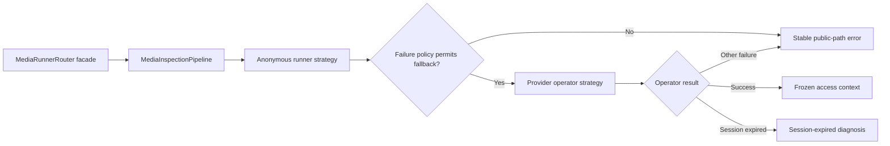

# 026 媒体解析策略责任链与浏览器会话桥接设计

- 状态：Implemented；外部 Provider 真实可用性由 canary 持续判定
- 日期：2026-08-17
- 关联设计：`005-多平台Provider策略设计.md`、`archive/024-Docker浏览器会话桥接设计.md`

## 1. 问题与目标

解析入口原先在 `MediaRunnerRouter.inspect` 中直接嵌套匿名与 Operator
异常处理。它能够工作，但路由顺序、允许降级的错误和最终错误优先级耦合在
同一个方法中；YouTube 登录 Cookie 被浏览器轮换后，Runner 又会把带 Cookie
的 bot challenge 误报为出口验证失败，导致用户只能看到“稍后重试”。

本设计完成六个目标：

1. 用可测试的策略责任链统一匿名与 Provider Operator 解析路径。
2. 以错误策略对象约束降级范围，并优先暴露已配置会话过期。
3. 本地可信环境直接复用当前 Chrome 登录态，持续生成 Runner 可读取的最小
   Provider Cookie 快照；生产环境继续使用私密窗口导出的不可变版本。
4. 私有封面通过认证 HTTP client 获取并在内存中显示，不让原生图片请求绕过
   Access/Refresh Cookie 恢复。
5. 下载规格漂移时用 Strategy Policy 自动选择当前兼容的最接近规格，避免要求
   用户重新手工选格式，同时让新任务记录真实新规格。
6. 为 Registry 中每个平台维护固定 metadata/media 诊断样本，并把真实结果写入
   canary 表；没有当前证据时不再显示静态“已验证”日期。

## 2. 解析管线模式

采用的模式和边界如下：

- **Strategy**：每个隔离 Runner client 是一个可替换的解析策略。
- **Chain of Responsibility**：`MediaInspectionPipeline` 根据 Provider 生成有界
  的 `anonymous → operator` 尝试链，不穷举账号、client 或代理。
- **Policy Object**：`InspectionFailurePolicy` 独立决定是否继续和选择哪个稳定
  错误；鉴权、链接临时不可用、临时故障和平台验证错误才允许进入 Operator。
- **Facade**：`MediaRunnerRouter` 只协调解析管线、下载上下文路由和活跃任务，
  不再内嵌 Provider 错误分支。

限流、地域、DRM、内容权益、格式不支持等错误不会消耗 Operator 会话。若
Operator Cookie 已过期，管线返回会话过期，而不是保留匿名 bot challenge；
其他 Operator 基础设施故障仍保留匿名路径的原始诊断。

## 3. 当前 Chrome 登录态桥接

Docker 不能安全解密宿主机 Chrome Profile，因此桥接进程只在本地可信 macOS
宿主机运行：

1. `provider-cookie-bridge.sh {youtube|tiktok|douyin|xiaohongshu|reddit}` 由当前用户的 `launchd` 会话监督；
   YouTube 旧脚本只是兼容包装。
2. 每 15 秒使用 yt-dlp 的浏览器 Cookie loader 读取当前 Chrome 登录态。
3. 只保留目标 Provider allowlist 域、未过期且包含认证标记的 Cookie。
4. 以同目录临时文件、`0400` 权限和原子替换刷新版本化 Netscape 文件。
5. Docker Operator Runner 继续只读挂载该文件；Cookie 原文不进入 API、DB、
   RabbitMQ、日志或业务响应。
6. 单次刷新失败保留最后一个有效快照；进程状态和快照新鲜度共同组成健康检查。

桥接不会自动输入密码、处理验证码、2FA 或扩大内容权益。当前 Chrome 登出或
平台撤销会话后，系统应明确报告会话过期。

## 4. 环境策略

| 环境 | 会话来源 | 生命周期 | 用途 |
| --- | --- | --- | --- |
| 本地可信开发 | 当前 Chrome 登录态桥接 | 周期刷新、原子替换 | 避免日常浏览导致静态 Cookie 被轮换 |
| CI | 无真实账号或短期测试 Secret | 测试期 | 单元测试和授权 canary |
| 生产 | 新私密窗口 `robots.txt` 导出的专用账号版本 | 不可变、canary 后激活 | 可审计、可回滚的 Operator Runner |

生产不直接连接个人 Chrome Profile。若未来需要长期托管生产凭据，应实现
005 中定义的 Credential Broker/Vault、版本租约、撤销和 canary，而不是把
本地桥接扩展为服务器自动登录。

## 5. 验收条件

- 同一公开 YouTube 链接可由匿名失败后自动选择 YouTube Operator。
- 带 Cookie 的 bot challenge 分类为 `credential_expired`，页面给出可操作错误。
- Cookie 桥接进程真实处于 running，且快照更新时间不超过两分钟。
- 解析成功后下载仍使用 inspection 冻结的 Operator access context。
- 限流等非白名单错误不触发 Operator，失败链保持有界。
- 目标链接完成解析、选格式、下载、制品校验和 AI 分析入口验证。

## 6. 私有封面交付

封面对象继续存储在私有 MinIO，并由受保护的 inspection 路由返回。前端不能把
受保护 API URL 直接交给图片标签，因为图片导航不会经过共享 HTTP client 的
401 刷新拦截器。`media-assets` 服务先用认证 client 读取 Blob，校验 MIME 与
非空内容，再创建短生命周 object URL；`MediaCover` 最终仍用官方 Next.js
`Image` 组件解码和渲染，并用 shadcn `AspectRatio` 维持布局。组件卸载或来源
改变时立即 revoke object URL。

站点 CSP 只为 `img-src` 增加 `blob:`，不扩大 script、connect 或 frame 来源。
加载中与真正失败是两个不同状态，只有认证读取或浏览器解码失败才显示“封面不可用”。

### 6.1 前端组件边界

- 业务组件只组合 `components/ui` 中的 shadcn/ui 组件；原生表单控件和
  Radix primitive 只能出现在该目录内。
- 图片使用官方 Next.js `Image`；受保护资源适配是数据层责任，不重新实现
  图片组件。
- Dialog、Sheet、Popover、Select、RadioGroup、Progress、Alert 与 Input
  优先使用已安装的 shadcn 实现，由 Radix 提供焦点、键盘和无障碍语义。
- `component-boundaries.test.ts` 扫描业务 TSX，阻止新增原生交互控件或越层
  导入 Radix。

## 7. 下载规格恢复 Strategy

平台可能在两次请求间轮换 CDN rendition。`RetryFormatRecoveryPolicy` 先寻找完全
一致的语义格式；找不到时，只在以下边界内选择最接近的当前格式：

- 容器家族、帧率桶、动态范围、音频编码和显式音轨语言一致；
- 画幅差不超过 3%；MP4 仅 H264/HEVC 互换，WebM 仅 VP9/AV1 互换；
- 优先保持原视频编码，再按像素面积对数距离排序；
- SOURCE 容器不跨视频编码；
- 只用于用户对终态任务发起重试，新任务保存新的 semantic plan，不改写历史任务。

固定媒体 canary 对相邻请求发生的 `format_unavailable` 最多执行三次“重新检查 →
选择当前最低规格 → 下载”，其他鉴权、DRM、限流和提取失败不重试、不换账号。

## 8. 固定诊断矩阵与状态真实性

`fixed_public_cases.json` 为 22 个注册 Provider 各保存一条 versioned metadata 和
media 诊断样本；单元测试要求它和 Registry 精确双向覆盖。诊断命令只输出
Provider、Profile、阶段、结果、稳定错误码和耗时，不输出 URL 或 Cookie。

固定公开矩阵用于定位上游回归，不替代生产环境 Secret 配置的项目自有/授权
canary，也不能单凭一次成功把平台恢复为 verified。状态仍要求 metadata、media、
完整视频 Analysis 证据和恢复迟滞；没有当前 canary 行的静态 verified 基线显示为
unknown。状态 API 分别公开最近真实媒体下载时间和最近完整 Analysis 验证时间，
页面不会再把已有媒体证据误显示为“暂无验证”。Compose readiness 同时检查配置
声明的每个 Runner，但平台 canary 失败只降级对应平台，不让整个 API 不可用。

2026-08-18 的本地固定矩阵结果为 metadata 22/22、media 22/22。小红书当前网页
契约要求官方分享/Feed URL 携带 `xsec_token`；缺失 token 的旧裸 URL 返回空
`noteDetailMap`，应归类为 extractor regression，而不是要求用户手工输入 Cookie。
Tumblr 公开页由项目插件直接读取当前 `www` 页的 OG 视频与封面，避免上游旧 blog
子域改写触发 429。
