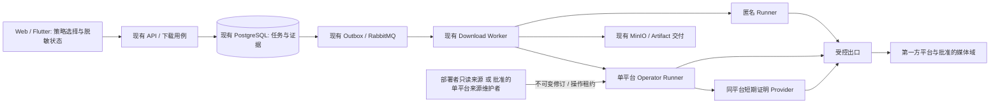

# 035 平台访问策略、会话生命周期与跨机器恢复设计

- 状态：Draft / 待评审；设计完成不等于平台可行性已验证，禁止据此开始产品实现。
- 日期：2026-09-12。
- 授权范围：完整设计、静态可行性分析与验证计划；本次不改代码、数据库、依赖、环境、会话或运行拓扑。
- 文档链：[研究](../research/020-平台会话生命周期与跨机器恢复调研.md) → 本设计 → [PRD](../prd/035-平台访问与会话恢复能力需求.md) → [Plan](../plans/035-平台访问与会话恢复能力计划.md) → [Acceptance](../acceptance/035-平台访问与会话恢复能力验收.md)。
- 基线：[005](005-多平台Provider策略设计.md)、[030](030-运行故障隔离与恢复设计.md)、[031](031-Linux无人值守运行设计.md)、[032](032-腾讯视频与优酷个人下载设计.md)。本文是待批准的增量提案，不覆盖这些文档的当前实现事实。

## 1. 决策摘要

目标不是让所有平台每次启动都重新登录，也不是要求用户维护一套新身份池。目标是：在已声明、已验证的内容范围内，运行所需状态有明确所有者；临时状态可重建；有效授权可恢复；不能自动恢复时给出准确动作。

选定方向：保留现有 Registry、yt-dlp 插件、匿名/独立 Operator Runner、任务租约、Outbox、下载前重解析和制品校验。补齐以下三个契约，平台实现通过可行性门禁后才进入代码：

1. **访问计划**：任务开始前根据平台策略选择唯一访问方式，公开内容不因存在账号配置而自动依赖账号。
2. **会话来源生命周期**：只读文件作为稳定基础来源；确有必要且可安全实现的平台，使用单平台来源维护者发布不可变会话修订。Runner 不写回 Secret。
3. **运行证据与恢复规则**：区分引擎、来源、出口、内容和任务故障；重启恢复不篡改授权上下文或历史任务。

不选：换用一个万能下载器、统一浏览器常驻集群、账号池/代理轮换、全局可写 Cookie、每次启动在线升级引擎、复制整个宿主浏览器 Profile。Tailscale 只承担客户端访问本部署，不被设计成修复上游平台访问限制的手段。

## 2. 事实、假设与成功定义

### 2.1 已核实事实

| 事实 | 对设计的约束 |
| --- | --- |
| 生产配置曾引用九个未运行的 Operator，DNS 不可达 | 属于部署故障，不能用会话刷新修复；也不能抹掉这项证据 |
| 文件来源逐操作只读，临时 jar 在结束时删除 | 能恢复凭据输入，但不提供跨操作的自动会话更新 |
| `ProviderAccessContextRef` 已包含版本、来源修订、客户端、出口和引擎身份 | 保留严格相等判断，不另建宽松的身份兼容层 |
| 下载阶段已有重新 inspect、来源身份/语义规格核验 | 不重做下载器，不持久化 CDN 地址作为恢复依据 |
| 当前 yt-dlp pin 是 2026.08.19，包含调研中 MeTube 403 案例的修复 | 那条 issue 不是当前故障的直接诊断 |
| 定时目标曾为空；最近媒体证据有 26 小时窗口 | “没有新证据”不是“刚实测失败” |

会话更新丢失、真实请求上下文漂移、某个平台引擎回归均是**待对照实验的假设**。当前没有足够证据把其中任一项认定为所有平台的共同根因。

### 2.2 用户承诺分层

- 新装：仅安装项目和必要基础设施，已验证的无账号公开能力可运行；不能自动获得个人账号授权。
- 同机重启/容器重建：持久输入未变时，不需改代码或重新准备仍有效的授权；可丢弃缓存重新建立。
- 换机：同一批准版本、恢复必要私有状态后，在验收过的系统/架构上运行；新出口或平台设备验证可能需要重新授权。
- 内容边界：支持清单必须到 `platform × capability × access policy × runtime profile`，不能把注册域名或一个样本成功写成“平台所有视频支持”。

目标运行环境为个人单部署、单活动来源维护者、每平台最多一个受控账号。首轮验证选 Linux amd64 与 macOS Apple Silicon/Docker；Linux arm64、Windows/Docker 必须分别有结果后才能标已验证。Web/Flutter 是客户端，手机不持有服务端平台 Secret。

## 3. 范围与不可改变的边界

- 普通媒体仍限用户有权处理的公开、免费、非 DRM 内容；受限内容按 024/029 官方授权 Connector 规则，只有腾讯/优酷保留 032 已批准的个人非 DRM 范围。
- 访客 Cookie 不等于账号登录；仅含白名单访客字段的来源也不能把未知权益当作公开。
- 匿名 Runner 不接收持久 Provider Secret；受控 Runner 只看一个平台的只读来源/操作租约，不持有 DB/MQ/MinIO/AI 凭据。
- 不扩大 Edge Agent 职责，不读取浏览器流量、保护材料，不自动化验证码/2FA、设备注册或自造平台签名。
- 不增加数据库、Vault 产品、工作流引擎、`deploy/` 或平行应用入口。候选来源维护者属于现有 `backend/app/runner/` 的受限业务进程，是否新增单平台 sidecar 由可行性门禁决定，不作为所有平台必装组件。
- 本期不开放多用户凭据上传、扫码登录中心或普通业务 JSON Cookie；用户 Credential/Vault 仍属于 005 未实现的独立范围。

## 4. 访问计划：选择发生在失败之前

### 4.1 静态契约

在现有 `ProviderProfile` 中定义可审计的访问策略目录，不由请求传入引擎参数：

| `access_policy_id` 语义 | 内部 access mode | 会话类型 | 权益规则 |
| --- | --- | --- | --- |
| `public` | `anonymous` | 无持久来源；操作内普通临时 Cookie 可由站点产生 | 公开、免费、clear，无法证明则拒绝 |
| `public_session` | `operator_managed` | 仅允许已审计的访客来源，无账号字段 | 与 public 相同，不扩大内容范围 |
| `operator_public` | `operator_managed` | 部署者单平台会话 | 005 公开内容权益防火墙 |
| `personal_entitled` | `operator_managed` | 032 腾讯/优酷个人会话 | 保留其原有完整时长、非 DRM、非购买/private 限制 |

不新增第三种 Runner 大类或第三套任务模型。`public_session` 是访问策略，不把访客 Cookie 塞进匿名 Runner；Profile 的不同策略必须使用不同 `profile_version`/`client_profile_id`，让现有 context 和探针能区分。

部署为每平台设置一个 `default_access_policy_id` 和允许的策略集合。旧路由映射仍负责定位端点，不再承担“配置了 Operator 就默认优先”的产品语义。缺少策略所需端点必须报配置错误，不能尝试另一种方式。策略与 Compose profile 的一致性校验是配套约束，不是平台可用性证明。

首期同平台只允许 `public + 一种受控策略` 同时配置；不并存访客/运维/个人三套身份，不扩展成账号池。受控 Runner 启动时绑定一个策略与来源种类，不能由单次 RPC 改变。Registry 仍只有一个 hostname/key 归属，策略选择后构造对应不可变执行 Profile 变体，不登记互相冲突的 hostname；匿名/受控 context 的版本必须不同。切换受控种类属于部署变更，排空后替换，不是请求失败回退。

### 4.2 一次操作的选择

1. 校验 URL；由 Registry 规范化并确定平台。文章发现仍先返回候选，由用户选择，不把 discovery 当 download。
2. 普通用户未选择方式时使用部署已批准的默认策略；默认只在 public 实测可行的平台设为 public。
3. 显式选择仅能引用服务端返回的、当前用户可用的策略 ID；不能提交 Runner URL、账号 ID、Cookie 或任意客户端参数。
4. 解析出权益信息后执行相应防火墙；选择 operator 不代表允许受限内容。
5. 冻结 context、媒体身份、语义计划，再允许创建任务。

public 返回“需要会话”时，页面可以展示另一条**已批准**路径，但用户确认后产生新的 inspection。DRM、private、地域、购买限制、未知权益或验证码挑战不触发访问方式升级。操作开始后不切换账号、访问模式、出口或 engine。

## 5. 所有权与部署边界



| 所有者 | 唯一职责和持久状态 | 禁止事项 |
| --- | --- | --- |
| Profile/部署配置 | 允许路径、引擎组合、来源引用、出口绑定 | 从 UI 动态装插件、按失败轮换账号 |
| 会话来源 | 私有会话材料、修订、撤销 epoch | 凭据进入普通任务 DB、日志或消息 |
| Runner | 操作副本、临时 URL、流与制品校验 | 反向写宿主文件/浏览器；改任务状态 |
| PostgreSQL/Worker | 原始任务事实、租约、attempt、retry_at、证据 | 保存 Cookie/PO Token；因探针失败篡改任务结果 |
| Canary/状态服务 | 近期结果与发布基线的投影 | 用 healthy、过期证据或合成测试宣告平台成功 |

来源维护者不是共享凭据 Broker：一个实例只管理一个 Provider、一个来源；不得拥有业务数据库等密钥，也不得同时提供全平台会话。

## 6. 会话来源与生命周期

### 6.1 三种来源的明确取舍

| 来源 | 决策 | 重启与更新 |
| --- | --- | --- |
| `manual_file` | 默认基线，复用 031 | 只读持久文件；部署者重新授权后原子替换 |
| `managed_visitor` | 候选，逐平台 G3 通过后启用 | 仅经已审计的正常第一方公开流程建立/维护访客状态；没有合规路径就不实现 |
| `managed_account` | 接口有定义，默认禁用 | 必须证明平台允许的更新方法、同账号核验与撤销语义；不能从“存在 Set-Cookie”推导自动续期可行 |

macOS 既有来源可继续按原边界使用，但不能作为跨机器验收依据。视频号的元宝动态来源单独列为未解决，不移植为通用 Cookie 模式。

### 6.2 私有来源记录（候选维护者内部，不是 API DTO）

最小记录为：`provider_key、source_id、source_kind、subject_epoch、revision_id、client_profile_id、egress_binding_id、state、expires_at?、validated_at、revision_sequence`，以及加密 payload。真实账号标识、visitor data、请求头和 Cookie 只能留在受保护 payload 内。

- `source_id`：部署内稳定不透明引用，不从宿主目录生成。
- `subject_epoch`：导入新账号、撤销、无法证明同主体时更换；不能仅靠 Cookie 名推断同账号。
- `revision_id`：内容/绑定变化即更新的不透明修订；不暴露未加密凭据哈希。
- `expires_at=null`：未知，不代表永不过期。公开状态不能把字段存在当作上游授权成功。
- `egress_binding_id`：受管出口引用加部署者控制的 generation；仅代理 URL 一致不足以证明公网出口未变。换网络必须失效相关验证，禁止依赖第三方公网 IP 探测服务自动放行。

基线 manual_file 继续沿用现有 HMAC 修订算法。维护者候选采用一份原子替换的认证加密 envelope 保存 payload 与元数据，密钥来自单独只读 Secret、不与数据同包备份；数据目录只由来源进程写。文件上限 1 MiB、目录 0700、文件 0600，拒绝链接与跨域来源。使用审查过的 AEAD 库，不自造加密算法。

### 6.3 状态机

```text
unconfigured -> validating -> ready
ready -> renewing -> ready(new revision)
ready/validating/renewing -> action_required | revoked
任意非 revoked 状态 --来源/网络暂时不可用--> unavailable
unavailable --依赖恢复且验证通过--> ready
revoked --显式重新登记--> validating(new subject_epoch)
```

`renewing` 不等于平台失效；`unavailable` 不注销账号；`action_required` 不自动循环登录。未知/首次来源只能在格式校验后做低成本验证，实际可下载仍以 media 结果决定。

### 6.4 来源端口与并发（拟议内部契约）

- `probe(provider)`：仅验证进程、权限和协议，无 Cookie 读取、无上游请求。
- `describe(provider)`：返回来源修订与脱敏状态，不返回材料。
- `acquire(expected_revision, operation_id, deadline, ephemeral_public_key)`：精确领取该修订的操作副本，复用现有一次性认证加密交付机制；不提供“版本不匹配时返回最新”。
- `heartbeat(lease_id, fence)` / `release(lease_id, fence)`：仅租约持有者可用，释放幂等；过期、撤销或来源实例重启后旧 fence 无效，heartbeat 不能延长到操作硬截止时间之外。
- `renew(expected_revision)`：仅来源维护者的内部维护动作，不接受业务 URL，不开放给普通用户或下载 Worker。
- `revoke(expected_epoch)`：部署者本地管理动作，拒绝新租约并终止旧 epoch 操作；目标 60 秒内完成。

首期一个来源只有一个活动操作/维护租约，维护者以操作系统锁保证单写者。实例加副本前必须另行设计分布式租约；本设计不承诺 HA。过期由 deadline 限制，操作持续有 heartbeat；暂停/崩溃不允许旧持有者在租约过期后发布修订。

来源协议仅在单平台私有网络/队列内可达：每次领取绑定 Provider、来源实例 epoch、操作 ID、期望修订、截止时间与临时公钥，并有认证和重放拒绝；仅 possession of public key 不构成授权。来源进程重启不恢复旧内存租约，Runner 失去续租确认则在现有有界取消机制内停止并清理。`probe` 不读材料，`describe` 不触发上游；对 API 仅暴露脱敏元数据，普通 Runner RPC 与业务消息继续不承载 Secret。

### 6.5 发布更新与崩溃恢复

1. 获取独占维护锁，等待当前操作排空；超时则保持旧版本，不中途替换活动操作材料。
2. 通过平台明确支持的更新流程取得候选，核验平台域、账号连续性、客户端/出口绑定及内容权益边界。
3. 原子校验 `expected_revision`，在同目录写完整新 envelope、fsync、rename 并同步目录；没有完整提交即继续读旧版本。
4. 新租约只能领取新修订。历史 inspection/context 保持原值；旧修订不得因账号看起来相同而被放行。
5. 成功后清理旧材料；撤销信息与单调 sequence 随来源持久化。恢复旧备份可能恢复被本地撤销但上游仍有效的凭据，因此仅一次上游验证不足以判 ready。恢复必须核对停写旧部署的最新来源清单/撤销 epoch；无法证明备份新鲜度时进入 action_required，显式重新授权/登记新 epoch 后才可领取，不自动回放旧 Secret。

**不接受普通 Runner 任务回传 Cookie 更新作为发布依据。** 这避免被不可信内容诱导写坏来源，也消除“inspect 刚返回、其上下文立即被它自己更新失效”的循环。自动账户维护如无法独立完成，继续 manual_file；不降低安全边界换取无人值守。

## 7. 冻结上下文与任务恢复

保留现有八字段 `ProviderAccessContextRef` 及其严格比较，暂不引入 v2 JSON 或旧版本兼容解析器。`access_policy_id` 映射到独立 Profile/client；受控来源修订仍通过 `credential_version_id` 不透明引用。访客来源也属于受控 mode，不伪装 anonymous。

- 临时 PO Token/播放器缓存可在同一来源、客户端、出口绑定下重建；Provider 软件版本变化仍使 context 变化。
- 文件/来源修订、账号 epoch、Profile、实际出口 generation 或引擎改变：旧 context 不自动改写。
- 更新后新 inspection 使用新 context；原任务返回现有稳定会话/上下文错误。用户“重新解析”生成新 inspection、重新确认真实规格并创建新任务；普通“重试”仍使用原上下文，不能暗中获得新身份。
- 引擎发布尽量先排空旧任务；无法排空时新版本应拒绝旧 context，不同时维护两个引擎兼容分支。
- 任务状态复用 `queued/running/retry_wait/succeeded/failed/cancelled`；不新增另一套会话等待任务状态机。需要用户动作的结果终态失败但提供可操作原因，来源状态单独展示。
- 进程重启由现有 lease/heartbeat/Outbox 回收重投；已完成 Artifact 不重新向平台下载。迁移 active 任务首期要求先排空，否则按现有恢复预算从新工作区重下，不承诺跨机器字节续传。
- partial/试看/单轨缺失/下载未完成不得生成成功 Artifact；现有时间、音视频与容量校验不变。

## 8. 出口、临时链接与错误预算

解析、下载前复核、音视频流、POT 与必要媒体探测使用相同已批准绑定，必要的 UA/Referer/Cookie 在各自白名单域内传递，不把所有头复制到 CDN。已有 `--load-info-json` 与语义计划继续复用，不保存过期 CDN URL 到业务数据库。

| 失败类别 | 下一步 | 不允许 |
| --- | --- | --- |
| Runner/DNS/来源进程缺失 | 精确配置/依赖故障 | 标为平台风控或自动换模式 |
| 有效 Cookie 被拒绝、身份不明 | action_required；来源独立验证 | 盲目续期、连续更换账号 |
| 429 | Retry-After + 持久 cooldown | 重启清零或层层立即重试 |
| 出口挑战、验证码、地域限制 | 停止自动调用并呈现边界 | 代理轮换、换 client 规避 |
| POT 服务不可用 | 单平台降级；恢复后有限重试 | 要求用户反复导出账号 Cookie |
| 明确 token 过期 | 在同 binding 下最多一次重建 | 无限刷新、跨身份复用 |
| 媒体 URL 过期 | 同 context 最多一次重新解析 | 静默换清晰度/重用旧 URL |
| 内容删除/private/DRM/未知权益 | 内容级终止 | 拉低整个账号或平台健康评分 |
| extractor 回归 | 候选版本对照，发布修复 | 自动启用未经审核的第三方解析服务 |

预算提案：不提高当前每 job 的 `max_download_attempts=3`；Runner 内全命令重试默认 0；同一 job 的所有 attempt 共享一次 token/URL repair 预算；fragment 重试必须单独有 Profile 上限，不无限放大。语义修复、重投计数和 cooldown 必须持久化，不能仅存在进程内。

任务数据增量仅为：在现有 `download_jobs` 增加 `repair_count`（0..1），修复前由 Worker 用行锁/CAS 领取预算，崩溃不退还；Runner 只接收此次允许的修复额度，不能自行重置。既有人工 RetryDownload 本来就创建新 job，本设计保留其新任务预算，不建立跨任务身份链。新任务仍受账户/全局配额和路径 cooldown 约束，不能用人工重试或重新解析解除平台冷却。现有任务删除会物理删除 job，因此不让冷却依赖某个任务行；删除不能删除路径冷却状态。已有任务在受控 schema 更新时初始化 repair_count=0，不增加历史迁移框架，不改旧任务语义快照。

另增单一非 Secret 当前态 `provider_route_cooldowns`：唯一键为部署内稳定 `provider_key + access_policy_id + egress_binding_id`，保存 `blocked_until、reason_code、probe_lease_until、version`。Cookie 修订或 engine 改变不清除 cooldown；更新以 max(blocked_until) 和 CAS 合并，半开探针只允许一个 lease。API/Worker/Canary 都经同一应用端口执行 admission，Runner 不连接 DB。新任务/人工重试不能绕过此门；状态读取不领取探针。具体字段约束和空库/已有库测试在 I3 前审核，不在本轮执行 SQL。

429 没有有效 Retry-After 时初始冷却建议 5 分钟；半开一次低成本探针，成功后逐步恢复，不启动全矩阵洪峰。该数值是待实验的初始预算，不是上游保证。凭据撤销、未知权限没有自动重试预算。

## 9. API、Web 与手机契约（提案，未存在的新字段必须生成）

当前 inspection 请求是带 discriminator 的 `source`，不是旧文档中的裸 `{url}`。保留 `public_url/discovered_item` 联合类型；拟新增可选 `access_policy_id`，未指定时用部署默认，参与幂等 request fingerprint。API 验证策略授权，未知/不可用策略不调用 Runner。

- `GET /api/providers`：保留现有字段，拟增加允许的策略摘要和 `evidence_state=fresh/stale/missing`；`download_supported` 仍表达发布能力，`download_available` 只表达近期证据。
- `InspectionResponse`：拟增加实际 `access_policy_id`，不返回内部 credential/context 原文。
- 管理侧新增只读运行视图 `GET /api/admin/provider-runtime`，拟 operationId `getAdminProviderRuntime`；不与现有平台名称/排序目录 CRUD 混用。管理员鉴权由现有角色系统执行，普通用户 403；返回配置缺项、来源状态、引擎标识、最近证据和动作，不返回真实账号/IP/路径/密钥。来源状态最多缓存 30 秒，过期/不可达展示 unknown，不沿用 ready；读取来源单请求预算 2 秒，不能拖住整个 Provider 列表。
- 状态视图只读当前聚合，不在 GET 中触发登录、续期或真实下载。
- 本期没有 Web Cookie 上传或任意 refresh URL。部署者使用单平台本地来源管理入口处理文件、验证、撤销；这是来源维护工具，不是新的业务启动入口。
- 复用现有稳定错误码和 user_action，只有确无对应语义时才新增错误；错误码清单在实现前由 schema/契约测试锁定，不能靠中文文案分支。
- 创建资源仍返回 201 + Location，接口必须唯一 operationId；更新 OpenAPI、Web 生成客户端和 video-app 生成客户端一次性交付，不手写平行 DTO。

Web/Flutter 交互：默认路径可用时直接粘贴解析；需要会话时解释当前路径，允许选择已批准替代路径并重新解析；依赖缺失提示部署者处理，普通用户不见 Cookie 操作；证据过期显示“尚未重新验证”而非“不可下载”；来源变化后的任务显示“需重新解析”，不得伪装成无限重试按钮。初始/加载/空/失败/撤销/冷却/恢复均有明确文本和键盘操作，保持既有视觉规范与 390px 布局。客户端只从本部署取 Artifact，不直接使用平台 CDN 凭据。

## 10. 重启、新机与版本发布

| 状态 | 是否迁移 | 恢复规则 |
| --- | --- | --- |
| 配置、来源引用、批准镜像/依赖版本 | 是 | 验证版本与策略；不从 example 覆盖旧配置 |
| 会话 envelope/只读文件、来源密钥 | 私有迁移，密钥分离 | 恢复权限；新机先 validating；不在 Git/普通备份日志输出 |
| PostgreSQL 与 MinIO | 按用户保留业务需要迁移 | 一致性备份；先排空写入；恢复后验证旧 Artifact 可取 |
| 撤销 epoch/cooldown | 是 | 不因重启或换机重新放行；无法证明来源备份新鲜度时必须重新授权/登记，不能仅靠上游验证放行 |
| 操作 jar、PO Token、播放器缓存、CDN URL | 否 | 当前 binding 下按需重建；不把它们当长期凭据 |
| partial 下载工作区 | 首期不做跨机续传承诺 | 排空；异常中止按现有任务恢复与清理流程处理 |

迁移分两次验证：先同镜像、同受管出口验证机器差异，再单独测试新出口。旧电脑必须停止消费/发放来源租约，不能两个部署拿同一业务状态并发写。新电脑的 Tailscale 名称、API/MinIO HTTPS 地址和代理直连规则重新核验；App 需指向新服务，现有包若固定旧地址需重新构建安装，不宣称自动发现已实现。

引擎组合记录 yt-dlp commit、EJS、JS runtime、插件、POT 服务、FFmpeg 与镜像 digest。候选只在隔离运行中取同样本对照，过门禁后一次发布统一镜像；不启动时在线更新、不通过远程下载任意代码修复。回滚退回已验收镜像与配置，不回滚已撤销来源；旧 context 要重新解析，不能为回滚放宽比较。

## 11. 平台适用性与可行性裁决

24 个目录项的策略分组和未验证项见 Acceptance；以下是实现门禁而非可用承诺：

| 能力 | 静态判断 | 进入实现的条件 |
| --- | --- | --- |
| 公开路径选择、确定性失败、现有链路恢复 | 结构上可行 | G0 设计通过 + G1 应用/引擎对照确认价值 |
| manual_file 同机/换机恢复 | 已有基础实现，端到端未验收 | G2 新机与重启真实制品；不能用文件读取测试代替 |
| 临时证明/缓存重建 | 有现成 Provider 可复用 | 同 binding 冷启动 + 软件组合兼容验证 |
| managed_visitor | 条件可行、未证明 | G3 平台正常流程、来源限制、无账号字段、恢复实验全部通过 |
| managed_account 自动维护 | 未证明，默认 No-Go | 明确刷新协议、同主体核验、撤销和 crash-safe 发布；缺任一项继续人工重新授权 |
| 腾讯完整下载/腾讯与优酷 VIP | 未完成 | 032 的真实账号/完整非 DRM 媒体验收独立通过 |
| 无桌面视频号动态来源 | 当前 No-Go | 独立来源可行性与既有保护边界验证，不能通过本设计自动放开 |
| 所有平台全部内容永久可下载 | 不可承诺 | 不作为项目验收条件 |

## 12. 实施授权与兼容性决策

035 不取代 031 的静态文件输入，也不因引用 005 Phase 2 就授权建设全局凭据平台。若 G3 证明必须引入来源维护进程，需在实施评审明确批准“由来源单独持久维护、Runner 仍只读”的增量，并同步 005/031/SECURITY/AGENTS 当前事实；本轮不修改这些规则。

所有验证门默认未通过。G0 为设计完整性；G1–G3 是授权后隔离可行性实验；G4 是用户对明确平台范围的实现批准；G5 才是完整发布验收。允许逐平台 Go/No-Go，但不得把部分 Go 改写为“所有支持平台已经可迁移”。具体实验、证据模板与停机/敏感数据前置条件见 Plan/Acceptance。

## 13. 备选方案与否决条件

| 方案 | 取舍 |
| --- | --- |
| 只完善启动检查和备份 | 保留为基础，但无法处理平台协议/会话生命周期，不足以单独满足目标 |
| 只升级或替换 yt-dlp | G1/E02 证明收益时采用；不是会话、出口或交付故障的统一答案 |
| 单平台来源维护 + 不可变操作租约 | 条件选择；只有 G3 证明必要、可行、安全时启用 |
| Runner 直接写回 Cookie | 否决；失去来源所有权和原子主体更新控制，会造成旧 context 混用风险 |
| DTK 式全局身份池、浏览器签名/多出口调度 | 否决；超出个人部署需求及当前安全边界 |
| 凭据入业务 DB、用户 Cookie 上传、全局 Vault | 本期否决；需要 005 Phase 2 的独立需求和授权，不为本问题顺带建设 |

如果 E01–E05 表明静态来源与当前引擎已能跨机稳定交付，035 可以只实现被证明必要的路由/状态缺口，并放弃来源维护进程。完整设计不意味着所有可选模块都必须实施。

## 14. 代码质量与复杂度门禁

关联 [代码质量登记](../code-quality.md)。进入实现前提交现有组件的保留/修改/删除/不引入清单；每个新增抽象、持久字段和进程必须有需求、失败案例及验收依据。优先复用已有规则与状态所有者，不把等价去重和业务语义变化混为一个重构。重复、不合理行为和测试失效均需登记；受影响模块的问题在批准切片中修复或明确裁决延期，不借 035 顺带重写全仓。来源维护者是否有必要按 CQ-009 和 G1–G4 裁决，不能先做占位实现。
