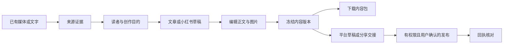

# 内容创作与平台发布设计

- 日期：2026-09-15；状态：证据回看、报告导出与完成态错误提示已修复；新增创作/发布领域仍待实施。
- 依据：根 AGENTS.md；继承 028、035 的已有设计边界。历史需求与调研通过 Git 追溯。
- 目标：把已取得的素材转成可编辑、可导出、可投递、可追溯的内容作品，避免重复生成、重复登录和重复发帖。

## 1. 产品主流程



用户入口是“制作文章”“制作小红书图文”，而非要求用户理解 Skill、MCP、Provider 或多阶段任务。默认读取已有标题和用户最近使用的创作偏好，但不能自动沿用发布账号及授权。

下载、分析、创作、发布为不同业务结果。下载成功后创作可以失败；发布失效不应使内容不可编辑/导出。平台状态异常只影响对应渠道。

## 2. 复用与新增边界

| 现有能力 | 本次使用方式 | 有必要新增的业务 |
| --- | --- | --- |
| 下载/上传 Artifact、owner/哈希校验 | 以 Artifact ID 引用，Worker 按需物化 | 创作资产引用和在用保护 |
| 不可变分析结果/报告版本 | 固定版本作为证据或首次草稿来源 | 可编辑作品及独立的内容修订 |
| Skill registry、指令快照和严格结果 schema | 复用校验/快照规则 | 创作输入/输出契约、已审查 Skill 来源清单 |
| PostgreSQL、Outbox、消费租约/心跳 | 复用事务提交、投递和恢复机制 | 创作执行和平台投递各自的业务状态 |
| Web 认证、配额、MinIO、OpenAPI | 复用服务入口、授权和资源核算 | 编辑器、内容预览、发布账号/回执视图 |

不把新输入强塞进 `screenplay`，不把平台发布接到 `workers/report/publisher.py`，也不为每个 Skill 建一套队列/任务框架。

## 3. 来源与证据模型

作品引用不可变 `source_snapshot`，包含输入类型、来源 Artifact/report version ID、内容哈希、取得时间、语言、来源署名及用户给出的使用说明。正文引用 `evidence_id`，证据类型分为：

- `visual`：视频时间区间和已验证画面观察；不能被转换成对白证据。
- `transcript`：字幕/转录时间区间、文本、转录引擎和版本、人工修订版本；明确标记机器生成。未经验证不识别人名或说话人身份。
- `document`：文档段落/页码范围；仅当源格式有页码时提供页码。
- `web`：原始 URL、最终 URL、标题、取得时间、必要引用片段及快照哈希；不把整篇外部文章复制进所有作品。
- `user_note`：用户提供的背景或主张，与已核实外部事实区分。

引用存在/时间合法由代码校验；来源是否真能支持论断由生成质量检查和人工复核验收。用户可以写个人观点，但新事实不能伪装成视频原话。修改正文使对应证据失配时标记待复核。

M1 使用已有视觉报告和用户文字；M2 增加字幕导入/校对与可选 ASR。ASR 失效时保留视觉和手工输入，明确未使用音频，不生成虚构转录。音频只从 owner-scoped 已验证 clear 媒体提取，处理有时长、字节、CPU/内存与并发预算；模型权重预取并校验，不在每次请求下载。

## 4. 内容作品、版本与编辑

拟新增以下模型，按交付阶段才写入当前态 `schema.sql`，不提前创建空表：

| 实体 | 必需字段/约束 |
| --- | --- |
| `content_drafts` | owner、标题、创作 brief、来源快照、正文 JSON、平台变体、revision、更新时间、删除状态；更新必须匹配当前 revision |
| `content_revisions` | draft、单调版本、冻结正文/brief/证据/图片顺序、schema version、内容 hash、Skill/模型/模板快照；唯一 `(draft_id, revision)`，不可变 |
| `content_assets` | draft/owner、Artifact、类型、像素/媒体格式、排序、来源与生成操作、ready/failed 状态；只能引用已验证资产 |
| `content_operations` | 生成/局部改写/配图/导出操作、输入 revision、幂等 key、执行状态、lease、错误、预算预留；遵循现有 Worker 模式 |
| `publication_connections` | owner、platform、稳定外部 account ID、展示名、用途、scope、凭据引用/修订、状态、last_checked、失效原因；无明文凭据响应 |
| `publication_operations` | owner、冻结 content revision、connection ID/修订、平台规则版本、action、payload hash、确认记录、状态、远端 ID、next_check_at；请求 key 唯一 |
| `publication_attempts` | operation、尝试号、提交前标记、adapter version、开始/完成、远端 ID、脱敏错误、核对结果；不保存平台 Cookie、完整敏感 HTTP 响应 |

正文以受限 JSON 文档为编辑事实来源，允许标题、段落、列表、引用、链接、图片及稳定节点 ID/证据引用；服务端严格校验。Tiptap 若通过预检，仅启用该子集并直接持久化受约束的文档 JSON。禁止将任意插件节点/HTML 当可信正文。平台 HTML、Markdown、DOCX、卡片图片均为派生制品；不维护三份独立可编辑正文。

自动保存使用乐观并发：客户端携带 revision；旧 revision 返回 409 并保留本地编辑，用户可比较、复制或重载，不能静默覆盖。首次实现不做多人实时协作。AI 局部改写生成候选差异，用户应用后才变成新 revision；运行期间用户已修改的节点不得被旧结果覆盖。

现有规范报告 MD/Web/DOCX 仍保持同源；创作作品从报告导入时记录源版本，形成新的明确实体。发布正文投影可以省略内部编辑附录，但必须保留对读者必要的出处、事实限制和使用者决定的声明。

## 5. 文章与小红书内容契约

### 文章

- brief：受众、目的、平台、核心观点、语气、目标篇幅、禁用表述；少量常用字段直接显示，扩展项可展开。
- 产物：标题候选与选中标题、导读、正文、结尾、封面/文中图片、摘要、署名、必要来源引用。
- 操作：编辑、局部改写、查看证据、换图、调整图片位置、预览、导出、存平台草稿。
- 公众号 HTML 由白名单渲染器生成；链接/图片经平台适配处理，未上传成功的图片不提交草稿。先比较 doocs 渲染模块/CLI 的独立成本与最小自有模板，只保留一个生产实现。

### 小红书图文

- 产物：标题、正文、话题数组、有序卡片大纲、封面与正文页、每页核心观点/素材来源/图片说明。
- 第一版默认 5 页、3:4 版式是**本产品建议**，可删减/调整；真实标题计数、正文/图片上限和视频规格由有来源/核验日期的 platform capability profile 校验，不把上游 Skill 的数字当平台事实。
- 卡片有统一字体、色彩、版式和安全区；中文内容允许用户修改。纯文字卡片可用确定性模板输出图片；这是自有渲染路线，不冒充执行了原生生图 Skill。
- AI 插图是可选路线，单张失败可重试，保留其他已验收图片；实际像素、文件类型/大小、可读性与文字准确度必须检查。无图像 Provider 时提供上传图片/模板卡片，不显示虚假生成成功。
- 内容包至少包含正文、顺序明确的图片与 `manifest.json`，manifest 记录版本、文件清单、尺寸与 hash。内部凭据、草稿修改历史和编辑附录不导出到平台包。

## 6. Skill 接入规则

1. 建议首批方法：在现有文章 Skill 基础上增加创作 brief/证据约束；移植 `baoyu-xhs-images` 的大纲和卡片组织方法。其他插图/封面 Skill 逐一审查后纳入。
2. 运行清单固定 `upstream_url/commit/path/license`、本地指令 hash、输入/输出 schema、允许工具、模板和评测集版本。现有指令 hash 继续复用，不引入自动从网络安装 Skill。
3. 保持现有分析 loader 禁止 scripts 的限制。纯方法整理为符合本地规范的资源；新增契约必须同步服务/API/生成客户端与架构测试。含脚本部分进入 `integrations/` 的受审查适配器，不通过放宽整个目录执行权限接入。
4. 模型仅返回内容和资产生成意图。发布账号、Credential、任意 shell、浏览器 Profile、服务器路径不进入模型上下文。MCP 只作受控工具传输，具体业务权限在调用方强制执行。
5. Skill 与网页均作为不可信输入；网页中的“执行命令/发帖/上传数据”不能改变任务权限。模型输出 schema 校验失败只允许一次受预算约束的修正，其后保留旧草稿并明确失败。

## 7. 发布连接与账号生命周期

FrameFetch 登录、媒体下载来源、AI Provider 认证、平台发布账号分开建模。下载小红书公开内容不需要发布账号；某个下载 Cookie 存在也不能授权替该账号发帖。

连接状态：`unconfigured → connecting → ready`；异常分为 `expired / permission_missing / temporarily_unavailable / revoked`。页面使用带更新时间的展示快照；Worker 执行前验证稳定账号身份和所需 scope。只有确实过期/撤销才要求重新授权，文件权限和网络故障分别说明。

公众号优先应用级官方凭据/授权，Token 加密保存并做单连接刷新互斥；撤销后不再刷新。小红书个人浏览器路线使用专用账号环境，不读取日常 Chrome。按账号持久互斥，只允许一个写操作；临时运行环境只注入该连接所需的凭据。禁止多用户共享一个 Cookie 文件。

迁移边界：

- 换客户端连接同一服务：恢复应用登录即可读取草稿/连接状态，不重新导出宿主 Cookie。
- 重启同一服务：DB、对象与密钥引用持久；恢复操作租约并核对已提交请求，不能整批重新发布。
- 换服务机器：迁移数据库、对象存储、加密密钥/Secret 管理配置、受控专用账号来源和必要出口白名单；重做解密、资产、账号身份及权限验证。浏览器会话可能绑定设备/环境，迁移被平台拒绝时要求重新授权，不承诺 Cookie 永久可迁移。

## 8. 发布操作、幂等与回执

支持的 action 为 `create_remote_draft`、`submit_publication`、`handoff`；平台能力不足时不接受该 action。创建发布意图前显示账号、内容版本、正文/图片、可见范围和动作。用户确认绑定 payload hash、连接修订、规则版本和有效期；任意一项改变均需针对新内容再次确认。

```text
queued -> preparing -> submitting -> accepted -> reconciling -> published
                               \-> remote_draft_ready
                               \-> handoff_ready -> handed_off
                               \-> outcome_unknown -> reconciling
queued/preparing -> cancelled | failed | action_required
accepted/reconciling -> rejected | outcome_unknown | published
```

这些是拟议领域状态，不改变现有 `AnalysisStage.PUBLISHING`。`handed_off` 仅说明已交给客户端/App，`remote_draft_ready` 仅说明可找回草稿；只有平台回执确认已发布才展示 published。后续下架/删除以单独远端可见状态更新，保留最初发布历史。

执行约束：

1. 同一确认请求的重复点击复用同一 operation。相同内容/账号/动作在已有未决操作时返回该操作，避免用户换 key 重发；重复发布同一版本必须明确创建新的已确认意图。
2. DB 事务写意图与 Outbox；消费者领取 lease，准备图片并记录 payload/hash，**发出外部写请求之前**持久化提交标记。
3. 收到远端 ID立即持久化。写请求超时、进程在发出后崩溃、响应丢失均进入 `outcome_unknown`；即使 lease 到期，也不能直接重试该写动作。
4. 优先用远端 ID/官方查询或可信后台记录核对。无唯一关联证据时保留待核实，由用户查看平台记录；不能凭同标题自动认领，也不能为了结束任务盲重发。外部无幂等支持时不承诺严格 exactly-once。
5. 上传前等确定未产生副作用的临时错误可以退避重试；草稿创建同样有副作用，响应丢失同样按未知结果处理。429 尊重平台指示并限制预算；权限错误暂停该连接。
6. 提交后的“取消”不能假装撤回平台帖子；显示请求已提交，继续核对。撤回/删帖是独立权限和操作，首版不自动执行。
7. 公众号先存草稿、读取核对，再在有权限的账号执行发布；受理 ID与最终 URL分别保存。回调验签、去重、防乱序；首版可先有界轮询，回调后续接入时不能产生第二套事实源。

## 9. API 与代码落点

以下是设计契约，实施时由 FastAPI 生成唯一 OpenAPI，不先提交平行 YAML/手写客户端：

| 拟议接口 | 行为 |
| --- | --- |
| `POST /api/contents` | 创建作品，201 + Location；支持已有分析版本或用户文字 |
| `GET/PATCH /api/contents/{id}` | owner-scoped 读取/更新；PATCH 必须有 revision，冲突409 |
| `POST /api/contents/{id}/operations` | 创建生成、局部改写、配图或导出操作，201 + Location；输入冻结 |
| `GET /api/content-operations/{id}` | 返回状态、错误、可用制品；不返回内部路径/密钥 |
| `POST /api/contents/{id}/revisions` | 冻结可投递版本，201 + Location |
| `GET/POST /api/publication-connections` | 读取连接/发起连接；敏感输入走独立受控授权流程 |
| `POST /api/publications` | 校验冻结版本、连接、动作和用户确认，创建/重放同一意图，201 + Location |
| `GET /api/publications/{id}` | 远端草稿、受理、核对和发布结果分别可见 |
| `POST /api/publications/{id}/reconcile` | 创建有界查询操作，不等于再次提交帖子 |

操作声明稳定 operationId/tag。输入体限制、错误码、分页、撤销连接和作品删除契约随对应切片补全，不用本表冒充已存在 API。

后端按 `api/workers → services → domain` 落在现有目录；分别建立 content 与 publication 业务文件，平台细节在 integrations。前端路由建议 `/contents` 和 `/contents/[id]`，业务组件在 `components/content`，请求经 services/生成客户端，状态放 hooks。不另建平行应用。App 首期继续现有能力，新创作浏览/导出及官方 SDK 分享按 034 单独交付。

## 10. 资源、恢复与观测

- 复用配额预留/结算：生成次数、ASR 分钟、图片张数、存储字节分别计量；部分失败只结算实际消耗，不因重放请求重复扣额度。服务端必须强制预算，UI 预估不作为账本。
- 内容版本和在途投递引用的资产不得被普通清理任务删掉；删除作品先撤销可取消操作，已有外部提交保留最小审计与核对能力，明确本地删除不等于远端删除。引用解除后按现有清理机制回收，失败可重试。
- 内容/发布 Worker 和各渠道均有独立并发、超时、冷却；平台故障不进入全局 readiness。复用现有指标设施，增加保存冲突、生成失败、远端草稿成功、未知提交数量/年龄、回执延迟和连接过期率。
- 日志记录 operation ID、平台、阶段、版本、脱敏错误和耗时；不记录全文、图片、Token、Cookie、完整带签名 URL。必要失败截图须私有、限时、访问受控。
- 已有报告仍可访问；新流程不可用时保留编辑/导出。关闭单个 adapter/Skill 新任务准入即可回滚，不删除已创建的作品/回执。

## 11. 交付优先级

1. **M1 内容闭环：** 证据回看、已有报告/文字转草稿、编辑/版本、文章/小红书正文与用户图片/模板卡片、真实导出。无需发布账号即可验收。
2. **M2 证据与视觉增强：** 字幕/转录校对、可选 ASR/生图、质量评测；不改变原视觉分析承诺。
3. **M3 官方远端闭环：** 公众号草稿→权限可用时发布→回执；账号不具备发布权限仍能验收草稿或导出，但不能标全功能完成。
4. **M4 小红书交接/发布：** 官方分享 SDK；个人专用 MCP 适配单独通过门禁后启用。其他平台复用协议、逐个平台交付。

这些阶段不替代 035 下载持续可用性、换机和真实文件验收。详细步骤、失败回滚及验收编号见配套计划与验收文档。

## 12. 已实施的既有行为修复

S1 的播放器定位复用 [Vidstack Player](https://vidstack.io/docs/player/components/core/player/) 的实例 `currentTime` 与 can-play 事件；仅将低频就绪状态传给结果页，播放进度不驱动整页重渲染。分镜/场景/高光/资产与文章 evidence 共用父页面定位入口，完成态及旧报告分支均传递；加载失败或媒体被清理时禁用回看并显示原因。定位不自动播放，避免浏览器自动播放限制或突然发声。

报告导出继续使用现有受鉴权 API，链接点击复用媒体下载的独立 iframe，不重建应用认证状态；页面文本把报告物化阶段称为“生成报告文件”。视频分析成功页补齐失败操作提示，不改变已有分析/报告事实。此切片未新增 API、数据库、依赖或创作任务。
