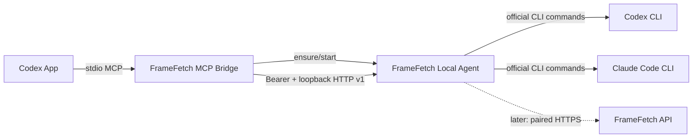

# 038 本地 Agent 与 Codex App 插件设计

## 1. 目标与现状

FrameFetch 已有宿主机 Analysis Worker，可直接消费 RabbitMQ 并访问数据库和
MinIO。该进程属于部署侧 Worker，不能作为用户电脑上的独立 Agent：它需要
基础设施密钥，也没有稳定的本机控制协议。038 新增独立发行边界，使 Codex
App 插件可以自动注册 MCP、拉起本机 Agent，并识别 Codex 与 Claude Code 的
连接状态。

首个可交付切片只建立控制面和 Provider 诊断。分析任务领取、设备配对、业务
授权和报告查询尚未接入，不能把本切片描述为完整的远程分析闭环。

## 2. 架构

插件是薄适配器，不承载业务执行。Agent 是每个操作系统用户唯一的本地控制面，
通过 `127.0.0.1` 随机端口提供版本化 HTTP API。endpoint 文件记录端口、PID、
版本和随机令牌；状态目录权限为 `0700`，文件权限为 `0600`。所有 API 都要求
Bearer 令牌，且不绑定局域网地址。

## 3. 设计模式与职责

- **Ports and Adapters**：Agent 的诊断端口只返回 `installed`、`version`、
  `authenticated` 和稳定状态；Codex、Claude Code 的命令与输出解析是独立
  CLI 适配策略。后续 API 模型 Provider 与本地 CLI 共享上层任务契约，但不
  共享认证实现。
- **Strategy**：每个 CLI 使用独立 probe 函数；新增 Provider 时注册新的诊断
  策略，不在 MCP 中增加条件分支。
- **Facade**：`ensure_agent` 封装存活探测、陈旧 endpoint 清理、并发启动锁、
  子进程拉起和就绪等待。MCP 不直接处理进程细节。
- **Sidecar/Proxy**：MCP 只把 Codex 工具调用映射到本机 API。Agent 可以脱离
  Codex 插件独立运行，避免插件版本与任务执行生命周期互相绑定。
- **Endpoint Registry**：当前用户私有的 `endpoint.json` 是本地服务发现事实，
  不使用固定端口，也不把访问令牌写入 Codex 对话或工具结果。

这些模式解决当前真实变化点；首期不引入通用工作流引擎、事件总线或依赖注入
容器。

## 4. 生命周期

1. Codex 加载插件并启动 `framefetch_mcp.py`。
2. MCP 初始化调用 `ensure_agent`，先使用 endpoint 探测现有 Agent。
3. Agent 不可达时，MCP 取得当前用户目录中的启动锁，删除陈旧 endpoint，
   以脱离终端的子进程拉起 Agent，并在 6 秒预算内等待就绪。
4. Agent 绑定随机 loopback 端口，原子写入私有 endpoint，再响应状态请求。
5. `stop` 返回响应后异步关闭 HTTP Server，并仅删除属于当前 PID 的 endpoint。

MCP 初始化失败不使 Codex 会话崩溃；初始化响应包含有限错误说明，后续工具调用
可以重试。Agent 启动失败、CLI 未安装、需要登录和命令超时必须保持不同状态。

## 5. 安全边界

- Agent 不读取 Codex/Claude Code 的认证文件，只运行官方 CLI 状态命令。
- Claude JSON 输出只提取 `loggedIn` 和有限的 `authMethod`，邮箱、组织和令牌
  不进入响应。
- endpoint 令牌不写日志、不返回 MCP 工具结果、不发送到 FrameFetch 服务端。
- 本切片没有数据库、RabbitMQ、MinIO 或 AI API Key 依赖。
- 后续由 Agent 启动模型子进程时，必须禁用 FrameFetch 业务插件，防止工具递归。
- 未来配对使用服务端签发的可撤销设备凭证，并与本机 endpoint 令牌分离。

## 6. 协议与扩展

当前本机 API 为：

| 方法 | 路径 | 用途 |
| --- | --- | --- |
| `GET` | `/v1/status` | Agent 元数据与缓存的 Provider 状态 |
| `POST` | `/v1/diagnostics` | 重新执行 Provider 诊断 |
| `POST` | `/v1/stop` | 停止当前 Agent |

后续业务协议按 `pair → lease task → execute → heartbeat → submit result` 扩展，
并保持本机控制令牌、设备凭证和模型 Provider 凭证三个独立安全域。任务执行端口
复用 037 的统一 AI 请求/结果语义，具体 Provider 仍由策略选择，不让插件感知
OpenRouter、Codex 或 Claude 的调用细节。
