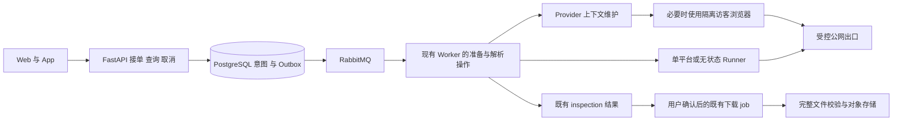

# 开源部署无感解析：系统设计

日期：2026-09-22。状态：目标设计，业务改造尚未验收。需求来自 [PRD](../prd/044-开源部署无感解析PRD.md)，执行和证据维护在 [Plan](../plan/044-开源部署无感解析Plan.md)，项目入口为 [BACKLOG P9](../../BACKLOG.md#p9-开源部署无感解析执行计划044)。本文只维护实现方案，不复制 FR／NFR／AC 定义或任务状态。

架构依据竞品调研与 `bb0e4ee3` 加既有未提交工作区的审查，后续文档基线为 `b1fde06c`；下述“当前事实”是该审查快照，实施前由 P9.01 复核。工程结构遵守 [PROJECT.md](../../PROJECT.md)，HTTP 契约仍由 FastAPI／Pydantic 生成 OpenAPI。

## 1. 设计目标与关联

实现全新开源部署的公开访问自动准备，让用户粘贴地址或分享文案后得到解析结果。核心改动是持久意图、访客与账号分离、有限恢复以及客户端状态连续性；已有来源分发不能替代空状态初始化。产品范围、平台批次、性能预算及验收标准均以 PRD 为准。

| 文档／台账 | 本次关系 |
| --- | --- |
| 005、029、032 | 保留平台隔离、内容准入与既有明确授权边界 |
| 030 | 复用 Outbox、租约、取消、排空和恢复机制 |
| 031、035、043 | 保留个人／已有账号来源的持久与维护能力；不是全新部署公开解析的必要前提 |
| 040、BACKLOG R18–R22／P8 | 持久意图、授权续接归入 044 同一实现；未完成项统一由 P9 排期，不再建第二套意图 |
| 041 | 业务缓存及 Web 会话目标纳入 P9；已修复身份误判不得重复计作新增交付 |
| 042 | 作为代码审查证据；后续产品顺序以PRD 和 Plan 为准 |

## 2. 审查基线与目标差距

| 能力 | 当前事实 | 本次需要完成 |
| --- | --- | --- |
| 分享输入 | `public_input.py` 已能提取单个分享 URL | 保留必要 query，明确多链接错误；所有入口复用 |
| 公开适配 | 已有 yt-dlp、抖音分享页等插件、YouTube bgutil provider | 自动访客上下文和失败恢复；不再创建同功能解析器 |
| 身份分类 | `public_session` 未进入可选策略，非 public 映射为 operator | 分开无状态公开、访客和账号上下文 |
| 错误 | 匿名 Douyin fresh cookies 可命中 credential_required | 按阶段及明确证据归类，模糊错误不直接要求账号 |
| 解析任务 | `inspect_media.py` 先调用 Runner，后持久化结果 | 上游调用前持久接单、去重、排队和恢复 |
| 下载任务 | 已有 PG／Outbox／RabbitMQ／Worker／制品验证 | 解析意图幂等交接，保留既有任务权威性 |
| 平台目录 | 本轮枚举 1,751 extractor 类、23 默认 Profile，另有 Generic 和硬阻断 | 候选能力、策略准入、部署就绪、验证证据分别展示 |
| Web | `04a18fc0` 已修复部分身份误判、迟到响应和恢复跳转 | 业务数据缓存、全路由连续性、041 的服务端 Web 会话目标 |
| 来源恢复 | `bb0e4ee3` 已实现已有加密来源的持久分发 | 从空访客状态创建能力，而不是要求先导入账号 Cookie |

计数是本次本地引擎快照，不是支持平台或下载成功数量。现有未提交授权／桥接代码由 P9.01 先盘点，不覆盖、不默认认定完成。

## 3. 系统架构与实现职责

### 状态所有权

| 概念 | 权威来源 | 生命周期 |
| --- | --- | --- |
| 本站身份 | 后端认证存储；前端 AuthProvider 仅投影 | 登录／撤销／过期；第三方故障不得改变 |
| 访客上下文 | Provider 管理进程及加密存储／短期缓存 | 从空创建、验证、刷新、冷却、到期回收；不拥有账号权益 |
| 账号授权 | owner／部署管理域绑定的受控授权 | 首次同意、主体／用途、版本、到期、撤销；不静默替代访客 |
| 业务任务 | PostgreSQL 意图／inspection／job | 前端、Socket 和轮询仅观察，关闭页面不改变执行 |

平台目录状态、某条链接结果、某个上下文健康、容器 readiness 也分别记录。内容删除不宣布整个平台不可用；Cookie 格式正确不等于当前访问成功。

候选清单由实际匿名 Runner 枚举，不读取 API 进程安装的引擎来替代运行事实。按与下载命令一致的显式插件目录完成加载，再枚举 extractor；固定版本的 yt-dlp `--list-extractors` 会在加载插件前返回，因此不能直接作为完整清单。清单绑定实际发行版本、安装来源 commit、项目插件 SHA-256、PO 插件版本与完整候选内容的摘要；配置 commit 与实际安装不一致时明确标记。枚举使用无业务凭据环境的独立子进程，8 秒／2 MiB 上限，同一 Runner 进程单飞并复用结果；换镜像随进程重新生成。管理员通过 HMAC 内部接口和鉴权 API 读取，前端按身份缓存、搜索和分页。清单只证明候选识别，不改变 Profile 准入、历史域名阻断或真实媒体证据；候选与策略／各条线路证据的完整关联仍属 P9.08 待完成范围。

复用既有基础设施，不增加第二套队列／任务引擎。准备与解析作为现有 Worker 体系中的独立操作及资源预算，按项目目录职责落位；必要时以同一镜像的独立进程运行，避免阻塞下载消费槽。

| 层 | 职责 | 禁止承担 |
| --- | --- | --- |
| api／schemas | 接单、认证、输入校验、查询／取消、生成 OpenAPI | HTTP 内等待浏览器或长解析、前端决定访问权限 |
| services/downloads | 唯一意图状态机、预算、结果与 job 交接规则 | 平行的 inspection／下载 DTO 与第二套执行器 |
| repositories + schema.sql | 状态版本、唯一约束、事务及 outbox 原子提交 | 在数据库事务内执行上游网络或浏览器等待 |
| Provider 管理进程 | 平台级 guest 初始化／维护／原子发布、非秘密健康投影 | 向前端泄露秘密、无条件读取普通 Chrome |
| Runner／可信插件 | 规范化平台输入、公开提取、媒体验证、必要上下文消费 | 数据库／队列／对象存储密钥、任意外部脚本加载 |
| 浏览器准备进程 | 平台限定的正常访客访问、短时受控上下文 | 公网调试端口、账号共享池、替用户越权登录 |
| Web／App | 输入、选项、任务观察、必要动作和缓存 | 权威任务状态、独立平台重试循环 |

无状态 Runner 继续不读取 Provider 凭据；需要访客材料时走单平台隔离的 guest 执行边界，只获得该平台短期材料，与 account Runner 分开。管理进程可写加密来源，执行进程只读租约，不以“访客不是账号”为由取消网络与秘密边界。

### 3.1 平台适配与上下文维护

平台模块只声明实际需要的准备、提取、验证和错误解释能力；共享生命周期负责互斥、预算、发布、度量和清理，不为每个平台强制创建空实现。

上下文状态：`absent → preparing → ready → refreshing`；有效旧版本可在明确期限内继续使用，刷新失败保留其有效性证据但不延寿。需要冷却时为 `cooling`；失效为 `expired`；撤销为不可复活的 `revoked`。新材料先验证，再通过版本条件原子发布；创建材料不自动标为已验证媒体。

上下文绑定平台、guest/account 类型、客户端配置及出口。平台整体 429／挑战时停止补充风暴；有界探测恢复，不靠轮换身份或出口规避限制。YouTube token 依真实会话／视频作用域缓存，复用已有 bgutil；不新增通用“全平台 token”服务。

公开 guest 持久控制使用 `provider_guest_contexts`，独立于已有账号来源表。作用域是平台、Profile 版本、客户端配置和出口，生成稳定 key；密文绑定 guest 域、scope、revision 和原有效期，即使部署复用来源密钥也不能替换为 account 密文。准备只在短事务中领取：全局 2 个、单平台 1 个维护名额，60 秒租约；数据库检查 fence 阻止迟到发布。发布的材料最长有效 1 小时，在到期前最多 60 秒进入刷新窗口；实际适配器按平台返回的期限进一步收窄。刷新失败冷却 30–300 秒，旧材料只在原期限内可用。失联维护回收、过期秘密清理与撤销由相同持久域管理；材料 ready 不代表某个链接已通过媒体校验。

### 3.2 数据模型与状态机

首条 guest 运行路线：`provider-guest` 仅获得 PostgreSQL 和稳定 `URL_ENCRYPTION_KEY`，从空 jar 经受控出口访问固定第一方首页，正向筛选 `ttwid` 后加密发布。抖音材料最长 15 分钟；HTTP 15 秒、单次维护含数据库总预算 25 秒，每 5 秒检查一次；不能从账号来源、普通浏览器或客户端上传补充。独立 `douyin-guest-runner` 只读单平台卷中的最长 90 秒租约，不获得数据库／对象存储／账号密钥。执行复用现有 tmpfs Cookie jar、全局单平台 Redis 租约及媒体校验；密文损坏按观察到的 fence/revision 条件失效，30 秒冷却后重建，不删除后来发布的版本。API 持久意图按已配置 guest 路线选择 `public_session`，重放保持原意图；guest 暂不可用有界重试，不转为账号授权。

沿用 040 的单一 `download_intent` 概念，放在 downloads 域：保存 id、owner、幂等键、请求指纹、加密输入／规范化 URL、模式、访问策略、状态／version、lease/fencing、attempt、next_attempt_at、剩余预算、deadline、授权引用、inspection_id、job_id、稳定原因及时间戳。不得再新增同义 parse_task 数据源。

| 当前状态 | 事件 | 目标状态／约束 |
| --- | --- | --- |
| queued | 获得执行租约 | preparing 或 resolving |
| preparing | guest 上下文验证可用 | resolving；不改变账号权限 |
| preparing／resolving | 可恢复故障且仍有预算 | retry_wait；保存下一次时间与原因 |
| retry_wait | 到期且重新获租约 | preparing 或 resolving |
| resolving | 结果及 inspection 原子关联成功 | ready；前端展示选项 |
| 准备／解析中 | 明确账号要求且存在受控动作 | action_required；保存预算和授权截止 |
| action_required | owner／用途／版本均匹配的有效授权完成 | queued；重复事件不重复执行 |
| ready | 用户明确确认格式且交接事务成功 | handed_off；之后只投影既有 job |
| ready | inspection 到期，用户再次操作 | 相同权限下回到 queued 重新解析；内容或规格变化需用户确认，不复用失效直链 |
| 非终态 | 用户取消／预算用尽／确定不可恢复 | cancelled／expired／failed；CAS 终态不可被迟到结果覆盖 |

`ready` 对解析操作表示结果可查看，`handed_off` 表示下载任务已受理，均不代表文件已验证。取消与交接的并发通过同一事务所有权判定：交接已提交则取消已有 job；交接未提交则终止意图，不能只修改前端状态。

重解析必须核对来源的 platform media id、内容类别和准入结果；不得用另一条内容、低权限之外的账号或不匹配的规格替代原选择。格式不可用时返回新选项供确认，不悄悄下载其他内容。

唯一约束至少覆盖 `(owner, idempotency_key)`、`(intent, outbox event/version)`、意图到 job 的单次交接。旧 Worker 提交必须匹配当前 lease/fencing 与 state version；仅有 Redis 锁不足以阻止迟到写入。

事务落位：`IntentRepository` 单独持有接单、领取、完成、取消与恢复事务。接单使用 PostgreSQL owner/key 唯一约束，与既有 outbox 同事务写入；重发只返回原意图，不能重置 180 秒截止。outbox 增加可空 `aggregate_version`，意图事件必须填写且同意图／事件／版本唯一；现有其他业务事件维持原有语义。事件只携带意图 ID 和版本，不携带输入或凭据。

领取在短事务内增加 attempt、version 和 fence；心跳只延长当前有效租约且不越过总截止。结果写入同时检查当前状态、lease owner、fence、version、租约与总截止；inspection、formats 和 `ready` 在一个事务中提交，复用既有 inspection 插入逻辑。恢复使用有界 `FOR UPDATE SKIP LOCKED` 扫描到期重试、过期租约及丢失投递，重新入队时增加版本并写入新事件。排队、重试和进程恢复不重置预算。

创建 API 在完成输入规范化、加密、owner 配额和意图／outbox 提交后返回 202；下载 Worker 使用两个独立解析消费槽和恢复循环执行意图，不占下载消费槽。解析计入每日任务数量、活跃名额，不预占下载字节；同 key 重放不重复计量。用户确认后另按既有下载资源规则计量。Runner 在读取请求体后等待 ASGI 断连事件，Worker 取消 HTTP 时传播至进程组终止和工作目录清理。跨副本的准备并发准入由 P9.03／P9.09 完成；P9.06 接入授权暂停／恢复预算，P9.07 接入 job 交接及引用清理。双客户端迁移前保留现有入口，不能把事务或受控上游测试当成真实平台下载验收。

Provider 上下文在现有 providers 持久域补齐类型与生命周期元数据，复用加密来源／只读租约原语；不能直接把账号来源表的 provider 唯一键当成支持多 owner、多 guest 的完整模型。P9.01 明确字段和唯一约束，落地时同步 ORM、当前态 `schema.sql`、空库与已有库测试，不维护历史迁移框架。

来源维护事务由 PostgreSQL `provider_authorizations` 持有，限定用途 `maintain_deployment_source`，与下载内容授权分开。既有 Agent 的 `source_available` 不具备账号主体和用途验证能力，不能当成 content grant。API 有界后台协调维护事务的队列交付、结果与超时；pending 记录本身可恢复未发布的控制请求，终态标记阻止重复控制请求重新启动。操作截止不随查询／重放延长，结果保留到原截止后 24 小时，先清理对应控制文件再回收记录。Web 离开页面只停止观察，明确取消才改变事务。内容授权和原意图续接仍须实现上表中的 owner／主体／用途／版本验证，不能用维护成功替代。

### 3.3 API 与客户端契约

下载格式的推荐顺序属于后端业务规则：优先可保留音轨的方案，再按分辨率、容器、编码和帧率等语义稳定排序；原本无声的素材仍提供可下载方案。Runner 在选项截断前排序，API 在每次投影持久化结果时使用同一规则，随机格式 ID、数据库返回顺序、幂等重放和页面刷新不能改变默认推荐。探针默认格式必须与用户得到的首选方案一致，真实验收检查最终文件的音视频轨道，不能只检查任务成功。

业务操作包括创建／查询／取消意图、确认下载、必要授权关联和平台能力查询；沿用现有 API 命名和认证约定。实施时在路由／Pydantic 中定义类型，经 OpenAPI 生成 Web 与 App 客户端，不在设计文档另维护 JSON Schema。

接单成功为持久化后的 `202` 并返回稳定资源引用；查询投影有 version、state、stage、稳定 reason、可执行 next_action、retry_at／deadline，以及可选 inspection/job 引用。next_action 只表达客户端能执行的操作，不暴露内部凭据或让客户端选择 operator。取消可重放，已交接返回相应 job 的取消结果／状态。

已持久接单后的上游失败写入任务，查询该任务本身仍可成功返回；只有认证、资源不可见或查询基础设施故障使用对应 HTTP 错误。本站会话确认失效才是本站 401；平台账号需求是任务业务状态。API 断连后客户端先以同一幂等键恢复，不生成新任务。

接单响应丢失时，客户端可按当前 owner 和原幂等键进行只读查询，找回服务端已经提交的意图；返回相同的 IntentResponse，查询不重新占用配额或延长预算。原文草稿只留在当前身份的应用会话内存，恢复引用仅保存随机请求键／意图 ID；不把原始分享文案或签名媒体地址写进 URL、localStorage 或遥测。找不到记录不等于允许自动生成新键重交。

Web 公开链接入口已切换到上述意图协议。提交前在 sessionStorage 保存当前 owner ID 和随机请求键，刷新后只读恢复；不保存输入、结果或凭据。软导航复用根布局中的草稿、格式选择及 QueryClient；卸载观察者不取消后台意图。状态查询每 2 秒一次，后台页暂停定时查询，发生查询故障、到达执行截止或进入稳定状态后停止定时查询，前台／联网／显式恢复再核对。查询失败保留已有结果，版本更旧的响应不得覆盖取消或交接结果。提交结果不明时先查询原键；404 后用户显式重试仍复用原键，刷新丢失原文时可重新粘贴并用同一键提交，冲突由服务端拒绝。关闭标签后的跨标签／跨设备找回和内容授权续接尚未由此实现。

切换时 Web 与 App 在一个发布门禁内更新；保留独立原生认证不是保留旧业务执行分支。已运行下载 job／历史 inspection 继续查询；删除被替代的同步创建路径，不长期保留两套解析入口。如果已分发 App 尚不能使用新契约，标记发布阻断并提供明确升级安排，不能以临时兼容层掩盖未完成迁移。

### 3.4 Web 与 App 连续性

根布局只挂载一次身份投影和业务查询缓存。沿用 041 的 TanStack Query 目标替换局部 `useState/useEffect` 数据寿命；按 owner、资源和查询参数隔离，事件驱动定向更新，重连用 HTTP 快照收敛。页面已有数据时后台刷新不清空；首次加载才使用局部骨架。

输入草稿按 owner 的会话级客户端状态保留，不写入 URL、共享存储或遥测；确认失效／换账号立即隐藏私有内容并清理旧缓存与在途请求。本站身份仍未知且网络异常时显示原地恢复界面，不伪造 anonymous。

041 的 PostgreSQL 不透明 Web Session 已实现：同源 HttpOnly Cookie 仅持有随机凭据，数据库保存摘要、空闲／绝对截止与撤销时间，普通请求不轮换 Cookie，WebSocket 心跳不续期。Web 写操作校验精确 Origin／Referer，代理来源仅来自受信 IP／CIDR；旧 Web 刷新接口和业务自动重放已删除。跨标签只广播动作，再重查服务端；退出未确认时隐藏私有内容并保留重试。原生 Bearer 协议独立，不回退 Cookie。切换前后端必须配套发布，旧 Web 登录需要一次重新登录；当前实测和 Redis 重启等剩余验收以 Plan P9.11 为准。查询缓存、SSR 身份投影和持久意图仍分别验收，不能由本次会话切换推断全站闪屏消失。

App 使用既有 Riverpod／Dio／go_router；同一 intent 引用可在重入／恢复前台后查询，不能导入平台 Cookie。App 的改动在独立仓库提交，但纳入服务端破坏性契约发布门禁。

### 3.5 默认部署、资源与发布

标准模式包含已承诺平台必需的引擎、插件、JS runtime 和经过准入的访客准备组件；构建时固定版本，启动不临时下载浏览器二进制或最新源码。精简模式明确关闭的能力，不能与标准模式共享成功宣传。

初始准备并发上限为全局 2、单平台／出口 1；浏览器准备单独预算并在任务结束或闲置到期后关闭；实际容器资源上限在 P9.09 依据测量固定。普通公开请求不唤醒桌面 Agent。Readiness 只判断对应进程职责；一个平台失败不阻塞核心 API。

自动化分为两种：运行中的访客创建／刷新自动执行；代码更新经候选镜像、确定性测试、低频平台 canary 和受控发布完成。部署采用显式发布通道与维护窗口，可自动应用已验证稳定镜像，但不修改用户环境文件或丢弃配置；备份、前后版本数据兼容、失败回滚都是发布门禁。存在不可回滚数据变化时阻断自动更新，先给可执行升级方案。

## 4. 调研依据与取舍

- [SaveAny 专用解析](https://github.com/liyupi/free-video-downloader/blob/6783636e03e91b0beb82683d955beb475d7e66cc/backend/douyin.py)：借鉴公开路线适配，不推导所有平台免配置。
- [DTK 访客维护](https://github.com/Evil0ctal/Douyin_TikTok_Download_API/blob/9fa3e5406694c80ec0a97399f410948f130d0f9e/src/dtk/worker/pool_filler.py)：借鉴生命周期、互斥与退避，不整体引入采集平台或身份轮换策略。
- [DTK 部署](https://github.com/Evil0ctal/Douyin_TikTok_Download_API/blob/9fa3e5406694c80ec0a97399f410948f130d0f9e/docker/compose.yml)：自动能力所需可选组件必须在我们的标准部署承诺中明确。
- [cobalt TikTok](https://github.com/imputnet/cobalt/blob/a636575b09de1fc55d9b8cd98cac88f5f2f16b42/api/src/processing/services/tiktok.js)：访问上下文延续到媒体传输，不能只缓存 URL。
- [yt-dlp 支持列表](https://github.com/yt-dlp/yt-dlp/blob/c7fb478d21e9e59524befbe23f7801bb267fb880/supportedsites.md)、[PO token 文档](https://github.com/yt-dlp/yt-dlp/wiki/PO-Token-Guide)：区分候选能力与可用证据，复用平台特定自动化。
- [VidBee](https://github.com/nexmoe/VidBee/blob/06cfca54cc7bfd5bbc92793208618676c385f393/README.md)、[MeTube](https://github.com/alexta69/metube/blob/300bf79b52cb3e398f966dedf11b3c0bbabe6f79/README.md)：本机或人工 Cookie 路线不能充当空服务器默认体验。

外部源码用于机制分析，未执行竞品实测；直接复用前核对相应许可及依赖。PRD 的 FR、NFR、预算与验收标准是本项目决策，不是竞品提供的保证。

## 5. SDD 实施约束

读取顺序为 PRD → 本文 → Plan 中的目标任务。实现前确认关联的 FR、NFR 和 AC、状态所有权、数据事务、客户端影响及删除旧路径的时机。每次改动先落可验证的行为约束，再实现最小业务闭环；只有相关验收证据完整，才能关闭 Plan 任务。

新增数据或 API 仍修改当前态 `schema.sql`、ORM、Pydantic／路由并生成客户端；不从本文件生成另一份手写 schema。技术决策改变而产品行为不变时更新本文与任务；产品行为或验收门槛改变时先改 PRD。拆分文档本身不证明系统已修复，也不触发部署。
