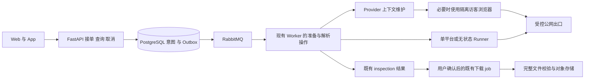

# 开源部署无感解析：需求分析与系统设计

日期：2026-09-22。状态：**目标设计，业务改造尚未按本文验收**。执行台账为 [BACKLOG 的 P9](../../BACKLOG.md#p9-开源部署无感解析执行计划044)；需求、非功能要求和验收编号以本文为唯一维护入口。

本文依据本轮竞品源码调研及当前工作区制定，实施基线为 `bb0e4ee3` 加既有未提交工作；未提交原型和历史单测结果不等于本方案已交付。本文负责产品需求、系统边界和验收契约；工程结构遵守 [PROJECT.md](../../PROJECT.md)，不生成第二份手写 OpenAPI。

## 1. 问题、目标与范围

### 1.1 核心问题

用户需要的能力是：开发者取得开源项目并完成标准部署后，普通用户在一个输入框粘贴地址或分享文案，点击解析，系统自行准备公开访问、解析并返回结果。它不以开发者已有浏览器登录、旧机器 Cookie、手动文件导入或特定宿主桌面为前提。

当前断点是：访客状态与账号授权混用；解析成功后才保存 inspection；平台错误容易变成授权提示；引擎能力、部署就绪与媒体成功混为一谈；页面状态依赖组件生命周期。既有来源持久化只能延续已有状态，不能为全新部署自动建立访问能力。

### 1.2 用户与成功条件

| 角色 | 主要任务 | 成功条件 |
| --- | --- | --- |
| 普通用户 | 输入、解析、选择规格、下载、查看历史／分析 | 公开内容的内部准备无须用户参与；刷新／断网后续接同一任务 |
| 开源部署者 | 标准安装、升级、定位平台故障 | 不逐个平台找 Cookie；依赖缺失、出口受限与引擎回归可以区分 |
| 管理员 | 控制资源、查看能力、处理确有必要的授权 | 非秘密状态可观察；不能通过普通用户请求改写共享账号来源 |
| 项目维护者 | 更新提取器、修复平台变化、发布 | 有固定版本、样本证据、回归门禁和回滚入口 |

### 1.3 范围与边界

覆盖输入到解析、下载与文件验证，以及平台能力、会话准备、Web 连续性、App 契约、部署、监控和维护。保留本地文件上传、已有 AI 分析、文档与历史能力；本轮只保证它们不被改造破坏，不新增支付、内容发布、直播录制或批量采集产品。

默认处理用户有权使用的公开、免费、非 DRM 内容。真实账号、付费／私密／地区权益等仍遵守既有平台边界；自动访客准备不产生额外权限。腾讯视频、优酷和视频号既有专用来源不并入通用访客流程。

不承诺任意平台、任意出口永久成功；承诺系统自动完成已验证的公开访问准备，故障有界且可解释。首期高可用边界是业务进程恢复、平台故障隔离及备份恢复，不把单宿主 Compose 宣称为跨宿主无损切换。

### 1.4 与已有设计的关系

| 文档／台账 | 本次关系 |
| --- | --- |
| 005、029、032 | 保留平台隔离、内容准入与既有明确授权边界 |
| 030 | 复用 Outbox、租约、取消、排空和恢复机制 |
| 031、035、043 | 保留个人／已有账号来源的持久与维护能力；不是全新部署公开解析的必要前提 |
| 040、BACKLOG R18–R22／P8 | 持久意图、授权续接归入本文同一实现；未完成项统一由 P9 排期，不再建第二套意图 |
| 041 | 业务缓存及 Web 会话目标纳入 P9；已修复身份误判不得重复计作新增交付 |
| 042 | 作为代码审查证据；后续产品顺序以本文和 P9 为准 |

## 2. 当前基线与目标差距

| 能力 | 当前事实 | 本次需要完成 |
| --- | --- | --- |
| 分享输入 | `public_input.py` 已能提取单个分享 URL | 保留必要 query，明确多链接错误；所有入口复用 |
| 公开适配 | 已有 yt-dlp、抖音分享页等插件、YouTube bgutil provider | 自动访客上下文和失败恢复；不再创建同功能解析器 |
| 身份分类 | `public_session` 未进入可选策略，非 public 映射为 operator | 分开无状态公开、访客和账号上下文 |
| 错误 | 匿名 Douyin fresh cookies 可命中 credential_required | 按阶段及明确证据归类，模糊错误不直接要求账号 |
| 解析任务 | `inspect_media.py` 先调用 Runner，后持久化结果 | 上游调用前持久接单、去重、排队和恢复 |
| 下载任务 | 已有 PG／Outbox／RabbitMQ／Worker／制品验证 | 解析意图幂等交接，保留既有任务权威性 |
| 平台目录 | 本轮枚举 1,751 extractor 类、23 默认 Profile，另有 Generic 和硬阻断 | 候选能力、策略准入、部署就绪、验证证据分别展示 |
| Web | `04a18fc0` 已修复部分身份误判、迟到响应和恢复跳转 | 业务数据缓存、全路由连续性、041 的服务端 Web 会话目标 |
| 来源恢复 | `bb0e4ee3` 已实现已有加密来源的持久分发 | 从空访客状态创建能力，而不是要求先导入账号 Cookie |

计数是本次本地引擎快照，不是支持平台或下载成功数量。现有未提交授权／桥接代码由 P9.01 先盘点，不覆盖、不默认认定完成。

## 3. 功能性需求（FR）

优先级“必需”是本轮产品发布范围；“扩展”只指平台覆盖的后续批次，不表示可以绕过安全、正确性和客户端契约门禁。

| ID | 需求与行为 | 发布要求 | 验收 |
| --- | --- | --- | --- |
| FR-01 | 一个输入框接受 HTTP(S) 地址、官方短链及完整分享文案；单链接提取，保留访问必要参数；多链接明确报错，不随意选第一条 | 必需 | AC-01 |
| FR-02 | 解析前保存 owner 绑定的持久意图；双击／重试使用同一幂等键；查询、取消、重入可恢复，冲突输入受控拒绝 | 必需 | AC-02、AC-11 |
| FR-03 | 服务端按已发布的平台规则选择有限公开路线；普通用户不选引擎、UA、Cookie 来源或出口；不自动升级账号权限 | 必需 | AC-03 |
| FR-04 | 对经过准入的平台自动从空状态准备公开访客上下文；轻量请求优先，必要时使用隔离浏览器；不得依赖开发者普通 Profile | 必需 | AC-04、AC-12 |
| FR-05 | 按真实作用域复用、验证、刷新和回收访客上下文；维护单飞、失效可重建、平台整体故障冷却；上下文版本及出口一致 | 必需 | AC-05、AC-12 |
| FR-06 | 对临时网络、429、访客失效、解析器变化、内容不可见、权限和 DRM 使用稳定原因与有限动作；本可自动恢复时不先弹登录 | 必需 | AC-06 |
| FR-07 | 明确账号权限需求才进入 action_required；授权绑定 owner／用途／平台／主体／版本，完成后服务端续接原意图；取消和撤销不可复活 | 必需，受平台准入限制 | AC-07 |
| FR-08 | 解析结果显示标题、媒体类别、封面和语义规格；区分元数据与媒体验证；链接过期时在同权限下重新解析，不伪造可用画质 | 必需 | AC-08 |
| FR-09 | 用户明确选择后交接已有下载 job；下载、合并、校验、保存分阶段；重复确认只产生一个业务结果；取消终止子进程组 | 必需 | AC-09 |
| FR-10 | 从实际引擎生成候选能力，与平台策略及近期证据关联；区分可识别、可尝试、已验证、受限／未验证；硬阻断逐项审查 | 必需 | AC-10 |
| FR-11 | 标准部署打包承诺能力所需依赖并后台准备平台；无账号来源仍可启动；缺失可选能力不阻塞核心 API；重建可恢复 | 必需 | AC-11、AC-17 |
| FR-12 | Web 保留根布局、已有数据、输入和任务引用；切页／断网不跳登录；只有确认本站会话失效才重新认证，换账号隔离数据 | 必需 | AC-13、AC-14、AC-19 |
| FR-13 | Flutter 复用同一意图／错误语义，由服务端 OpenAPI 更新生成客户端；恢复前后台／断网状态，不在 App 保存平台凭据 | 必需，接口发布门禁 | AC-15 |
| FR-14 | 管理端展示平台准备状态、上游故障阶段、运行版本、样本时间、资源水位及安全恢复动作；不能用“Cookie 文件存在”判成功 | 必需 | AC-18 |
| FR-15 | 引擎／插件固定版本，自动构建候选、执行回归与 canary；稳定发布可回滚；不在生产启动时无约束更新 upstream | 必需 | AC-20 |
| FR-16 | 本地上传、既有历史／下载、AI 分析与文档可继续使用；AI 失败不改变下载成功；私人结果不进入公共复用缓存 | 必需 | AC-16 |

## 4. 非功能性需求（NFR）

下列数值为本设计的**初始验收目标／运行预算**，不是实测容量或已实现 SLA。P9.01 固定配置，P9.14 测量；不达标保留失败证据并修复，任何调整须更新本文、台账和测试参数，不在验收后悄悄降低目标。

| ID | 要求与目标 | 测量口径／验收 |
| --- | --- | --- |
| NFR-01 性能 | 在参考环境中，提交持久意图 p95 ≤ 1 s、查询 p95 ≤ 500 ms；选定公开样本热解析目标 p95 ≤ 15 s、需要访客准备的冷解析 p95 ≤ 60 s | API 用受控上游、10 请求/s 连续 5 分钟且并发连接上限 50；真实平台低频持续采样，少于 100 个合格样本／组只列原始耗时，不声称 p95 达标；AC-17 |
| NFR-02 并发与背压 | API、owner、平台／出口、访客准备、Runner、转码各有独立上限；同一上下文只允许一个维护者；全局及 owner 超限在持久接单前返回受控 429／503 | 1／5／20／50 并发夹具、上下文竞争与队列饱和测试；无无限线程／浏览器；AC-02、AC-12、AC-17 |
| NFR-03 持久正确性 | 成功接单必须已提交意图与 outbox；消息允许至少一次投递，业务结果幂等；租约过期由新持有者接管，旧持有者不能提交；取消／过期为终态 | 在提交、发消息、执行、保存结果各边界注入崩溃；50 次相同 key 并发仍一份意图及至多一份对应 job；AC-02、AC-09、AC-11 |
| NFR-04 故障隔离 | 单平台／浏览器／PO token 组件异常不拖垮其他平台、本站身份及核心查询；观察断开不取消任务；恢复完成后 60 s 内触发可执行的到期任务重调度 | 故障注入中健康平台受控样本成功率不低于 99%，不丢已受理任务；60 s 为调度延迟，不是要求媒体执行结束；AC-11、AC-17 |
| NFR-05 可用性与恢复 | 首期声明单宿主进程恢复边界；依赖持久数据完好时，进程重建不丢已接单任务；备份恢复演练目标 RPO ≤ 24 h、RTO ≤ 60 min | RPO 按可恢复备份时间点，RTO 从恢复操作开始到核心读写与任务恢复通过；单宿主不能满足宿主故障连续服务承诺，报告此限制；AC-11、AC-17 |
| NFR-06 安全与权限 | 公网 HTTP(S) 准入和逐跳受控出口；账号、guest、无状态路线隔离；最小权限、短租约、owner 校验、CAS／撤销代际；不暴露浏览器 RPC 或任意执行参数 | 跨用户、跨平台、私网／重绑定／恶意重定向、迟到授权、撤销与过期用例；Cookie 写操作覆盖 CSRF；AC-03、AC-07、AC-12、AC-19 |
| NFR-07 隐私与生命周期 | 原始 Cookie、token、完整带签名 URL、页面正文不进入公开响应／普通日志；持久源加密，非秘密引用可审计；输入加密保存；清理不误删活跃任务 | Secret 扫描、日志夹具、所有者删除／到期清理与最小租约测试；AC-12、AC-16、AC-18 |
| NFR-08 可维护性 | 一份错误语义、一份意图、一个预算所有者；可信平台模块，删除被替代生产路径；固定依赖和可回滚发布；不新增工作流引擎或平行 DTO | 结构／契约门禁、受控发布及回滚演练；AC-03、AC-06、AC-20 |
| NFR-09 可移植与契约 | Linux amd64／arm64 标准容器不依赖 macOS Agent；Web、原生分别认证但共享业务契约；生产与开发默认能力一致，精简部署明确差异 | 双架构镜像验证；生成客户端无漂移；App 不支持新契约时不得发布破坏性服务端替换；AC-15、AC-17、AC-19 |
| NFR-10 连续性与可访问性 | 390px 与桌面、明暗主题、键盘／读屏均可操作；保留已加载数据，无整页白屏；网络失败不暴露旧账号数据或误登出 | 真实浏览器录制和 DOM／导航断言；核心流程无横向溢出、焦点可恢复；App 按现有文字缩放／语义测试；AC-13、AC-14、AC-15 |
| NFR-11 资源与预算 | 所有外部操作有时间、字节、磁盘及并发上限；浏览器与下载隔离；等待授权、业务执行、观察超时分别计算；取消请求确认后 10 s 内终止所拥有的执行子进程组 | 压测／超时／取消／磁盘不足测试，记录容器峰值资源，禁止把延长 HTTP 超时当恢复方案；AC-05、AC-09、AC-12、AC-17 |
| NFR-12 可观测 | 串联 request／intent／job／provider／版本／阶段，按平台、内容、访问上下文和出口分组；运行健康与媒体成功分离；告警不携带秘密 | 样本和故障可追溯；指标区分合格公开样本与全部有效输入，不能隐藏失败改善分母；AC-10、AC-18、AC-20 |

参考环境：业务容器合计至少 4 vCPU／8 GiB RAM、足够的独立工作空间，既有 PG／RabbitMQ／Redis／MinIO 分别记录版本和资源，不把它们排除出成本记录。测试记录网络、架构、镜像 digest 和配置。资源不足的精简环境单列结果，不套用标准环境容量。

初始安全预算：单次公开解析从 accepted 起累计最多 180 s、最多 3 次有语义的执行尝试；单次访客准备最多 60 s、普通上游请求最多 15 s且受剩余总预算约束；用户授权等待最多 10 min，授权回调在新执行前仍检查全局取消／到期。排队时间算入公开解析期限；进入 action_required 时暂停剩余主动执行预算，授权等待有独立硬截止，恢复后使用剩余预算。下载沿用独立 job 的大小／时长／总期限，不套用 180 s 解析预算。

## 5. 产品交互与状态所有权

### 5.1 主流程

1. 用户粘贴内容，点击“解析”；前端提交原文与幂等键，服务端提取并校验。
2. 接单成功返回稳定 intent 引用；页面显示“正在解析”，必要准备由服务端自动完成。
3. 临时故障显示同一任务的恢复状态与可取消操作，不先报红色失败再要求用户修复 Cookie。
4. 解析完成显示真实媒体与规格，用户选择下载；**解析按钮不自动批量下载或创建 AI 任务**。
5. 下载确认幂等交接已有 job；制品校验完成才显示“文件已就绪”。浏览器保存是独立结果，不能伪称已保存到设备。
6. 只有确有账号权限需要且有可执行授权入口，才请求一次必要操作；关闭页面后授权成功也由后端续接。

普通用户不看到 Cookie 字段、引擎列表或运维 profile。管理员入口展示诊断细节。多链接输入提供明确校验反馈；本轮不引入隐式批量解析。

### 5.2 三类身份与四类状态分开

| 概念 | 权威来源 | 生命周期 |
| --- | --- | --- |
| 本站身份 | 后端认证存储；前端 AuthProvider 仅投影 | 登录／撤销／过期；第三方故障不得改变 |
| 访客上下文 | Provider 管理进程及加密存储／短期缓存 | 从空创建、验证、刷新、冷却、到期回收；不拥有账号权益 |
| 账号授权 | owner／部署管理域绑定的受控授权 | 首次同意、主体／用途、版本、到期、撤销；不静默替代访客 |
| 业务任务 | PostgreSQL 意图／inspection／job | 前端、Socket 和轮询仅观察，关闭页面不改变执行 |

平台目录状态、某条链接结果、某个上下文健康、容器 readiness 也分别记录。内容删除不宣布整个平台不可用；Cookie 格式正确不等于当前访问成功。

## 6. 系统架构与实现职责

复用既有基础设施，不增加第二套队列／任务引擎。准备与解析作为现有 Worker 体系中的独立操作及资源预算，按项目目录职责落位；必要时以同一镜像的独立进程运行，避免阻塞下载消费槽。

| 层 | 职责 | 禁止承担 |
| --- | --- | --- |
| api／schemas | 接单、认证、输入校验、查询／取消、生成 OpenAPI | HTTP 内等待浏览器或长解析、前端决定访问权限 |
| services/downloads | 唯一意图状态机、预算、结果与 job 交接规则 | 平行的 inspection／下载 DTO 与第二套执行器 |
| repositories + schema.sql | 状态版本、唯一约束、事务及 outbox 原子提交 | 在数据库事务内执行上游网络或浏览器等待 |
| Provider 管理进程 | 平台级 guest 初始化／维护／原子发布、非秘密健康投影 | 向前端泄露秘密、无条件读取普通 Chrome |
| Runner／可信插件 | 规范化平台输入、公开提取、媒体验证、必要上下文消费 | 数据库／队列／对象存储密钥、任意外部脚本加载 |
| 浏览器准备进程 | 平台限定的正常访客访问、短时受控上下文 | 公网调试端口、账号共享池、替用户越权登录 |
| Web／App | 输入、选项、任务观察、必要动作和缓存 | 权威任务状态、独立平台重试循环 |

无状态 Runner 继续不读取 Provider 凭据；需要访客材料时走单平台隔离的 guest 执行边界，只获得该平台短期材料，与 account Runner 分开。管理进程可写加密来源，执行进程只读租约，不以“访客不是账号”为由取消网络与秘密边界。

### 6.1 平台适配与上下文维护

平台模块只声明实际需要的准备、提取、验证和错误解释能力；共享生命周期负责互斥、预算、发布、度量和清理，不为每个平台强制创建空实现。

上下文状态：`absent → preparing → ready → refreshing`；有效旧版本可在明确期限内继续使用，刷新失败保留其有效性证据但不延寿。需要冷却时为 `cooling`；失效为 `expired`；撤销为不可复活的 `revoked`。新材料先验证，再通过版本条件原子发布；创建材料不自动标为已验证媒体。

上下文绑定平台、guest/account 类型、客户端配置及出口。平台整体 429／挑战时停止补充风暴；有界探测恢复，不靠轮换身份或出口规避限制。YouTube token 依真实会话／视频作用域缓存，复用已有 bgutil；不新增通用“全平台 token”服务。

### 6.2 数据模型与状态机

沿用 040 的单一 `download_intent` 概念，放在 downloads 域：保存 id、owner、幂等键、请求指纹、加密输入／规范化 URL、模式、访问策略、状态／version、lease/fencing、attempt、next_attempt_at、剩余预算、deadline、授权引用、inspection_id、job_id、稳定原因及时间戳。不得再新增同义 parse_task 数据源。

| 当前状态 | 事件 | 目标状态／约束 |
| --- | --- | --- |
| queued | 获得执行租约 | preparing 或 resolving |
| preparing | guest 上下文验证可用 | resolving；不改变账号权限 |
| preparing／resolving | 可恢复故障且仍有预算 | retry_wait；保存下一次时间与原因 |
| retry_wait | 到期且重新获租约 | preparing 或 resolving |
| resolving | 结果及 inspection 原子关联成功 | ready；前端展示选项 |
| 准备／解析中 | 明确账号要求且存在受控动作 | action_required；保存预算和授权截止 |
| action_required | owner／用途／版本均匹配的有效授权完成 | queued；重复事件不重复执行 |
| ready | 用户明确确认格式且交接事务成功 | handed_off；之后只投影既有 job |
| ready | inspection 到期，用户再次操作 | 相同权限下回到 queued 重新解析；内容或规格变化需用户确认，不复用失效直链 |
| 非终态 | 用户取消／预算用尽／确定不可恢复 | cancelled／expired／failed；CAS 终态不可被迟到结果覆盖 |

`ready` 对解析操作表示结果可查看，`handed_off` 表示下载任务已受理，均不代表文件已验证。取消与交接的并发通过同一事务所有权判定：交接已提交则取消已有 job；交接未提交则终止意图，不能只修改前端状态。

重解析必须核对来源的 platform media id、内容类别和准入结果；不得用另一条内容、低权限之外的账号或不匹配的规格替代原选择。格式不可用时返回新选项供确认，不悄悄下载其他内容。

唯一约束至少覆盖 `(owner, idempotency_key)`、`(intent, outbox event/version)`、意图到 job 的单次交接。旧 Worker 提交必须匹配当前 lease/fencing 与 state version；仅有 Redis 锁不足以阻止迟到写入。

Provider 上下文在现有 providers 持久域补齐类型与生命周期元数据，复用加密来源／只读租约原语；不能直接把账号来源表的 provider 唯一键当成支持多 owner、多 guest 的完整模型。P9.01 明确字段和唯一约束，落地时同步 ORM、当前态 `schema.sql`、空库与已有库测试，不维护历史迁移框架。

### 6.3 API 与客户端契约

业务操作包括创建／查询／取消意图、确认下载、必要授权关联和平台能力查询；沿用现有 API 命名和认证约定。实施时在路由／Pydantic 中定义类型，经 OpenAPI 生成 Web 与 App 客户端，不在设计文档另维护 JSON Schema。

接单成功为持久化后的 `202` 并返回稳定资源引用；查询投影有 version、state、stage、稳定 reason、可执行 next_action、retry_at／deadline，以及可选 inspection/job 引用。next_action 只表达客户端能执行的操作，不暴露内部凭据或让客户端选择 operator。取消可重放，已交接返回相应 job 的取消结果／状态。

已持久接单后的上游失败写入任务，查询该任务本身仍可成功返回；只有认证、资源不可见或查询基础设施故障使用对应 HTTP 错误。本站会话确认失效才是本站 401；平台账号需求是任务业务状态。API 断连后客户端先以同一幂等键恢复，不生成新任务。

切换时 Web 与 App 在一个发布门禁内更新；保留独立原生认证不是保留旧业务执行分支。已运行下载 job／历史 inspection 继续查询；删除被替代的同步创建路径，不长期保留两套解析入口。如果已分发 App 尚不能使用新契约，标记发布阻断并提供明确升级安排，不能以临时兼容层掩盖未完成迁移。

### 6.4 Web 与 App 连续性

根布局只挂载一次身份投影和业务查询缓存。沿用 041 的 TanStack Query 目标替换局部 `useState/useEffect` 数据寿命；按 owner、资源和查询参数隔离，事件驱动定向更新，重连用 HTTP 快照收敛。页面已有数据时后台刷新不清空；首次加载才使用局部骨架。

输入草稿按 owner 的会话级客户端状态保留，不写入 URL、共享存储或遥测；确认失效／换账号立即隐藏私有内容并清理旧缓存与在途请求。本站身份仍未知且网络异常时显示原地恢复界面，不伪造 anonymous。

041 的 PostgreSQL 不透明 Web Session 作为单独任务实施：同源 HttpOnly Cookie、撤销／期限、CSRF、跨标签行为明确，旧 Web 刷新流程删除。原生 Bearer 协议独立，不回退 Cookie。查询缓存修复不以这项协议迁移为前置，避免为消除闪屏必须先重写全部认证。

App 使用既有 Riverpod／Dio／go_router；同一 intent 引用可在重入／恢复前台后查询，不能导入平台 Cookie。App 的改动在独立仓库提交，但纳入服务端破坏性契约发布门禁。

### 6.5 默认部署、资源与发布

标准模式包含已承诺平台必需的引擎、插件、JS runtime 和经过准入的访客准备组件；构建时固定版本，启动不临时下载浏览器二进制或最新源码。精简模式明确关闭的能力，不能与标准模式共享成功宣传。

初始准备并发上限为全局 2、单平台／出口 1；浏览器准备单独预算并在任务结束或闲置到期后关闭；实际容器资源上限在 P9.09 依据测量固定。普通公开请求不唤醒桌面 Agent。Readiness 只判断对应进程职责；一个平台失败不阻塞核心 API。

自动化分为两种：运行中的访客创建／刷新自动执行；代码更新经候选镜像、确定性测试、低频平台 canary 和受控发布完成。部署采用显式发布通道与维护窗口，可自动应用已验证稳定镜像，但不修改用户环境文件或丢弃配置；备份、前后版本数据兼容、失败回滚都是发布门禁。存在不可回滚数据变化时阻断自动更新，先给可执行升级方案。

## 7. 平台覆盖与准入

| 批次 | 样本平台 | 要验证的差异 |
| --- | --- | --- |
| A 首条纵向闭环 | 抖音 | 分享文案、公开页、空访客状态、有界准备、解析／媒体分别验证 |
| B 不同机制复用 | 小红书、微博、YouTube、B 站 | 必要 query、图集、访客请求、已有 PO token、分离音视频；不能只复制抖音实现 |
| C 重点覆盖 | TikTok、快手、X、Instagram、Reddit | 平台差异、公开读取／真实账号边界、出口限制 |
| D 长尾 | 引擎候选及现有 Registry／固定样本；PeerTube 使用明确可信实例 | Generic 准入、历史硬阻断逐项审查、避免手工 24 平台上限 |

批次代表工作顺序，不预先保证各平台成功。未通过的平台标为未验证或明确限制，不能加入“标准部署已验证”集合。完整 P9 交付要求每个计划平台都有验证结果和处置，不能只测通过的平台；若核心目标平台不通过，保持对应任务未完成并记录缺口。

## 8. 验收目录（AC）

| ID | 输入／故障场景 | 必须满足的结果与证据 |
| --- | --- | --- |
| AC-01 输入 | 直链、短链、中文文案、必要 query、多链接、私网及非法 scheme | 单一规范化规则；合法访问参数保留；多链接受控拒绝；恶意输入在访问前拒绝，重定向仍受出口约束 |
| AC-02 接单幂等 | 50 个相同 key 并发、相同 key 不同输入、提交响应丢失 | 上游调用前已有唯一意图；冲突为明确错误；恢复同一引用；崩溃时无“返回成功但未接单” |
| AC-03 策略 | public／guest／account、未知候选、历史阻断来源 | 不隐式升权；有限路线有原因；必要字段与稳定错误由同一契约产生 |
| AC-04 空状态 | 空上下文、无用户浏览器和账号文件、标准部署 | 核心公开样本自动准备并返回正确媒体；首次请求无 Cookie 导入／授权弹框；记录耗时与访问方式 |
| AC-05 维护 | 过期、删除可重建 guest、并发刷新、迟到发布、出口变化 | 单维护者、有效版本原子发布、旧发布不能覆盖新版本；重新绑定先重建／验证；预算耗尽准确终止 |
| AC-06 故障语义 | fresh cookies、空响应、429／Retry-After、5xx、超时、结构变化、删除／DRM | 不把模糊字符串当账号证据；按规定退避／停止；不循环登录、不叠加跨层重试 |
| AC-07 授权 | 确有权限需求、不同 owner／主体、取消与完成乱序、撤销 | 仅正确绑定可续接原任务；取消不复活；共享宿主来源不能被普通用户改写；无材料泄露 |
| AC-08 解析质量 | 视频／图集、标题成功但媒体 403、时效 URL、画质变化 | metadata/media 分层记录；必要时有界 Range／小片段验证，不能只信 HEAD；无假画质、无假下载成功 |
| AC-09 下载交接 | 双击格式确认、交接与取消竞争、Worker 崩溃／重投 | 只关联一个 job；结果原子提交；最终 ffprobe／图集清单校验；取消子进程组 ≤ 10 s；设备保存单独报告 |
| AC-10 能力清单 | 引擎升级、单链接删除、旧出口证据、未验证站点 | 清单绑定运行版本；证据不过期背书、不跨上下文背书；不宣传 extractor 数等于平台成功数 |
| AC-11 恢复 | API／Worker 重启、outbox 发布失败、确认丢失、平台组件断开、备份还原 | 不丢已接单任务；无重复结果；其他平台可服务；重调度和 RPO／RTO 记录符合 NFR |
| AC-12 隔离资源 | 并发访客准备、失联进程、恶意页面／重定向、磁盘不足、日志扫描 | 资源始终有界；跨平台／账号材料不可读；管理和执行权限分离；无秘密进入前端及日志 |
| AC-13 Web 连续性 | 桌面／390px、明暗主题、切页往返、首次加载、后台刷新失败 | 稳定布局与已有内容保留；草稿／任务恢复；键盘焦点和读屏提示合理；无整页空白替换 |
| AC-14 身份连续性 | 断网、401／403／409／429／503、登录／退出乱序、换账号 | 仅确认本站身份失效才重登；旧账号响应不可写新缓存；退出失败不伪报成功 |
| AC-15 原生契约 | 生成客户端、前后台切换、断网／恢复、账号切换、重新进入任务 | iOS／Android 查询同一意图；无手写 DTO 和平台 Cookie；静态／Widget／设备流程通过，不能用编译替代设备验收 |
| AC-16 存量回归 | 旧历史、正在执行的下载、本地上传、AI／文档失败、用户清理 | 既有数据可读；AI 不篡改下载状态；活跃制品不误删；私有结果不跨 owner 复用 |
| AC-17 部署与容量 | 空业务状态、amd64／arm64、标准／精简模式、参考环境压测 | 标准承诺依赖完整；无宿主 Cookie；记录性能、峰值与瓶颈；限流不造成无限排队或全局身份故障 |
| AC-18 运维可观察 | 任意平台故障／预算耗尽／准备不可用 | 由 request→intent→job 和版本／阶段定位；管理员可诊断，用户只见必要信息；不同指标分母明确 |
| AC-19 Web 会话切换 | PG 短故障、Redis 重启、会话撤销／到期、跨标签、CSRF、旧 Web 凭据 | 持久会话按 041 工作；基础设施故障不冒充401；旧 Web 路径删除，原生 Bearer 不回退；明确一次重新登录影响 |
| AC-20 更新回滚 | 新引擎回归、镜像不健康、数据兼容性不满足 | 回归阻断稳定发布；失败回滚到固定版本；在途任务不混用版本；不兼容数据变化阻断自动升级 |

真实平台证据要求：每个平台至少 3 个有权使用的公开样本，覆盖实际支持的内容类别／短链与直链；逐条记录冷／热／重启恢复、引擎／插件／出口／访问方式、metadata/media/完整文件结果。未测、平台限制、部署故障、确定失败分别计数。小样本用于准入，不代表总体成功率；性能分位数按 NFR-01 的样本量要求单独统计。

压测与故障注入使用受控上游／合成内容，真实平台仅低频验证。验收证据至少包含运行命令、配置与版本、时间、预期／实测、脱敏结果、失败原因及剩余风险。业务源码／配置变更按 AGENTS 门禁执行；本次文档交付只检查链接、ID 追溯、依赖顺序、状态真实性和差异范围。

## 9. 发布与完成定义

任务状态使用“未开始／进行中／代码完成待验收／已验收／阻塞”。只有需求、对应 NFR、所有关联 AC 均通过且证据完整，才在 BACKLOG 勾选；仅有文档、Cookie 可读、单元测试或元数据成功都不能关闭平台下载任务。

发布顺序按 P9 执行。契约改造与 Web／App 同步发布；准备失败不阻断其他平台；分批启用能力时目录必须反映该部署的真实状态。完整交付还需给出运维恢复／更新手册、容量边界及未支持清单。本文确定的功能和门槛不得因某竞品也失败而自动取消。

## 10. 调研依据与取舍

- [SaveAny 专用解析](https://github.com/liyupi/free-video-downloader/blob/6783636e03e91b0beb82683d955beb475d7e66cc/backend/douyin.py)：借鉴公开路线适配，不推导所有平台免配置。
- [DTK 访客维护](https://github.com/Evil0ctal/Douyin_TikTok_Download_API/blob/9fa3e5406694c80ec0a97399f410948f130d0f9e/src/dtk/worker/pool_filler.py)：借鉴生命周期、互斥与退避，不整体引入采集平台或身份轮换策略。
- [DTK 部署](https://github.com/Evil0ctal/Douyin_TikTok_Download_API/blob/9fa3e5406694c80ec0a97399f410948f130d0f9e/docker/compose.yml)：自动能力所需可选组件必须在我们的标准部署承诺中明确。
- [cobalt TikTok](https://github.com/imputnet/cobalt/blob/a636575b09de1fc55d9b8cd98cac88f5f2f16b42/api/src/processing/services/tiktok.js)：访问上下文延续到媒体传输，不能只缓存 URL。
- [yt-dlp 支持列表](https://github.com/yt-dlp/yt-dlp/blob/c7fb478d21e9e59524befbe23f7801bb267fb880/supportedsites.md)、[PO token 文档](https://github.com/yt-dlp/yt-dlp/wiki/PO-Token-Guide)：区分候选能力与可用证据，复用平台特定自动化。
- [VidBee](https://github.com/nexmoe/VidBee/blob/06cfca54cc7bfd5bbc92793208618676c385f393/README.md)、[MeTube](https://github.com/alexta69/metube/blob/300bf79b52cb3e398f966dedf11b3c0bbabe6f79/README.md)：本机或人工 Cookie 路线不能充当空服务器默认体验。

外部源码用于机制分析，未执行竞品实测；直接复用前核对相应许可及依赖。本设计的 FR、NFR、预算与验收标准是本项目决策，不是竞品提供的保证。
