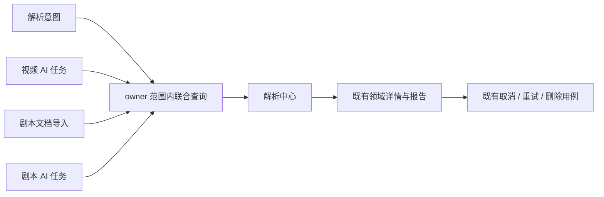

# 045 统一解析中心设计

状态：设计规格，尚未实现。2026-09-24 源码审查，HEAD 0435b13c；工作区存在其他前端修改。关联：[PRD](../prd/045-统一解析中心PRD.md) · [Plan](../plan/045-统一解析中心Plan.md)。

## 1. 已验证基线与缺口

| 当前代码 | 已有能力 | 需要补齐 |
| --- | --- | --- |
| backend/app/repositories/history_records.py | intent 与 video AnalysisJob 的 UNION ALL，owner 过滤、复合游标 | 明确 input_kind == video，遗漏 screenplay 和 Document |
| backend/app/services/history_records.py | 两种 HistoryRecordKind、安全标题补全 | 新类型、筛选、完整状态投影 |
| backend/app/schemas/history_records.py | parse/video_analysis 判别联合 | 文档与剧本 AI 分支，动作与可用性摘要 |
| frontend/src/components/intake/intent-history.tsx | 混合历史、视频 AI 精确 ID 导航 | 缺分类/筛选；仅视频 AI 活跃状态触发轮询 |
| frontend/src/components/screenplay/screenplay-document-route.tsx | 读取 documentId | 不接收 analysisId |
| frontend/src/components/screenplay/screenplay-analysis-panel.tsx | 从 documentId 读取最近分析 | 需将选中 analysisId 传入已有 useAnalysisJob 能力 |
| backend/app/models/analysis.py、analysis_run.py | 同一 AI 模型支持 video/screenplay，多次 run、report 引用 | 不需要另建剧本任务系统 |
| backend/app/models/document.py | 导入状态、软删除、基本计数 | 作为 document_parse 只读来源 |

源码事实不能证明 localhost 运行镜像一致；实施第一步记录源码/镜像版本及实际 API 返回类别。本次不读取私人正文或发起模型任务来证明设计。

## 2. 架构决策

解析中心是既有领域资源的统一只读查询。保留现有 HistoryRecordRepository → Service → Schema → 路由，不新增万能 Task 表、History 写入表或异步投影消费者。数据库现有记录立即纳入查询，不需要复制状态、补写任务或改动 outbox。



执行和权限仍由各领域拥有。列表不是权限凭证，详情及写操作重新校验。

## 3. 记录与查询契约

沿用 `GET /api/download-intents/history/records` 和 operationId `listHistoryRecords`，本期不为命名整齐新增平行聚合 API。旧意图历史端点的既有调用方仍按原职责使用，不在本期无证据删除。

目标 query：原有 before_created_at / before_id / before_record_type / limit，加 record_type、status_group、created_from、created_to、q、skill_id、document_id、download_id。时间带时区，q 去首尾空格且最长 100 字，limit 1–50。非法组合返回既有校验错误封装；不支持的类型/Skill/来源组合不能静默忽略。UI 的“剧本解析”传 document_parse 和 screenplay_analysis 两个类型。AI 改写筛选通过 result_contract；同时补对应 query 参数。

类型定义继续为 OpenAPI 判别联合；以下是字段设计，不是在前端创建手写 DTO：

| 层次 | 字段 |
| --- | --- |
| 共用 | record_type、id、title、created_at、updated_at、status_group、source_availability、result_availability |
| parse | 保留当前意图状态与 inspection_id/job_id；不返回原始 URL |
| document_parse | document_id、导入原始 status、source_format、error_code；无意义进度不填 0 |
| 两类 AI | analysis_id（等于 id）、原始 status、input_kind、result_contract、skill_id、skill_display_name、output_language、progress、stage、current_run_no、cancel_requested_at、error_code |
| AI 来源 | 视频 download_id / artifact_id；剧本 document_id；展示用引用不包括对象存储 key |
| 动作摘要 | allowed_actions 枚举及 action_unavailable_reason；服务端根据真实来源、状态、锁与结果生成 |

统一 source_availability/result_availability 使用 available/unavailable/unknown/not_applicable。列表只能证明数据库登记状态；不可每行 HEAD 对象存储。实际报告读取失败以明确不可用反馈处理，不覆写 succeeded。过期 inspection 的可用性单独计算。后台结构信息无法确认的历史记录为 unknown，不以空值冒充已删除。

skill_display_name：现有历史可从当前目录查名称，未找到回退 skill_id；若需求要求严格还原当时名称，新建时在 AnalysisJob 增加可空名称快照。旧记录不得伪造“当时名称”。此字段增强不阻塞四类覆盖。完整 Prompt、Skill instructions、模型原始响应不进入列表。

AI 具体结果按既有 result_contract 渲染，不根据 Skill 名猜 JSON 结构。当前统一 API 的“视频分析”注释应改为适用于视频/剧本的准确名称，不改业务执行语义。

## 4. SQL 与分页

在现有联合查询增加 Document 分支，AnalysisJob 分支按 input_kind 投影 video_analysis 或 screenplay_analysis。每个分支先 owner 过滤，适用时 deleted_at IS NULL，再施加类型/状态/时间/标题过滤。关联 Document/Artifact/Download 同样限制 owner；LEFT JOIN 保留源丢失但报告存在的 AI 任务。

保持现有严格排序 `(created_at DESC, id DESC, record_type DESC)`。游标三字段完整校验，不因新类型改变排序顺序。过滤必须发生在 LIMIT 之前；limit+1 判断下一页。禁止各源取 20 条再前端拼接，禁止按 updated_at 排序导致重试跨页漂移。

新插入记录位于首部，旧页不会自动混入；首部显示有新记录提示，显式刷新重置游标。状态筛选下，任务变化可以退出当前集合，这是活跃数据语义；不承诺跨多次请求冻结快照。删除/状态变化导致当前页为空时给出返回较新记录入口。无需 COUNT(*) 或为页签默认查询总数。

q 仅匹配持久标题字段，按字面转义 `%`、`_`；标题安全补全后的临时展示标签不保证可被关键词搜索，UI 提示“搜索内容标题”。初期复用 owner_created 索引，按 EXPLAIN 分析是否添加 owner/created_at/id 或带 deleted_at 的部分索引。模糊搜索达不到目标时再评估 pg_trgm；不预设现有数据库已启用扩展。

## 5. 页面、详情和记录关系

```text
解析中心                                     新建解析 ▾
全部 | 链接解析 | 视频 AI | 剧本解析
搜索内容标题     状态 ▾     时间 ▾     Skill ▾
旅行片  视频 AI · 导演拉片 · 简体中文   分析中    查看分析
第 1 集  剧本 AI · 综合审稿             已完成    查看报告
第 1 集  剧本基础解析                  已完成    查看正文
旅行片  链接解析                      已创建下载 查看详情
```

页签/筛选使用现有 shadcn 组件；Empty、Error、Feedback 沿用项目公共语义。不另起控制台视觉体系。

短期路由复用：视频 AI 沿用 `/downloads/detail?jobId=...&analysisId=...`；剧本 AI 进入 `/documents/detail?documentId=...&analysisId=...`；基础解析进入对应文档详情。每个详情校验 source_id 与 analysis_id 是否属于同一 owner 和同一来源；不匹配给出不可用，不读取另一个“最近”任务。

必须补独立报告入口 `/analyses/detail?analysisId=...`，供源资源删除/关联丢失时使用，直接读取 getAnalysis 并复用现有结果展示/报告导出组件。该页面只承担已有分析详情，无输入源时不显示可执行配置表单。不要新建同义结果 API。有来源的页面可链接这里，避免报告查看被源文件加载成功绑定。列表分支导航集中维护，未知类型不降级成链接解析。

来源详情增加“本素材全部分析”链接，带来源过滤到中心。中心一行是任务；详情显示当前 run_no 及“查看运行记录”。运行元信息若尚无公开契约，增加 owner-scoped `GET /api/analyses/{analysis_id}/runs`，默认 20、上限 50，按 run_no 降序游标分页，只返回运行时间、状态、trigger 和安全错误；不公开 prompt/CLI 原文。已有 report 关系不足以证明历史 run 的导出能力，本期不承诺历史报告切换。

## 6. 动作、刷新与并发

- 列表只导航，写操作复用 createAnalysis/createDocumentAnalysis/cancelAnalysis/retryAnalysis/deleteAnalysis，不新增统一 mutate API。
- 原参数重跑沿用现有同任务新 run 语义，配置改变新建任务。共享 mutation 幂等键与同任务互斥；未知网络结果不自动创建第二任务。
- 后端 allowed_actions 仅为呈现提示；写操作在事务中重新判定来源/运行状态，竞争冲突经既有 ApiError 展示并刷新。
- 创建/取消/重试/删除成功后失效所有当前身份的解析中心筛选缓存与来源详情；保留滚动和筛选。不因为写操作完成在已经离开的页面强制导航。
- 活跃判断覆盖所有类型，含 action_required 的低频状态同步；可见页面活跃处理默认 3 秒，等待人工操作 10 秒；后台暂停，恢复焦点立即读取。请求错误停止周期重试，提供手动恢复；终态停止轮询。
- QueryKey 包含身份代际、全部过滤与游标；读取接受 AbortSignal，状态有 version 的使用单调版本校验。其余类型实现时补版本投影或取消旧请求后串行更新，避免迟到结果回退。

## 7. 生命周期、删除与历史

复用领域软删除和对象清理，不新增保留期限。删除文档受 AnalysisDocumentLockRow 限制；分析报告删除遵循原分析用例。中心不绕过锁，不把隐藏列表当作已清理对象。

历史数据通过联合查询直接纳入；不做批量重新解析、不重跑 AI、不把既有所有文档标为 AI 完成。缺 Skill 名称、运行时间或资源关联时明确空值及未知。已删除任务不恢复。

若新增名称快照/索引，仅维护 backend/sql/schema.sql 当前态幂等 SQL，同步 ORM；在已有 PostgreSQL 服务的隔离空库及已有结构测试库验证，禁止另起基础设施。无结构变更时无需 SQL“迁移”。

## 8. 发布与观测

先生成新 OpenAPI 并检查所有消费方，再部署后端/前端配套版本。扩展判别联合可能让旧 Web/App 穷举解码失败，不能把新增枚举假定为兼容。上线前若有旧客户端使用本接口，则其发布升级是新类别启用的前置门禁；无法同步升级时本次不启用新类别，不临时维护第二套 DTO/API。

上线核对：固定测试账号四类条数/IDs 与 owner 范围 SQL 对照；历史入口 GET 无副作用；实际运行镜像与发布 SHA 一致。观测只记录类别、延迟、错误码、详情不可用率，不记录敏感输入。回退需后端/前端配套回退，新增可空字段/索引可保留；新分析仍在原领域表中，不需要逆向搬运数据。

Web 验收和 App 验收独立；新增通用列表接口若纳入 App，遵循 App 自身 AGENTS、冻结 OpenAPI 与生成 SDK，不手改生成文件。
