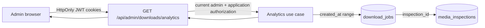

# 011 管理员下载数据分析设计

- 状态：Accepted
- 日期：2026-08-10
- DAC：DAC-011-01 ～ DAC-011-10
- 关联设计：`docs/design/archive/004-下载历史设计.md`、`docs/design/archive/008-用户资料与角色管理设计.md`、`docs/design/archive/009-Next前端与蓝白视觉系统设计.md`

## 1. 目标与边界

为管理员提供一个可视化的下载数据页，用于查看指定时间窗口内的任务总量、当前状态、成功率、每日趋势和视频来源分布。数据直接聚合 PostgreSQL 中的下载任务与已持久化解析记录，不使用浏览器本地存储、Prometheus 指标或伪造统计作为业务事实。

本编号不包含逐用户下载审计、用户排名、原始链接查看、数据导出、任务管理、实时推送或 Provider 健康监控。Provider canary、队列、存储和 SLO 属于 006 运维可观测边界，不与本页的业务下载统计混用。

## 2. 当前数据事实与来源关联



视频来源信息已经在现有下载闭环中持久化：

- `media_inspections` 保存 `extractor_key`、`provider_media_id` 和标题等解析快照。
- 原始来源 URL 只以 `url_ciphertext + url_nonce + url_key_id` 密文包保存，不存在明文 URL 列。
- `download_jobs.inspection_id` 外键把每个已创建下载任务与其解析来源稳定关联。即使 inspection 的解析 TTL 已过期，业务快照仍可用于历史和聚合读取。

因此本功能不在 `download_jobs` 增加重复来源列，也不新建分析事实表。聚合查询使用 `download_jobs -> media_inspections` 关联，以已持久化的 `extractor_key` 作为低基数来源维度；空白或未识别值统一归入“其他来源”。统计过程不解密 URL，不使用 `provider_media_id` 作为分组维度。

## 3. 统计口径

`days` 表示包含当前 UTC 日在内的日历天数，API 取值范围为 7–365，默认 30。`start` 是第一个统计日的 UTC `00:00:00`，`end` 是请求时的当前 UTC 时刻，查询包含 `start <= created_at <= end` 的任务；因此当前日是部分日。前端产品界面只提供 7、30、90 天三个快捷选项，API 仍保留 7–365 的参数校验契约。

统计对象是区间内按 `download_jobs.created_at` 创建的任务，每个任务只计一次；幂等重放返回同一任务时不重复计数。状态取查询时的 PostgreSQL 当前值：

| 指标 | 口径 |
| --- | --- |
| `total` | 区间内创建的全部下载任务 |
| `succeeded` | 当前状态为 `succeeded` |
| `failed` | 当前状态为 `failed` |
| `active` | `queued + running + retry_wait` |
| `cancelled` | 当前状态为 `cancelled` |
| `unique_users` | 按 `owner_hash` 去重后的用户数，只返回聚合数量 |
| `downloaded_bytes` | 区间内任务关联制品的 `size_bytes` 总和 |
| `average_duration_seconds` | 解析快照视频时长总和除以 `total`，无任务时为 0 |
| `success_rate` | `succeeded / (succeeded + failed) * 100`；四舍五入到 1 位小数，分母为 0 时返回 `0`，数值范围 0–100 |

每日趋势按任务 `created_at` 所在 UTC 日分桶，按日期升序返回，空白日补零。来源分布按任务数降序、来源 key 升序稳定排序，各来源使用相同的状态和成功率口径。

## 4. API 契约

`GET /api/admin/downloads/analytics?days=<7..365>`

- `operationId`: `getDownloadAnalytics`
- tag: `admin`
- 认证：必须是最新账户状态为启用的 `admin`。
- `days`：整数，默认 30，最小 7，最大 365。

响应示例：

```json
{
  "period_days": 30,
  "start": "2026-07-12T00:00:00Z",
  "end": "2026-08-10T12:00:00Z",
  "summary": {
    "total": 120,
    "succeeded": 96,
    "failed": 12,
    "cancelled": 4,
    "active": 8,
    "unique_users": 31,
    "downloaded_bytes": 9876543210,
    "average_duration_seconds": 318.42,
    "success_rate": 88.9
  },
  "daily": [
    {
      "date": "2026-08-10",
      "total": 7,
      "succeeded": 5,
      "failed": 1,
      "cancelled": 0
    }
  ],
  "sources": [
    {
      "source_key": "youtube",
      "source_name": "YouTube",
      "total": 45,
      "succeeded": 40,
      "failed": 5,
      "cancelled": 0,
      "active": 0,
      "unique_users": 18,
      "downloaded_bytes": 4567890123,
      "success_rate": 88.9
    }
  ]
}
```

响应 schema 使用严格字段白名单，不返回 URL 或密文包、`owner_hash`、`provider_media_id`、`provider_hints`、`error_message`、用户资料、对象存储字段或单任务详情。未认证返回 401，普通用户返回 403，`days` 越界返回统一 `ProblemDetails` 422。

FastAPI 路由使用 `get_current_admin` 进行协议层校验，应用用例仍接收当前 actor 并再次校验管理员角色，不得把路由依赖作为唯一授权边界。

## 5. 查询与性能

应用用例通过专用只读 repository 端口获取一致的摘要、日趋势和来源分布。SQL 先用 `download_jobs.created_at` 限定范围，再按 `inspection_id` 关联 `media_inspections` 并聚合；不加载单任务 URL 密文或完整 metadata。当现有 `(owner_hash, created_at)` 索引不足以支持跨 owner 时间范围查询时，可在当前态 SQL 与 ORM 中增加以 `created_at` 为前导列的索引，但不增加来源冗余列。

返回数量受 `days <= 365` 和低基数来源聚合限制，不返回无界任务列表。日期分桶和 PostgreSQL 时区行为必须用真实 PostgreSQL 验收，SQLite 单元测试不能单独作为数据口径证据。

## 6. 前端页面

新增静态 App Router 页面 `/admin/analytics`，页面标题为“下载分析”，通过 `ProtectedRoute requireAdmin` 改善交互，同时依赖后端最终授权。桌面账户菜单与移动 Sheet 只向管理员显示“下载分析”入口；直接访问时的返回 fallback 为 `/account`。

页面使用 009 的 Vercel Home 无边框语言：PageHeader 下方是受控 `days` 选择和手动刷新，摘要数字通过排版、留白和发丝 Separator 分组，不使用可见 Card 堆叠。每日趋势和来源分布使用响应式图表/比例可视化，并为同一数据提供语义化表格或列表摘要。图例、标签和数值不得只靠颜色区分，Tooltip 不承载唯一信息。

390×844 下摘要项重排，图表宽度不超过视口，来源表格转为 Item/摘要列表，不依赖水平滚动。初始、加载、成功、空数据、请求失败、刷新和过期响应失效均有明确状态。数据只通过 OpenAPI 生成服务与薄业务 facade 读取，不手写平行 DTO。

## 7. 设计验收标准（DAC）

- DAC-011-01：未登录和普通用户无法读取分析接口或渲染管理页，管理员角色变更立即生效。
- DAC-011-02：API `days` 支持 7–365，默认 30，越界返回稳定 422；产品页提供 7/30/90 天选项。
- DAC-011-03：摘要、日趋势和来源分布在同一 UTC 时间口径下与 PostgreSQL 任务事实一致。
- DAC-011-04：成功率为 0–100 的百分比，分母为 0 时返回 0，前后端不重复乘以 100。
- DAC-011-05：来源使用 `download_jobs.inspection_id` 关联已持久化的 inspection，不新增来源冗余列或分析事实表。
- DAC-011-06：统计不解密或返回 URL，不返回 `owner_hash`、`provider_hints`、`error_message` 及其他单任务内部字段。
- DAC-011-07：日数组按日期升序且空日补零，来源排序稳定，无数据时返回合法零值结构。
- DAC-011-08：页面有加载、空、错误重试、刷新和过期请求保护，快速切换窗口不会被旧响应覆盖。
- DAC-011-09：图表有可读名称和等价文本/表格，键盘、明暗主题、200% 缩放和 390×844 下可完成查看与筛选。
- DAC-011-10：OpenAPI 生成客户端、后端契约/聚合测试、前端组件测试与生产构建的实际结果记入 Acceptance；未执行的 PostgreSQL 口径或浏览器检查保持待验收。
