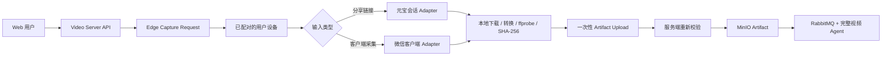

# 微信视频号 Provider 接入调研

- 日期：2026-08-12
- 调研范围：GitHub 广度检索、协议关键字交叉检索、活跃候选浅克隆、许可与代码来源核验、单元测试/构建与公开样例链接在线验证
- 总结论：**技术上可实现，且首期产品化可行性高**。有分享链接时，优先使用用户本地的腾讯元宝会话解析，无需安装根证书；没有可解析分享链接或遇到原始视频差异时，再回退到 Windows 微信客户端 + 选择性本地代理。两条路径都应在 Edge Agent 本地产出 MP4，当前代码尚未实现，Provider 保持 `unsupported`

## 0. 可实现性判定

| 目标形态 | 可行性 | 信心 | 判定 |
| --- | --- | --- | --- |
| `weixin.qq.com/sph/...` 分享链接 + 用户本地元宝会话 | 高 | 高 | 多份开源代码相互佐证；本次公开样例已实测解析和 CDN Range |
| Windows 微信客户端 + 本地代理 Edge Agent | 高 | 高 | 多个活跃桌面项目独立实现，适合作为兼容性回退 |
| 无会话、无微信客户端的匿名服务端 extractor | 低 | 高 | 未找到稳定、自给自足的实现；公共 Worker 本质上使用运营者 Cookie |
| 媒体前 128 KiB 的 ISAAC64/XOR 转换 | 高 | 高 | Go、Rust、JavaScript/WASM 至少三种独立实现和真值向量一致 |
| 整库复制某个高 Star 下载器 | 中低 | 高 | 存在限商、许可冲突、缺失构建产物、Windows DLL 和第三方代码来源问题 |

## 1. 调研方法

检索不只依赖“微信视频号下载”仓库名，还交叉检索 `finder.video.qq.com`、`finder-preview`、`decodeKey`、`WxIsaac64`、`wasm_video_decode` 和 `weixin.qq.com/sph/`。评估按“链接解析→元数据→媒体 URL→受保护前缀转换→可播容器验证”的完整链进行，并单独核对：

1. 是否有可审计源码，而不是只有二进制或下载页。
2. 是否显式需要微信客户端、元宝 Cookie、第三方 API Key 或公共 Worker。
3. 是否有真值向量、容器校验、负例、可重复构建和活跃维护信号。
4. 顶层 LICENSE 与 README 声明是否冲突，以及解密/WASM/代理引擎的原始来源是否可追溯。

## 2. 开源项目核验

以下数据为调研日当日的 GitHub 快照，Star 只表示社区覆盖面，不代表生产可用性。

| 项目 | 快照 | 核心路径 | 本次验证 | 许可与决策 |
| --- | --- | --- | --- | --- |
| [`BlueOcean223/EasyDownload`](https://github.com/BlueOcean223/EasyDownload) | 7 Star / 3 Fork，2026-07-30 仍更新 | Go + Wails；loopback 代理、动态生成 CA、严格 MITM 域名白名单、页面注入、ISAAC64 本地转换、容器验证 | `internal/detection/wechatadapter`、`internal/download/wechat`、`internal/proxy` 等子包测试全部通过；只因未先构建 `frontend/dist` 导致根包失败 | 顶层 MIT；**首要代码与安全边界参考**，复用仍需逐文件来源记录 |
| [`nobiyou/wx_channel`](https://github.com/nobiyou/wx_channel) | 2,371 Star / 374 Fork，2026-08-11 仍更新 | Windows 微信 + SunnyNet 本地代理 + 页面注入 + WebSocket/HTTP API + 本地下载转换 | 多个内部包测试通过；完整测试受缺失 Windows `nfapi.dll` 与 macOS 下 SQLite 重复链接阻断 | 顶层 MIT；架构和功能证据强，但不是当前 checkout 上可重复的整库构建；SunnyNet/解密代码需独立溯源 |
| [`27Aaron/ParseKit`](https://github.com/27Aaron/ParseKit) | 2026-08-11 仍更新的新项目 | Rust 库/CLI；元宝扫码登录→分享链接解析→feed API→下载→ISAAC64 前缀转换→ffprobe | 源码含已知微信密文前缀、完整 128 KiB 密钥流 SHA-256 和错误密钥不落盘测试；当前环境无 Rust toolchain，未执行 | 顶层 MIT；**分享链接路线首要参考**，上线前需在固定 Rust 环境复验并使用项目自有会话 |
| [`Evil0ctal/WeChat-Channels-Video-File-Decryption`](https://github.com/Evil0ctal/WeChat-Channels-Video-File-Decryption) | 343 Star / 112 Fork，2026-06-10 仍更新 | 使用微信 WASM 由 `decode_key` 生成 131,072 字节密钥流，反转后 XOR 媒体前缀 | 7/7 零依赖测试通过，包括 120 MB 大文件、XOR 可逆、前缀边界和 `ftyp` 校验 | 顶层 MIT；可作解密真值参考，但内嵌微信 WASM 的再分发权需单独审查 |
| [`ltaoo/wx_channels_download`](https://github.com/ltaoo/wx_channels_download) | 8,561 Star / 1,399 Fork，2026-08-12 仍更新 | macOS/Windows/Linux 本地代理、页面注入、本地转换；另有元宝 Cookie + Cloudflare Worker 分享链解析 | `pkg/scraper/wxchannels` 与 `pkg/certificate` 可编译，但无单测；全库 `go test` 要求修改 `go.mod` | Commons Clause + MIT，不允许未另行授权的销售型使用；只参考行为，不复制商业功能代码 |
| [`putyy/res-downloader`](https://github.com/putyy/res-downloader) | 19,092 Star / 2,371 Fork，2026-06-18 仍更新 | 跨平台资源嗅探、本地 HTTPS 代理、视频号本地转换 | 根包缺 `frontend/dist`，macOS 核心包还有 `fmt.Errorf` 格式检查失败 | LICENSE 为 Apache-2.0，README 有“禁止商业”声明，[许可澄清 Issue](https://github.com/putyy/res-downloader/issues/355) 仍未关闭；不复制源码 |
| [`jiamuAi/jiamu-wechat-channels-downloader-skill`](https://github.com/jiamuAi/jiamu-wechat-channels-downloader-skill) | 4 Star / 1 Fork，2026-08-04 仍更新 | TikHub 付费 API 获取作品/媒体，调用上述 WASM 服务转换，再转写 | 6/6 Node 测试通过 | 顶层 MIT；可参考任务编排与依赖指纹，但不应将付费第三方 API 当作核心 Provider |
| [`lyt26/wechat-channels-download`](https://github.com/lyt26/wechat-channels-download) | 1 Star，2026-07-31 仍更新 | Python 零依赖 UI，实际调用 `sph.litao.workers.dev` | Python 编译通过 | 顶层 MIT；只参考 UI，不使用默认公共 Worker |
| [`qiye45/wechatVideoDownload`](https://github.com/qiye45/wechatVideoDownload) / [`lecepin/WeChatVideoDownloader`](https://github.com/lecepin/WeChatVideoDownloader) | 5,591 / 4,680 Star；后者已归档 | 前者主要为二进制/资源，后者缺完整当前源码 | 无法执行可审计的重复构建 | 无清晰许可证，排除 |

[`yt-dlp/yt-dlp`](https://github.com/yt-dlp/yt-dlp) 当前没有微信视频号 extractor。开源项目表明存在两种有状态上下文：微信 PC 客户端会话，或腾讯元宝会话。所以视频号可以做到“粘贴分享链接后下载”，但不能将它宣称为无会话的匿名 HTTP 解析。

## 3. 已验证的技术链路

### 3.1 路径 A：分享链接 + 元宝会话

`ltaoo/wx_channels_download` 和 `27Aaron/ParseKit` 相互佐证了同一条两步链：

1. 用元宝会话调用 `https://yuanbao.tencent.com/api/weixin/get_parse_result`，将 `weixin.qq.com/sph/...` 转为 `wx_export_id` 和含 `token/eid` 的 `playable_url`。
2. 调用 `https://channels.weixin.qq.com/finder-preview/api/feed/get_feed_info`，获得作品元数据、H.264/H.265 候选、短时媒体 URL，以及在需要时使用的 `decodeKey`。
3. 下载后检查 BMFF/MP4 头；已是明文则直接验证，否则对前 128 KiB 执行 ISAAC64/XOR 再验证。

本次使用 `ParseKit` 仓库公开的样例分享链接，对 `ltaoo` 的公开 Worker 只做一次验证：解析 HTTP 200、`errCode=0`、响应含 `videoUrl`；对返回的 CDN 执行 `Range: bytes=0-4095`，得到 HTTP 206 与 4,096 字节，`ftyp` 位于偏移 4，且该样例未需要 `decodeKey`。这证明分享链路线在调研日实际可用，但公共 Worker 使用运营者配置的 Cookie，**不是生产架构**。

### 3.2 路径 B：微信客户端本地采集

对 `EasyDownload`、`nobiyou/wx_channel`、`ltaoo/wx_channels_download` 和 `putyy/res-downloader` 的源码核验得到如下共性：

1. 本地代理只对微信/视频号页面和目标 JavaScript 使用 MITM，媒体 CDN 应直通，并向页面注入受控采集脚本。
2. 注入层取得作品 ID、标题、封面、时长、媒体 URL/token 和 `decodeKey`，再交给本地下载器。
3. `decodeKey` 初始化 ISAAC64 密钥流，对默认 128 KiB 受保护前缀做 XOR；不同实现还会逐步扩大检查区域，直到容器验证通过或明确失败。
4. 下载完成后必须检查 MP4/BMFF 头、音视频轨、时长、文件大小和 SHA-256；不能将“HTTP 200”当作完成。

### 3.3 稳定性和能力边界

- 活跃项目已扩展到首页、作者页、搜索、批量、评论和导出，证明元数据能力可做，但这些不应随单视频下载一起默认发布。
- 调研日仍有[新版微信无法下载](https://github.com/ltaoo/wx_channels_download/issues/493)、[原始视频失败](https://github.com/ltaoo/wx_channels_download/issues/489) 和[解密失败](https://github.com/nobiyou/wx_channel/issues/91) Issue，必须将元宝/微信版本与 canary 绑定。
- 分享链路线比 MITM 安装负担低，但同样依赖未公开稳定性承诺的网页接口和用户会话；因此应有限时、限次、可撤销的会话导入和自动降级。

## 4. 推荐架构

视频号与红果共用 `user_device` 访问模式和 Artifact Import 协议，但使用不同的设备端 Adapter。

### 4.1 服务端控制面

- 新增 `ProviderAccessMode.USER_DEVICE`，不复用 `anonymous` 或 `operator_managed` Runner。
- 用户选择已配对设备后创建有 TTL 的 Edge Capture Request；任务只含输入链接、Provider、用户权利声明和大小/时长上限。
- 每任务发放只能写一个对象的一次性上传会话；Edge Agent 不获得 MinIO、数据库、RabbitMQ 或 AI 通用凭据。
- 服务端重新计算 SHA-256，执行 ffprobe 和大小/时长/轨道门禁，校验 Provider、作品 ID 与任务绑定后才创建 Artifact。
- 下载与分析仍是两个独立任务；设备采集失败不生成空制品，AI 失败不改写制品导入成功状态。

### 4.2 分享链接 Edge Adapter

- 首期输入限定为 `https://weixin.qq.com/sph/<id>`，所有重定向和媒体 URL 都按严格域名 allowlist 校验。
- 元宝 Cookie 由 Edge Agent 从用户本地登录会话导入，不进入 API 请求、服务端数据库、日志或上传 manifest。
- 先优先使用经验证的明文/直达媒体；仅在容器验证失败且返回 `decodeKey` 时执行前缀转换。
- 解析和下载都需 TTL，下载前 re-resolve，不持久化媒体 URL、token 或 `decodeKey`。
- 不回退到默认公共 Worker；用户会话不可用时返回 `provider_session_required`，或显式引导到微信客户端采集路径。

### 4.3 微信客户端 Edge Adapter

- 首期只支持 Windows 10+ 和经 canary 的固定微信版本，不因 Go 代码可交叉编译就声称 macOS/Linux 可用。
- 本地端口只绑定 loopback，管理 API 需要每安装独立的设备密钥；不开放无认证 Web 控制台到局域网。
- 根证书与私钥必须每安装随机生成、本地存储和可一键卸载；不复用开源仓库中内置的通用 `SunnyRoot.key`。
- 代理尽可能限定到微信进程和经审查的第一方域名，任务完成/异常退出都必须恢复代理设置。
- `decodeKey`、媒体 token、Cookie、请求/响应原文和 CA 私钥只留在本地内存或单任务目录，日志和上传 manifest 中均不得出现。
- 首期只采集用户明确选中的单个视频；批量作者归档、评论导出和雷达监控等高风险能力后置。

### 4.4 开源代码复用策略

1. 优先独立实现窄协议 Adapter，不整库 fork 或把桌面应用嵌入服务端。
2. 分享链路线优先参考 `ParseKit` 的域名约束、Cookie 状态评估、密钥真值向量和错误密钥不落盘设计；若复用 MIT 代码，逐文件记录来源并保留声明。
3. 微信客户端路线优先参考 `EasyDownload` 的 loopback、动态 CA、严格域名白名单、私密字段不进 UI 和视频子包测试。
4. 若参考 `nobiyou/wx_channel`，对 SunnyNet、WASM/解密代码及其原始来源单独审计，不携带仓库中的预置私钥或平台 DLL。
5. `putyy/res-downloader` 在许可声明冲突未澄清前不复制源码；`ltaoo/wx_channels_download` 受 Commons Clause 限制，商业产品不复制、链接或再发行其功能性代码。
6. 密钥流转换若独立实现，使用公开真值向量与项目自有授权样本交叉验收，不再分发来源不明的已删仓库代码或微信 WASM。

## 5. 不采用的方案

- 不将用户分享链接发给 `sph.litao.workers.dev` 或其他公共解析站。
- 不在中心服务保存微信/元宝 Cookie，不使用单一运维账号为所有用户代理内容权益。
- 不把本地代理伪装成 Docker 内的无状态 Provider；它依赖客户端版本、已登录会话和设备信任链。
- 不直接运行无源码或无许可证的高 Star 二进制。
- 不默认开启批量扫描、评论抓取、账号搜索或持续监听。

## 6. 发布门禁

视频号从 `unsupported` 调整为 `access_required`/`verified` 前需要：

1. 固定 Edge Agent 版本；分享链路线绑定元宝网页版本/canary，客户端路线另绑定 Windows 和微信版本；记录 SBOM、转载许可、源码来源和可重复构建结果。
2. 用项目自有或明确授权的单个视频完成分享链接→本地 MP4→一次性上传→服务端校验→MinIO→AI 报告 E2E。
3. 微信未登录、设备离线、分享链接过期、无视频、加密前缀变化、解密失败、上传过期、哈希不匹配和超限负例。
4. 分享链路线验证 Cookie 只留本地、媒体域名严格 allowlist 与短时 URL 过期行为；客户端路线另确认代理仅覆盖评审域名、异常退出恢复网络且根证书可卸载。
5. 通过流量和日志验收，证明服务端未收到 Cookie、token、`decodeKey`、CA 私钥、原始响应或带签名媒体 URL。
6. 加入客户端版本 canary 与自动降级；连续失败后停止发放新任务，而不对用户链接无界重试。

## 7. 实施顺序

1. 先实现通用 Artifact Import 和原始媒体上传，让红果/视频号成品视频能够立即进入现有分析链路。
2. 实现设备配对、Edge Capture Request、一次性上传与服务端复验协议。
3. 先实现视频号单分享链接 Adapter：本地元宝会话、严格域名门禁、明文优先、ISAAC64 回退、ffprobe/SHA-256 后上传。
4. 再实现 Windows 微信单视频采集 Adapter，用于没有分享链接、分享链解析失败或特殊媒体类型。
5. 稳定后复用同一设备协议实现 Android 红果 Adapter；红果无许可证参考代码不进入生产仓库。
6. 最后再评估视频号批量、评论和红果整剧能力，每类能力单独限额、授权和 canary。
