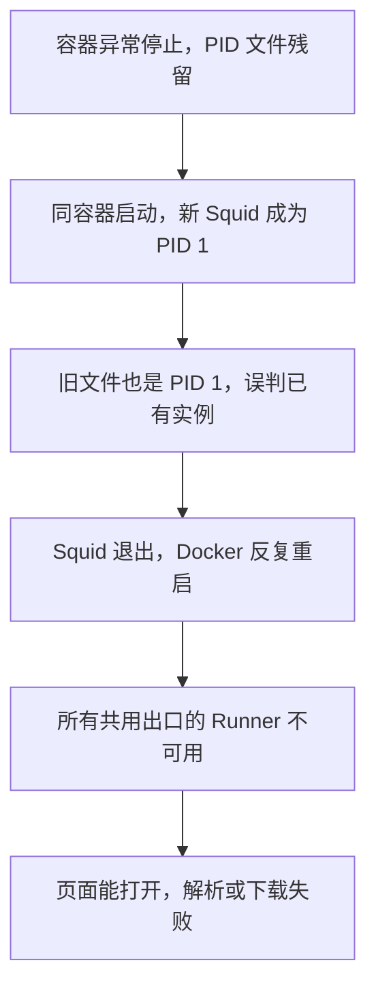

# 万能视频下载器的持续可用性与重启恢复方案

## 1. 结论与修复顺序

**当前最紧急的问题已定位到公共出口代理的异常重启缺陷，不能归咎于全部平台登录同时失效。** Squid 的 PID 文件保存在容器可写层，异常停止后残留；新进程再次成为 PID 1，读取旧文件时把自身误认成已运行的旧实例，立即退出。所有依赖这个出口的 Runner 因而不可用。相同镜像的隔离实验复现了故障，也验证了把该目录改为 tmpfs 后可在强制终止后恢复。

**“每次获取登录信息”另有三种机制，需要分开修复：** 现有浏览器来源逐操作重新导出 Cookie；文件来源没有跨操作更新能力；错误分类把含义模糊的 `Fresh cookies` 直接翻译为需要登录。导出 Cookie、更新短期访问证明、用户重新登录，是三个不同动作。

持续支持平台的可落地目标应是：对声明范围内的平台能力持续验证，内部故障自动恢复，授权有效时复用，授权确实失效时一次性要求正确的人处理，上游变化时及时定位与发布适配修复。yt-dlp 官方也明确说明，列入支持清单不代表始终可用，网站变化需要实际验证。[^1]

建议依次实施：

1. **P0：修复 Squid 残留 PID，恢复共同出口。** 先处理导致多个平台一起失败的内部缺陷。
2. **P1：固定可复现的部署输入，纠正错误分类。** 不再通过临时配置或重复登录掩盖问题。
3. **P1：完善会话来源修订与复用。** 复用 035 的单平台模型，先实现确定性恢复，再逐平台验证自动更新是否成立。
4. **P1/P2：启用真实平台探针、重启演练与引擎候选发布。** 让平台退化在用户投诉前可见。

本方案延续 [035 设计](../design/035-平台访问与会话恢复能力设计.md)，不另建下载架构。这里的修复项是待实施方案；本次完成的是代码核对、运行诊断、隔离实验和研究文档，业务服务尚未修复或重启。

## 2. 基线与证据强度

证据采集于 2026-09-15，约北京时间 10:24–10:30。Server 工作树起始干净，HEAD 为 `6b50c83dcb07f15e8471a79f047a1b050cbee8a8`。App 存在大量既有改动，本次未修改。运行中的业务镜像为 `sha256:b9c1cb2afbfd570ed49380a24d029be765f150096b1843379c3542822c06f233`；不能把工作树 HEAD 当作所有运行代码版本。

| 编号 | 本次直接观察 | 说明与边界 |
| --- | --- | --- |
| L1 | `egress-proxy` 为 restarting，退出码 1；首次详细快照重启计数 795，稍后为 798 | 当前持续故障；计数是 Docker 记录，不等于人为重启次数 |
| L2 | 日志反复出现 `Squid is already running`，指向 `/tmp/squid.pid` 和 PID 1 | 精确失败位置与源码机制一致 |
| L3 | 匿名、YouTube、抖音、Reddit、视频号共五个 Runner 的出口 TCP 探测均为 false | 共同出口不可用；不意味着其他尚未启动的 Runner 已实测 |
| L4 | 上述 Runner 的来源 readiness 均为 true；其中四个 Operator 为宿主代理来源 | 代理无 Cookie 的 probe 往返可用，**不是上游账号有效性验证** |
| L5 | API 健康，五个 Runner 不健康 | 全局 API readiness 有意只覆盖核心依赖，缺少明显的下载功能退化信号 |
| L6 | API、Worker、Canary 配置九个 Operator 端点，但仅四个对应 Operator 正在运行 | 小红书、X、Instagram、Facebook、Pinterest 的配置端点缺少运行实例；这不自动否定它们的匿名路线 |
| L7 | 四个默认策略为 `youtube/douyin/reddit/wechat_channels → operator_public` | 当前这些默认解析确实依赖平台来源；不能假设仅有链接就走匿名 |
| L8 | API、Worker、Canary、视频号启动标签含 `/tmp/framefetch-yuanbao-deploy.cu1Y9k/images.yml`，文件现已不存在 | 同容器 restart 可用原配置；重建/换机无法原样重放该输入 |
| L9 | 运行中的 Canary 的 `PROVIDER_CANARY_TARGETS` 数量为 0 | 该实例没有配置定时目标；不代表历史手动矩阵或业务证据不存在 |
| L10 | 已认证与未认证的抖音上下文，输入 JSON 解析失败加 Fresh cookies，均返回 `credential_required, 422` | 确定性复现误分类；不能由这条字符串证明需要用户重新登录 |
| L11 | 114 项相关既有测试通过，其中有测试明确期望 Fresh cookies 映射为 credential_required | 现有绿色测试不能证明需求正确，更没有覆盖这次异常重启路径 |

运行镜像与本地 `provider_sessions.py`、`provider_errors.py`、`readiness.py` 的 SHA-256 相同；`provider_session_source.py` 不同。容器内的来源选择文件与实际执行浏览器导出的宿主代理也不是同一执行位置，所以本报告只对已经核实的文件作等同性判断。

## 3. 重启为什么会让多个平台一起不能下载

### 3.1 已确认的 Squid 故障链

当前两个业务 Compose 文件均使用 `entrypoint: ["squid"]`、`command: ["-N", "-f", "/etc/squid/squid.conf"]`。当前 [Squid 配置](../../backend/egress/squid.conf) 使用 `pid_filename /tmp/squid.pid`，但代理服务没有为 `/tmp` 配置 tmpfs。

容器可写层的文件在同一个容器停止后仍可保留。Squid 6.6 的 `Instance::ThrowIfAlreadyRunning()` 读取 PID 文件，再通过 `kill(pid, 0)` 检查对应 PID 是否存在；它不能从这个检查区分“上次容器的 PID 1”和“本次启动的 PID 1”。正常退出会尝试清理文件，但强制终止不能依赖退出清理。[^2][^3]



此链条解释当前故障；尚未取得上一轮关机/停止的完整事件记录，不能断言每一次历史失败都由强杀触发。即便如此，“残留文件导致当前持续启动失败”已有日志、源码与实验的相互印证。

### 3.2 隔离实验

使用现有代理镜像 ID `sha256:8a3baed477e2c282ab8aa5edad442f69873246964f225c5c2ae8364b6610963c`，启动两个临时代理容器，`--network none`，没有业务网络、凭据或宿主浏览器。最小配置保留同样的前台启动和 PID 路径，并拒绝所有 HTTP 请求。每组都先正常启动，然后 `SIGKILL → docker start`。

| 方案 | 初次启动 | 强杀后再启动 | 残留 PID 错误 | `squid -k check` |
| --- | --- | --- | --- | --- |
| PID 位于原可写层 | running | exited，退出码 1 | 出现 | 失败 |
| `/tmp` 使用 tmpfs | running | running | 未出现 | 退出码 0 |

临时容器及其自动卷已清理。结果证明修复机制成立，**尚未证明生产 ACL、DNS、实际媒体传输、Docker Desktop 整机恢复或连续运行已通过**。原始实验结果位于本机临时研究目录；本表保留可持续审阅的脱敏结果。

### 3.3 为什么 restart 和重建会表现不同

- `docker restart` / `docker compose restart` 复用容器及其可写层；既不会自动解决残留 PID，也不会应用新增挂载或改过的环境变量。
- `docker compose up` 在需要时重建容器；新可写层可能使症状暂时消失，但如果没有修复 PID 生命周期，下次异常停止仍会重现。
- Docker daemon/Desktop 重启按运行时策略恢复容器，不等于重新执行一次 Compose 的完整依赖启动流程。
- Compose 的 `depends_on.condition: service_healthy` 主要约束 Compose 启动；`depends_on.restart: true` 也不覆盖容器运行时自动重启事件。不能靠加这一行解决持续故障。[^4][^5]

## 4. 为什么解析时总像在重新登录

### 4.1 当前实际调用链

[ProviderSessionStore.operation](../../backend/app/runner/provider_sessions.py) 在每次受控操作中调用 `sync(provider, version)`。当前浏览器来源通过文件队列申请一次加密导出；宿主代理创建有界子进程，从 Chrome 中读取该平台 Cookie，或使用元宝专用来源。`sync` 在这里主要是“重新读取来源”，不等于调用平台的续期接口。

```text
用户解析 → 领取一次会话副本 → 临时 jar → yt-dlp → 清理副本
用户创建任务 → Worker 开始执行 → 再领取一次会话副本
             → 下载前重解析 + 下载，共用这一操作的 jar → 清理副本
```

[Runner service](../../backend/app/runner/service.py) 已在一个下载操作内共用 jar 完成重解析和下载。不能误写成该步骤又独立登录三次，也不应为了少一次会话获取而删除下载前重解析：CDN 地址会过期，内容身份和格式仍需检查。

### 4.2 三种来源的具体问题

| 来源 | 已实现行为 | 重复访问与持久化边界 | 最小改进 |
| --- | --- | --- | --- |
| Chrome 平台 Cookie | 每个操作读取域白名单 Cookie；macOS 限定、短进程、加密交付 | 依赖宿主用户、Keychain、Chrome 数据结构；反复读取不是重新授权，但增加前置开销和失败点 | 发布有修订的单平台快照；操作只领取已验证修订；来源不可用不能改成用户未登录 |
| 只读 Cookie 文件 | 每次打开并过滤过期项，计算 keyed revision，临时副本执行 | 文件可跨重建保存；副本中的 Set-Cookie 不回写来源，无法证明自动续期 | 先保留只读契约；需要更新的平台由来源所有者原子发布新修订 |
| 专用元宝 Profile | 本地持久 Profile，每次导出启动浏览器、访问首页、读取动态状态后关闭 | **已经持久化**，不能再把原因说成每次创建空 Profile；冷启动、页面状态和 15 秒导出预算仍可能产生间歇失败 | 分阶段测时；只在证明动态状态可安全复用后缓存/维护，不先改为全局常驻浏览器 |

元宝已有代码和过去单次验收，不等于长期稳定。现有 CQ-027 记录过来源成功而平台请求间歇失败，本轮没有通过实际导出来重新验证其登录状态。当前代理探针不读取 Cookie，也不会触发重新登录。

### 4.3 已确认的错误分类缺陷

固定 yt-dlp commit 的抖音实现中，`aweme_detail` 未取得时会输出 `Fresh cookies (not necessarily logged in) are needed`。它前面使用 `fatal=False` 获取 JSON，因此网络失败、非 JSON 返回、缺少字段等情况均不能仅凭该末尾信息归结为账号过期。[^6]

本项目 [provider_errors.py](../../backend/app/runner/provider_errors.py) 不区分认证状态，匹配 `fresh cookies + needed` 即返回 `credential_required`；[media_runner.py](../../backend/app/integrations/media_runner.py) 再将其转换为 `MediaInspectionAuthRequired`，Web 最后显示“需要平台登录或官方授权”。此外 `rate-limit reached or login required` 也被归到凭据缺失。这使模糊的上游失败变成确定的用户登录要求。

GitHub #16867 有“带有效 Cookie 仍出现相同报错”的报告；本次核实该 issue 已关闭，创建于 2026-06-03，更新于 2026-08-16。它只作旁证，关闭状态不证明本项目已修复，主要结论来自当前固定源码和本地复现。[^7]

### 4.4 FrameFetch 登录与平台登录也要分开

Web 的 [request.ts](../../frontend/src/lib/request.ts) 有针对站内 401 的 refresh/登录跳转链。平台受控会话缺失一般是 422，来源不可用是 503，不应触发站内退出。此次没有证据证明站内 JWT/refresh 数据因每次解析失效。

后续需补契约回归：平台 422/429/503 不清除 FrameFetch 会话；只有站内认证真正失败才走站内登录。若实际现象是跳到 FrameFetch 登录页，应另查 401 请求、站内签名密钥是否稳定、refresh 持久化与并发刷新，不能拿平台 Cookie 修复代替。

## 5. 上游资料对方案的约束

| 主题 | 第一方结论 | 对本项目的决定 |
| --- | --- | --- |
| yt-dlp 平台支持 | extractor 被列出不保证此刻工作 | 支持粒度必须到能力、策略、引擎组合和近期证据；不以注册平台数量验收[^1] |
| YouTube Cookie | 打开的 YouTube 标签页会轮换账号 Cookie；官方说明独立导出会话的方式 | 普通 Chrome 实时读取与稳定文件导出是不同来源策略；避免让日常浏览无意改变后台账号会话[^8] |
| YouTube EJS | 需要兼容的 JavaScript runtime 与 EJS；Node 需要显式启用 | 当前已有 Node/runtime 参数和 `yt-dlp[default]`，核对版本组合；不把“安装 Deno”当通用修复[^9] |
| YouTube PO Token | 证明可能绑定会话或视频，且有有限生命周期；建议通过 Provider 提供 | token 是按需派生状态，不是永久登录凭据；错误和健康独立于账号状态[^10] |
| bgutil | HTTP Provider 与插件是配套组件；有 token 仍可能失败 | 保留已有受限 sidecar；先同版本组合验证，不通过换账号或代理扩大尝试[^11] |
| Docker | tmpfs 在停止后丢弃；restart 不应用配置；依赖重启语义有范围 | 临时 PID/租约用 tmpfs；真正持久来源用持久目录；部署与恢复分别验收[^3][^4][^5] |

GitHub releases/latest 本次返回 yt-dlp `2026.08.19`，与本项目固定版本一致；因此不能把这次公共出口故障直接解释为“yt-dlp 太旧”。上游未来回归仍需候选更新通道，但启动时在线升级会破坏复现性。[^12]

另一个必须安排的依赖项是 bgutil：本机运行 1.3.2，而本次官方 latest 返回 2026-09-08 发布的 2.0.0。发布说明披露服务端安全问题，并改变默认监听地址。应优先评估插件与服务成对升级，在候选环境核对容器间监听、请求格式和网络隔离；不能只替换版本号后把新增连接失败误当登录失效。本次未做漏洞利用验证，也没有证据表明部署已遭利用；该升级不替代 Squid 修复。[^14]

本机该 Provider 没有发布宿主端口，仅连接专用 `youtube_pot_net`，且使用项目自己的 supervisor；所以不能直接套用上游默认公开监听部署的风险结论。升级验收还必须覆盖这个 supervisor 的固定版本、代理和请求约束。

## 6. 可落地的目标结构

保留 FastAPI、PostgreSQL、RabbitMQ/Outbox、Worker、匿名/单平台 Operator Runner、MinIO 与既有 Canary。优先补齐状态生命周期，而不是更换整个下载引擎、引入账号池或新增工作流产品。

### 6.1 状态必须有明确所有者

| 状态 | 持久位置/所有者 | 重启规则 |
| --- | --- | --- |
| 任务、attempt、lease、cooldown、制品元数据 | 现有 PostgreSQL | 重投幂等；失败/冷却不因重启归零 |
| 最终媒体文件 | 现有对象存储 | 校验存在、长度、哈希与媒体结构；设备保存另验 |
| 部署文件、镜像组合、平台默认策略 | 持久运维配置 | 可重放，不引用已删除临时文件 |
| 平台授权来源 | 单平台持久目录/已批准专用 Profile | 有效时恢复；撤销不恢复；未知有效性进入待验证 |
| 操作 Cookie jar、文件队列租约、PID | tmpfs/临时队列 | 丢弃后重建，不作为登录状态来源 |
| CDN URL、短期证明 | 单次操作/受限缓存 | 过期重新解析或按协议生成，不永久保存作恢复依据 |
| 展示状态缓存 | 既有进程内缓存 | 可丢弃，不参与授权或任务真实性判定 |

### 6.2 来源修订与身份

现有动态来源的 `credential_version_id` 固定为 `browser`，不能证明两次读取属于同一主体，CQ-020 已登记。文件来源有 keyed revision。不要为解决更新后 context 不相等而删掉相等检查。

沿用 035 设计的最小来源记录：`source_id、provider、source_kind、subject_epoch、revision_id、client_profile_id、egress_binding_id、state、validated_at、expires_at?`。敏感 payload 与真实主体信息留在来源私有存储；业务 DB/API 只保留不透明引用。

实施分两步：

1. **先做到来源确定性。** 浏览器来源生成不可变修订。解析冻结修订，下载只领取完全匹配的修订；旧修订不可用时准确要求重新解析，不默默换账号。领取失败、来源锁定或代理离线不撤销登录。
2. **再证明同主体更新。** 只有平台提供可核验的主体/更新方式时，来源维护者才能确认相同 `subject_epoch` 并发布新修订。无法证明主体一致时更换 epoch，旧任务不得继承新账号。首期旧 context 不自动跟随新 revision，使用新解析产生新任务。

来源状态采用 `unconfigured → validating → ready`；之后可进入 `renewing / unavailable / action_required / revoked`。网络暂时失败只能进入 unavailable；明确的撤销进入 revoked；无法自动完成的登录/设备确认进入 action_required。`expires_at=null` 表示未知，不是永不过期。

### 6.3 会话复用而非每次重新导出

普通操作应为 `acquire(expected_revision) → 临时只读副本 → release`。来源内部处理变更发现、单写者更新与原子发布；多个并发请求共享同一次来源更新结果，避免同时解密 Chrome 或同时启动元宝。旧修订只保留到允许的短期操作窗口，撤销立即停止发放。

不要用一个固定“缓存 30 天”代替有效性设计。普通 Cookie、本机动态元宝状态、YouTube 短期证明的有效期不同；缓存必须有提供方约束、验证时间、撤销 epoch 和最大领取窗口。首期文件来源无需新增服务；浏览器复用的必要性和可行性先在一个平台验证，通过后才扩展。

Set-Cookie 不自动意味着允许或足以续期，也不意味着返回内容属于同账号。Runner 继续不写宿主 Secret；如确有更新需要，由来源维护者校验字段、域、主体和并发版本后原子发布。失败时保留上一份未撤销的材料但标记准确状态，不覆盖为空文件。

## 7. P0：公共出口修复与可执行恢复步骤

### 7.1 候选代码变更

在 `docker-compose.yml` 和 `docker-compose-prod.yml` 的 `egress-proxy` 同时增加：

```yaml
tmpfs:
  - /tmp:rw,noexec,nosuid,size=16m,mode=1777
```

保留当前 `pid_filename /tmp/squid.pid` 和 `squid -k check`。这样一次运行中仍有 PID 文件用于进程检查，容器停止后由 tmpfs 生命周期清理。本次已验证此组合的最小强杀恢复；生产容量与实际配置还需验收。

备选是专门的 `/run/squid` tmpfs 加正确 uid/gid，但涉及 PID 路径和权限联动，当前没有必要增加变更面。Squid 官方支持 `pid_filename none`，但这会让依赖 PID 文件的 `-k check` 等命令失效，不能只改一行便上线。[^2][^13]

### 7.2 发布前准备

1. 记录当前 proxy/app 镜像 ID、运行配置来源、默认策略、Operator 清单；输出必须脱敏。
2. 保持公共出口 ACL，使用同一代理镜像验证当前完整配置、权限、健康检查与拒绝私网目标；不为“恢复下载”取消出口隔离。
3. 确认活动任务状态；排空/暂停新的媒体任务后只替换代理。当前公共出口已故障，也不能盲目全栈停机。
4. 保留既有平台来源、对象存储、数据库和运行镜像；不得使用 `down -v`、全局清理或重新导出所有账号。

完成代码修改及镜像核对后，当前生产拓扑可按以下入口仅重建代理：

```bash
docker compose --env-file .env.prod \
  -f docker-compose-prod.yml -f docker-compose-browser.yml \
  up -d --no-deps --force-recreate --no-build --pull never --wait egress-proxy
```

这是实施时的候选命令，本次未执行。须先验证本地代理 tag 对应已核实 image ID；若不一致，先在持久部署覆盖中固定批准镜像。代理无需引用缺失的临时业务镜像覆盖文件；后续重建 API/Worker 前必须先完成第 8 节的部署固化。

### 7.3 恢复验证

代理进程检查通过后，依次检查 Runner 的出口 TCP、代理协议转发、固定自有小样本 metadata、media、对象存储和真实客户端文件保存。记录每阶段结果，不把某一个 HTTP 200 当作完成。

本次未取得代理恢复后的实测，所以当前业务恢复仍为未通过。P0 完成条件是相同服务实例多轮正常停止和强杀恢复都成功，恢复后能生成并取回完整音视频文件；整机重启另列验收。

## 8. P1：让部署能被准确重放

### 8.1 消除临时配置依赖

本次发现的 `/tmp/.../images.yml` 已丢失，必须把最终镜像组合与部署覆盖移至持久配置目录。仓库保留无 Secret 的入口/示例，私有 `.env.prod` 只在部署端维护。不能直接把含环境变量展开值的 `docker compose config` 全文提交到仓库。

建立最小发布清单，记录：业务镜像摘要、代理镜像摘要、yt-dlp commit、JS/EJS/插件/PO Provider 组合、Compose 文件列表、启用 profiles、各平台 source kind 与默认策略。实际使用源码挂载的宿主来源代理也记录版本与执行路径。回滚以这个清单为单位，不能只移动一个 `video-server:prod` tag。

### 8.2 预检失败要直接说明原因

复用现有 Python CLI 组织一个脱敏部署预检入口即可，不必新建管理服务。预检至少覆盖：

- 部署输入文件存在，所有必要镜像可用，当前镜像与清单相符。
- 默认/允许的受控策略存在对应 Runner、DNS/端口与正确 source kind；未启动路线不显示为已可用。
- 会话文件目录可达、只读与权限正确；宿主代理采用无 Cookie probe；不要自动测试登录或刷新全部账号。
- 工作目录权限、现有 schema、MQ、对象存储符合当前运行要求。
- 生产若宣称开启平台监测，Canary targets 不能为空；显式关闭时显示“监测未配置”，不显示绿色。

本机九个配置端点、四个活动 Operator 的差集要逐个裁决：要么按需要启动并验证，要么从允许的受控路线中移除并显示未配置。不能仅因配置了五个端点就批量要求登录五个平台。

### 8.3 分开核心健康与下载能力

保留核心 API readiness 不依赖所有平台，避免一个平台故障拖垮登录、历史记录、上传与已有文件下载。新增或扩展现有管理员运行诊断，分别显示 `core / egress / runner / source / upstream / artifact`。

共同出口故障应使依赖它的解析快速返回可重试的服务故障，并在产品中展示“下载服务暂时不可用”。不要触发平台注销，也不要把所有平台标成永久不支持。出口恢复后受控地恢复探针，不同时让所有失败请求猛烈重试。

## 9. P1：错误分类、预算与恢复动作

### 9.1 分类与用户动作矩阵

| 证据 | 内部分类方向 | 自动动作 | 面向用户 |
| --- | --- | --- | --- |
| Runner DNS 不存在、代理 TCP 不通、来源进程无响应 | configuration / runtime unavailable | 暂停该路线、告警、有限恢复探测 | 服务暂时不可用；不提示重新登录 |
| 没有配置任何来源 | credential_required / source_missing | 不重试授权 | 管理员需完成一次来源配置 |
| 来源明确过期、平台明确拒绝会话或撤销 | credential_expired / revoked | 停止旧 epoch；一次通知 | 平台连接需要重新授权 |
| Douyin 空 JSON + Fresh cookies，没有明确失效证据 | provider_temporarily_unavailable；有挑战证据才 verification_failed | 原上下文最多一次受预算约束的重试 | 平台暂时无法解析/需要验证；不伪称账号失效 |
| 429 / Retry-After | provider_rate_limited | 持久化冷却，遵守 Retry-After | 显示何时可再试 |
| CAPTCHA/挑战页 | egress_challenged | 停止自动尝试；保存已有来源 | 需要平台验证，不循环登录 |
| 页面结构变化/缺失解析字段 | extractor_regression | 保留脱敏失败摘要，进入候选适配流程 | 平台解析暂不可用 |
| CDN 403，但页面解析有效 | 先区分 URL 过期、头/出口绑定、PoT、明确授权拒绝 | 仅同上下文有界重解析；不一律刷新账号 | 按最终分类给出准确动作 |
| 音轨缺失、ffprobe 5xx、文件截断 | media/transport/validation | 区分临时探测故障与真实格式缺失 | 不以静音或不完整文件宣告成功 |
| DRM、删除、私有、权益不满足 | 对应内容错误 | 不自动重试 | 明确该内容边界 |

现有 API 已有 `provider_temporarily_unavailable`、`provider_verification_failed`、`provider_rate_limited` 等语义，应优先复用。新增内部原因时保持普通页面简洁，细节在管理员诊断中展示。不能把所有 403 改成网络错误，或把所有 Fresh cookies 改成“引擎回归”；证据不足要明确保留不确定性。

### 9.2 重试的总预算

首期建议将“同一次解析的额外修复”限制为最多一次，作为待压测的工程预算，不是平台官方限额。任务级、HTTP 层、yt-dlp 和插件已有重试应合并计算，不能新增一层后造成乘法放大。下载断点重试仍遵守既有媒体语义和校验；不对长媒体粗暴重下全部内容。

重试不得更换账号、访问策略、出口或引擎，不得跨越绝对 deadline；认证撤销、验证码、DRM、内容不存在不进入自动重试。冷却/已消费预算必须跨 Worker 重启持久化。已有 `provider_route_admission.py` 与冷却表可复用；任何新字段只按实际用例加入当前态 schema。

恢复前重新解析来源身份和语义计划，产出文件后仍执行音视频轨、完整时长、哈希/长度校验。旧任务、旧失败、旧静音制品保持事实，不改数据库冒充已修复。

## 10. 23 个当前平台的维护策略

以下是当前 Registry 的 23 个平台及建议维护责任，不是本次实时成功清单。`verified` 静态声明也不能覆盖当前共同出口故障。通用链接、公众号文章发现及条件式 PeerTube 需要各自能力记录，不能从下面的单视频能力外推。

| 平台 | 现有访问能力/建议默认方向 | 专项维护与验收 |
| --- | --- | --- |
| YouTube | 匿名/受控均存在；本机当前默认受控 | Cookie、mweb、JS/EJS、PO Provider、出口分别诊断；完整音视频与 Shorts 分开 |
| 哔哩哩 | 公开匿名 | 短链、音视频分轨、CDN 4483/8082 与域限定 ACL |
| 抖音 | 匿名/受控；本机当前受控 | Fresh cookies 歧义、短链、媒体探测；访客状态与账号分离 |
| TikTok | 公开匿名专用播放器路径 | 保持当前公开路径；地区/内容拒绝不改成登录重试 |
| 小红书 | 匿名/受控，当前静态 degraded | 页面结构、验证页、视频与图文分别验证；需要恢复对应路线部署 |
| 快手 | 公开匿名 | 公开分享页、客户端组合、合并现有 inspection 重试预算 |
| 微信视频号 | 本机默认受控元宝来源 | 专用 Profile、动态状态、浏览器冷启动；当前不宣称纯 Linux 无桌面恢复 |
| Vimeo | 公开匿名 | 独立音轨元数据缺失和媒体探测；不能接受静音误成功 |
| X | 匿名/受控 | 公开单视频与登录态策略；未启动的 Operator 显示未配置 |
| Instagram | 匿名/受控 | 空媒体返回区分限流/来源；单视频、图集/轮播独立验收 |
| Facebook | 匿名/受控 | Reel 页面结构、明确公开属性、c_user/xs 来源一致性 |
| Twitch | 公开匿名 | Clip/VOD 边界、分片与链接过期 |
| Reddit | 匿名/受控；本机当前受控 | 视频与音轨合并、短链接、授权与限流分类 |
| Pinterest | 匿名/受控 | 视频 Pin 与图片 Pin 区分；短链与来源恢复 |
| 微博 | 公开匿名 | t.cn 官方视频跳转、目标域、单视频边界；不外推主页/图集 |
| 优酷 | 匿名/个人受控可配置，静态 unknown | 保持 032 非 DRM 个人范围；全时长、会话与下载限速单独验收 |
| 腾讯视频 | 匿名/个人受控可配置，静态 unknown | 同上，完整时长/音轨/CDN；不能以试看成功声称完整版成功 |
| Snapchat | 公开匿名 | Spotlight 单作品与实际媒体可达性 |
| LinkedIn | 公开匿名 | 公开帖子页面变化、媒体身份、非登录页面正向识别 |
| Telegram | 公开匿名 | 公开频道帖子、媒体可达；私有内容明确拒绝 |
| Kick | 公开匿名 | 公开 Clip 与媒体传输 |
| Tumblr | 公开匿名 | 公开视频帖子与外嵌播放器身份 |
| 红果网页 | 公开匿名官方分享 | ffprobe 的 5xx 保留为临时故障，不能误报永久格式不支持 |

平台扩展按同一准入过程：明确内容能力 → 可用公开/授权路径 → 固定来源与引擎组合 → 自有样本 metadata/media → 真实客户端下载 → 重启后复验。某条路线失败可以隔离该路线；不要隐藏失败后换一个样本便宣称全平台通过。

## 11. 平台持续可用性的运行机制

### 11.1 复用现有 Canary

当前已有 metadata/media 阶段、固定矩阵、数据库证据与真实业务成功投影，缺的是当前部署启用与足够的失败闭环。为每个已承诺能力配置自有或明确授权的小样本，保留版本、expected capability、access mode、媒体身份和预算。授权负例与公开正例分开。

初始可沿用现有配置默认的 metadata 6 小时、media 24 小时，增加发布后/重启后的事件触发验证；关键四个平台可在取得基线后评估更短间隔。抖动、限流、日流量和媒体成本需要监控，不能为了监测制造限流。

23 个平台各一次 metadata/media 是 46 个阶段结果，不是 46 个完整用户流程，也不能覆盖图集/分轨/长视频全部能力。失败必须计入原批次；重测单独记录，禁止把第二次成功覆盖第一次失败。

### 11.2 引擎升级流程

候选依赖进入隔离镜像，与当前版本用同一固定内容、同一访问策略及批准来源做对照；不在用户请求中尝试多个未知版本。校验 yt-dlp、EJS、Node、bgutil 插件/服务、curl-cffi、FFmpeg 和本地插件整体组合。

普通 GitHub CI 继续承担确定性测试；真实 Provider、外部依赖和完整启停作为独立的发布/运维验收。上游代码合并、issue 关闭或容器 healthy 都不是放行条件。候选没有媒体和重启证据就不提升平台状态。

### 11.3 建议观察指标

- 按平台/能力/策略拆分首试解析成功率、最终有效文件成功率、p95 耗时与失败原因；声明分母并保留内容级拒绝分类。
- 单位合法请求的会话读取、来源更新、真实交互登录次数；不要把 token 派生算作登录。
- 代理重启次数、来源不可用时长、缺失路线数、Canary 目标数与证据年龄。
- 恢复时间、队列积压、重复任务/重复扣额、Worker 重启后的冷却与预算保持情况。
- 服务端制品成功率与客户端保存成功率分别记录；Chrome 组织策略和手机网络属于交付层问题。

建议目标而非现状：内部运行故障一分钟内发现；单次代理恢复后两分钟内恢复可用路线；在来源仍有效的受控重启实验中交互登录次数为零。数值须用目标机器、实际网络与慢平台预算校准，不对上游故障承诺固定恢复时长。

## 12. 实施切片、依赖与人日估算

人日是本项目已有结构下的工程估算，不是已经验证的平台工期。优先用一名工程师依次关闭根因；没有必要同时重写 23 个适配器。

| 切片 | 预计投入 | 文件/模块 | 完成条件 |
| --- | --- | --- | --- |
| A：P0 代理恢复 | 0.5–1 人日 | 两个业务 Compose、egress 测试、030/035 验收 | 完整配置正常/强杀恢复 + 原线路文件交付；隔离最小机制已验证 |
| B：部署固化与预检 | 1–2 人日 | Compose 入口/示例、现有 CLI、runtime 诊断 | 无失效临时依赖；配置端点与实例一致；只恢复批准配置 |
| C：错误分类修正 | 1–2 人日 | provider_errors、media_runner、Web/App 错误映射、test_commands | 过期、挑战、空响应、429、断网、缺文件逐项回归；不错误退出站内账号 |
| C2：bgutil 配套升级 | 0.5–1 人日初步评估 | 依赖锁定、PO Provider 镜像/监听、YouTube Profile | 2.0.0 安全变更与网络兼容核对；插件/服务配套及真实 YouTube 文件通过 |
| D：单平台来源修订 | 3–5 人日 | provider_sessions、cookie 协议/来源、host agent、来源测试 | 旧/新 revision、主体变化、锁、崩溃、撤销与连续复用均通过 |
| E：探针与重启发布门禁 | 1–2 人日 | Canary 配置/证据、操作手册、验收入口 | 目标不空、失败保留、完整重启矩阵和真实文件证据 |
| F：平台专项 | 按平台实验后估算 | 各 Profile/plugin 与已有专项 | 视频号间歇失败、红果探测、Vimeo 音轨、优酷/腾讯能力逐项闭环 |

A/B/C 可在首批 2.5–5 人日内形成可靠性基线；C2 应紧接公共出口恢复安排，不等所有平台专项结束。D/E 约再需 4–7 人日，部分可在同一验证周期内推进。跨天持续性实验至少保留 24–72 小时观察窗口，不计为纯开发工作量。未经平台实验，不能承诺“两周实现所有平台永久免登录”。

## 13. 验收矩阵

| 测试 | 必须观察的结果 | 本次状态 |
| --- | --- | --- |
| 同镜像最小代理：强杀后启动 | 旧配置失败、tmpfs 候选成功，清理测试资源 | **已验证** |
| 实际代理完整 ACL + 正常停止/强杀各 3 轮 | PID 无残留故障；HTTP 转发与私网拒绝不退化 | 待实施与验证 |
| API/Worker/Runner 分别重启 | 服务恢复；任务 lease/幂等/cooldown 不重置；已有来源不要求登录 | 待验证 |
| 整套 Compose 重建 | 持久输入齐全，镜像组合一致，已验证平台生成完整文件 | 待验证 |
| Docker Desktop/整机重启 | 宿主来源代理和 Keychain 前置条件明确；无需人为重装配置 | 待目标机演练 |
| 连续 20 次授权有效的解析 | 无交互登录；来源导出次数符合复用契约；明确失败分类 | 待实现修订后验证 |
| 解析后切换账号或撤销 | 旧 context 拒绝，不跨主体下载 | CQ-020 待修复 |
| 解析后正常 Cookie 轮换 | 旧修订有界领取或要求重新解析，不静默改变冻结 context | 待验证 |
| 来源锁定、文件缺失、429、空 JSON、验证码 | 每类动作正确；无循环登录和无界重试 | 误分类已复现，修复待验证 |
| 23 平台 metadata/media 矩阵 | 逐项原始结果，所有 non-pass 保留；内容能力单列 | 本次未执行，当前出口阻断 |
| Web 和 App 最终交付 | 实际保存文件、长度/哈希、音视频轨与播放；失败归属准确 | 本次未执行 |
| 相关既有代码测试 | 记录基线，不能替代上述验收 | **114 passed** |

本次基线测试命令，在 `backend/` 执行：

```bash
.venv/bin/python -m pytest \
  tests/unit/runner/test_provider_sessions.py \
  tests/unit/runner/test_provider_cookie_file.py \
  tests/unit/runner/test_runner_readiness.py \
  tests/unit/runner/test_egress_config.py \
  tests/unit/runner/test_commands.py -q
```

修复阶段必须先修改错误需求对应的测试期待，添加混合 stderr/已认证状态反例，再按 Red→Green 实现。不能只保留旧测试绿色，也不能仅增加检查 YAML 字符串的测试来宣称重启可靠性完成。

## 14. 来源与可追溯证据

外部资料访问日期为 2026-09-15。固定 commit/tag 链接用于重现当时源码；Wiki 与文档是访问时快照，后续实施应检查变更。Issue 仅说明报告事实；官方源码和本地复现承担根因判断。

[^1]: yt-dlp maintainers, [Supported sites](https://github.com/yt-dlp/yt-dlp/blob/master/supportedsites.md)，动态维护文档；支持声明的边界。
[^2]: Squid Project, [Instance.cc, SQUID_6_6](https://github.com/squid-cache/squid/blob/SQUID_6_6/src/Instance.cc)，固定 6.6 源码；PID 检查与退出清理机制。
[^3]: Docker, [tmpfs mounts](https://docs.docker.com/engine/storage/tmpfs/)，动态文档；停止后 tmpfs 数据生命周期。
[^4]: Docker, [Compose services: depends_on](https://docs.docker.com/reference/compose-file/services/#depends_on)，动态文档；显式 Compose 重启与运行时自动重启的区别。
[^5]: Docker, [docker compose restart](https://docs.docker.com/reference/cli/docker/compose/restart/)，动态文档；restart 不应用配置变更。
[^6]: yt-dlp maintainers, [DouyinIE in tiktok.py](https://github.com/yt-dlp/yt-dlp/blob/3a08beaf031ab68f966401ead017ac81fe8486cf/yt_dlp/extractor/tiktok.py)，本项目固定 commit；空 detail 的模糊错误。
[^7]: yt-dlp issue reporter, [#16867: Fresh cookies issue with valid cookies on nightly](https://github.com/yt-dlp/yt-dlp/issues/16867)，2026-06-03 创建，本次状态 closed；不是本地根因或修复完成证明。
[^8]: yt-dlp maintainers, [Extractors: Exporting YouTube cookies](https://github.com/yt-dlp/yt-dlp/wiki/Extractors#exporting-youtube-cookies)，动态 Wiki；账号 Cookie 轮换与导出来源区别。
[^9]: yt-dlp maintainers, [External JS Scripts Setup Guide](https://github.com/yt-dlp/yt-dlp/wiki/EJS)，页面显示 2026-07-12 更新；JS runtime 与 EJS 安装配套。
[^10]: yt-dlp maintainers, [PO Token Guide](https://github.com/yt-dlp/yt-dlp/wiki/PO-Token-Guide)，页面显示 2026-07-12 更新；绑定、生命周期和 Provider 模式。
[^11]: Brainicism, [bgutil-ytdlp-pot-provider README, 1.3.2](https://github.com/Brainicism/bgutil-ytdlp-pot-provider/blob/1.3.2/README.md)，固定版本；插件/服务组合与不保证消除拒绝的边界。
[^12]: yt-dlp maintainers, [Release 2026.08.19](https://github.com/yt-dlp/yt-dlp/releases/tag/2026.08.19)，2026-08-19 发布；本次 latest endpoint 返回该版本。
[^13]: Squid Project, [pid_filename directive](https://www.squid-cache.org/Doc/config/pid_filename/)，包含 v6 适用说明；支持 none，但控制命令需联动评估。
[^14]: Brainicism, [Release 2.0.0](https://github.com/Brainicism/bgutil-ytdlp-pot-provider/releases/tag/2.0.0)，2026-09-08 发布；安全修复、默认监听与 Docker 使用说明变化。当前部署风险需结合实际暴露面另验。

本地主要证据入口：

- [Squid 配置](../../backend/egress/squid.conf)、[生产 Compose](../../docker-compose-prod.yml)、[本机 Compose](../../docker-compose.yml)、[浏览器来源覆盖](../../docker-compose-browser.yml)。
- [来源选择](../../backend/app/runner/provider_session_source.py)、[来源策略](../../backend/app/runner/provider_session_policy.py)、[会话 Store](../../backend/app/runner/provider_sessions.py)、[只读文件](../../backend/app/runner/provider_cookie_file.py)、[临时 jar](../../backend/app/runner/provider_session_files.py)。
- [浏览器导出](../../backend/app/runner/provider_cookie_export.py)、[导出边界](../../backend/app/runner/provider_cookie_boundary.py)、[元宝持久来源](../../backend/app/runner/yuanbao_session.py)、[Runner readiness](../../backend/app/runner/readiness.py)。
- [错误分类](../../backend/app/runner/provider_errors.py)、[业务映射](../../backend/app/integrations/media_runner.py)、[Runner 下载流程](../../backend/app/runner/service.py)、[既有测试](../../backend/tests/unit/runner/test_commands.py)。
- [035 历次验收](../acceptance/035-平台访问与会话恢复能力验收.md)、[代码质量登记](../code-quality.md)、[固定探针手册](../operations/007-固定Provider探针运行手册.md)。历次平台成功与失败属于历史样本证据，本报告没有把它们当作当前可用状态。
