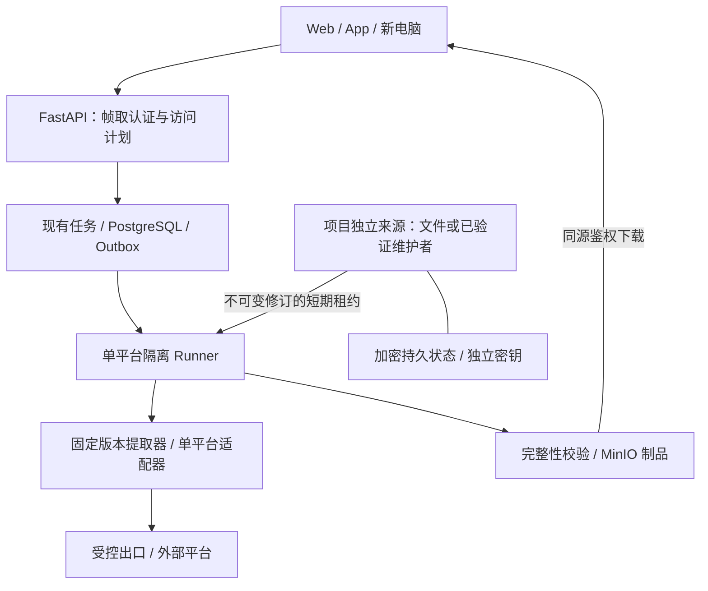

# 可迁移下载服务与平台会话架构调研

日期：2026-09-15。性质：已完成资料与当前实现审查；目标架构和实验方案，不是新能力已上线。实施承接 [035 设计](../design/035-平台访问与会话恢复能力设计.md)、[需求](../prd/035-平台访问与会话恢复能力需求.md)、[计划](../plans/035-平台访问与会话恢复能力计划.md)、[验收](../acceptance/035-平台访问与会话恢复能力验收.md)，运行流程承接 [009 SOP](../operations/009-下载故障修复与持续可用性SOP.md)。

## 1. 结论与承诺

应将平台会话从日常 Chrome、个人开发目录和每次下载请求中分离，作为下载服务自己拥有、可恢复、可撤销的持久来源。保留现有任务与隔离 Runner，逐平台维护提取器和真实样本；无需重写整个项目，也不能靠更换一个“万能引擎”完成全部修复。

必须区分两种换机：

| 场景 | 目标行为 | 必须验证的边界 |
| --- | --- | --- |
| 换电脑/手机访问同一个服务 | 登录帧取后继续下载；平台来源在服务端，客户端不配置 Python、Chrome 或平台 Cookie | 业务登录与设备文件保存仍分别验收 |
| 整个服务迁到另一台机器 | 恢复配置、业务数据、文件和独立来源，固定运行版本后执行平台复验 | 平台可能将授权绑定设备或出口；需要时只对受影响来源重新授权 |
| 原机正常重启/重建容器 | 复用有效来源和持久任务；临时租约失效重建 | 会话恰好自然过期仍应准确提示，不能保证永久有效 |

可以系统性消除“没读到个人 Chrome 就全平台不可用”“重启丢来源”“下载触发页面重载”等内部缺陷。外部平台变更、账号撤销、内容删除与限流需要持续维护；不能承诺每个平台的每条内容永久成功。yt-dlp 官方支持列表也明确说明列入名单不保证当前可用，真实尝试才是依据。[yt-dlp 支持范围](https://github.com/yt-dlp/yt-dlp/blob/master/supportedsites.md)

## 2. 研究方法和证据等级

本次实际使用 GitHub 插件读取上游仓库、Firecrawl 的开发者搜索与页面提取、Context7 的 yt-dlp/Playwright 官方文档检索；Chrome/Apple 官方资料用于运行环境边界。外部仓库默认分支和产品页访问日期均为本报告日期，后续会变化。

- **本项目实证**：当前源码、部署配置及本轮之前已记录的原机实验，能说明具体故障阶段。
- **上游实现/官方文档**：能说明支持机制和限制；不能直接证明我们当前链接可以下载。
- **商业产品声明**：仅作为功能与交互参考；本次没有购买测试或取得其内部架构。
- **设计推论**：下文来源维护、恢复包和发布门禁是本项目的取舍；没有把上游 README 当作本项目验收。

## 3. 当前系统的结构性缺口

审查基线：Server `a38925752c314365e311161a0c887a0e83dcdd48`。源文件以该提交及既有验收记录为准，不读取或记录凭据正文。

| 环节 | 当前证据 | 结构性后果 | 对应处置 |
| --- | --- | --- | --- |
| Chrome 来源 | `chrome_provider_cookies.py` 从 macOS 用户的 Google/Chrome Profile 读取 SQLite；`provider_cookie_agent.py` 由宿主 LaunchAgent 调用仓库虚拟环境 | 用户目录、OS 授权、Chrome 加密方式、解释器路径进入下载依赖链 | 日常 Chrome 仅保留显式选择的过渡来源；新部署主路径移除该依赖 |
| 每次操作获取来源 | `provider_sessions.py` 在操作时同步；动态修订仍有固定 `browser` 标识，见 CQ-020 | 没有稳定描述与不可变发布，难以区分同来源复用和来源变化 | `describe` 与精确修订领取分离；维护者异步发布 |
| 来源健康 | Agent 的快速 probe 验证进程/协议，没有实际导出；当前 8 个来源导出均失败 | Runner healthy 会被误读成账号或平台可用 | 分开进程、来源、上游和制品证据 |
| 原机失败阶段 | Chrome Cookies 文件存在；项目 SQLite 打开失败；直接读取返回 `Operation not permitted`；小红书隔离操作在执行提取器前返回 `provider_session_unavailable` | 当时没有证据证明“小红书提取器本身坏了”，也没有证据证明重新登录可修复 | 首先诊断来源；取得有效来源后才比较提取器 |
| 部署声明 | `a3892575` 已补齐 8 个 Chrome operator 的队列挂载；生产仍仅启用 4 条已有来源路线，Canary 10 个目标 | 挂载存在、端点启用、默认选择和样本路线不是同一件事 | 发布前核对完整配置关系，分别测试普通入口默认路线和显式路线 |
| 只读文件来源 | `provider_cookie_file.py` 已有权限/链接/过期/修订检查，但不回写更新 | 可支持独立持久文件；不能据此宣称自动续期 | 保留此最小可靠基线，按平台增加维护者 |
| 元宝来源 | 已有专用持久 Profile、互斥和明确登录过程 | 提供“项目拥有来源”的本地先例 | 复用生命周期原则，不把元宝协议套到其他平台 |
| 下载交付 | CQ-032 已修复顶层导航，原 Chrome 点击未新增 auth/me | 帧取认证恢复与平台授权是两类问题 | 保留无导航文件交付；平台维护不触发业务退出登录 |

相关实现目录：[Runner](../../backend/app/runner/)、[035 验收](../acceptance/035-平台访问与会话恢复能力验收.md)、[缺陷登记](../code-quality.md)。本次没有重新执行完整平台矩阵；历史通过只保留原日期、样本与路线的证明范围。

**权限结论修正**：已观察到操作系统拒绝 Chrome 数据库读取；尚未证明具体 TCC 责任进程归属。不能断言“给 Python 完全磁盘访问就彻底解决”，也不应要求每位部署者给通用解释器或 Shell 广泛磁盘权限。Apple 的资料表明文件访问另有隐私控制与进程责任链问题，当前 UI 上 ChatGPT 的授权状态不足以证明整个后台调用链可读。[Apple 文件访问控制](https://support.apple.com/en-ca/guide/security/secddd1d86a6/web)、[Apple DTS 关于责任链的讨论](https://developer.apple.com/forums/thread/702907)

## 4. 市面方案到底提供了什么

| 方案 | 官方资料可确认的机制 | 我们应借鉴 | 不能推导的结论 |
| --- | --- | --- | --- |
| MeTube | yt-dlp Web UI；队列/历史放 STATE_DIR，临时文件独立；显式 Cookie 导入；跟随引擎更新发布镜像 | 程序、状态、临时文件分开；引擎生命周期独立管理 | 换 UI 并不增加独立提取器，也不消除平台授权 |
| YTDLnis / Parabolic | 均基于 yt-dlp；YTDLnis 提供队列、登录 Cookie、备份和依赖插件更新 | 下载体验、恢复和依赖更新形成完整产品能力 | 两个前端不等于两个独立成功路线 |
| cobalt | 独立的平台 service 文件、按媒体类型列能力、独立 Cookie/YouTube session 配置；服务端代理交付 | 平台适配器分治；可作为确有增量的平台候选 | 不能直接替代持久任务、完整制品校验；官方 API 文档也未承诺 Twitter/X 100% 可靠 |
| 4K Video Downloader Plus | 官方产品页提供内置浏览器登录和保存下载偏好 | 平台登录在产品拥有的环境中完成，用户不操作开发工具 | 未公开的会话续期、跨机恢复、成功率不能猜测 |
| JDownloader | 官方有独立的账号 Cookie 导入流程；提醒原网页退出会使会话失效，并建议分离 Profile | 区分来源过期与程序故障；避免日常登出影响下载服务 | 成熟产品仍然会遇到会话失效 |
| XHS-Downloader | 小红书视频/图集专用实现；配置与记录持久化；README 称 Cookie 可选、访客 Cookie 有画质收益，同时标明浏览器读取功能失效 | 小红书分别验证匿名、访客、账号来源；以专用实现比较现有插件缺口 | 作者功能声明没有证明我们的固定链接、出口与画质可用 |

对应一手来源：[MeTube](https://github.com/alexta69/metube/blob/master/README.md)、[YTDLnis](https://github.com/deniscerri/ytdlnis/blob/main/README.md)、[Parabolic](https://github.com/NickvisionApps/Parabolic/blob/main/README.md)、[cobalt API](https://github.com/imputnet/cobalt/blob/main/api/README.md)、[cobalt 平台实现](https://github.com/imputnet/cobalt/tree/main/api/src/processing/services)、[cobalt 环境配置](https://github.com/imputnet/cobalt/blob/main/docs/api-env-variables.md)、[4K 官方产品页](https://www.4kdownload.com/products/videodownloader-42)、[JDownloader 官方会话说明](https://support.jdownloader.org/en/knowledgebase/article/account-cookie-login-instructions)、[XHS-Downloader](https://github.com/JoeanAmier/XHS-Downloader/blob/master/README.md)。

选择：继续以当前 yt-dlp 与已有插件为主。cobalt、小红书专用实现进入对照实验，只有证明特定平台/形态有实际增量，才决定移植最小适配或增加隔离执行后端。集成前审查其声明的 AGPL/GPL 等许可及依赖，更新本项目第三方声明；本报告不构成集成或采购决定。禁止把不明第三方解析站当作携带私人会话的 fallback。

## 5. 目标架构：沿用现有服务，明确四个所有者

1. **业务服务**拥有用户登录、访问策略、任务与制品；不用平台错误注销帧取账号。浏览器 GET 状态不发起授权，解析按钮不驱动交互登录。
2. **来源进程**拥有单个平台的授权状态，单写者发布不可变修订；不拥有业务 DB、RabbitMQ 或 MinIO 凭据。
3. **Runner**领取指定修订的有界副本，在 tmpfs 中使用并销毁，负责解析/下载上下文一致。匿名 Runner 继续没有任何平台 Cookie；访客来源也必须用单独声明的访问策略。
4. **现有 Canary 与发布流水线**拥有能力证据和候选版本验证，不负责自动更换账号、出口或取消冷却。

单节点部署即可先实现，不新增微服务平台、浏览器集群、账号池、第二套任务框架或数据库。参考部署优先使用固定 Linux 镜像及既有宿主基础设施；macOS 仍可运行明确支持的来源。架构不依赖所有平台浏览器常驻。

## 6. 项目独立来源怎么落地

### 6.1 按能力选择来源，而非所有平台强制登录

| 来源 | 适用情况 | 生命周期 |
| --- | --- | --- |
| 无来源的匿名访问 | 已验证能公开取得完整媒体 | 不读取 Chrome、不领取 Cookie |
| `manual_file` | 已有可用授权导出，但未证实可自动维护 | 加密备份；原子换版；明确过期由部署者重新授权 |
| `managed_visitor` 候选 | 正常第一方访客流程已证明必要且可复现 | 项目独立目录维护；不冒充账号登录；按平台试验 |
| `managed_account` 候选 | 本项目拥有的独立授权环境，且维护与主体识别已证明 | 首次人工授权；有效期内后台复用；确切失效才请求一次重新授权 |

保持 032 已批准的个人权益边界及完整文件检验；不因新适配器自动扩展权益策略。YouTube 播放证明与账号会话是不同依赖，前者不能代替后者，后者也不能保证所有视频格式可取。

### 6.2 独立浏览器只是来源的实现，不是新主业务框架

为试点来源设独立持久根目录、明确运行版本和单写者锁；首次登录采用部署者控制的专用窗口。无桌面服务器的候选登录通道必须认证、短时有效、单人独占、关闭后失效；不得公开 CDP/VNC 或读取日常 Chrome。先复用现有专用 Chrome/CDP 管理能力验证，只有证据表明必要才引入 Playwright 依赖。

Chrome 136 起对默认用户目录的远程调试加了限制；Playwright 也要求独立目录并限制同目录并发。这支持使用项目专用 Profile，但**不是本机 SQLite 权限失败的直接根因解释**。[Chrome 官方变更](https://developer.chrome.com/blog/remote-debugging-port)、[Playwright 持久上下文](https://github.com/microsoft/playwright/blob/main/docs/src/api/class-browsertype.md)

浏览器状态可包含 Cookie、localStorage 等；持久化并不等于永久登录，sessionStorage 也不是 storageState 的自动完整备份。只保存每个平台实验已证实必需的最少状态，不复制整个浏览器目录作为跨 OS 的恢复契约。[Playwright 认证与存储](https://github.com/microsoft/playwright/blob/main/docs/src/auth.md)

### 6.3 发布、领取与撤销

沿用 035 第 6–7 节契约：`source_id / subject_epoch / revision_id / client_profile_id / egress_binding_id`、精确 `acquire(expected_revision)`、单写者与 fence、独立加密密钥。首期维护与操作串行，等待/截止预算保持原定义。

- `describe` 返回脱敏的持久修订，不访问日常 Chrome；每次下载只领取已验证修订，不重新登录。
- 维护在暂存状态中完成，验证后原子发布。写入失败保留上一份有效修订；不能将半文件或空文件升级为 ready。
- 同账号更新也会产生新 revision；旧 inspection 不能静默领取最新版，必须重新解析。无法证明同主体时更换 epoch。
- 撤销停止新领取，并在既有 60 秒目标内终止旧 epoch 操作；进程重启不能清除撤销与冷却事实。
- 未证明可维护的平台继续使用只读文件或准确不可用状态，不做无限刷新、Cookie 永久缓存或循环弹窗。

## 7. 状态、错误与用户体验

健康必须有四层证据：

| 层 | 说明 | 触发方式 |
| --- | --- | --- |
| 进程 | 服务、协议和队列可以响应 | 无秘密读取的快速 probe；不能标记账号有效 |
| 来源 | 最近一次来源读取/租约验证成功，修订与有效期明确 | 管理员预检或有界后台维护；普通状态查询不触发 |
| 平台 | 指定路线最近 metadata/media 实测结果 | 现有 Canary 分散执行，记录时间、引擎、来源修订、出口代次 |
| 交付 | 完整文件校验及客户端保存结果 | 任务校验 + 实际浏览器/设备操作，分开报告 |

来源权限拒绝、文件缺失、密钥不匹配、代理不可达、提取器 JSON 变化、证明失效、明确账号过期、429、内容删除分别分类；不统一翻译成“正在获取登录状态”。来源状态过期标记“尚未验证”，不能无证据地显示平台故障。

平台失败只影响该路线。普通用户看到可执行说明，部署者看到脱敏原因；内部 source/lease/egress 字段不进入首页。保留 CQ-032 无顶层导航下载，平台来源更新不清空业务会话。

## 8. 引擎维护与平台能力如何持续增长

**能力单位是“平台 × URL 形态 × 媒体形态 × 访问策略”，不是平台名称。** 保留现有 23 平台目录；每条证据同时记录默认产品路线及显式测试路线，短链接、标准链接、视频、图集和个人权益分别评价。样本中必要的分享 token 保存在受保护夹具，归一化不能擅自丢弃，日志必须脱敏。

维护流程：

1. 每日错峰执行已授权的低成本 metadata 样本；media 按预算定期执行，发布前执行完整目标集。首次上线先测得时延与流量，再确定频率；不能让启动同时触发所有平台登录。
2. 失败先分来源、传输、证明、提取器和内容。内容被删除则保留失败证据，审查后增加替代样本，不把删样本当作故障修复。
3. 上游更新触发候选构建，锁定 yt-dlp、插件、JS 运行时、FFmpeg 与平台适配器版本；同来源、同出口、同链接做旧版/新版对照。
4. 候选通过受影响平台和公共回归后，按既有部署整组升级，保留旧镜像和恢复方案。启动不在线升级，引擎变更不能放宽旧 context。
5. 主引擎失败且来源有效时才评估专用适配器。先用相同样本证明新增完整文件成功，再承担长期维护成本；失败后不自动扩大授权或换出口。

yt-dlp 官方文档说明网站变化快并提供 nightly 更新路径；本项目据此建立候选验证渠道，而非直接让生产随最新版本漂移。[yt-dlp README](https://github.com/yt-dlp/yt-dlp/blob/master/README.md)

解析出来的媒体 URL 可能绑定 IP、Cookie 或头部。因此解析、证明和实际下载必须使用批准的一致访问绑定；客户端领取本服务校验后的制品，不能把上游临时 URL 当作跨机下载能力。[yt-dlp FAQ](https://github.com/yt-dlp/yt-dlp/wiki/FAQ)

## 9. 服务重启与迁移 SOP 增量

以下是目标迁移流程；来源维护者、恢复包和预检命令尚未实现，不把它们伪装成可直接运行的命令。当前操作命令仍见 [008 手册](../operations/008-个人部署重启与换机手册.md)。

1. **记录清单**：镜像 digest、配置 schema、已启用平台/默认路线、来源种类和非秘密修订、依赖版本、出口 generation、活动任务；不输出 `.env` 或 Cookie。
2. **排空与停写**：停止新任务接纳，等待或按既有机制取消活动任务；停旧来源写者，完成一致性备份，记录迁移代次。不能让两机同时使用同一来源。
3. **恢复持久数据**：PostgreSQL 业务状态、MinIO 制品、业务配置及 Cookie 签名/验证等必需密钥、加密来源；密钥通过独立受控渠道恢复。队列按既有 Outbox/任务恢复语义核对，不能只恢复 Cookie。
4. **拒绝旧授权复活**：恢复启动创建新的来源部署代次并废止旧租约；有撤销日志则校验其最新水位。无法证明备份未包含后来撤销的来源时，恢复为待重新授权，绝不自动 ready。
5. **固定运行环境启动**：校验目录权限、密钥可解密、声明与挂载/端点/default/Canary 一致。恢复平台失败不妨碍帧取登录、历史查询和已存制品获取。
6. **逐平台复验**：先相同出口新机器，再单独改变出口；来源检查、metadata、完整 media 分别记录。无法迁移设备绑定材料时只重新授权该来源，不反复读新机日常 Chrome。
7. **真实交付与切换**：通过目标平台文件校验、浏览器保存和需要的手机验证后接纳新任务；确认旧机仍停写。新增能力只按通过的范围发布。
8. **回滚**：排空新机、关闭新写者后回原镜像/配置。不得回滚撤销或冷却状态；如果来源已换 epoch/平台授权已变，保留新安全事实并重新解析，不能靠旧备份复活会话。

恢复内容分类：数据库、制品、配置、密钥和批准的来源是持久资产；tmpfs Cookie 副本、下载中间文件、短期租约、播放器缓存和临时媒体 URL 可丢弃并重建。持久 Profile 是原机实现细节，跨平台恢复以经验证的最小状态格式或明确重新授权为准。

## 10. 可执行修复切片与出口

用户已有实施授权继续有效。下列顺序是技术门禁，不新增重复确认流程；自动来源的可行性仍需实验通过。

| 切片 | 范围/主要落点 | 必须产生的证据 | 失败时动作 |
| --- | --- | --- | --- |
| S0 来源诊断与部署一致性 | `provider_cookie_agent.py`、会话错误映射、现有 Compose/预检；CQ-033/034 | 来源权限拒绝稳定可辨；普通状态无读取；缺失队列/端点/default 不一致在发布前失败 | 保留当前已通过路线，不启用失败候选 |
| S1 无日常 Chrome 的恢复基线 | 031 文件来源、既有启动/迁移手册、035 冻结 context；CQ-020 | 不存在 Google/Chrome 目录的干净环境中，匿名能力和有效 file 来源可用；重启 3 次；换修订拒旧 context | 区分源失效与读取失败，不能加大权限冒充通过 |
| S2 平台增量实验 | 现有插件与候选上游最小对照；优先小红书，其次实际失败平台 | 同链接/出口下匿名、访客、账号分别测；metadata、完整文件、画质/音轨结果；候选真实胜出 | 不胜出不接第二引擎；给出明确失败阶段 |
| S3 单平台独立来源试点 | 035 来源端口、现有受控队列/专用浏览器管理 | 首次授权后操作不再读日常 Chrome；原子发布、崩溃、撤销、同主体换版和真实过期全部可验证 | 未通过的平台继续 file 基线；不推广八平台 |
| S4 真正换机与发布 | 同版镜像、备份恢复、现有 Canary/Web 文件交付 | 干净第二机器同/异出口分开测；旧机停写；历史制品可取；浏览器不刷新；未通过平台保留 | 回滚运行版本，保留最新撤销/冷却事实 |
| S5 持续适配 | 现有 CI、Canary、平台目录和第三方声明 | 候选引擎同样本对照、有限重试、真实文件门禁、回滚演练和脱敏报告 | 阻止候选发布，不在用户点击时实验新账号或新引擎 |

S0→S1 建立可维护基础；S2 可在隔离候选中同步研究，S3 取决于单平台 G3，S4 取决于实际目标机，S5 先覆盖现有通过路线再扩展。估工应以 S0/S2 实验得到的平台失败类型为依据；当前不编造“几天修复所有平台”的交付承诺。

## 11. 完成定义和本轮边界

结构修复的验收不是“八个容器都 healthy”，而是：不依赖日常 Chrome 的选定平台有完整媒体证据；三次重建无需重新导入有效来源；真正第二台机器按恢复清单可运行；无效来源只影响该平台；页面与业务登录保持；撤销与冷却不会被重启/备份恢复清除。

本轮初次交付为研究、035 文档增量与缺陷登记。后续 S0 已实现稳定来源分类、脱敏 doctor 以及默认 operator/Canary endpoint 关系预检；本机八个日常 Chrome 平台因此准确归类为来源权限拒绝，专用元宝视频号来源为 ok。S2 随后先用同一小红书固定样本证明匿名 metadata/media 均成功，再以相同方法验证 X、Instagram、Facebook、Pinterest；五个平台的固定公开路线均不再依赖日常 Chrome。YouTube、抖音、视频号、Reddit 当前匿名样本分别保留平台验证、临时不可用或明确认证结果，不能批量切换。yt-dlp 官方文档也把 Cookie 定位为认证或挑战所需的可选输入，并把浏览器模拟依赖单独处理；YouTube 文档进一步说明浏览器 Cookie 会轮换。由此路线选择必须来自同链接两阶段证据，不能从“支持 Cookie”推断“公开下载必须 Cookie”。仍未新增普通平台独立维护者或证明新机/全平台通过，短链接、图集、访客画质和账号内容继续待测。下一实施还需 S1 及其余 S2，不再要求用户反复登录日常浏览器。

### S1 实施后的新证据（2026-09-15）

已核实宿主权限责任链并从现有 Chrome 安装 YouTube、抖音、Reddit 的单平台文件，生产 Compose 不再向这三个 Runner 提供浏览器同步来源。三平台候选完整文件及重启新下载通过，抖音/Reddit 生产固定 metadata/media 通过；YouTube 正常网页新任务完成对象存储持久化、哈希与全片解码，详见 035。源文件持久化与独立维护是两个门禁：YouTube 旧快照在本轮已被上游明确判定失效，重新采集同一 Chrome 才恢复，因此 S3/CQ-044 仍未实现。用户拒绝测试浏览器重新登录，应保留现有 Chrome 作为显式维护输入，不能用换登录窗口掩盖来源维护缺口。未执行新机器、跨轮换长期稳定或设备文件保存验收。

### agent-browser 路线复核增量（2026-09-15）

匿名浏览器实测再次证明网页登录提示不是会话路线的充分条件：Bilibili、Instagram、Facebook、小红书均展示登录或互动限制，X 甚至连续返回 HTTP 403，但这八个选定匿名平台的生产完整 media 均成功。Reddit 连续显示网络安全阻断且 operator 完整 media 成功，应保留文件来源；视频号分享页可见但下载继续需要专用元宝来源。YouTube 匿名页与 Runner 的挑战结果也不同，说明宿主网页、隔离出口与 extractor 是三条独立证据。

腾讯视频页面和 metadata 可用，完整 media 在 120048 ms 的重新解析阶段超时；页面同时展示会员全集。该问题应先分免费单集、会员权益、DRM、播放器协议和 extractor 延迟，不能通过复制 Chrome Cookie、放大超时或把页面能播放当作下载授权来处理。完整数据见 035 第 32 节和 CQ-045。
